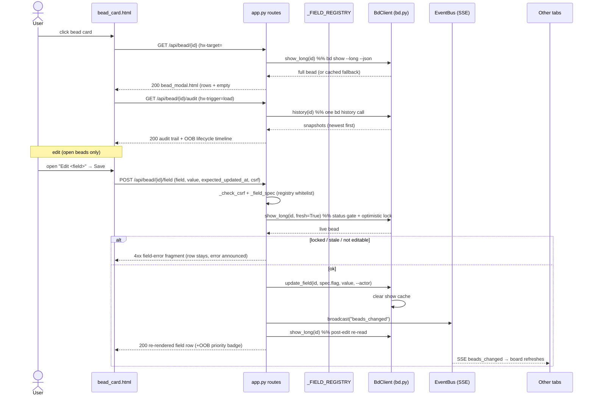

# Feature: Bead detail & inline editing

## What it does

Clicking any card on the [board](../Views/board-page.md) opens a full-screen
**bead-detail modal** that shows everything `bd` knows about that issue — id,
priority badge, status chip, title, every non-hidden field in a curated order,
and a lazily-loaded **lifecycle timeline + audit trail** of who changed what and
when. For *open* beads the modal is also an editor: each whitelisted field grows
an inline `Edit <field>` (or `+ Add a note`) disclosure that posts a single-field
change back to `bd update` and swaps just that one row back in place — no modal
reload, no page reload. The read half is three GET endpoints
([`/api/bead/{id}`](../Endpoints/bead-detail-api.md), `/audit`, `/raw`); the
write half is one tightly-scoped POST
([`/api/bead/{id}/field`](../Endpoints/bead-field-edit-api.md)). Together they
turn the board from a read-only observer into a place where a human can correct a
title, bump a priority, or append a verification note without ever dropping to a
terminal.

## Why it exists

The board began life as a pure, read-only window onto bd's issue list — great for
*seeing* work, useless for *touching* it. Three needs drove this feature:

1. **Depth on demand.** A card can only show a headline. Maintainers regularly
   need the full field set, the acceptance criteria, the dependency graph, and —
   crucially — the *history*: when did this go in_progress, who closed it, what
   changed between commits. The modal is the one surface that answers "tell me
   everything about this bead" in one click.
2. **In-place curation without a terminal.** Typos in titles, a wrong priority,
   a stale assignee, or a missing note are trivial to fix from the CLI but
   annoying to context-switch for. Inline editing puts the fix two clicks from
   where you noticed the problem — in the same surface you were reading.
3. **Safety is the whole point.** Editing issue state is dangerous in ways
   reading never is: you can clobber an agent's in-flight change, rewrite closed
   history, destroy append-only verification notes, or let a crafted POST write a
   field that should never be user-editable. This feature is deliberately built
   as a *narrow, guarded* write path — a registry whitelist, a status lock, an
   optimistic lock, CSRF, and append-only protection for `notes` — rather than a
   generic "edit anything" form. It inherits the CSRF + serialized-mutation +
   optimistic-refresh + SSE-broadcast posture first established by
   [memory management](memory-management.md).

## How it works

### User perspective

1. **Open.** The user clicks a [bead card](../Views/board-page.md). HTMX fetches
   `/api/bead/{id}` into `#bead-modal`; a skeleton paints instantly, then the
   modal shell appears with the id, a priority badge, the status chip, the title,
   the ordered field rows, and an "Audit trail — loading history…" panel.
2. **Read.** The audit section fires its own fetch on load. Within a moment a
   **lifecycle timeline** (status transitions with dwell time) slots in at the
   top of the scroll region and a **field-by-field audit trail** fills the bottom
   panel. A `raw JSON` link in the header is the debug escape hatch.
3. **Edit (open beads only).** Each editable field shows an `Edit <field>`
   disclosure. Opening it reveals a real form — a text input, number input,
   `<select>` dropdown (priority / issue_type), or a textarea (markdown prose) —
   pre-filled with the current value. **Save** posts the change and the row
   re-renders in place with the saved value; the editor collapses. A per-row
   polite aria-live region announces "Saved." (or, on failure, the error) without
   stealing focus.
4. **Add a note.** The `notes` field never offers a replace editor. Instead it
   shows `+ Add a note` — a fresh empty box whose content is **appended** below
   the existing notes, never overwriting them.
5. **Locked beads.** Once a bead is `in_progress` or closed, every edit
   affordance disappears — the modal is read-only for claimed or completed work.
6. **Cross-tab sync.** Any successful edit (here or from another tab, or the CLI)
   re-paints every open board within ~1 s via the
   [live-refresh](live-auto-refresh.md) SSE channel.

### System perspective

The read and write halves are deliberately split, and the read half is itself
split into a fast first paint and a slow deferred history:

1. **Detail (fast paint).** `GET /api/bead/{id}` (`api_bead`) prefers a live
   `bd show --long --json` read; if that fails it falls back to the cached list
   [snapshot](../Concepts/store-snapshot-cache.md) so the modal still renders
   (flipping `source` to `"Cached snapshot"` and showing a warning) rather than
   hard-failing. It runs `_ordered_fields(bead)` to build the rows — walking
   `_FIELD_ORDER` first, then appending any unlisted keys alphabetically so a new
   bd field never silently vanishes — and renders `partials/bead_modal.html`.
2. **Audit (deferred).** The modal's audit `<section>` carries
   `hx-trigger="load"`, so once the shell is on screen it fetches
   `GET /api/bead/{id}/audit` (`api_bead_audit`). One `bd history` call feeds
   **both** views: `derive.status_timeline` (transitions + dwell, swapped
   out-of-band into `#lifecycle-slot`) and `_shape_audit` (a no-op-suppressed,
   field-by-field change log). Total failure still returns `200` with a friendly
   "temporarily unavailable" panel so the already-open modal is never blanked.
3. **Raw (debug).** `GET /api/bead/{id}/raw` (`api_bead_raw`) dumps the unshaped
   `bd show --long --json` object as JSON.
4. **Field edit (write).** `POST /api/bead/{id}/field` (`api_bead_field_update`)
   is the guarded write path. In order: `_check_csrf` → look the field up in
   `_FIELD_REGISTRY` via `_field_spec` (must be `editable` with a non-empty
   `flag`, else `400`) → reject empty append-only submits → a single **LIVE**
   `bd show --long --json` (`fresh=True`) that serves *both* the **status gate**
   (`_bead_is_editable`; `in_progress`/closed → `403`) and the **optimistic lock**
   (`expected_updated_at` vs live `updated_at` → `409`) → `bd.update_field` with
   the registry's flag and `--actor` → `bus.broadcast("beads_changed")` → a
   post-edit re-read and a re-render of *just* the affected `field_row.html`. For
   `priority` it also appends an out-of-band copy of the header badge so the
   modal-header badge updates in the same swap.

All writes run through `BdClient._run_mutate`, serialized on the single-writer
`_subprocess_gate`, and clear the per-bead show cache so the follow-up read
returns post-edit state. Markdown flags (`description`/`design`) stream their
value on stdin via `--body-file -` / `--design-file -` to dodge shell-arg limits.

## Sequence

## Implementation Map

| Concern | Where | Notes |
| --- | --- | --- |
| Detail route (fast paint) | [`src/bdboard/app.py:api_bead`](../../src/bdboard/app.py) (`GET /api/bead/{id}`) | Live `show_long`; cached-snapshot fallback with `source`/`warning`; 404 only if neither finds the bead. |
| Audit route (deferred) | [`app.py:api_bead_audit`](../../src/bdboard/app.py) (`GET /api/bead/{id}/audit`) | One `bd history` feeds `status_timeline` (OOB) + `_shape_audit`; failure degrades to a 200 panel. |
| Raw route (debug) | [`app.py:api_bead_raw`](../../src/bdboard/app.py) (`GET /api/bead/{id}/raw`) | Unshaped `bd show --long --json` as JSON; cached fallback / `{"error": ...}`. |
| Field-edit route (write) | [`app.py:api_bead_field_update`](../../src/bdboard/app.py) (`POST /api/bead/{id}/field`) | CSRF → registry whitelist → status gate + optimistic lock (one live read) → `update_field` → broadcast → re-render row. |
| Field registry (single source of editability) | [`app.py:_FIELD_REGISTRY` / `FieldSpec` / `_field_spec`](../../src/bdboard/app.py) | v1 whitelist; unlisted ⇒ `_READONLY_SPEC`. The **only** place a field's flag/editor/append-only lives. |
| Field ordering + row hints | [`app.py:_ordered_fields` / `_field_row` / `_FIELD_ORDER`](../../src/bdboard/app.py) | Ordered keys then alpha leftovers; decorates each row with `editable`/`editor`/`flag`/`enum_options`/`append_only`. |
| Lifecycle lock | [`app.py:_bead_is_editable` / `_LOCKED_EDIT_STATUSES`](../../src/bdboard/app.py) | `derive.CLOSED_STATUSES \| {in_progress}`; missing status ⇒ editable. Gates UI hints **and** the server write. |
| Audit diffing | [`app.py:_shape_audit` / `_diff_issue` / `_short`](../../src/bdboard/app.py) | Field-by-field diff; suppresses no-op dolt commits; oldest entry always "created". |
| Lifecycle timeline | [`src/bdboard/derive/history.py:status_timeline`](../../src/bdboard/derive/history.py) | Status transitions + dwell hours, derived from the same history payload. |
| Live/history reads | [`src/bdboard/bd.py:BdClient.show_long`](../../src/bdboard/bd.py) (`fresh=` bypass) / [`bd.py:BdClient.history`](../../src/bdboard/bd.py) | `bd show --long --json` (cached) / `bd history --json` (cached). |
| bd mutation | [`bd.py:BdClient.update_field`](../../src/bdboard/bd.py) → [`_run_mutate`](../../src/bdboard/bd.py) | Serialized on `_subprocess_gate`; `--body-file -` / `--design-file -` for markdown; clears `_show_cache`. |
| Actor attribution | [`app.py:_ACTOR`](../../src/bdboard/app.py) (`$BDBOARD_ACTOR`) → `bd update --actor` | Attributes the human edit; falls back to `$BEADS_ACTOR`/git/`$USER` when unset. |
| CSRF guard | [`app.py:_check_csrf`](../../src/bdboard/app.py) + `_CSRF_TOKEN` | `X-CSRF-Token` header or `csrf_token` form field; 403 otherwise. |
| Modal template | [`templates/partials/bead_modal.html`](../../src/bdboard/templates/partials/bead_modal.html) | Header, `#lifecycle-slot`, field grid, audit section (`hx-trigger="load"`). |
| Field row template | [`templates/partials/field_row.html`](../../src/bdboard/templates/partials/field_row.html) | `field_form` macro (shared HTMX wire contract), kind dispatch, replace vs append-only editors. |
| Audit/lifecycle template | [`templates/partials/bead_audit.html`](../../src/bdboard/templates/partials/bead_audit.html) | Renders both views; OOB-swaps the timeline into `#lifecycle-slot`. |
| OOB priority badge | [`templates/partials/bead_priority_badge.html`](../../src/bdboard/templates/partials/bead_priority_badge.html) | Re-rendered `oob=True` so the header badge updates after a priority edit. |
| Card trigger + modal host | [`templates/partials/bead_card.html`](../../src/bdboard/templates/partials/bead_card.html) + [`templates/base.html`](../../src/bdboard/templates/base.html) (`#bead-modal`, error/success a11y handlers) | Card opens the modal; `htmx:beforeSwap` routes 4xx/5xx into `data-edit-feedback`; `afterSwap` announces "Saved." |
| Markdown rendering | [`src/bdboard/md.py:render`](../../src/bdboard/md.py) (the `md` Jinja filter) | Renders markdown field values (`description`, `notes`, `acceptance_criteria`, `close_reason`). |

## Config

| Name | Where | Default | Effect |
| --- | --- | --- | --- |
| `SHOW_TIMEOUT_S` | [`bd.py`](../../src/bdboard/bd.py) | `8.0` | Subprocess timeout for `bd show --long` (detail + raw + lock precondition reads). |
| `HISTORY_TIMEOUT_S` | [`bd.py`](../../src/bdboard/bd.py) | `8.0` | Timeout for the `bd history` read behind the audit/lifecycle views. |
| `UPDATE_TIMEOUT_S` | [`bd.py`](../../src/bdboard/bd.py) | `10.0` | Timeout for `bd update`; higher than reads because a write does a dolt commit (and markdown can be long). |
| `_CSRF_TOKEN` | [`app.py`](../../src/bdboard/app.py) | `secrets.token_urlsafe(32)` (per-process) | Required on every field-edit POST; exposed to templates as the `csrf_token` Jinja global. |
| `_ACTOR` / `$BDBOARD_ACTOR` | [`app.py`](../../src/bdboard/app.py) | `None` | When set, forwarded as `bd update --actor` so the audit trail attributes the human edit. |
| `_FIELD_REGISTRY` (v1 whitelist) | [`app.py`](../../src/bdboard/app.py) | `title, description, acceptance_criteria, design, priority, assignee, issue_type, external_ref, estimate, notes` | The complete set of manually-editable fields. Everything else is read-only by default. |
| `_LOCKED_EDIT_STATUSES` | [`app.py`](../../src/bdboard/app.py) | `CLOSED_STATUSES \| {in_progress}` | Statuses that make a bead read-only in the modal and at the route. |

> [!IMPORTANT]
> Adding a newly-editable field is **one entry** in `_FIELD_REGISTRY` — the
> registry is the extensibility seam (open/closed + DRY). The handler never
> hard-codes a field or a flag; it pulls `spec.flag` from the registry, so the
> client supplies only a field *name* and can never widen what is writable. A
> crafted POST asking to write `status`, `parent`, or `story_points` fails
> because those fields simply aren't whitelisted.

## Edge Cases

> [!WARNING]
> - **Locked beads are read-only.** Once a bead is `in_progress` or closed,
>   `_bead_is_editable` returns false: the modal renders no edit affordances and
>   the route rejects any crafted POST with `403`. Editing claimed work risks
>   clobbering an agent mid-flight; editing closed work rewrites history.
> - **Optimistic-lock conflict.** The edit form carries the `updated_at` the row
>   was rendered with. Before writing, the route re-reads the bead **live** and,
>   if `updated_at` moved on, rejects the stale submit with a `409` "this bead
>   changed since you opened it" rather than silently overwriting a newer value.
>   A missing/empty token degrades to last-write-wins (older forms still work).
> - **`notes` is append-only.** `bd update --notes` *replaces* the whole field
>   and would nuke agent verification / bug-discovery history. The registry pins
>   `notes` to `--append-notes`, the route rejects empty appends (`400`), and the
>   template offers only an "Add a note" box — never a prefilled replace.
> - **New bd fields never disappear.** `_ordered_fields` appends any key not in
>   `_FIELD_ORDER` alphabetically, so a field bd adds tomorrow still renders
>   (read-only until someone whitelists it) instead of vanishing.
> - **Cached-degradation read.** If the live `bd show` fails, the detail modal
>   falls back to the cached snapshot, flips `source` to `"Cached snapshot"`, and
>   shows a warning banner instead of 404-ing — only a genuinely-unknown bead 404s.
> - **Markdown streamed on stdin.** `description`/`design` are written via
>   `--body-file -` / `--design-file -` (stdin), not as positional args, to dodge
>   shell-arg length limits and quoting fragility on large prose.
> - **Priority badge staleness.** A priority edit returns an out-of-band copy of
>   the header badge so it updates in the same swap; without it the badge would
>   stay stale until the modal was reopened.

> [!CAUTION]
> Do **not** add a replace-style inline editor for `notes`, and do not call
> `bd update --notes` by hand to "fix" a note. Replacing notes destroys the
> append-only audit/verification history that the whole bead workflow depends on.
> The append-only contract is enforced in three places (registry `append_only`,
> the route's empty-check + pinned `--append-notes` flag, and the template's
> "Add a note" framing) precisely so no single change can reintroduce the
> foot-gun.

## Error Scenarios

| What fails | What the user sees | How the system degrades |
| --- | --- | --- |
| Unknown bead on `/api/bead/{id}` (live + cache both miss) | `404` modal-error: "We couldn't find that bead. Please refresh the board and try again." | The only real 404; every other failure degrades to 200. |
| Live `bd show` fails but the bead is cached | The full modal with a warning banner: "Showing cached details while live data is temporarily unavailable." | `200` (degraded), `source="Cached snapshot"`. |
| `bd history` fails on `/audit` | "Audit history is temporarily unavailable." panel — no timeline, no trail. | `200`; the rest of the already-open modal is untouched. |
| Missing/invalid CSRF on a field edit | `403` "Invalid or missing CSRF token. Please refresh the page and try again." | `_check_csrf` raises before any read or write. |
| Non-editable / unknown field posted | `400` `
Field "<field>" is not editable.
` | Registry whitelist rejects it; no write attempted. |
| Empty append-only (`notes`) submit | `400` `
Nothing to add.
` | Rejected before the subprocess. |
| Bead locked (`in_progress`/closed) | `403` "This bead is <status> and can no longer be edited — only open beads are editable." | Server-side status gate; the UI already hides the affordance. |
| Stale tab (optimistic-lock conflict) | `409` "This bead changed since you opened it — please refresh and re-apply your edit…" | Detected via the live `updated_at` re-read before the write. |
| `bd update` subprocess fails | `500` `
Could not save: <bd stderr>
` | `_run_mutate` surfaces bd's stderr; **no broadcast** fires for a write that didn't land. |
| Edit succeeded but re-read fails | `200` "Saved, but could not refresh — reopen the bead to see the change." | The write committed; the SSE refresh will reconcile. |

> [!WARNING]
> All field-edit error bodies are HTML fragments with `role="alert"`, not JSON.
> The `htmx:beforeSwap` handler in [`base.html`](../../src/bdboard/templates/base.html)
> cancels the row swap on a 4xx/5xx and routes the message into the per-row
> `data-edit-feedback` aria-live region, so a failed save **never wipes the row** —
> the edit form stays open with the error announced.

## Testing

- [`tests/test_field_edit.py`](../../tests/test_field_edit.py) — the route and the
  `BdClient.update_field` method: CSRF required (header *and* form-field
  fallback), registry validation (non-editable/unknown rejected, the bd flag
  comes from the registry not the client), append-only safety
  (`--append-notes`, empty-note 400, no replace form for notes), re-render + SSE
  broadcast, OOB priority badge only for priority, error surfacing (500), and the
  client's exact arg/stdin construction (`--body-file -` for description,
  `--design-file -` for design, actor omitted when None, caches cleared,
  `show_long(fresh=True)` bypasses the cache).
- [`tests/test_field_registry.py`](../../tests/test_field_registry.py) — the
  registry as single source of truth: `FieldSpec` frozen, unknown field defaults
  read-only, the v1 whitelist is editable, out-of-scope fields stay read-only,
  `notes` is append-only, select fields carry `enum_options`, and `_ordered_fields`
  decorates rows with editability hints without dropping render hints.
- [`tests/test_field_edit_status_gate.py`](../../tests/test_field_edit_status_gate.py)
  — the lifecycle lock: open beads expose edit affordances; `in_progress`/closed
  beads render no affordances and reject edits (incl. note appends) at the route;
  status matching is case-insensitive; an unreadable live status doesn't block.
- [`tests/test_field_edit_concurrency.py`](../../tests/test_field_edit_concurrency.py)
  — the optimistic lock: a stale `updated_at` is rejected without clobber, a
  matching token proceeds, a missing token skips the lock, an append skips the
  lock even when stale, an unreadable precondition doesn't block the write, and a
  re-rendered row carries a fresh token.
- [`tests/test_api_bead_audit.py`](../../tests/test_api_bead_audit.py) — the
  audit endpoint: both views render from one `bd history` payload with dwell
  computed; a history error degrades to the "temporarily unavailable" panel; an
  empty history shows "no recorded history yet" with no timeline.
- [`tests/test_derive_history.py`](../../tests/test_derive_history.py) — unit
  tests for `status_timeline` (empty input, oldest-first transitions, dwell hours,
  blank-status skipping).
- [`tests/test_md.py`](../../tests/test_md.py) — the `md` filter that renders the
  markdown field values shown in the modal.

## Related

- [Endpoint: Bead detail API (`/api/bead/{id}`, `/audit`, `/raw`)](../Endpoints/bead-detail-api.md) — the read-half request/response contract and curl examples.
- [Endpoint: Bead field-edit API (`POST /api/bead/{id}/field`)](../Endpoints/bead-field-edit-api.md) — the write-half contract: validation, status/optimistic-lock errors, OOB badge.
- [Flow: Inline field-edit write path](../Flows/field-edit-write-path.md) — the end-to-end edit flow these endpoints anchor.
- [View: Board page (`/`)](../Views/board-page.md) — hosts the `#bead-modal` target and the cards that open it.
- [Feature: History & trends](history-and-trends.md) — the board-wide view over the same `bd history` data the audit trail surfaces per-bead.
- [Feature: Memory management](memory-management.md) — the first write path; this feature reuses its CSRF + serialized-mutation + optimistic-refresh + SSE posture.
- [Feature: Live auto-refresh](live-auto-refresh.md) — the `beads_changed` broadcast → board refresh that fans an edit out to every open tab.
- [Concept: bd CLI as runtime source of truth](../Concepts/bd-cli-source-of-truth.md) — why every read and write is a serialized `bd` subprocess.
- [Concept: Store snapshot cache & change detection](../Concepts/store-snapshot-cache.md) — the cache the detail read falls back to and the edit invalidates.
- [Concept: Derive layer (pure view shaping)](../Concepts/derive-layer.md) — where `status_timeline` lives and why shaping stays pure.
- [Concept: HTMX + server-rendered partials](../Concepts/htmx-partials-architecture.md) — the in-place row swap and out-of-band (`#lifecycle-slot`, priority badge) idioms this modal uses.
