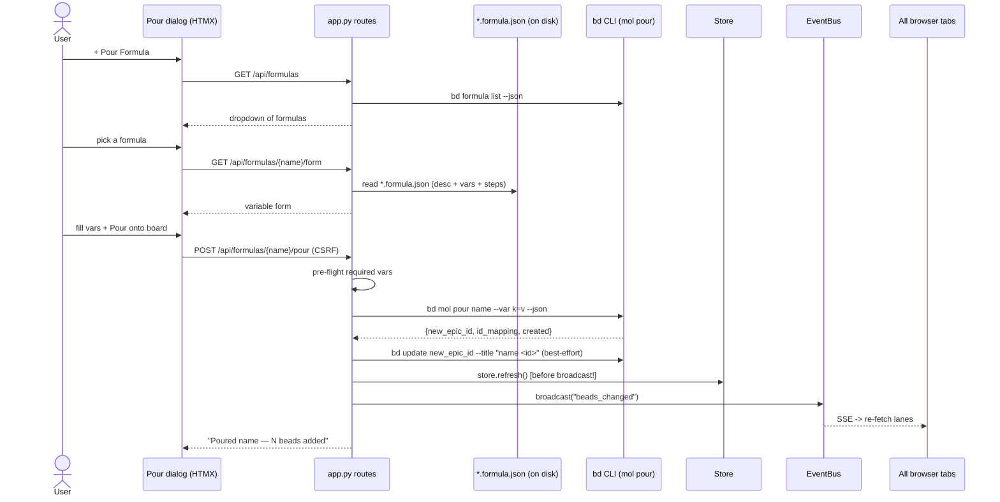

# Feature: Formula pour

## What it does

Formula pour lets a user materialize a whole **tree of beads** onto the board
from a single reusable *formula* (an on-disk `*.formula.json` template) in one
click. From the board masthead the user opens a **Pour a Formula** dialog, picks
a formula from a dropdown, fills in any variables the formula declares, and hits
**Pour onto board**. The server runs one `bd mol pour … --json` subprocess that
cooks the template and creates a molecule-wrapper node plus one bead per step,
renames the wrapper so repeat pours stay distinguishable, refreshes the snapshot
cache, and broadcasts a `beads_changed` SSE event so the new beads appear live on
every open tab. The user sees an honest acknowledgement of how many *visible*
beads landed. One click → N new beads → every tab updated.

## Why it exists

Some workflows are not a single bead but a recurring *shape* of work — a code
health audit, an incident retro, a discovery-and-fan-out epic — that always
decomposes into the same set of steps with the same dependency wiring. Recreating
that tree by hand every time is tedious, error-prone, and drifts over time.
Formulas capture the shape once as a versioned template; pour instantiates it on
demand. Three concrete needs drive the feature:

1. **Reusable scaffolding, parameterized.** A formula carries `variables`
   (e.g. a target repo, a token) so the same template can be poured against many
   contexts without editing the file. The pour form surfaces those variables and
   prefills any defaults.
2. **Atomic, all-or-nothing creation.** A half-poured tree (orphan steps, an
   empty wrapper epic) is worse than no pour at all. Pour is atomic at the `bd`
   layer — a failure rolls back to zero new beads — and bdboard refuses to dress
   a *partial* materialization up as a clean success.
3. **Live, honest feedback.** The poured beads must show up on the board
   instantly (no manual reload) and the success message must report the count the
   user will actually *see*, not bd's raw node count (which includes the hidden
   wrapper).

## How it works

### User perspective

The user clicks **+ Pour Formula** in the board masthead. A native `<dialog>`
opens (trapping keyboard focus) and loads a **formula picker** — a single
`<select>` dropdown listing every available formula by name and description.
Choosing one swaps in that formula's **variable form**: its full description, a
collapsed *Show all steps* disclosure, and one text input per declared variable.
Required variables (those with no default) are marked with a `*` and the browser
blocks submission until they're filled; variables with defaults come prefilled.
The user clicks **Pour onto board**; the button disables to prevent
double-submits. On success the picker resets to its default state and a
confirmation persists below it — `Poured <formula> — N beads added to the
board.` — while the new beads fan into the lanes a beat later via live refresh.
A *partial* pour instead shows a warning telling the user to check the formula's
top-level `pour: true` and remove the incomplete epic before retrying.

### System perspective

The feature is a **two-read-then-one-write** sequence across three routes:

1. **Picker (`GET /api/formulas`).** Calls `bd formula list --json` and renders a
   dropdown of `name` + `description`. The list payload also carries each
   formula's `source` (absolute path to its `*.formula.json`), which the next
   step needs.
2. **Variable form (`GET /api/formulas/{name}/form`).** Looks the formula up in
   the list to get its `source`, then **reads the `*.formula.json` file
   directly** via `read_formula_detail()` to get the untruncated description,
   the variable descriptors, and the step list. This file read is deliberate:
   `bd formula list --json` truncates the description, `bd formula show --json`
   omits the `variables` block entirely, and the list payload's `vars` count is
   always `0` — the on-disk template is the only reliable source.
3. **Pour (`POST /api/formulas/{name}/pour`).** CSRF-checked. Re-reads the
   declared variables and runs a **server-side pre-flight**: every required
   (no-default) variable must have a value (falling back to its default when the
   field was left blank), or the pour is rejected before any subprocess runs — a
   crafted POST can't skip the browser's `required` attribute. It then runs
   `bd mol pour <name> --var k=v … --json`, surfacing bd's stderr verbatim on
   failure (because `--dry-run` can't catch every pour-blocking bug). On success
   it renames the grouping node (`new_epic_id`) to `"<formula> <short-id>"`
   (best-effort — a rename failure does not undo the pour), reconciles the
   visible count, calls `store.refresh()` **before** broadcasting `beads_changed`,
   and returns the result fragment.

The molecule wrapper is hidden from the board (Option A), so the reported count
is `created - 1`. A mismatch between `len(id_mapping)` and `created` means not
every node materialized — that's surfaced as a partial-pour warning, never as a
clean win.

## Sequence

## Implementation Map

| Concern | Where | Notes |
| --- | --- | --- |
| Picker route | [`src/bdboard/app.py:api_formulas`](../../src/bdboard/app.py) (`GET /api/formulas`) | Lists formulas; degrades to a friendly inline message on bd failure. |
| Variable-form route | [`app.py:api_formula_form`](../../src/bdboard/app.py) (`GET /api/formulas/{name}/form`) | Reads the `*.formula.json` for full desc + vars + steps; 404 on unknown formula. |
| Pour route | [`app.py:api_formula_pour`](../../src/bdboard/app.py) (`POST /api/formulas/{name}/pour`) | CSRF guard, pre-flight, pour, rename, refresh-then-broadcast. |
| Visible-count + partial-pour reconciliation | [`app.py:_pour_counts`](../../src/bdboard/app.py) | `(visible = created - 1, created, fully_materialized)`; hides the wrapper, flags shortfalls. |
| Title disambiguator | [`app.py:_short_pour_id`](../../src/bdboard/app.py) | Reuses bd's existing id suffix; zero new entropy, collision-free. |
| `bd formula list` wrapper | [`src/bdboard/bd.py:BdClient.list_formulas`](../../src/bdboard/bd.py) | Returns `name` / `description` / `source`; rejects non-list payloads. |
| Template parsing (desc/vars/steps) | [`bd.py:read_formula_detail`](../../src/bdboard/bd.py), [`bd.py:read_formula_variables`](../../src/bdboard/bd.py), `_load_formula_json` / `_parse_variables` / `_parse_steps` | The only reliable source for variables + untruncated description. |
| Pour subprocess | [`bd.py:pour_formula`](../../src/bdboard/bd.py) | `bd mol pour … --var k=v --json`; serialized on `_subprocess_gate`; atomic; surfaces stderr; invalidates caches. |
| Grouping-node rename | [`bd.py:rename_bead`](../../src/bdboard/bd.py) | `bd update <id> --title <title>`; invalidates caches. |
| Picker template | [`templates/partials/formula_list.html`](../../src/bdboard/templates/partials/formula_list.html) | `<select>` dropdown; populated + empty states. |
| Variable-form template | [`templates/partials/formula_form.html`](../../src/bdboard/templates/partials/formula_form.html) | One input per var; `required` markers; collapsed steps disclosure; in-flight disable + post-pour reset. |
| Result template | [`templates/partials/formula_pour_result.html`](../../src/bdboard/templates/partials/formula_pour_result.html) | Success vs partial-pour warning; visible count; rename warning. |
| Dialog shell + open button | [`templates/dashboard.html`](../../src/bdboard/templates/dashboard.html) (`#formula-dialog`, `openFormulaDialog()`), [`templates/partials/theme_toggle.html`](../../src/bdboard/templates/partials/theme_toggle.html) | Native `<dialog>` with focus trap; `#formula-list` / `#formula-form` / `#formula-pour-result` regions. |

## Config

| Name | Where | Default | Effect |
| --- | --- | --- | --- |
| `FORMULA_LIST_TIMEOUT_S` | [`bd.py`](../../src/bdboard/bd.py) | `8.0` | Subprocess timeout for `bd formula list --json` (used by picker + form + pour pre-resolve). |
| `POUR_TIMEOUT_S` | [`bd.py`](../../src/bdboard/bd.py) | `30.0` | Timeout for `bd mol pour`; generous because pour cooks inline and materializes a whole tree. |
| `UPDATE_TIMEOUT_S` | [`bd.py`](../../src/bdboard/bd.py) | `10.0` | Timeout for the best-effort `rename_bead` of the grouping node. |
| `_CSRF_TOKEN` | [`app.py`](../../src/bdboard/app.py) | per-process | Token required on the pour POST (header `X-CSRF-Token` or `csrf_token` form field). |

> [!IMPORTANT]
> Variables and the untruncated description MUST be read from the on-disk
> `*.formula.json` file (via the `source` path bd reports), never from
> `bd formula show --json` (omits `variables`) or the `formula list --json`
> payload (truncated description, `vars` count always `0`). If a future bd
> release exposes variables through `formula show --json`, switch to that and drop
> the file read.

> [!IMPORTANT]
> `store.refresh()` MUST run **before** `bus.broadcast("beads_changed")` on the
> pour route. Without it the optimistic broadcast races ahead of the
> watcher→refresh cycle and clients re-fetch a stale snapshot that omits the
> freshly poured beads (regression `bdboard-dfl`).

## Edge Cases

> [!WARNING]
> - **Hidden molecule wrapper (count honesty).** `bd`'s `created` counts the
>   molecule wrapper that bdboard deliberately hides from the board, so reporting
>   it raw over-counts by one. `_pour_counts` returns `created - 1` (floored at 0)
>   as the visible count, keeping the success message honest.
> - **Partial materialization.** If `len(id_mapping) != created`, not every node
>   landed (a bd-layer vapor-pour, or a formula that lost its top-level
>   `pour: true`). bdboard surfaces a partial-pour **warning** and logs the
>   shortfall rather than claiming a clean success — the failure mode that used to
>   leave empty wrapper epics accumulating while the UI cried success.
> - **Required variables.** The browser's `required` attribute is mirrored by a
>   server-side pre-flight; a crafted POST that omits a required, no-default
>   variable is rejected with a 400 before any subprocess runs. Blank fields fall
>   back to the variable's default when one exists.
> - **Rename is best-effort.** The pour is atomic and already succeeded by the
>   time the wrapper rename runs; a rename failure is surfaced as a *soft warning*
>   (the tree shows under the bare formula name) and never undoes the pour.
> - **No-variable formulas.** A missing/empty `variables` block is a valid
>   "pour with no inputs" — the form shows "This formula takes no variables" and
>   pours immediately.
> - **Pour timeout.** A pour exceeding `POUR_TIMEOUT_S` is killed but its pipes
>   are drained/closed (no fd leak) and the user is told the formula may still be
>   materializing and to refresh in a moment.

> [!CAUTION]
> Do not report `bd`'s raw `created` count to the user, and do not mask a
> `id_mapping`/`created` mismatch as success. Both defeat the count-honesty and
> partial-pour guarantees and let empty wrapper epics pile up invisibly. Always
> route the result through `_pour_counts`.

## Error Scenarios

| What fails | What the user sees | How the system degrades |
| --- | --- | --- |
| `bd formula list` fails (picker) | "Couldn't load formulas right now. Please try again in a moment." | Inline `200` message instead of a 500'd partial swap. |
| Unknown formula name (form/pour) | "No such formula." | `404` fragment; nothing is poured. |
| `*.formula.json` unreadable / bad JSON | "Couldn't read this formula's details/variables." | `RuntimeError` logged; friendly fragment; no pour. |
| Missing required variable | "Please fill required variable(s): …" | `400`; pre-flight blocks before any subprocess runs. |
| `bd mol pour` non-zero exit | "Pour failed: \<bd stderr\>" | `500`; bd's real stderr surfaced; pour is atomic so zero beads created. |
| Pour timeout | "Pour timed out. The formula may still be materializing — refresh in a moment." | Subprocess killed, pipes drained; no fd leak. |
| Grouping-node rename fails | Success + "(poured, but couldn't rename the grouping node…)" | Soft warning; pour kept; tree shows under bare formula name. |
| Partial materialization | "Partial pour … only N beads materialized; some steps did not land." | Warning fragment + server log; user told to check `pour: true` and remove the incomplete epic. |

## Testing

- [`tests/test_bd_formulas.py`](../../tests/test_bd_formulas.py) — `BdClient`
  unit tests: `test_list_formulas_shells_formula_list_and_returns_list` /
  `test_list_formulas_rejects_non_list_payload`,
  `read_formula_variables` parsing defaults/required, missing-file and bad-JSON
  raises, `read_formula_detail` returning untruncated description + vars + steps,
  malformed-steps skipping, and `test_pour_formula_builds_var_args_and_returns_json`
  (the `mol pour --var k=v … --json` argv).
- [`tests/test_formula_pour.py`](../../tests/test_formula_pour.py) — route-level
  tests: picker renders a dropdown (not buttons) and its empty/degraded states;
  `api_formula_form` renders variables, disables the button in-flight, resets the
  picker on success only, 404s on unknown, and shows the full description + steps
  (collapsed by default); and the pour write path —
  `test_pour_requires_csrf`, `test_pour_blocks_missing_required_var`,
  `test_pour_success_renames_and_broadcasts` (asserts the optimistic
  `beads_changed` broadcast), `test_pour_uses_default_when_field_blank`,
  `test_pour_surfaces_bd_stderr_on_failure`, and
  `test_pour_soft_warns_when_rename_fails`.

## Related

- [Flow: Formula pour fan-out](../Flows/formula-pour-fanout.md) — the end-to-end write/fan-out half: step-by-step, data transformations, and failure handling for the `POST … /pour`.
- [Endpoint: Formulas API (`/api/formulas`, form, pour)](../Endpoints/formulas-api.md) — the request/response contract for all three routes this feature drives.
- [Feature: Live auto-refresh](live-auto-refresh.md) — the broadcast → re-fetch machinery this feature piggybacks on so poured beads appear live.
- [Concept: bd CLI as runtime source of truth](../Concepts/bd-cli-source-of-truth.md) — why pour shells `bd mol pour` and why bdboard reads the `*.formula.json` template directly for variables.
- [Concept: Store snapshot cache & change detection](../Concepts/store-snapshot-cache.md) — the cache `store.refresh()` rebuilds before the post-pour broadcast.
- [Concept: HTMX + server-rendered partials](../Concepts/htmx-partials-architecture.md) — how the two-step dialog swaps the picker → form → result partials.
- [View: Board page](../Views/board-page.md) — the page hosting the **+ Pour Formula** button and the dialog, and whose lanes the poured beads fan into.
- [Flow: Inline field-edit write path](../Flows/field-edit-write-path.md) — the sibling write flow that shares the CSRF + serialized-mutate + optimistic-broadcast posture.
