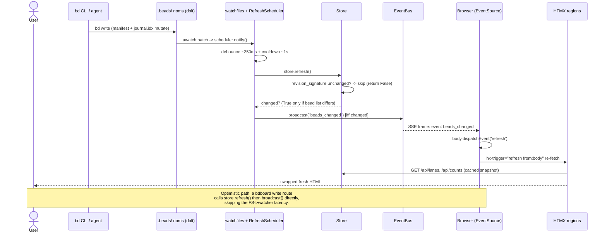

# Feature: Live auto-refresh

## What it does

Live auto-refresh keeps every open bdboard tab in lock-step with the underlying
`bd` workspace **without polling and without a manual reload**. The moment a bead
changes — whether the write came from this tab, another tab, a CLI `bd` command,
another agent, or a `/bead-chain` run — the board, KPI counts, history, and
memory regions re-render within roughly a second. bdboard is a pure *observer*
on the dolt-native source of truth: this feature never writes beads, it only
notices that they changed (via a filesystem watcher) or is told that they changed
(via an in-process optimistic broadcast from bdboard's own write routes), and
then pushes a content-free "go re-fetch" signal over a long-lived Server-Sent
Events (SSE) stream to every connected browser.

## Why it exists

A bead board is only trustworthy if it reflects *current* state. The whole point
of bdboard is to be a glanceable, always-correct window onto a workspace that is
being mutated continuously by humans and agents from outside the browser. If the
user had to hit reload — or if the page polled on a timer — the board would be
either stale or wasteful, and an agent finishing a bead in the terminal wouldn't
visibly land on the board. Three concrete needs drive this feature:

1. **External writes must show up live.** The dominant write path is *not* the
   browser — it's `bd` on the CLI and agents. A timer-poll would add latency and
   load; nothing would feel "live."
2. **The acting tab and its peers must update instantly.** When you edit a field
   or pour a formula *in* bdboard, waiting out the filesystem→watcher latency
   feels laggy, so write routes broadcast optimistically the instant their `bd`
   subprocess returns.
3. **It must degrade to "last-good," never to "broken."** A flaky filesystem
   event, a transient `bd list` failure, or a dropped SSE socket must leave the
   board showing the previous snapshot and silently self-heal — never flash empty
   or spin.

## How it works

### User perspective

The user opens the board and sees a **live-status pill** in the footer (the
`#live-status` text next to the `#live-dot`). It starts at `connecting…`, flips to
`live · push` once the SSE stream connects, and shows `reconnecting…` if the
connection drops (it auto-recovers). From then on the user does nothing: when a
bead is created, edited, closed, or poured — from anywhere — the relevant region
visibly updates in place a beat later. There is no reload button, no spinner
storm, no flicker; regions swap their fresh HTML and any client-side filter the
user had applied is re-applied after the swap.

### System perspective

There are **two entry points** that both end in the same broadcast, plus a
freshly-connected tab's bootstrap:

1. **Filesystem path (canonical, for external writes).** On boot, `lifespan`
   spawns the `_watch_beads()` task, which watches a small fixed set of dolt
   `noms/` dirs + `.beads/` itself, *non-recursively*. Each `watchfiles.awatch`
   batch calls `RefreshScheduler.notify()`. The scheduler debounces the burst
   (~250 ms), waits out any cooldown remainder (~1 s), then runs
   `store.refresh()`. `refresh()` first compares the dolt manifest
   `revision_signature()`; if the committed state is byte-identical (i.e. the
   event was bdboard's *own* read echoing back), it skips the `bd list`
   subprocess and returns `False`. Otherwise it re-runs `bd list --json` and
   structurally diffs against the cached snapshot. **Only if the bead list
   actually changed** does the scheduler call `bus.broadcast("beads_changed")`.
2. **Optimistic in-process path (for bdboard's own writes).** A write route
   (field edit, formula pour, memory mutation) mutates via `bd`, calls
   `store.refresh()` itself, then calls `bus.broadcast("beads_changed")` directly
   — so it doesn't wait for the watcher latency.
3. **Bootstrap.** A brand-new SSE connection is handed a one-shot
   `beads_changed`/`bootstrap` frame the instant it subscribes, so a freshly
   opened tab paints immediately.

The broadcast pushes the opaque string `"beads_changed"` onto every subscriber
queue. The `/api/events` SSE endpoint relays each frame to its browser. The
browser's `EventSource` listener dispatches a synthetic `refresh` `CustomEvent`
on `document.body`; every region with `hx-trigger="refresh from:body"`
re-fetches its HTML partial (lanes, counts, history, memory) and HTMX swaps it in.
The payload carries **no bead data** — the authoritative render always comes from
the normal partial-fetch request path through the
[derive layer](../Concepts/derive-layer.md).

## Sequence

## Implementation Map

| Concern | Where | Notes |
| --- | --- | --- |
| Watcher boot / target enumeration | [`src/bdboard/app.py:lifespan`](../../src/bdboard/app.py) → [`app.py:_watch_beads`](../../src/bdboard/app.py) | Spawns watcher task; non-recursive watch of dolt `noms/` + `.beads/`. |
| Target re-scan (inode swap / new db) | [`app.py:_rescan_targets`](../../src/bdboard/app.py) | Polls `bd.watch_signature()` every `WATCHER_RESCAN_S` and trips `awatch`'s `stop_event`. |
| Debounce / cooldown / in-flight protection | [`src/bdboard/watcher.py:RefreshScheduler`](../../src/bdboard/watcher.py) (`notify`, `_settle`) | Coalesces FS bursts into one refresh; never cancels an in-flight refresh. |
| Snapshot refresh + change diff | [`src/bdboard/store.py:Store.refresh`](../../src/bdboard/store.py) | Returns `True` only if the bead list actually changed — the broadcast gate. |
| Self-feedback skip (dolt revision check) | [`src/bdboard/bd.py:BdClient.revision_signature`](../../src/bdboard/bd.py) | Manifest root-hash fingerprint; skips `bd list` when bytes are identical. |
| SSE fan-out bus | [`src/bdboard/events.py:EventBus`](../../src/bdboard/events.py) (`broadcast`, `subscribe`) | Per-subscriber bounded queue (16), drop-oldest on overflow. |
| SSE endpoint | [`app.py:sse_events`](../../src/bdboard/app.py) (`GET /api/events`) | Bootstrap frame on connect, 15 s heartbeat, disconnect cleanup. |
| Optimistic broadcast (write routes) | [`app.py`](../../src/bdboard/app.py) — field edit / formula pour / memory routes call `bus.broadcast("beads_changed")` | Drives the acting tab + peers instantly. |
| Client SSE wiring + status pill | [`templates/base.html`](../../src/bdboard/templates/base.html) (`EventSource('/api/events')`, `#live-status`, `#live-dot`) | Translates `beads_changed` → synthetic `refresh` DOM event. |
| Live regions | [`templates/dashboard.html`](../../src/bdboard/templates/dashboard.html), [`partials/lanes.html`](../../src/bdboard/templates/partials/lanes.html), [`history.html`](../../src/bdboard/templates/history.html), [`memory.html`](../../src/bdboard/templates/memory.html) | `hx-trigger="load, refresh from:body"` regions that re-fetch on each event. |

## Config

| Name | Where | Default | Effect |
| --- | --- | --- | --- |
| `WATCHER_DEBOUNCE_S` | [`app.py`](../../src/bdboard/app.py) → `RefreshScheduler(debounce_s=…)` | `0.25` | Trailing quiet-window that collapses a multi-file `bd update` burst into one refresh. |
| `WATCHER_COOLDOWN_S` | [`app.py`](../../src/bdboard/app.py) → `RefreshScheduler(cooldown_s=…)` | `1.0` | Minimum gap between *successful* refreshes; throttles a write storm. |
| `WATCHER_RESCAN_S` | [`app.py`](../../src/bdboard/app.py) → `_rescan_targets` | `3.0` | How often the watcher re-checks its target inode signature for a new db / replaced `noms/`. |
| `_QUEUE_SIZE` | [`events.py`](../../src/bdboard/events.py) | `16` | Per-subscriber SSE queue depth; overflow drops the oldest event. |
| SSE heartbeat interval | [`app.py:sse_events`](../../src/bdboard/app.py) (`asyncio.wait_for(..., timeout=15.0)`) | `15 s` | Comment-line keep-alive so proxies/load-balancers don't kill the idle stream. |

> [!IMPORTANT]
> The broadcast is **gated on `store.refresh()` returning `True`**. Never
> broadcast unconditionally on a watcher event — pure dolt-internal churn and
> memory-only `bd remember` writes produce no issue-state change, and a flood of
> no-op broadcasts would make every tab re-fetch for nothing. Structural equality
> of the cached snapshot is the dedup.

## Edge Cases

> [!WARNING]
> - **Self-feedback loop.** A *read-only* `bd list` still makes dolt re-touch
>   `journal.idx`/`manifest` inside the watched `noms/` dir, so the watcher fires
>   for bdboard's own read ~1.3 s later. Two guards sever the loop: `notify()`
>   never cancels an **in-flight** refresh (only the cancellable debounce/cooldown
>   sleep), and `Store.refresh()` skips `bd list` entirely when the dolt
>   `revision_signature()` is byte-identical to last time. Break either and the
>   board freezes until relaunch (regression `bdboard-ywep`).
> - **Trailing / isolated write inside cooldown.** The *last* event of a burst
>   has no successor, so a single `bd update` that lands inside the cooldown
>   window must not be dropped. The scheduler waits out the remaining cooldown and
>   then refreshes rather than discarding it (regression `bdboard-xbc7` #1).
> - **Inode swap / new db after startup.** macOS kqueue watches inodes, not
>   paths; a dolt-replaced `noms/` dir or a brand-new db would silently stop
>   firing events. `_rescan_targets` detects the signature change and re-enters
>   `awatch` with fresh targets — no process restart (regression `bdboard-xbc7` #2).
> - **Slow / dead SSE client.** A subscriber's bounded 16-deep queue drops its
>   oldest event on overflow, so a slow tab can never back-pressure the
>   broadcaster. Losing a freshness blip is safe — the next event re-triggers the
>   same re-fetch.
> - **No-op writes.** `bd remember` and other memory-only or dolt-internal writes
>   change no bead state; the structural snapshot diff returns `False` and no SSE
>   frame is sent.

> [!CAUTION]
> Do not stuff bead data into the SSE payload to "save a round-trip." The event is
> intentionally a content-free `"beads_changed"` signal; the authoritative render
> always comes from a fresh partial fetch through the derive layer. Smuggling data
> through the event would create a second, divergent render path and defeat the
> single-source-of-truth posture.

## Error Scenarios

| What fails | What the user sees | How the system degrades |
| --- | --- | --- |
| `bd list --json` raises during `store.refresh()` | Board keeps showing the previous snapshot (no flash-empty) | Refresh returns `False`, **no broadcast**; the cooldown clock is **not** advanced so the next event retries promptly (`bdboard-xbc7` #3). |
| Watcher task crashes / `.beads/` missing | No visible change; updates briefly pause | `_watch_beads()` logs and restarts after 2 s; a not-yet-present `.beads/` simply retries. The watcher can never permanently die. |
| SSE socket dropped (server restart, proxy timeout) | Live-status pill flips to `reconnecting…` | `EventSource` auto-reconnects with exponential backoff; on reconnect the bootstrap frame repaints the tab. |
| Subscriber queue overflow (slow tab) | At worst one missed intermediate frame | Oldest event dropped; the next event re-triggers the identical re-fetch, so final state is still correct. |
| Optimistic write route's `bd` mutation fails | The acting tab sees the route's error response | The route does **not** broadcast on failure, so peers aren't told of a change that didn't happen; the filesystem path remains the backstop. |

## Testing

The timing-critical logic is unit-tested in isolation (no FastAPI / watchfiles /
real `bd` workspace required), and the broadcast contract is tested at the route
level:

- [`tests/test_watcher_scheduler.py`](../../tests/test_watcher_scheduler.py) —
  `test_isolated_event_refreshes_and_broadcasts` (one event ⇒ one
  refresh+broadcast), `test_trailing_event_after_cooldown_still_refreshes`
  (`bdboard-xbc7` #1), `test_burst_collapses_to_single_refresh` (debounce),
  `test_no_change_suppresses_broadcast` (broadcast dedup gate), and
  `test_transient_refresh_failure_does_not_wedge_live_sync` /
  failure-doesn't-advance-cooldown (`bdboard-xbc7` #3).
- [`tests/test_watcher_self_feedback.py`](../../tests/test_watcher_self_feedback.py)
  — `revision_signature` fingerprinting,
  `test_store_refresh_skips_bd_list_when_revision_unchanged`,
  `test_store_refresh_runs_bd_list_when_revision_changes`,
  `test_store_refresh_never_skips_without_dolt_signal`, and
  `test_inflight_refresh_is_not_cancelled_by_self_event` (the `bdboard-ywep` fix).
- [`tests/test_watch_targets.py`](../../tests/test_watch_targets.py) —
  non-recursive bounded watch targets, and `watch_signature()` changing when a new
  db appears or a `noms/` inode is replaced (but stable on mere content changes).
- [`tests/test_formula_pour.py`](../../tests/test_formula_pour.py) —
  `test_pour_success_renames_and_broadcasts` asserts the optimistic
  `"beads_changed"` broadcast fires on a successful pour.
- [`tests/test_memory_mutations.py`](../../tests/test_memory_mutations.py) —
  `test_create_memory_broadcasts_sse_on_success` and
  `test_delete_memory_broadcasts_sse_on_success` assert the optimistic broadcast
  on memory writes.

## Related

- [Flow: Live-refresh pipeline](../Flows/live-refresh-pipeline.md) — the end-to-end mechanics this feature presents; the step-by-step, data transformations, and full failure matrix live there.
- [Endpoint: SSE events (`/api/events`)](../Endpoints/sse-events.md) — the long-lived stream, heartbeat, and bootstrap frame this feature pushes onto.
- [Endpoint: Lanes API (`/api/lanes`)](../Endpoints/lanes-api.md) — the primary region re-fetched on each `refresh`.
- [Concept: Watcher debounce/cooldown & self-feedback skip](../Concepts/watcher-scheduling.md) — the timing model (debounce, cooldown, in-flight protection) behind the scheduler.
- [Concept: Store snapshot cache & change detection](../Concepts/store-snapshot-cache.md) — the cache `refresh()` rebuilds and the structural-equality diff that gates the broadcast.
- [Concept: bd CLI as runtime source of truth](../Concepts/bd-cli-source-of-truth.md) — why bdboard observes dolt via `bd list` subprocesses instead of reading files directly.
- [Concept: HTMX + server-rendered partials](../Concepts/htmx-partials-architecture.md) — how the synthetic `refresh` event drives the partial re-fetch/swap.
- [Concept: Derive layer (pure view shaping)](../Concepts/derive-layer.md) — how the refreshed snapshot is shaped into lanes/activity/counts on each re-fetch.
- [Flow: Inline field-edit write path](../Flows/field-edit-write-path.md) — a write flow that drives the optimistic-broadcast half of this feature.
- [Flow: Formula pour fan-out](../Flows/formula-pour-fanout.md) — the sibling write flow that piggybacks on this broadcast → re-fetch machinery.
- [View: Board page](../Views/board-page.md) — the page whose lanes/counts regions this feature keeps live, and host of the live-status pill.
