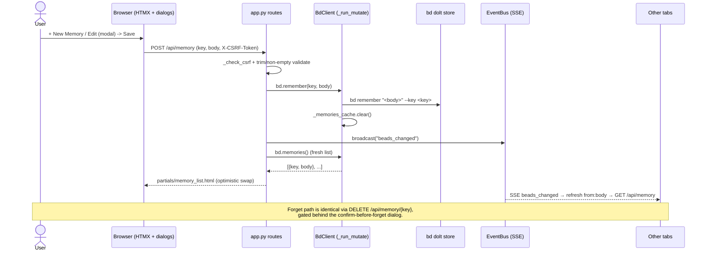

# Feature: Memory management

## What it does

Memory management is bdboard's UI for browsing, searching, creating, editing,
and deleting **bd memories** — the durable, key→body notes that `bd` injects into
every agent's context at `bd prime`. The dedicated `/memory` page renders each
memory as a card (monospace key heading + markdown-rendered body), offers a
debounced server-side search box, and exposes inline **edit** and **forget**
button affordances. Creating or editing happens in a native modal
`<dialog>`; deleting routes through a separate confirm-before-forget dialog
because a stray forget silently degrades every future agent session. Every
mutation is an upsert/delete against bd's dolt store via `bd remember` /
`bd forget`, after which the list re-renders optimistically and an SSE broadcast
keeps every other open tab in sync.

## Why it exists

bd memories are the project's persistent institutional knowledge — gotchas,
conventions, hard-won lessons — and they are *consumed* by agents at `bd prime`,
but historically they could only be *curated* from the CLI (`bd remember`,
`bd forget`, `bd memories`). That left a glaring asymmetry: a human staring at
the board could see the work but had no glanceable way to read, fix a typo in,
or retire a memory without dropping to a terminal. Three concrete needs drive
this feature:

1. **Browsability.** Memories accumulate; a searchable, markdown-rendered card
   list makes the corpus legible at a glance instead of a wall of CLI JSON.
2. **Safe in-place curation.** Editing a memory's body or deleting a stale one
   should be a two-click operation in the same surface you read it — but
   *deletion in particular needs friction*, because forgetting is irreversible
   and invisibly harms downstream agent runs.
3. **It is bdboard's first (and reference) write path.** bdboard began as a pure
   read-only observer. Memory management is where the project deliberately
   introduced its first mutations — establishing the CSRF + serialized-mutation +
   optimistic-refresh + SSE-broadcast posture that the
   [field-edit](../Endpoints/bead-field-edit-api.md) and
   [formula pour](formula-pour.md) write paths later inherited.

## How it works

### User perspective

The user navigates to **Memory** in the nav. The page shows a toolbar with a
**search box** and a **+ New Memory** button, above a list region that paints a
skeleton instantly and then fills with memory cards (each a monospace key + a
markdown-rendered body + edit/forget buttons). A live result-count line
(`N memories`, or `N matching "term"`) announces filter changes to screen
readers. Typing in the search box re-queries the server after a 250 ms debounce
and swaps the list in place; clearing it (via the native search clear control)
returns the full list.

- **Create:** click **+ New Memory** → a modal opens with Key and Body fields →
  **Save Memory** posts the form; the list re-renders with the new card.
- **Edit:** click the edit button on a card → the same modal opens pre-filled,
  with the **Key field read-only** (a key can't be renamed via `bd remember`) →
  editing the body and saving upserts it.
- **Forget:** click the forget button on a card → a **separate confirm dialog**
  appears,
  spelling out that the memory is injected at `bd prime` and that forgetting it
  degrades future agent sessions and **cannot be undone** → **Yes, Forget It**
  deletes it; the list re-renders without the card.

The user never reloads: a mutation made in any tab (or from the CLI) re-paints
every open Memory list within ~1 s via the live-refresh SSE channel.

### System perspective

The page route and the data/mutation routes are deliberately split so the page
load never blocks on a `bd` subprocess:

1. **Page shell.** `GET /memory` (`page_memory`) validates the workspace
   (surfacing a friendly error page if broken, for parity with `/`), then renders
   `memory.html` — just the toolbar, the empty list region, and the create/forget
   dialogs. It runs no `bd` command itself.
2. **List/search.** The list region carries
   `hx-get="/api/memory" hx-trigger="load, refresh from:body"`, so it fetches on
   load, on every debounced search keystroke, and on each `beads_changed` SSE
   event. `GET /api/memory` (`api_memory`) calls `bd.memories(term)`, which shells
   `bd memories [term] --json`. bd performs its **own** case-insensitive substring
   match across key and body, so search is delegated to bd rather than
   reimplemented client-side. The wrapper strips the `schema_version` sentinel,
   sorts the remaining entries by key, and renders `partials/memory_list.html`.
3. **Create / update.** `POST /api/memory` (`api_memory_create`) first validates
   the CSRF token (`_check_csrf`), then trims and non-empty-validates key and
   body, then calls `bd.remember(key, body)` -> `bd remember "<body>" --key <key>`
   (upsert: new key creates, existing key replaces the body). On success it
   **broadcasts `beads_changed`** and returns a freshly-fetched list partial for
   the optimistic swap.
4. **Delete.** `DELETE /api/memory/{key:path}` (`api_memory_delete`) validates
   CSRF (header only), then calls `bd.forget(key)` -> `bd forget <key>`. The key is
   `:path`-encoded so keys containing slashes work. On success it broadcasts
   `beads_changed` and returns the refreshed list.

All mutations run through `BdClient._run_mutate`, serialized on the shared
`_subprocess_gate` (bd's dolt store is single-writer), and both `remember` and
`forget` clear the `_memories_cache` immediately so the follow-up
`bd.memories()` read returns post-mutation state rather than a stale cached
snapshot. The SSE broadcast is the *cross-tab* half; the returned partial is the
*acting-tab* (optimistic) half — together they make the change appear everywhere
without waiting on the filesystem watcher's debounce.

## Sequence

## Implementation Map

| Concern | Where | Notes |
| --- | --- | --- |
| Page route (shell only) | [`src/bdboard/app.py:page_memory`](../../src/bdboard/app.py) (`GET /memory`) | Validates workspace, renders `memory.html`; runs no `bd` command. |
| List / search route | [`app.py:api_memory`](../../src/bdboard/app.py) (`GET /api/memory`) | Trims `q`, calls `bd.memories(term)`, degrades to inline message on failure. |
| Create / update route | [`app.py:api_memory_create`](../../src/bdboard/app.py) (`POST /api/memory`) | CSRF + non-empty validation → `bd.remember` → broadcast → fresh list. |
| Delete route | [`app.py:api_memory_delete`](../../src/bdboard/app.py) (`DELETE /api/memory/{key:path}`) | CSRF (header) → `bd.forget` → broadcast → fresh list; `:path` key. |
| CSRF guard | [`app.py:_check_csrf`](../../src/bdboard/app.py) + `_CSRF_TOKEN` | Accepts `X-CSRF-Token` header or `csrf_token` form field; 403 otherwise. |
| Memories read wrapper | [`src/bdboard/bd.py:BdClient.memories`](../../src/bdboard/bd.py) | `bd memories [term] --json`; strips `schema_version`, sorts by key; cached + in-flight deduped. |
| Write wrappers | [`bd.py:BdClient.remember`](../../src/bdboard/bd.py) / [`bd.py:BdClient.forget`](../../src/bdboard/bd.py) | `bd remember "<body>" --key <key>` / `bd forget <key>`; clear `_memories_cache`. |
| Serialized mutation runner | [`bd.py:BdClient._run_mutate`](../../src/bdboard/bd.py) | Single-writer `_subprocess_gate`; surfaces bd stderr; fd-leak-safe `communicate()`. |
| List partial | [`templates/partials/memory_list.html`](../../src/bdboard/templates/partials/memory_list.html) | Result-count (`aria-live`), cards, context-aware empty states. |
| Page template + dialogs + JS | [`templates/memory.html`](../../src/bdboard/templates/memory.html) | Search strip, create/edit `<dialog>`, confirm-before-forget `<dialog>`, `editMemory`/`confirmForget` wiring. |
| Markdown rendering | [`src/bdboard/md.py:render`](../../src/bdboard/md.py) (the `md` Jinja filter) | `html=False` (escapes raw HTML in bodies), `linkify=True`. |
| SSE broadcast | [`src/bdboard/events.py:EventBus.broadcast`](../../src/bdboard/events.py) | Pushes `beads_changed`; other tabs re-fetch via `refresh from:body`. |

## Config

| Name | Where | Default | Effect |
| --- | --- | --- | --- |
| `MEMORIES_TIMEOUT_S` | [`bd.py`](../../src/bdboard/bd.py) | `8.0` | Subprocess timeout for the `bd memories` read. |
| `REMEMBER_TIMEOUT_S` | [`bd.py`](../../src/bdboard/bd.py) | `10.0` | Timeout for `bd remember`; higher than reads because a write does a dolt commit. |
| `FORGET_TIMEOUT_S` | [`bd.py`](../../src/bdboard/bd.py) | `10.0` | Timeout for `bd forget` (also a dolt-commit write). |
| `SCHEMA_VERSION_KEY` | [`bd.py`](../../src/bdboard/bd.py) | `"schema_version"` | Sentinel key stripped from `bd memories --json` before rendering. |
| `_CSRF_TOKEN` | [`app.py`](../../src/bdboard/app.py) | `secrets.token_urlsafe(32)` (per-process) | Required on every memory mutation; exposed to templates as the `csrf_token` Jinja global. |
| Search debounce | [`templates/memory.html`](../../src/bdboard/templates/memory.html) (`hx-trigger="keyup changed delay:250ms, search"`) | `250 ms` | Trailing quiet-window before a keystroke re-queries `/api/memory`. |

> [!IMPORTANT]
> The Key field is **read-only when editing** (`editMemory` sets `readonly`).
> `bd remember --key K` is an upsert keyed on `K`; allowing the key to change in
> the edit dialog would silently create a *second* memory and orphan the
> original instead of renaming. To "rename," forget the old key and create a new
> one deliberately.

## Edge Cases

> [!WARNING]
> - **Forget is irreversible and invisible.** Memories are injected at
>   `bd prime`, so a stray delete silently degrades every future agent session.
>   This is why deletion is gated behind a *separate* confirm dialog that spells
>   out the consequence — never wire the forget button straight to the `DELETE`
>   route.
> - **`schema_version` sentinel.** `bd memories --json` returns a flat key→body
>   object *plus* a `schema_version` sentinel that is **not** a memory. The
>   wrapper strips it; a payload of *only* the sentinel (the empty / no-match
>   shape) correctly yields an empty list, not a phantom "schema_version" card.
> - **Keys with slashes.** The delete route uses `{key:path}` and the client
>   `encodeURIComponent`s the key, so keys containing `/` round-trip correctly.
> - **Upsert vs. create.** `POST /api/memory` has no "already exists" error —
>   posting an existing key *replaces* its body by design. The UI signals this in
>   the dialog hint ("If it exists, the body is updated.").
> - **Empty key/body.** Both are trimmed and rejected with a 400 inline message
>   *before* any `bd` subprocess runs, so whitespace-only input never reaches the
>   store.
> - **Memory writes don't change bead state.** A `remember`/`forget` mutates the
>   memory table, not the issue list, so the [live-refresh](live-auto-refresh.md)
>   broadcast here is fired *explicitly* by the route — it would not be triggered
>   by the snapshot-diff gate, which only reacts to bead-list changes.

> [!CAUTION]
> Do not render memory bodies with `html=True` or bypass the `md` filter. Bodies
> are authored content that an agent may not have written; the `md` shim
> deliberately escapes raw HTML (`html=False`) to keep `<script>` out of the
> page. Stuffing raw HTML through would open an XSS hole on the very surface that
> feeds agent context.

## Error Scenarios

| What fails | What the user sees | How the system degrades |
| --- | --- | --- |
| `bd memories` raises during `api_memory` | Inline "Couldn't load memories right now. Please try again in a moment." | Returns **200** with a friendly `role="status"` message rather than 500-ing the partial swap; the next load/search retries. |
| Missing / wrong CSRF token on create or delete | 403 "Invalid or missing CSRF token. Please refresh the page and try again." | `_check_csrf` raises `HTTPException(403)` before any `bd` write runs. |
| Empty key on create | 400 "Key cannot be empty." inline | Validated before the subprocess; no write attempted. |
| Empty body on create | 400 "Body cannot be empty." inline | Validated before the subprocess; no write attempted. |
| `bd remember` subprocess fails | 500 "Could not save: \<bd stderr\>" inline | `_run_mutate` surfaces bd's stderr; **no broadcast** fires, so peers aren't told of a write that didn't land. |
| `bd forget` on a non-existent key | 500 "Could not delete: \<bd stderr\>" inline | `bd forget` exits non-zero with a descriptive stderr, which is surfaced verbatim; no broadcast. |
| Mutation times out | 500 "Request timed out while saving. Please try again." | `_run_mutate` kills the child (fd-leak-safe drain) and raises after `REMEMBER`/`FORGET_TIMEOUT_S`. |

## Testing

- [`tests/test_bd_memories.py`](../../tests/test_bd_memories.py) — the
  `BdClient.memories()` JSON contract: empty/sentinel-only → no results,
  no-match search → no results, single match strips the sentinel, full list is
  sorted by key, blank/whitespace query collapses to the bare `memories`
  command, and a non-object payload raises.
- [`tests/test_memory_mutations.py`](../../tests/test_memory_mutations.py) —
  route behavior for `POST`/`DELETE /api/memory`: CSRF required (header *and*
  form field accepted), empty-key/empty-body 400s, `bd.remember`/`bd.forget`
  invoked with the right args, `beads_changed` broadcast on success
  (`test_create_memory_broadcasts_sse_on_success`,
  `test_delete_memory_broadcasts_sse_on_success`), and 500 + surfaced stderr on
  bd failure.
- [`tests/test_api_memory.py`](../../tests/test_api_memory.py) — the
  `GET /api/memory` list/search region rendering and the degraded-on-failure
  path.
- [`tests/test_page_memory.py`](../../tests/test_page_memory.py) — the `/memory`
  page shell renders the toolbar, list region, and dialogs (and the
  workspace-validation error path).
- [`tests/test_md.py`](../../tests/test_md.py) — the `md` filter that renders
  memory bodies (HTML escaping, linkify).

## Related

- [Endpoint: Memory API (`/api/memory` GET/POST/DELETE)](../Endpoints/memory-api.md) — the request/response contract, validation, and curl examples for the routes this feature drives.
- [View: Memory page (`/memory`)](../Views/memory-page.md) — the page layout, dialogs, and client wiring that present this feature.
- [Feature: Live auto-refresh](live-auto-refresh.md) — the SSE broadcast → `refresh from:body` machinery that fans memory mutations out to every open tab.
- [Endpoint: Bead field-edit API](../Endpoints/bead-field-edit-api.md) — the sibling write path that inherited this feature's CSRF + serialized-mutation + optimistic-refresh posture.
- [Feature: Formula pour](formula-pour.md) — the other write surface sharing the `_run_mutate` + SSE-broadcast pattern.
- [Concept: bd CLI as runtime source of truth](../Concepts/bd-cli-source-of-truth.md) — why every read and write is a `bd` subprocess and search is delegated to bd.
- [Concept: Store snapshot cache & change detection](../Concepts/store-snapshot-cache.md) — the cache layer `memories()` uses and `remember`/`forget` invalidate.
- [Concept: HTMX + server-rendered partials](../Concepts/htmx-partials-architecture.md) — why every response is an HTML fragment swapped in place.
