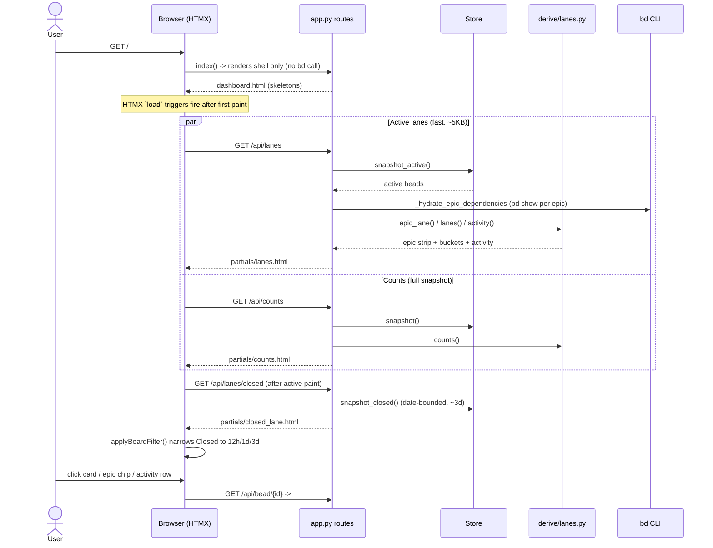

# Feature: Swim-lane board

## What it does

The swim-lane board is bdboard's home page (`/`) — a kanban-style view of the
entire `bd` workspace's *current* state. It buckets every non-epic bead into
five lifecycle lanes — **Deferred**, **Blocked**, **Ready**, **In Progress**,
and **Closed** — derived live from `bd`, alongside a horizontal **epic strip**
(active epics in dependency order) and an **Activity** column of recent events.
A masthead **counts strip** summarizes the workspace at a glance, and a
**time-window toolbar** (`12h` / `1d` / `3d`) scopes the recent-closures lane.
The lane assignment is *computed*, not just read off `status`: an `open` bead
whose blocking dependency is still un-closed is shown in **Blocked**, not
**Ready**, so the board answers "what's actually actionable" rather than merely
"what's the raw status field." Clicking any card, epic chip, or activity row
opens that bead in the shared detail modal, and the whole board stays live over
the SSE pipeline.

## Why it exists

A maintainer's first question every session is *"what's actionable right now,
and what's stuck?"* Answering that from the CLI means stitching together
`bd ready`, `bd list --status=blocked`, `bd list --status=in_progress`, and a
fair bit of manual epic/dependency reasoning. The swim-lane board collapses all
of that into a single glanceable surface whose columns map directly onto the
lifecycle states `bd` already tracks, with the blocking-dependency math
(`Ready` vs `Blocked`) done for you in the
[derive layer](../Concepts/derive-layer.md). Three needs drive its shape:

1. **Actionability over raw status.** The split between `Ready` and `Blocked`
   is the board's whole reason to exist — it surfaces *unmet blocking
   dependencies* that a flat status list hides. An `open` bead that can't be
   started yet must not masquerade as ready work.
2. **Epics deserve sequencing, not a column.** Epics are coordination
   containers, not actionable cards, so they live in a topologically-ordered
   strip (predecessor → successor) with the active/next-ready epic promoted to
   the front — answering "what's the current thrust?" without cluttering the
   work lanes.
3. **Recency for "done," history elsewhere.** The board is a *recent-activity*
   surface: the Closed lane is date-bounded (≤ 3 days) so the most relevant
   wins stay visible without the lane ballooning. Long-window retrospection is
   the [History page](../Views/history-page.md)'s job, not the board's.

It also deliberately reuses the snapshot the rest of the app already holds
rather than spawning a `bd` subprocess per render (see
[bd CLI as runtime source of truth](../Concepts/bd-cli-source-of-truth.md)), and
shares chrome with the History and Memory pages so the three feel like one
product.

## How it works

### User perspective

On opening `/`, the user sees the masthead (workspace name + a live counts
strip: `open` / `blocked` / `deferred` / `closed`), the Board/History/Memory
nav, the theme toggle, the **+ Pour Formula** button, and a right-aligned time
toolbar (`12h` / `1d` / `3d`, default `1d`). Below that: the epic strip, then
the swim lanes. Each lane shows a title with a live count badge and a column of
clickable bead cards (id, priority badge, title, assignee, type, dependency
count); empty lanes read `(empty)`. The **Activity** column lists recent events
("closed / in progress / blocked / created / updated", actor, humanized
timestamp). Clicking the `12h`/`1d`/`3d` badges instantly narrows the **Closed**
lane (and re-syncs the masthead Closed count) entirely client-side — no server
round-trip. Clicking any card, epic chip, or activity row opens that bead in the
shared modal. Everything updates in place when beads change anywhere — no reload.

### System perspective

The board page route is deliberately **thin and never calls `bd`** — it renders
only the shell ([`app.py:index`](../../src/bdboard/app.py)), and every byte of
board data is fetched lazily by HTMX `load` triggers *after* first paint
(design symmetry with History/Memory; see
[board-page](../Views/board-page.md)). The data arrives via three endpoints,
split for fast first paint (bdboard-0yy):

1. **`GET /api/lanes`** ([`app.py:api_lanes`](../../src/bdboard/app.py)) fetches
   the **active-only** snapshot (`store.snapshot_active()`, ~5 KB), hydrates
   epic dependency edges (`_hydrate_epic_dependencies`, a per-epic `bd show`
   fan-out — `bd list` omits expanded dependency arrays), and shapes it through
   the pure derive functions `epic_lane()`, `lanes()`, and `activity()` into
   [`partials/lanes.html`](../../src/bdboard/templates/partials/lanes.html).
2. **`GET /api/lanes/closed`** ([`app.py:api_lanes_closed`](../../src/bdboard/app.py))
   loads the heavy closed set separately (`store.snapshot_closed()`, up to
   ~500 KB) *after* the active lanes paint, swapping
   [`partials/closed_lane.html`](../../src/bdboard/templates/partials/closed_lane.html)
   into the `.lane-closed` placeholder — a ~100× first-paint payload reduction.
3. **`GET /api/counts`** ([`app.py:api_counts`](../../src/bdboard/app.py)) shapes
   `derive.counts()` over the **full** snapshot into the masthead strip.

The bucketing logic lives in [`derive/lanes.py`](../../src/bdboard/derive/lanes.py):
`lanes()` excludes epics (they live in the strip) and `molecule` wrappers (the
redundant formula-pour grouping node), then buckets each remaining bead — closed
statuses → `closed`; `in_progress`/`blocked` → their lanes; `open` →
`blocked` if it has an unmet blocking dependency else `ready`; everything else →
`deferred` (the catch-all). `epic_lane()` builds a dependency graph over active
epics, topologically orders connected components (stable created_at/id
tie-break, cycle-safe), appends unwired epics, then promotes the
in-progress-or-next-ready epic to position 0. The time toolbar is purely
client-side (`applyBoardFilter()` in
[`base.html`](../../src/bdboard/templates/base.html)) — it shows/hides
already-fetched Closed cards by their `data-closed-at` and mirrors the visible
count into the masthead Closed cell. SSE `refresh from:body` re-fetches all
three regions on any `beads_changed` event (see
[live auto-refresh](live-auto-refresh.md)).

## Sequence

## Implementation Map

| Concern | Where | Notes |
| --- | --- | --- |
| Page shell route | [`app.py:index`](../../src/bdboard/app.py) | Thin: runs `_validate_or_warn()`, renders `dashboard.html` with `workspace`/`workspace_path`/`active`. Never calls `bd`. |
| Page template | [`templates/dashboard.html`](../../src/bdboard/templates/dashboard.html) | Two-row masthead, time toolbar (`#board-time-filter`), `.lanes-region` swap target, pour `<dialog>`. |
| Active lanes endpoint | [`app.py:api_lanes`](../../src/bdboard/app.py) (`GET /api/lanes`) | Active-only snapshot → `epic_lane`/`lanes`/`activity`. |
| Closed lane endpoint | [`app.py:api_lanes_closed`](../../src/bdboard/app.py) (`GET /api/lanes/closed`) | Date-bounded closed snapshot, loaded after active paint. |
| Counts endpoint | [`app.py:api_counts`](../../src/bdboard/app.py) (`GET /api/counts`) | `derive.counts()` over the full snapshot. |
| Epic dependency hydration | [`app.py:_hydrate_epic_dependencies`](../../src/bdboard/app.py) | Per-epic `bd show` fan-out (`asyncio.gather`) to graft dependency edges `bd list` omits. |
| Lane / epic / activity / counts logic | [`derive/lanes.py`](../../src/bdboard/derive/lanes.py) (`lanes`, `epic_lane`, `activity`, `counts`) | Pure functions over the snapshot — no I/O, no caching. |
| Blocked-vs-ready math | [`derive/lanes.py:_has_unmet_blocking_dep`](../../src/bdboard/derive/lanes.py) | Treats `blocks`/`blocked-by` targets that aren't closed (or are unknown) as unmet → Blocked. |
| Epic topological ordering | [`derive/lanes.py:_topo_component_order`](../../src/bdboard/derive/lanes.py) | Heap-based Kahn sort, stable tie-break, cycle-safe leftover append. |
| Lanes template | [`templates/partials/lanes.html`](../../src/bdboard/templates/partials/lanes.html) | Epic strip + 4 active lanes + lazy `.lane-closed` + Activity. |
| Closed lane template | [`templates/partials/closed_lane.html`](../../src/bdboard/templates/partials/closed_lane.html) | Card list + `data-closed-count` badge; cards carry `data-closed-at`. |
| Counts template | [`templates/partials/counts.html`](../../src/bdboard/templates/partials/counts.html) | `<dl>` with `data-count-status` hooks the filter JS targets. |
| Shared bead card | [`templates/partials/bead_card.html`](../../src/bdboard/templates/partials/bead_card.html) | Single source of truth for the clickable tile across active/closed lanes + History. |
| Active/closed snapshots | [`store.py:Store.snapshot_active`](../../src/bdboard/store.py) / [`snapshot_closed`](../../src/bdboard/store.py) / [`snapshot`](../../src/bdboard/store.py) | Split caches feeding the three endpoints. |
| Date-bounded closed fetch | [`bd.py:BdClient.list_closed`](../../src/bdboard/bd.py) | `bd list --status closed --closed-after <cutoff>`; window = `BOARD_CLOSED_WINDOW_DAYS`. |
| Client time filter + count sync | [`templates/base.html`](../../src/bdboard/templates/base.html) (`applyBoardFilter`, `syncMastheadClosedCount`, `wireFilterBadges`) | Client-side Closed-lane window; mirrors visible count into masthead. |

## Config

| Name | Where | Default | Effect |
| --- | --- | --- | --- |
| `BOARD_CLOSED_WINDOW_DAYS` | [`derive/lanes.py`](../../src/bdboard/derive/lanes.py) | `3` | Look-back window bounding the Closed lane & the matching CLOSED KPI at fetch time (`bd list --closed-after`). Anything older lives on the History page (bdboard-p8v). |
| `BOARD_TIME_WINDOWS` | [`templates/base.html`](../../src/bdboard/templates/base.html) | `12h` / `1d` / `3d` | The client-side time-toolbar buckets. The `3d` ceiling matches `BOARD_CLOSED_WINDOW_DAYS` — the widest window can't out-reach the fetched set. |
| `BOARD_FILTER_STORAGE_KEY` | [`templates/base.html`](../../src/bdboard/templates/base.html) | `bdboard-time-filter` (default value `1d`) | `sessionStorage` key persisting the selected window across SSE refreshes and navigations. |
| `activity(limit=…)` | [`derive/lanes.py:activity`](../../src/bdboard/derive/lanes.py) | `25` | Cap on the Activity column's synthesized event feed. |
| `LANES` / `CLOSED_STATUSES` | [`derive/lanes.py`](../../src/bdboard/derive/lanes.py) | `(deferred, ready, in_progress, blocked, closed)` / `{closed, resolved, done}` | Stable lane keys and the status set treated as "done." |

> [!IMPORTANT]
> `in_progress` is intentionally **omitted** from the masthead counts strip.
> bdboard is a single-flight workflow tool — only one bead is in progress at a
> time, so a `0`/`1` cell is noise. The In Progress *lane* already surfaces the
> active bead. See [`derive.counts`](../../src/bdboard/derive/lanes.py) and
> `tests/test_derive_counts.py::test_counts_excludes_in_progress`.

## Edge Cases

> [!WARNING]
> - **Active-only first paint mislabels resolved-blocker beads.** `/api/lanes`
>   fetches *active* issues only, so a bead whose sole blocker is already closed
>   isn't in view to be checked — `_has_unmet_blocking_dep` conservatively
>   treats the unknown target as unmet and renders it **Blocked**. It corrects
>   to **Ready** on the next SSE `refresh` (full snapshot). This is the accepted
>   tradeoff for the ~100× faster first paint, not a bug. The Activity column
>   has the same property: closed-bead events appear only after the first refresh.
> - **Unknown statuses fall through to Deferred.** `lanes()` routes any status
>   that isn't `open`/`in_progress`/`blocked`/closed-family into the **Deferred**
>   catch-all (covers bd built-ins like `hooked`/`pinned` and any custom status)
>   so no bead silently vanishes (regression bdboard-yed). Non-standard statuses
>   that actually exist also surface as extra counts cells.
> - **Open epics with unmet blockers show a Blocked badge.** An `epic` with
>   `status=open` but an un-closed blocking dependency renders with the Blocked
>   badge in the strip; if its blocker is *closed*, it reverts to Open
>   (regression bdboard-vja). `in_progress` is never overridden.
> - **Molecule wrappers are hidden.** `bd mol pour` creates a `molecule`-typed
>   wrapper plus the formula's own `epic` root step. Per the grouping-node
>   display decision (Option A), the human-readable name rides the epic root
>   step (already in the strip), so the bare wrapper is excluded from both the
>   lanes and the epic strip rather than rendered as a stray Ready card.
> - **Closed lane / KPI consistency.** The Closed lane and the masthead CLOSED
>   count both reflect the *same* date-bounded set (`BOARD_CLOSED_WINDOW_DAYS`);
>   the client filter narrows the lane and mirrors the visible total back into
>   the KPI via `syncMastheadClosedCount`, so header and lane can never drift at
>   the window boundary (bdboard-p8v, bdboard-de4z).
> - **Dependency cycles among epics.** `_topo_component_order` appends any nodes
>   it couldn't topologically place (a cycle) in stable created_at/id order, so a
>   bad dependency graph degrades to deterministic rendering instead of dropping
>   epics.

> [!CAUTION]
> Don't key the time-filter / count-sync JS off the visible label text in the
> counts strip — it's text-transformed and re-wordable. Target the stable
> `data-count-status` / `data-closed-at` / `data-closed-count` hooks instead.
> Likewise, don't move the Ready/Blocked split out of the derive layer into the
> template: the bucketing is pure, testable logic and must stay that way (see
> [derive layer](../Concepts/derive-layer.md)).

## Error Scenarios

| What fails | What the user sees | How the system degrades |
| --- | --- | --- |
| Broken / missing workspace at page load | `error.html` rendered with HTTP `500` | `index` runs `_validate_or_warn()` and fails *visibly* rather than painting an empty board. |
| `bd list` (active) raises during snapshot refresh | Board keeps showing the previous snapshot | `store.refresh()` returns `False`, no SSE broadcast; the last-good cache stays on screen and the next event retries (see [live-refresh pipeline](../Flows/live-refresh-pipeline.md)). |
| `_hydrate_epic_dependencies` `bd show` fails for an epic | That epic still renders; sequencing falls back | The per-epic `bd show` result is simply skipped (`if not full: continue`); the epic keeps its base fields and is ordered as an unwired node. |
| `/api/lanes/closed` slow or failing | Active lanes are already visible; Closed lane shows its skeleton | The closed lane is independent of first paint, so a failure there never blocks the actionable lanes. |
| Closed-lane filter runs before hydration | No clobbering of the masthead total | `syncMastheadClosedCount` only runs when the real `[data-closed-count]` badge exists (skeleton has none), so a premature run can't overwrite the server total with a stale `0` (bdboard-de4z). |
| Bead with no usable timestamp | Omitted from the Activity feed | `activity()` skips beads lacking `closed_at`/`updated_at`/`created_at`. |

## Testing

The board's logic is concentrated in the pure derive layer and the
template/JS contract, which keeps it fast to test without a live `bd` workspace:

- [`tests/test_deferred_fallback.py`](../../tests/test_deferred_fallback.py) —
  `test_deferred_status_lands_in_deferred_lane`,
  `test_unknown_status_falls_back_to_deferred_lane`, and
  `test_mixed_statuses_bucket_correctly` assert every bead lands in exactly one
  lane and unknown statuses hit the Deferred catch-all (bdboard-yed).
- [`tests/test_derive_epics.py`](../../tests/test_derive_epics.py) —
  `test_lanes_excludes_epics_from_main_columns`,
  `test_lanes_excludes_molecule_wrapper_from_main_columns`,
  `test_epic_lane_excludes_molecule_wrapper`, `test_is_molecule_helper`,
  `test_epic_lane_promotes_active_or_next_ready_to_front_and_omits_closed`,
  `test_epic_lane_promotes_ready_when_no_active_epic`, and
  `test_epic_lane_displays_blocked_badge_for_open_epics_with_unmet_blockers`
  cover epic sequencing, promotion, molecule hiding, and the Blocked-badge
  derivation (bdboard-vja).
- [`tests/test_derive_counts.py`](../../tests/test_derive_counts.py) —
  `test_counts_returns_fixed_status_set_even_when_empty`,
  `test_counts_excludes_in_progress`,
  `test_counts_preserves_status_order_with_mixed_data`,
  `test_counts_includes_custom_statuses_at_end`, and
  `test_counts_case_insensitive` pin the stable masthead geometry and the
  intentional `in_progress` omission.
- [`tests/test_board_counts_filter_sync.py`](../../tests/test_board_counts_filter_sync.py) —
  `test_counts_cells_carry_status_hook`,
  `test_closed_cell_pairs_hook_with_value`,
  `test_sync_helper_targets_closed_cell_by_hook`,
  `test_sync_mirrors_zero_state_muting`,
  `test_apply_filter_feeds_visible_count_to_masthead`,
  `test_masthead_sync_guarded_by_real_closed_lane`, and
  `test_counts_strip_resync_on_independent_settle` assert the client-side
  time-filter ↔ masthead CLOSED-count contract (bdboard-de4z).
- Contrast/visual regressions for board chrome live in
  [`tests/test_closed_filter_contrast.py`](../../tests/test_closed_filter_contrast.py),
  [`tests/test_counts_contrast.py`](../../tests/test_counts_contrast.py),
  [`tests/test_bead_status_contrast.py`](../../tests/test_bead_status_contrast.py),
  [`tests/test_epic_status_contrast.py`](../../tests/test_epic_status_contrast.py),
  and [`tests/test_activity_filter_contrast.py`](../../tests/test_activity_filter_contrast.py).

## Related

- [View: Board page (`/`)](../Views/board-page.md) — the page that hosts this feature: route, page structure, partials, and state.
- [Endpoint: Lanes API (`/api/lanes`, `/api/lanes/closed`, `/api/counts`)](../Endpoints/lanes-api.md) — the three endpoints that supply the board's data.
- [Endpoint: Bead detail API (`/api/bead/{id}`, `/audit`, `/raw`)](../Endpoints/bead-detail-api.md) — opened when a card / epic chip / activity row is clicked.
- [Endpoint: SSE events (`/api/events`)](../Endpoints/sse-events.md) — the stream that drives the board's live re-fetch.
- [Feature: Live auto-refresh](live-auto-refresh.md) — how a `beads_changed` event re-renders the lanes, closed lane, and counts.
- [Feature: Formula pour](formula-pour.md) — the **+ Pour Formula** flow that drops new beads onto the board.
- [Feature: Bead detail & inline editing](bead-detail-and-inline-editing.md) — the modal a board click opens.
- [Flow: Live-refresh pipeline](../Flows/live-refresh-pipeline.md) — end-to-end mechanics behind the board staying live.
- [Concept: Derive layer (pure view shaping)](../Concepts/derive-layer.md) — where `lanes`/`epic_lane`/`activity`/`counts` live and why they're pure.
- [Concept: Store snapshot cache & change detection](../Concepts/store-snapshot-cache.md) — the active/closed/full snapshots the endpoints read.
- [Concept: bd CLI as runtime source of truth](../Concepts/bd-cli-source-of-truth.md) — why the board observes `bd` via subprocesses instead of files.
- [Concept: HTMX + server-rendered partials](../Concepts/htmx-partials-architecture.md) — the load/refresh swap model the board is built on.
- [Architecture](../Architecture.md) — system overview.
- [FlowDoc Authoring Guide](../_FlowDocGuide.md) — the template this doc follows.
