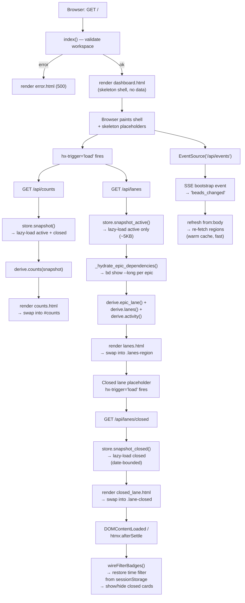

# Board First Paint

## What Happens

A user navigates to `/` (or the CLI auto-opens a browser tab). The server
returns a **cheap shell** instantly — static HTML with skeleton placeholders,
no subprocess calls, no data fetching. The browser paints the skeletons,
then three HTMX `load` triggers fire to hydrate the page in parallel:
`GET /api/counts` (masthead strip), `GET /api/lanes` (epic strip + active
swim lanes + activity feed), and — once the lanes partial swaps in —
`GET /api/lanes/closed` (the heavy closed lane, deferred to keep time-to-
first-paint low). Concurrently, an `EventSource` connects to
`GET /api/events` for live updates, and client-side JS restores the
board time filter from `sessionStorage` and applies it to newly rendered
Closed cards.

This is the **initial load** path — every subsequent live update rides the
[Watcher Refresh Cycle](WatcherRefreshCycle.md) and
[SSE Live Update](SseLiveUpdate.md) pipeline instead.

## Trigger

**Browser issues `GET /`** — either from:

- The CLI's `_open_when_ready()` thread, which polls until the server
  accepts connections and then calls `webbrowser.open(...)`.
- A user navigating directly (typing the URL, clicking a bookmark, or
  refreshing the page).
- A full-page navigation from `/history` or `/memory` via the masthead
  nav links (plain `<a>` hrefs, not HTMX).

## Outcome

- The board shell (masthead, nav, time-filter toolbar, footer, bead-modal
  host, SSE status dot) is visible **immediately** — within a single
  network round-trip — with shimmer skeleton placeholders where data will
  appear.
- The masthead counts strip shows Open / Blocked / Deferred / Closed
  tallies once `/api/counts` resolves.
- The epic strip, four active swim lanes (Deferred / Blocked / Ready /
  In Progress), and the Activity column appear once `/api/lanes` resolves.
- The Closed lane fills in once `/api/lanes/closed` resolves (after the
  lanes partial swaps in, since the closed lane's `hx-get` lives *inside*
  `lanes.html`).
- The SSE connection is live (green dot in the footer), and any subsequent
  `.beads/` mutation will trigger a re-fetch of all data regions via
  `refresh from:body`.
- The board time filter (12h / 1d / 3d) is restored from `sessionStorage`
  and applied to the Closed lane cards client-side.



## Step-by-Step

| # | What | Where (file:symbol) | Failure mode |
| --- | --- | --- | --- |
| 1 | **CLI startup** — resolve workspace, set `BDBOARD_WORKSPACE` and `BDBOARD_BD_BIN` env vars, pick a free port (auto-increment from 7332), start uvicorn, optionally spawn a daemon thread that polls until the server accepts connections and opens a browser tab. | `src/bdboard/cli.py`:`_run`, `_resolve_workspace`, `_pick_port`, `_open_when_ready` | Workspace unresolvable (macOS TCC sandboxing) → exit 1 with friendly message. No free port → exit 1. |
| 2 | **App boot (lifespan)** — the FastAPI lifespan handler spawns the `_watch_beads` background task, which enumerates `.beads/` watch targets and enters `awatch`. Store caches are still empty — no `bd list` runs until a route or the watcher triggers one. | `src/bdboard/app.py`:`lifespan`, `_watch_beads`; `src/bdboard/bd.py`:`BdClient.watch_targets` | `.beads/` absent → watcher sleeps 2 s and retries (board still serves, just without live sync). |
| 3 | **GET / — shell render** — `index()` calls `_validate_or_warn()` (lazy workspace validation), then returns `dashboard.html` with only static context (`workspace`, `workspace_path`, `active`). No `store`, no `bd` subprocess, no data — **zero blocking I/O**. The template extends `base.html`, which injects anti-FOUC theme JS, CSS, HTMX, and SSE/filter scripts. | `src/bdboard/app.py`:`index`, `_validate_or_warn`; `src/bdboard/templates/dashboard.html`; `src/bdboard/templates/base.html` | Workspace validation fails → `error.html` (500). |
| 4 | **Browser paints skeletons** — `dashboard.html` renders: (a) `counts_skeleton.html` inside `#counts` (4 shimmer stat cells), (b) `lanes_skeleton.html` inside `.lanes-region` (shimmer epic strip + 5 lane columns + activity column), (c) the board time-filter toolbar (12h / 1d / 3d badges), (d) the Pour Formula `<dialog>`, and (e) the `<footer>` with SSE status dot ("connecting…"). Both `#counts` and `.lanes-region` carry `aria-busy="true"` so assistive tech announces them as loading regions. | `src/bdboard/templates/dashboard.html`; `src/bdboard/templates/partials/counts_skeleton.html`; `src/bdboard/templates/partials/lanes_skeleton.html` | Cannot fail — static HTML. |
| 5 | **HTMX `load` triggers fire** — `#counts` has `hx-get="/api/counts" hx-trigger="load, refresh from:body"` and `.lanes-region` has `hx-get="/api/lanes" hx-trigger="load, refresh from:body"`. Both requests fire in parallel on DOM insertion. | `src/bdboard/templates/dashboard.html` | HTMX not loaded (CDN down) → no fetch, skeletons persist. |
| 6 | **GET /api/lanes — active snapshot** — `api_lanes()` calls `store.snapshot_active()`. On first paint the active cache is empty, so `_load_active()` acquires `_refresh_lock`, shells `bd list --no-pager --limit 0 --json` via `_subprocess_gate` (Semaphore(1)), parses the JSON array, and builds a `_Snapshot(beads=..., by_id=...)`. Typical active payload: ~5 KB. | `src/bdboard/app.py`:`api_lanes`; `src/bdboard/store.py`:`Store.snapshot_active`, `Store._load_active`; `src/bdboard/bd.py`:`BdClient.list_active`, `BdClient._run_json` | `bd list` timeout (15 s) or non-zero exit → `RuntimeError` → `_load_active` logs and returns empty; lanes render "(empty)" in every column. |
| 7 | **Epic dependency hydration** — `_hydrate_epic_dependencies()` filters the active snapshot for `issue_type == "epic"`, then fires `bd.show_long(epic_id)` for each via `asyncio.gather`. Each call is serialized through `_subprocess_gate` (+ TTL-cached + in-flight-deduped). The returned dependency arrays (`deps` / `dependencies`) are grafted onto the epic dicts. | `src/bdboard/app.py`:`_hydrate_epic_dependencies`; `src/bdboard/bd.py`:`BdClient.show_long`, `BdClient._cached` | `bd show` failure for one epic → that epic gets no dependency info, sequencing falls back to stable-key order. Individual failures are non-fatal. |
| 8 | **Derive — lanes, epics, activity** — three pure functions run over the enriched bead list: `derive.epic_lane()` (topological sort + rank-based anchoring of active epics), `derive.lanes()` (bucket non-epic, non-molecule beads into Deferred / Blocked / Ready / In Progress / Closed), `derive.activity()` (synthesize an activity feed from timestamps, newest 25). | `src/bdboard/derive/lanes.py`:`epic_lane`, `lanes`, `activity` | Cannot fail — pure functions with fallback defaults. |
| 9 | **Render lanes partial** — `partials/lanes.html` renders the epic strip, 4 active swim lanes, the **closed lane skeleton** (with its own `hx-get="/api/lanes/closed" hx-trigger="load, refresh from:body"`), and the Activity column. HTMX swaps this into `.lanes-region`. `aria-busy` flips to `"false"` on `htmx:afterSettle`. | `src/bdboard/templates/partials/lanes.html`; `src/bdboard/templates/partials/bead_card.html` | Cannot fail — template rendering. |
| 10 | **GET /api/counts — full snapshot** — `api_counts()` calls `store.snapshot()`, which checks whether both active and closed caches are populated. If the active cache was already loaded by step 6, only `_load_closed()` runs (acquires `_refresh_lock`, shells `bd list --status closed --closed-after <3d-ago> --sort closed --limit 0 --json`). If counts reached the server first, `refresh()` fetches both active and closed in sequence. `derive.counts()` then buckets the combined list into a fixed-order dict: `{open, blocked, deferred, closed}`. | `src/bdboard/app.py`:`api_counts`; `src/bdboard/store.py`:`Store.snapshot`, `Store.refresh`, `Store._load_closed`; `src/bdboard/bd.py`:`BdClient.list_closed`; `src/bdboard/derive/lanes.py`:`counts` | `bd list` failure → `refresh()` logs and preserves empty cache → counts render all zeros. |
| 11 | **Render counts partial** — `partials/counts.html` renders a `<dl>` with one `<div class="counts-cell">` per status, each carrying a `data-count-status` hook for client-side sync. Swapped into `#counts`. | `src/bdboard/templates/partials/counts.html` | Cannot fail — template rendering. |
| 12 | **GET /api/lanes/closed — closed snapshot** — the closed lane's `hx-trigger="load"` fires after `lanes.html` swaps into the DOM. `api_lanes_closed()` calls `store.snapshot_closed()`. If the closed cache was already populated by step 10's `snapshot()` / `refresh()` call, this returns immediately from cache. Otherwise `_load_closed()` fetches date-bounded closed beads. | `src/bdboard/app.py`:`api_lanes_closed`; `src/bdboard/store.py`:`Store.snapshot_closed`, `Store._load_closed`; `src/bdboard/bd.py`:`BdClient.list_closed` | `bd list` failure → closed cache stays empty → lane renders "(empty)". |
| 13 | **Render closed lane partial** — `partials/closed_lane.html` renders the lane title with a `[data-closed-count]` badge and a list of bead cards, each carrying a `data-closed-at` attribute for client-side time filtering. Swapped into `.lane-closed`. | `src/bdboard/templates/partials/closed_lane.html`; `src/bdboard/templates/partials/bead_card.html` | Cannot fail — template rendering. |
| 14 | **SSE connection** — the browser's `EventSource('/api/events')` connects. The handler subscribes to the `EventBus`, immediately yields a bootstrap `beads_changed` event, then loops: drain the per-subscriber queue (real events) or send a heartbeat comment every 15 s. | `src/bdboard/app.py`:`sse_events`; `src/bdboard/events.py`:`EventBus.subscribe` | Connection refused (server not ready) → EventSource auto-reconnects with exponential backoff. |
| 15 | **SSE bootstrap event** — the bootstrap `beads_changed` event dispatches `CustomEvent('refresh')` on `<body>`, which triggers `refresh from:body` on all data regions. If their `load`-triggered requests are still in-flight, HTMX deduplicates (same URL, same element). If already settled, the regions re-fetch — hitting warm caches, so the responses are fast and the swap is usually a no-op (identical HTML). | `src/bdboard/templates/base.html` (SSE script); `src/bdboard/app.py`:`sse_events` | No visible effect if load requests have settled — same HTML, same DOM. |
| 16 | **Client-side finalization** — `DOMContentLoaded` and `htmx:afterSettle` both call `wireFilterBadges()`, which reads the saved time filter from `sessionStorage` (default `1d`), applies it to the Closed lane (showing/hiding cards by their `data-closed-at` timestamp), updates the CLOSED count badge, and syncs the masthead CLOSED cell via `syncMastheadClosedCount()`. | `src/bdboard/templates/base.html`:`wireFilterBadges`, `applyBoardFilter`, `syncMastheadClosedCount` | `sessionStorage` unavailable → falls back to `1d` default. |

## Data Transformations

**GET / → shell (step 3)**

```
Input:   HTTP request
               ↓
         _validate_or_warn() — checks bd binary + .beads/ exist
               ↓
Output:  Fully-rendered HTML shell with:
         - workspace name in the masthead
         - skeleton placeholders (counts + lanes)
         - HTMX load triggers on #counts and .lanes-region
         - EventSource wiring in base.html
         No bead data whatsoever.
```

**GET /api/lanes — active beads → board layout (steps 6–9)**

```
Input:   bd list --no-pager --limit 0 --json
         → list[dict] of active beads
         e.g. [{"id": "bdboard-x", "title": "...", "status": "open",
                "issue_type": "task", "priority": 2, ...}, ...]
               ↓
         _hydrate_epic_dependencies():
           each epic gets deps array grafted from bd show --long
               ↓
         derive.epic_lane(enriched):
           filter active epics → build succ/indegree graph from
           blocks/blocked-by edges → topo-sort connected components →
           append unwired epics → anchor position 0 by rank
           (in_progress=0, open-ready=1, blocked=2, deferred=3)
           → enrich with status_key, status_icon, status_label
               ↓
         derive.lanes(beads):
           filter non-epic, non-molecule → bucket by status:
             open + no unmet blocker → ready
             open + unmet blocker → blocked
             in_progress → in_progress
             blocked → blocked
             deferred/other → deferred
             closed → closed
           sort open lanes: priority asc, updated_at desc
           sort closed: closed_at desc
               ↓
         derive.activity(beads, limit=25):
           each bead → one event row (verb from status, ts from
           most-recent timestamp, actor from assignee/created_by)
           sort by ts_epoch desc, take first 25
               ↓
Output:  Rendered lanes.html partial with epic strip, 4 active lanes,
         closed lane skeleton, and activity column.
```

**GET /api/counts — full snapshot → status tallies (steps 10–11)**

```
Input:   active beads (from cache or fresh) + closed beads
         (bd list --status closed --closed-after <3d-ago> --json)
               ↓
         derive.counts(combined):
           bucket by status, fixed order: [open, blocked, deferred, closed]
           include zeros for stable layout geometry
           in_progress intentionally omitted (single-flight noise)
           append any non-standard statuses at end
               ↓
Output:  dict e.g. {"open": 12, "blocked": 3, "deferred": 1, "closed": 8}
         Rendered as counts.html <dl> with data-count-status hooks.
```

**GET /api/lanes/closed — closed beads → lane content (steps 12–13)**

```
Input:   closed beads (from cache, date-bounded by BOARD_CLOSED_WINDOW_DAYS=3)
         already sorted by closed_at desc at fetch time
               ↓
Output:  Rendered closed_lane.html with bead cards carrying
         data-closed-at="<ISO timestamp>" for client-side time filtering.
```

## Performance Characteristics

| Aspect | Detail |
| --- | --- |
| **Shell latency** | ~5–15 ms. The `GET /` route does zero data fetching — it validates the workspace (a cached path check) and renders a static Jinja template. This is the key architectural win: users see a structured page immediately, not a blank screen. |
| **Active lanes latency** | ~200–700 ms on first paint. `bd list --json` (active only, ~5 KB) takes ~150–500 ms depending on workspace size. Each epic dependency hydration (`bd show --long`) adds ~100–200 ms, serialized by `_subprocess_gate`. With 3 active epics: ~800 ms total for lanes. |
| **Closed lane latency** | ~200–500 ms for the `bd list --status closed` subprocess, but often **0 ms** on first paint because `GET /api/counts` (which fetches both caches) typically completes before the closed lane's `load` trigger fires, warming the cache. |
| **Counts latency** | Depends on cache state. If lanes loaded active first: one `bd list` (closed) + derive. If counts won the lock: two `bd list` calls (active + closed) via `refresh()`. Either way: ~300–1000 ms. |
| **Total time-to-interactive** | ~1–3 s from navigation to all regions hydrated. The shell paints in <20 ms, active lanes in <1 s, counts and closed lane in <2 s. The user can interact with the epic strip and active lanes while the closed lane is still loading. |
| **Subprocess serialization** | `BdClient._subprocess_gate` (Semaphore(1)) serializes all `bd` commands. On first paint this means the 2–4 subprocess calls (list_active, N×show_long, list_closed) run sequentially, not in parallel. This is intentional — dolt's single-writer lock would deadlock concurrent CLI calls. |
| **Cache warm-up** | After first paint, all three Store caches (active, board-closed, and per-epic show) are populated. Subsequent SSE refreshes hit warm caches and return in <50 ms (derive-only, no subprocess). |
| **Payload split** | Active beads: ~5 KB. Closed beads (3-day window): ~50–500 KB depending on workspace velocity. Splitting the fetch avoids a ~500 KB blocking fetch before the first pixel paints — a ~100× improvement over the pre-split architecture. |
| **SSE bootstrap dedup** | The bootstrap `beads_changed` event fires `refresh from:body` shortly after `load`. If `load` requests are still in-flight, HTMX deduplicates them (no double fetch). If already settled, the re-fetch hits warm caches and swaps identical HTML (visual no-op). |

## Failure Handling

| Stage | Failure | Behavior |
| --- | --- | --- |
| CLI startup (step 1) | Workspace unresolvable (macOS TCC sandboxing: `getcwd()` raises `PermissionError` in iCloud/Desktop/Documents folders) | Falls back to `$PWD` env var. If that also fails: exit 1 with a friendly one-liner suggesting `--dir /path`. |
| CLI startup (step 1) | All ports 7332–7351 taken | exit 1 with message suggesting `lsof -iTCP -sTCP:LISTEN`. With `--strict-port`: only the requested port is tried. |
| Shell render (step 3) | Workspace validation fails (`bd` binary not found, `.beads/` absent) | `error.html` returned with HTTP 500 and a human-readable error message + workspace path. Skeletons never appear. |
| bd list (steps 6, 10, 12) | Subprocess timeout (15 s) or non-zero exit | `RuntimeError` raised → `_load_active`/`_load_closed`/`refresh` catches and logs → cache stays `None` (or empty list returned) → lanes render "(empty)", counts render zeros. No crash. |
| bd show --long (step 7) | Subprocess failure for one epic | That epic's dependency array is absent → `epic_lane()` sequences it by stable key (created_at, id) instead of topology. Other epics unaffected — `asyncio.gather` collects per-epic results independently. |
| HTMX CDN (step 5) | `unpkg.com` unreachable (or blocked by proxy) | HTMX never loads → `hx-get`/`hx-trigger` attributes are inert → skeletons persist permanently. The shell is still visible but never hydrates. Self-hosting HTMX would eliminate this. |
| SSE connection (step 14) | Server not yet accepting connections (race during startup) | `EventSource` auto-reconnects with built-in exponential backoff. Footer dot shows "reconnecting…" until the connection succeeds. |
| SSE connection (step 14) | Server restart mid-session | `EventSource` fires `error` → footer dot flips to "reconnecting…" → auto-reconnects → bootstrap event re-fires → regions re-fetch from warm (or re-warmed) caches. |
| Client-side filter (step 16) | `sessionStorage` disabled (private browsing with strict settings) | Falls back to `1d` default filter. No visible error — the catch blocks silently swallow the storage exception. |

> [!WARNING]
> **Counts can block lanes.** If `GET /api/counts` reaches the server first
> and acquires `_refresh_lock` before `/api/lanes`, the lanes request blocks
> until `refresh()` completes (which fetches both active AND closed — two
> sequential `bd list` calls). In the worst case, the lanes skeleton persists
> for the full ~1 s it takes counts to load both caches, even though lanes
> only needs the active cache. In practice, both requests arrive within
> milliseconds and the difference is imperceptible, but the ordering is
> non-deterministic.

> [!NOTE]
> **The active cache may be fetched twice on first paint.** If `/api/lanes`
> loads the active cache first via `_load_active()`, then `/api/counts` calls
> `snapshot()` → `refresh()`, which re-fetches active (because `refresh()`
> always fetches both and the revision-skip requires BOTH caches populated).
> The second active fetch is structurally compared against the first —
> identical data, so no broadcast — but it does pay one redundant subprocess
> call (~200 ms). This is an acceptable trade-off for the simpler `refresh()`
> logic.

## Key Log Messages

| Log line | Where | Means |
| --- | --- | --- |
| `watcher started for %s` | `src/bdboard/app.py`:`lifespan` | The `.beads/` watcher task launched on app boot. First paint can proceed before this message. |
| `watcher observing %d target(s) (non-recursive): %s` | `src/bdboard/app.py`:`_watch_beads` | The watcher resolved its watch targets. This fires during or after first paint — the watcher is a background concern. |
| `store: bd list_active failed; active cache stays empty` | `src/bdboard/store.py`:`Store._load_active` | The active `bd list` failed on first load. Lanes will render empty. |
| `store: bd list_closed failed; closed cache stays empty` | `src/bdboard/store.py`:`Store._load_closed` | The closed `bd list` failed on first load. Closed lane renders "(empty)", counts show CLOSED=0. |
| `store: bd list failed; keeping previous snapshot` | `src/bdboard/store.py`:`Store.refresh` | `refresh()` (called by `snapshot()` for counts) hit a `bd list` failure. On first paint there is no "previous" — caches stay `None`. |
| `INFO: 127.0.0.1:... - "GET / HTTP/1.1" 200` | uvicorn access log | The shell was served. First paint has begun. |
| `INFO: 127.0.0.1:... - "GET /api/lanes HTTP/1.1" 200` | uvicorn access log | Active lanes + epic strip + activity data served. The heaviest first-paint request. |
| `INFO: 127.0.0.1:... - "GET /api/counts HTTP/1.1" 200` | uvicorn access log | Masthead counts strip served. |
| `INFO: 127.0.0.1:... - "GET /api/lanes/closed HTTP/1.1" 200` | uvicorn access log | Closed lane served. All three data regions are now hydrated. |

## Common Issues

| Symptom | Likely cause | Fix |
| --- | --- | --- |
| Skeletons stay forever — no data appears | HTMX failed to load (CDN unreachable or blocked by corporate proxy). | Check the browser console for a failed `unpkg.com` fetch. Self-host `htmx.min.js` in `static/` to eliminate the external dependency. |
| Board shows empty lanes but no error page | `bd` binary not on `$PATH`, or `.beads/` directory absent (bd workspace not initialized). The shell renders but every `bd list` call fails silently (logged server-side). | Check the uvicorn log for `bd list failed`. Run `bd list` manually in the workspace to verify bd works. |
| Lanes appear but counts strip stays skeleton | `GET /api/counts` failed or is still waiting on `_refresh_lock`. If counts reaches the lock after lanes, it blocks until lanes finishes, then fetches the closed cache. On a slow workspace this can take 1–2 s. | Wait a moment. If it persists, check the log for `bd list failed; keeping previous snapshot`. |
| Closed lane stays skeleton after lanes appear | `/api/lanes/closed` hasn't completed yet (the closed `bd list` is slower on large workspaces), or the closed `bd list` failed. | Check the log. If the closed cache was already warmed by counts, the closed lane should appear instantly; if not, it depends on the `bd list --status closed` subprocess. |
| Epics appear in unexpected order | Epic dependency hydration failed for one or more epics (bd show --long timed out). Without dependency data, `epic_lane()` falls back to stable-key ordering (created_at asc) instead of topological sequencing. | Check the log for bd show errors. Verify the epics have `blocks`/`blocked-by` edges (run `bd show <epic-id> --long`). |
| Footer shows "reconnecting…" indefinitely on first load | The SSE connection to `/api/events` failed — server may not be fully ready, or a reverse proxy is buffering the SSE stream. | Check that `X-Accel-Buffering: no` header is set (it is, in `sse_events`). If behind a proxy, verify it supports SSE pass-through. EventSource auto-reconnects, so transient failures heal. |
| Closed lane count in masthead doesn't match the lane | The board time-filter JS (`applyBoardFilter`) syncs the masthead CLOSED cell with the visible count. If the counts strip hydrates AFTER the closed lane, its swap carries the unfiltered server total — then `htmx:afterSettle` re-applies the filter. A brief flicker is expected but should self-correct. | This is by-design behavior. The `htmx:afterSettle` handler on `#counts` calls `wireFilterBadges()` to re-sync. |
| Board renders but the time filter is ignored (all closed cards visible) | `wireFilterBadges()` didn't run — either `DOMContentLoaded` fired before the lanes settled, or the `htmx:afterSettle` handler didn't match. | Check that `dashboard.html` has a `board-time-filter` element with `data-filter` badges, and that `base.html` has the `htmx:afterSettle` handler targeting `.lanes-region` and `[data-lane="closed"]`. |

## Related

- [Board (/)](../Views/BoardView.md) — the view doc for the page this flow
  hydrates; covers URL params, components, state management, and
  accessibility.
- [SSE Live Update](SseLiveUpdate.md) — the end-to-end live-sync pipeline
  that takes over after first paint for ongoing updates.
- [Watcher Refresh Cycle](WatcherRefreshCycle.md) — the authoritative
  refresh path that feeds the SSE bus; inactive during first paint but
  powers every subsequent update.
- [Field Edit Write Path](FieldEditWritePath.md) — the write-path flow
  for inline field edits in the bead modal (a post-first-paint interaction).
- [Formula Pour Pipeline](FormulaPourPipeline.md) — the write-path flow
  for the "+ Pour Formula" dialog (a post-first-paint interaction).
- [GET /api/lanes](../Endpoints/GetApiLanes.md) — the active lanes
  endpoint that supplies the epic strip, swim lanes, and activity feed.
- [GET /api/lanes/closed](../Endpoints/GetApiLanesClosed.md) — the
  deferred closed lane endpoint, loaded after the active lanes paint.
- [GET /api/counts](../Endpoints/GetApiCounts.md) — the masthead counts
  strip endpoint.
- [GET /api/events](../Endpoints/GetApiEvents.md) — the SSE stream that
  connects during first paint and delivers live updates afterward.
- [Derive Layer](../Concepts/DeriveLayer.md) — the pure functions
  (`epic_lane`, `lanes`, `activity`, `counts`) that shape raw snapshots
  into board-ready data.
- [Store Snapshot & Change Detection](../Concepts/StoreSnapshotChangeDetection.md)
  — the three-cache Store that lazy-loads on first paint and is refreshed
  by the watcher afterward.
- [Subprocess Serialization & Caching](../Concepts/SubprocessSerializationAndCaching.md)
  — the `_subprocess_gate` semaphore and TTL cache behind every `bd` call.
- [Epic Lane Sequencing](../Concepts/EpicLaneSequencing.md) — the
  topological sort and rank-based anchoring logic that orders the epic
  strip.
- [bd CLI as Source of Truth](../Concepts/BdCliSourceOfTruth.md) — why
  first paint shells out to `bd list --json` instead of reading `.beads/`
  directly.
- [SSE Event Bus](../Concepts/SseEventBus.md) — the in-process pub/sub
  that fans out the bootstrap event on first SSE connection.
- [Filesystem Watcher](../Concepts/FilesystemWatcher.md) — the `.beads/`
  change detection that starts during app boot alongside first paint.
- [Flows index](index.md)
- [Back to docs index](../index.md)
