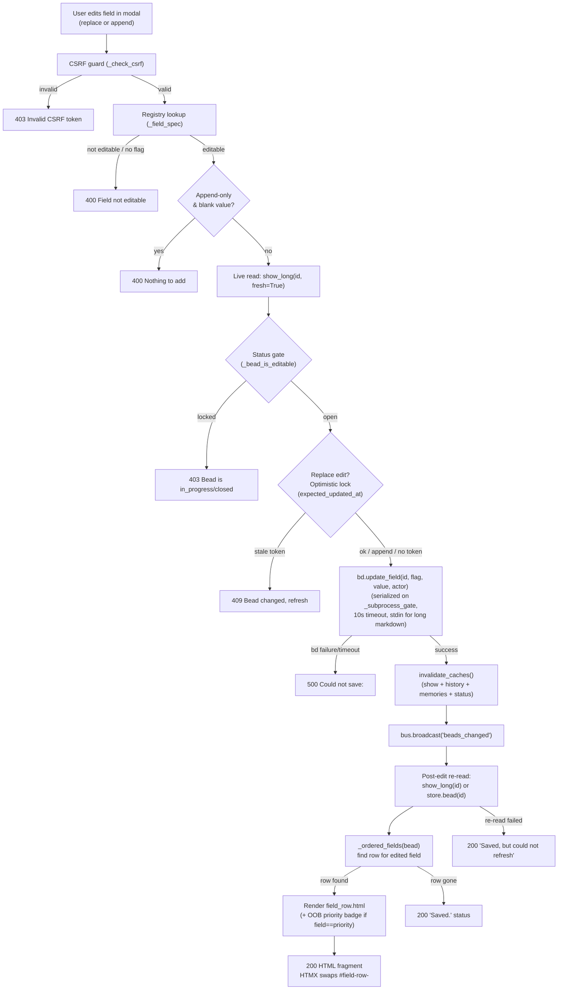

# Field Edit Write Path

## What Happens

A user edits a whitelisted bead field (title, description, priority, notes,
etc.) from the bead detail modal. The browser submits an HTMX form POST to
`POST /api/bead/{id}/field`. The server validates CSRF, looks up the field in
the editability registry, enforces a status gate (open beads only) and an
optimistic-lock check (replace edits only), shells out to `bd update` via the
serialized subprocess gate, broadcasts an SSE event so every open tab refreshes,
and returns the re-rendered field row for an in-place HTMX swap — all without
closing the modal.

This is bdboard's **per-field value mutation path** — every other write
(memory create/forget, formula pour) uses the same CSRF + serialized-mutation +
SSE-broadcast plumbing, but this is the only one that edits an existing bead's
scalar/prose fields.

## Trigger

**User submits the inline-edit form** inside a bead's detail modal on the
[Board view](../Views/BoardView.md). Two UI variants exist, both rendered by the
same `partials/field_row.html` template and handled by the same route:

1. **Replace edit** — a `<details>` disclosure on a whitelisted field
   (e.g. title, description, priority, assignee, estimate, issue_type,
   external_ref, design, acceptance_criteria) reveals a form prefilled with the
   current value. The user edits, clicks **Save**, and the form fires
   `hx-post="/api/bead/{id}/field"` with `field`, `value`,
   `expected_updated_at`, and the CSRF token.

2. **Append-only edit** — the `notes` field shows a separate "+ Add a note"
   `<details>` with an *empty* textarea (never prefilled — appending, not
   replacing). The user types, clicks **Add note**, and the same endpoint
   receives `field=notes`, `value=<new text>`. No `expected_updated_at` is sent
   because an append can never clobber.

Both forms carry the CSRF token in two places (redundantly): the
`X-CSRF-Token` header (via `hx-headers`) and a hidden `csrf_token` form field.

## Outcome

- The bead's field value is updated in the Dolt database via `bd update`.
- A `beads_changed` SSE event fires so every connected browser tab re-fetches
  its lanes/counts.
- On the acting tab, HTMX swaps `#field-row-<field>` with the freshly
  re-rendered row — the modal stays open and shows the updated value.
- If the edited field is `priority`, an out-of-band copy of the modal-header
  priority badge is appended to the response so HTMX swaps both the row
  **and** the badge in a single response.



## Step-by-Step

| # | What | Where (file:symbol) | Failure mode |
| --- | --- | --- | --- |
| 1 | CSRF guard — either the `X-CSRF-Token` header or the `csrf_token` form field must match the process-lifetime `_CSRF_TOKEN` | `src/bdboard/app.py`:`_check_csrf` | `403` HTTPException — form is stale or crafted |
| 2 | Field lookup — resolve `field` against `_FIELD_REGISTRY` via `_field_spec()`; reject if `editable=False` or `flag` is missing | `src/bdboard/app.py`:`_field_spec`, `_FIELD_REGISTRY`, `FieldSpec`, `_READONLY_SPEC` | `400` "Field \<field\> is not editable." |
| 3 | Value normalization — `.strip()` for non-`md` editors; `md` editors keep the raw value verbatim (preserves intentional leading/trailing whitespace in prose) | `src/bdboard/app.py`:`api_bead_field_update` (inline) | — |
| 4 | Append-only blank guard — for append-only fields (`notes`), reject blank-after-strip submissions rather than silently appending nothing | `src/bdboard/app.py`:`api_bead_field_update` (inline) | `400` "Nothing to add." |
| 5 | Live read — `show_long(bead_id, fresh=True)` drops the per-bead cache entry and forces a live `bd show <id> --long --json` subprocess call. This single read feeds both the status gate (step 6) and the optimistic-lock check (step 7) — no double-shelling | `src/bdboard/bd.py`:`BdClient.show_long` (→ `_cached`, gated on `_subprocess_gate`, timeout `SHOW_TIMEOUT_S = 8s`) | Returns `(None, error)` — handler degrades gracefully: skips status gate and lock check, proceeds to write (registry whitelist bounds the blast radius) |
| 6 | Status gate — manual editing only applies to OPEN beads; `in_progress` (claimed / work-in-flight) and closed (`closed`, `resolved`, `done`) beads are locked. Single source of truth: `_bead_is_editable` checks `status not in _LOCKED_EDIT_STATUSES` where `_LOCKED_EDIT_STATUSES = CLOSED_STATUSES ∪ {in_progress}` | `src/bdboard/app.py`:`_bead_is_editable`, `_LOCKED_EDIT_STATUSES`; `src/bdboard/derive/lanes.py`:`CLOSED_STATUSES` | `403` "This bead is \<status\> and can no longer be edited — only open beads are editable." |
| 7 | Optimistic-lock check (replace edits only) — compare the form's `expected_updated_at` token against the live bead's `updated_at`. If they differ, a concurrent edit landed between form render and submit. Append-only fields skip this (an append never clobbers). Missing/empty token degrades to last-write-wins | `src/bdboard/app.py`:`api_bead_field_update` (inline) | `409` "This bead changed since you opened it — please refresh and re-apply your edit." |
| 8 | Serialized write — `bd.update_field(bead_id, spec.flag, value, actor)` builds `bd update <id> <flag> <value>`. For long-markdown flags (`--description`, `--design`), the value is streamed on stdin via `_STDIN_FLAG_ALIASES` (`--body-file -`, `--design-file -`) to avoid shell-arg length limits. The call is serialized on `_subprocess_gate` (Dolt is single-writer) with a 10s timeout (`UPDATE_TIMEOUT_S`). `actor` (from `_ACTOR` / `BDBOARD_ACTOR` env) attributes the edit in the audit trail | `src/bdboard/bd.py`:`BdClient.update_field`, `_STDIN_FLAG_ALIASES`, `_run_mutate`, `_subprocess_gate` | `RuntimeError` (non-zero exit / timeout / cancelled) → `500` "Could not save: \<bd stderr\>" |
| 9 | Cache invalidation — immediately after a successful write, `update_field` clears `_show_cache` and calls `invalidate_caches()` (drops show + history + memories + status caches) so the follow-up re-read and any SSE-triggered re-fetches serve post-edit state | `src/bdboard/bd.py`:`BdClient.invalidate_caches` | Cannot fail (dict `.clear()`) |
| 10 | SSE broadcast — push `beads_changed` to every connected EventSource subscriber so all tabs re-fetch lanes/counts | `src/bdboard/events.py`:`EventBus.broadcast("beads_changed")` | Enqueue-per-subscriber; full queues drop oldest (lossy but non-blocking) |
| 11 | Post-edit re-read — `show_long(bead_id)` (non-fresh, may use cache populated by the invalidation-then-fetch). Falls back to `store.bead(bead_id)` (cached snapshot) if the live read fails, so the user still sees a row | `src/bdboard/bd.py`:`BdClient.show_long`; `src/bdboard/store.py`:`Store.bead` | Both fail → `200` "Saved, but could not refresh — reopen the bead to see the change." |
| 12 | Row lookup — `_ordered_fields(bead)` builds the full field list with editability hints; `next(r for r in rows if r["key"] == field)` finds the edited field's row | `src/bdboard/app.py`:`_ordered_fields`, `_field_row`, `_bead_is_editable` | Row not found (field cleared to empty and filtered out) → `200` "Saved." |
| 13 | Render — return `partials/field_row.html` for `#field-row-<field>` via HTMX `hx-swap="outerHTML"`. When `field == "priority"`, also append an out-of-band `partials/bead_priority_badge.html` (`oob=True`) so the modal-header badge updates in the same swap | `src/bdboard/templates/partials/field_row.html`, `src/bdboard/templates/partials/bead_priority_badge.html` | Cannot fail at this stage |

## Data Transformations

**Form submission → validated inputs (steps 1–4)**

Input (form-encoded, from the HTMX `<form>`):
```
field=priority&value=2&expected_updated_at=2026-06-05T12:34:56Z&csrf_token=<token>
```

After validation:
```python
field = "priority"                          # stripped
spec  = FieldSpec(editable=True, flag="--priority", editor="select",
                  enum_options=("0","1","2","3","4"), append_only=False)
new_value = "2"                             # stripped (non-md editor)
expected_updated_at = "2026-06-05T12:34:56Z"
```

The client **cannot choose the `bd update` flag** — it is pinned in
`_FIELD_REGISTRY` keyed by `field`. A crafted POST naming an unwhitelisted
field is bounced by the `_READONLY_SPEC` fallback.

**Serialized write — bd subprocess (step 8)**

For a typical scalar:
```
bd update bdboard-x1 --priority 2 --actor bdboard-human
```

For a long-markdown field (description, design) the value goes via stdin:
```
bd update bdboard-x1 --body-file - --actor bdboard-human
# stdin: <markdown content>
```

**Post-edit re-read → row dict (steps 11–12)**

`show_long` returns the full bead dict (all fields); `_ordered_fields` shapes
each field into a row dict:

```python
{
    "key": "priority",
    "val": 2,
    "kind": "scalar",
    "short_meta": True,
    "editable": True,          # from _FIELD_REGISTRY + _bead_is_editable
    "editor": "select",
    "flag": "--priority",
    "enum_options": ("0","1","2","3","4"),
    "append_only": False,
}
```

**Rendered HTML (step 13)**

`partials/field_row.html` produces an HTML fragment with a stable
`id="field-row-priority"` and the full inline-edit affordance, which HTMX
swaps over the old row via `hx-swap="outerHTML"`. When `field == "priority"`,
a second fragment (`bead_priority_badge.html` with `hx-swap-oob="true"`) is
appended so the modal header badge updates in the same response.

## Performance Characteristics

| Aspect | Detail |
| --- | --- |
| Serialization | All `bd` reads and writes are gated on `BdClient._subprocess_gate` (`asyncio.Semaphore(1)`) because bd's embedded Dolt is single-writer. Concurrent field edits from multiple tabs queue, not race. |
| Subprocess timeouts | Live read: `SHOW_TIMEOUT_S = 8s`. Write: `UPDATE_TIMEOUT_S = 10s` (generous because Dolt commit of long markdown can be slow). |
| Double-shelling avoided | The status gate (step 6) and optimistic-lock check (step 7) share a single `fresh=True` live read — one subprocess call, not two. |
| Stdin streaming | Long-markdown fields (`--description`, `--design`) stream the value on stdin via `_STDIN_FLAG_ALIASES` (`--body-file -` / `--design-file -`), dodging shell-argument length limits and quoting fragility. `create_subprocess_exec` (no shell) keeps all args shell-safe. |
| Cache invalidation cost | `invalidate_caches()` is six `.clear()` calls on Python dicts — O(1) amortized, non-blocking. |
| No store refresh | Unlike the Formula Pour Pipeline, this path does **not** call `store.refresh()` before broadcast. The SSE-triggered re-fetch from other tabs will hit `bd.show_long` / `_cached` which was just invalidated, so it gets fresh data. The acting tab gets its row from the same response (no re-fetch needed). |

## Failure Handling

| Stage | Failure | Behavior |
| --- | --- | --- |
| CSRF (step 1) | Token mismatch | `403` HTTPException. HTMX's `htmx:beforeSwap` handler in `base.html` routes 4xx/5xx into the `[data-edit-feedback]` aria-live region — the row stays intact and the error is announced. |
| Registry (step 2) | Unknown / non-editable field | `400` inline HTML fragment. The field whitelist is a closed set; new fields require an explicit registry entry. |
| Blank append (step 4) | Empty append-only submission | `400` inline HTML. Prevents a no-op `--append-notes ""` from littering the audit trail. |
| Live read (step 5) | bd subprocess fails | `(None, error)` — handler **skips** the status gate and optimistic-lock check and proceeds to write. The registry whitelist already bounds the blast radius to value edits on known fields. |
| Status gate (step 6) | Bead locked (in_progress / closed) | `403` inline HTML. The UI hides edit affordances for locked beads (`_ordered_fields` consults the same `_bead_is_editable`), but a crafted POST is caught server-side. |
| Optimistic lock (step 7) | Stale `expected_updated_at` | `409` inline HTML. The user sees "bead changed, please refresh" — not a silent clobber. Missing/empty token degrades to last-write-wins rather than blocking. |
| bd write (step 8) | Non-zero exit | `RuntimeError` with bd's verbatim stderr → `500` "Could not save: \<stderr\>". No partial state — bd's write is atomic. |
| bd write (step 8) | 10s timeout | Process killed (`_safe_kill`), pipes drained via `proc.communicate()` to prevent fd leaks. `RuntimeError` → `500` "Request timed out while saving." |
| Post-edit re-read (step 11) | Both show_long and store.bead fail | `200` "Saved, but could not refresh — reopen the bead to see the change." The write already succeeded; the SSE broadcast will reconcile other tabs. |
| Row lookup (step 12) | Field no longer in rendered set | `200` "Saved." — field cleared to empty and filtered out by `_ordered_fields`. |

> [!IMPORTANT]
> The status gate reads the bead **LIVE** (`fresh=True`) — never from cache.
> A stale cache (up to `SUCCESS_TTL_S` old) could report the bead as still
> `open` when it was just claimed (`in_progress`), letting a manual edit slip
> through and clobber an agent's in-flight change.

> [!WARNING]
> The optimistic-lock check only applies to **replace** edits. Append-only
> fields (currently just `notes`) are exempt because an append can never
> clobber existing content. If a future field is marked `append_only=True`,
> it inherits this exemption automatically.

## Key Log Messages

| Log line | Where | Means |
| --- | --- | --- |
| `locked field edit rejected: %s %s status=%s` | `src/bdboard/app.py`:`api_bead_field_update` | A field edit was rejected because the bead is `in_progress` or closed. The log includes the bead id, field name, and live status. |
| `stale field edit rejected: %s %s expected=%s live=%s` | `src/bdboard/app.py`:`api_bead_field_update` | A replace edit was rejected because `expected_updated_at` doesn't match the live `updated_at` — a concurrent edit landed between form render and submit. |
| `bd update %s %s failed: %s` | `src/bdboard/app.py`:`api_bead_field_update` | The `bd update` subprocess exited non-zero or timed out. Includes the bead id, flag, and the RuntimeError message (which embeds bd's stderr). |

## Common Issues

| Symptom | Likely cause | Fix |
| --- | --- | --- |
| Edit returns 403 "Invalid CSRF token" | CSRF token expired: the modal's form bakes the process-lifetime token from page load; a server restart generates a new token, invalidating all open tabs. | Refresh the page to pick up the new process-lifetime token. |
| "Field \<name\> is not editable" | The field is not in `_FIELD_REGISTRY` or is whitelisted without a `flag`. Shape/graph/lifecycle fields (`status`, `parent`, `labels`, `id`) are intentionally non-editable. | This is by design. To add a new editable field, add a `FieldSpec` entry to `_FIELD_REGISTRY` with the correct `bd update` flag. |
| "This bead is in_progress and can no longer be edited" | The bead was claimed (`bd update --claim`) between the time the modal was opened and the edit was submitted. The status gate reads LIVE. | The bead is being worked — wait for it to return to `open` or coordinate with the assignee. |
| "This bead changed since you opened it" (409) | A concurrent edit (from another tab, agent, or `bd` CLI) modified the bead after the modal was rendered. The optimistic lock caught the stale `expected_updated_at`. | Refresh the modal (click the bead again) to pick up the latest value, then re-apply the edit. |
| "Could not save: \<bd stderr\>" (500) | The `bd update` subprocess failed — bad value, corrupt workspace, or Dolt write error. bd's actual stderr is surfaced verbatim. | Read the error message. Common sub-causes: invalid enum value for a select field, bead id not found (deleted between render and submit). |
| "Saved, but could not refresh" | The write succeeded but neither `show_long` nor `store.bead` could re-read the bead. Transient bd issue. | Reopen the bead modal to force a fresh read. The SSE broadcast will reconcile other tabs automatically. |
| Notes edit shows a replace textarea instead of "Add a note" | A registry bug: `notes` is missing `append_only=True`. The current registry has it correct, but a regression here would surface `--notes` (replace) instead of `--append-notes` (append), destroying existing notes on save. | Check `_FIELD_REGISTRY["notes"].append_only` — must be `True`. |
| Priority badge in modal header stays stale after edit | The OOB swap (`bead_priority_badge.html` with `hx-swap-oob="true"`) requires the badge target (`#modal-priority-badge-<id>`) to be present in the DOM. If the modal header template changed and the id shifted, the OOB swap silently no-ops. | Verify `#modal-priority-badge-<id>` exists in the rendered modal header and matches the OOB fragment's id. |

## Related

- [POST /api/bead/{id}/field](../Endpoints/PostApiBeadField.md) — the endpoint
  this flow documents (the handler that implements every step above).
- [GET /api/bead/{id}](../Endpoints/GetApiBead.md) — renders the modal whose
  field rows this flow's endpoint edits.
- [GET /api/bead/{id}/audit](../Endpoints/GetApiBeadAudit.md) — uses the same
  OOB-swap idiom for the `#lifecycle-slot` badge.
- [Board (/)](../Views/BoardView.md) — the view whose bead detail modal
  triggers this flow.
- [Feature: Manual Field Editing](../Features/index.md) — the feature this
  flow implements.
- [Field Editability Registry](../Concepts/FieldEditabilityRegistry.md) —
  decides WHICH fields are editable and pins the `bd update` flag.
- [CSRF Protection](../Concepts/CsrfProtection.md) — the token guard that
  fronts every write path, including this one.
- [Subprocess Serialization & Caching](../Concepts/SubprocessSerializationAndCaching.md)
  — the `_subprocess_gate` that serializes the write and the cache
  invalidation that follows it.
- [SSE Event Bus](../Concepts/SseEventBus.md) — the `beads_changed` broadcast
  that pushes every tab to re-fetch after an edit.
- [bd CLI as Source of Truth](../Concepts/BdCliSourceOfTruth.md) — why the
  write shells out to `bd update` rather than writing Dolt directly.
- [Store Snapshot & Change Detection](../Concepts/StoreSnapshotChangeDetection.md)
  — the `store.bead()` fallback used when the post-edit live read fails.
- [Formula Pour Pipeline](FormulaPourPipeline.md) — sibling write-path flow
  that shares the same CSRF + serialized-mutation + SSE-broadcast plumbing.
- [Flows index](index.md)
- [Back to docs index](../index.md)
