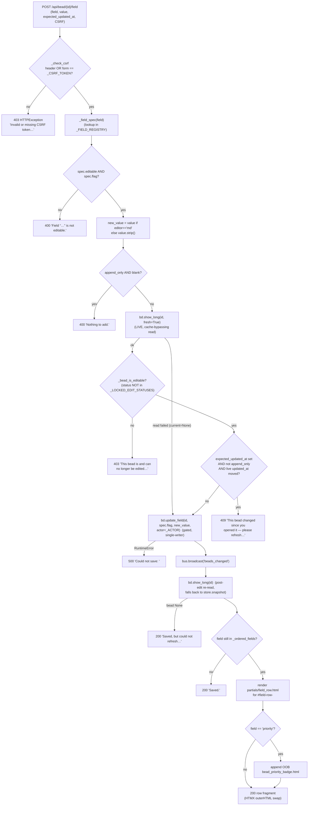

# Inline Field-Edit Write Path

## What Happens

A user edits **one** field of an open bead in the detail modal — types a new
title, picks a priority, rewrites the markdown description, or appends a note —
and clicks **Save**. That single in-place form submit runs a fixed, heavily
hedged write pipeline: CSRF guard → field-registry whitelist check →
append-only emptiness check → a **single LIVE (cache-bypassing) re-read** of the
bead that does double duty as the status gate **and** the optimistic-lock
precondition → one serialized `bd update <id> <flag> <value>` mutation → SSE
broadcast → optimistic re-read → and finally the **re-rendered field row** swapped
back into `#field-row-<field>` via HTMX `outerHTML`. No full-page reload, no JSON
envelope — the response is always an HTML fragment.

This is the **only** write path in bdboard that mutates bead *content*
(everything else is read-only or lifecycle-only). Because it is the one place a
human can clobber data, it is deliberately fenced: the registry decides *which*
fields are ever editable and *which* `bd update` flag to use (the client never
chooses the flag), the status gate decides *when* (only open beads), and the
optimistic lock prevents a stale tab from silently overwriting a concurrent
change.

## Trigger

A `POST /api/bead/{bead_id}/field` request, fired by the inline edit `<form>` (or
the add-a-note `<form>`) inside `partials/field_row.html`. The form posts
`application/x-www-form-urlencoded` via HTMX (`hx-post`,
`hx-target="#field-row-<key>"`, `hx-swap="outerHTML"`) and carries the per-process
CSRF token in the `X-CSRF-Token` header (`hx-headers`) with a hidden `csrf_token`
form field as a non-JS fallback. The hidden `field` input pins the field key and a
hidden `expected_updated_at` input carries the bead's `updated_at` at render time
(the optimistic-lock token). The sibling read routes — `GET /api/bead/{id}`,
`/audit`, `/raw` — never mutate; this POST is the lone content-write entry point.

## Outcome

On success: the field is committed via `bd update`, every open tab gets an
optimistic `beads_changed` SSE pulse, and the dialog swaps in the freshly
re-rendered field row (collapsing the editor, showing the new value, carrying a
**fresh** `expected_updated_at` for the next edit). A `priority` edit additionally
appends an **out-of-band** copy of the modal-header priority badge so it updates
in the same swap. On a recoverable failure the row is **never** wiped — the
`htmx:beforeSwap` handler in `base.html` cancels the swap for any `4xx`/`5xx` and
renders the server's `<p class="field-error">` fragment into the form's polite
`[data-edit-feedback]` aria-live region instead. Append-only `notes` edits append
text and never replace existing content.



## Step-by-Step

| # | What | Where (file:symbol) | Failure mode |
| --- | --- | --- | --- |
| 1 | Bind the request: `bead_id` (path), `field`/`value`/`expected_updated_at`/`csrf` (form), `x_csrf_token` (header) | `src/bdboard/app.py:api_bead_field_update` | FastAPI binding; a missing `field` is a `422` from FastAPI (`Form(...)` required), all other params default and are validated downstream || 2 | CSRF guard: accept if **either** the header or the form field equals the per-process `_CSRF_TOKEN` | `src/bdboard/app.py:_check_csrf` / `_CSRF_TOKEN` | Neither matches → raises `HTTPException(403)` before any work; nothing touched |
| 3 | `field = field.strip()`, then resolve its `FieldSpec` from the registry | `src/bdboard/app.py:_field_spec` / `_FIELD_REGISTRY` | Unknown field returns the shared `_READONLY_SPEC` (`editable=False`) → handled in step 4 |
| 4 | Editability whitelist: refuse unless `spec.editable` **and** a non-empty `spec.flag` | `src/bdboard/app.py:api_bead_field_update` (`if not spec.editable or not spec.flag`) | `400` `Field "<field>" is not editable.` — the registry's `flag` is the ONLY flag ever passed to bd; the client can't choose it |
| 5 | Normalize the value: keep verbatim for `editor == "md"`, else `.strip()`; for append-only fields reject blank content | `src/bdboard/app.py:api_bead_field_update` (`new_value = …`; `if spec.append_only and not new_value.strip()`) | `400` `Nothing to add.` for an empty `notes` append |
| 6 | **Single LIVE re-read** (cache-bypassing) of the bead — shared by the status gate and the optimistic lock so bd is never double-shelled | `src/bdboard/bd.py:BdClient.show_long` (`fresh=True`, `SHOW_TIMEOUT_S`) | Read failure (`current is None`) **degrades** — both checks are skipped and the write proceeds (registry whitelist already bounds the blast radius) |
| 7 | Status gate: a locked (`in_progress` or closed) bead rejects ALL field writes | `src/bdboard/app.py:_bead_is_editable` / `_LOCKED_EDIT_STATUSES` (`derive.CLOSED_STATUSES | {"in_progress"}`) | `403` `This bead is <status> and can no longer be edited — only open beads are editable.` |
| 8 | Optimistic-lock precondition (replace-semantics only): if `expected_updated_at` is set, not append-only, and the LIVE `updated_at` has moved, reject | `src/bdboard/app.py:api_bead_field_update` (`if expected_updated_at and not spec.append_only`) | `409` `This bead changed since you opened it — please refresh…`; append-only edits skip this (an append can't clobber) |
| 9 | Serialized mutation: `bd update <id> <flag> <value>` (long markdown streamed on stdin via the `--body-file -` / `--design-file -` aliases), `--actor` forwarded when set | `src/bdboard/bd.py:BdClient.update_field` / `_run_mutate` / `_STDIN_FLAG_ALIASES` (gated on `_subprocess_gate`, `UPDATE_TIMEOUT_S=10.0`) | Non-zero exit → `RuntimeError(stderr)` → `500` `Could not save: <bd stderr>`; timeout → `RuntimeError("Request timed out…")` → `500` |
| 10 | Drop the per-bead show cache + invalidate sibling caches so the follow-up re-read sees post-edit state | `src/bdboard/bd.py:BdClient.update_field` (`self._show_cache.clear()` + `invalidate_caches`) | None |
| 11 | Optimistic SSE broadcast so every open tab re-fetches its live regions | `src/bdboard/app.py:bus.broadcast` → `src/bdboard/events.py:EventBus.broadcast` | Lossy under backpressure (drop-oldest); a dropped event is healed by the next watcher refresh |
| 12 | Optimistic re-read of the post-edit bead; fall back to the cached snapshot if the live read momentarily fails | `src/bdboard/bd.py:BdClient.show_long` → `src/bdboard/store.py:Store.snapshot` / `Store.bead` | Both empty → `200` `Saved, but could not refresh — reopen the bead to see the change.` (write already committed) |
| 13 | Locate the edited field's row dict in display order | `src/bdboard/app.py:_ordered_fields` (`next(r for r … if r["key"] == field)`) | Field saved but filtered out (e.g. cleared to empty) → `200` `Saved.` acknowledgement |
| 14 | Re-render just the affected field row for an in-place swap | `src/bdboard/templates/partials/field_row.html` (`field_form` macro + `#field-row-<key>` div) | None — pure render; carries a fresh `expected_updated_at` |
| 15 | For `priority` edits, append an OOB copy of the header badge so the modal-header badge updates in the same swap | `src/bdboard/templates/partials/bead_priority_badge.html` (`oob=True`) | None — same OOB idiom the audit endpoint uses for `#lifecycle-slot` |
| 16 | Client routes the response: `2xx` swaps the row (announces "Saved.", moves focus); `4xx`/`5xx` cancels the swap and shows the error in the feedback region | `src/bdboard/templates/base.html` (`htmx:beforeSwap` / `htmx:afterSwap` handlers) | A failed save never wipes the row — `e.detail.shouldSwap = false` |

## Data Transformations

Input → output at each hop:

1. **Browser form → request.** The `field_form` macro `<form>` posts
   `application/x-www-form-urlencoded`: `field=<key>` (hidden), `value=<new>`,
   `expected_updated_at=<render-time updated_at>` (hidden, replace-edit forms
   only), `csrf_token=<token>` (hidden fallback), plus the `X-CSRF-Token`
   header. FastAPI binds `bead_id` (path), `field`/`value`/`expected_updated_at`
   (`Form`), `csrf` (`Form(None, alias="csrf_token")`) and `x_csrf_token`
   (`Header(None)`).

2. **field key → FieldSpec.** `_field_spec(field)` →
   `FieldSpec(editable, flag, editor, enum_options, append_only)` from
   `_FIELD_REGISTRY`, or the shared read-only fallback. Example for a title edit:

   ```json
   {
     "editable": true,
     "flag": "--title",
     "editor": "text",
     "enum_options": null,
     "append_only": false
   }
   ```

3. **raw value → normalized value.** `new_value = value if spec.editor == "md"
   else value.strip()`. Markdown editors (`description`, `acceptance_criteria`,
   `design`, `notes`) keep whitespace verbatim; everything else is trimmed.
   Append-only (`notes`) with a blank trimmed value short-circuits to `400`.

4. **bead id → LIVE bead.** `show_long(bead_id, fresh=True)` →
   `(bead_dict | None, err)`; `fresh=True` pops the per-bead cache so the read
   bypasses the up-to-`SUCCESS_TTL_S`-stale snapshot. The handler reads two
   fields off it: `status` (for the gate) and `updated_at` (for the lock).

5. **lock comparison.** `live_updated_at = str(current.get("updated_at") or "")`;
   reject when `live_updated_at and live_updated_at != expected_updated_at.strip()`
   (replace-semantics fields only).

6. **spec.flag + value → bd argv.** `update_field` builds
   `["update", <id>]`; for `--description`/`--design` it appends
   `[--body-file | --design-file, "-"]` and streams `value` on **stdin**; every
   other flag appends `[flag, value]` directly. `--actor <_ACTOR>` is appended
   when `_ACTOR` is set. Example for the title edit:

   ```json
   {
     "argv": ["update", "bdboard-mol-bfs.9", "--title", "New title", "--actor", "Aaron"],
     "stdin": null
   }
   ```

   …versus a description edit (long markdown via stdin):

   ```json
   {
     "argv": ["update", "bdboard-mol-bfs.9", "--body-file", "-"],
     "stdin": "## Overview\n\nThe full markdown body…"
   }
   ```

7. **post-edit bead → row dict.** `show_long(bead_id)` (now cache-cleared) →
   the bead; `_ordered_fields(bead)` → list of row dicts; `next(...)` selects the
   one whose `key == field`. The row dict shape (per `_field_row`):

   ```json
   {
     "key": "priority",
     "val": 1,
     "kind": "scalar",
     "short_meta": true,
     "editable": true,
     "editor": "select",
     "flag": "--priority",
     "enum_options": ["0", "1", "2", "3", "4"],
     "append_only": false
   }
   ```

8. **row dict → HTML fragment.** `field_row.html` renders
   `<div id="field-row-<field>" …>` with a fresh `expected_updated_at` =
   `bead.get("updated_at")`. For `priority`, an OOB
   `bead_priority_badge.html` (`oob=True`) fragment is appended so HTMX swaps the
   header badge too. The whole thing returns as `HTMLResponse`.

## Performance Characteristics

- **Sync vs async.** The handler is `async`, but the bd subprocesses run behind
  `BdClient._subprocess_gate` (an `asyncio.Semaphore(1)`) because bd's embedded
  dolt store is single-writer. Concurrent edits from multiple tabs **queue**
  rather than run in parallel.
- **Subprocess budget.** Up to **three** sequential bd subprocesses on the happy
  path: the LIVE precondition read (`bd show --long`, `SHOW_TIMEOUT_S`), the
  mutation (`bd update`, `UPDATE_TIMEOUT_S=10.0`), and the post-edit re-read
  (`bd show --long`, served from cache only if warm — but `update_field` clears
  `_show_cache`, so this re-read is effectively always a fresh shell). The
  re-read is the price of an accurate optimistic render.
- **The fresh read is deliberate, not wasteful.** The `fresh=True` precondition
  read intentionally bypasses the cache: a stale `updated_at` could let a
  concurrent edit slip through the optimistic lock undetected and silently
  clobber the other writer. Correctness wins over saving one shell.
- **No N+1.** Exactly one field is edited per request, one `bd update` is issued.
  There is no per-field fan-out — the modal posts each row independently.
- **Broadcast cost.** `bus.broadcast("beads_changed")` is O(N) over connected
  tabs and content-free; the actual re-render cost is paid by each *other* tab
  re-fetching `/api/lanes` etc., not by this handler. The editing tab gets its
  fresh row directly in the POST response (no SSE round-trip needed for itself).

## Failure Handling

- **CSRF (403).** Hard reject before any I/O — `_check_csrf` raises
  `HTTPException(403)`; no bead is touched. No retry; the user must refresh to
  pick up a valid per-process token.
- **Non-editable field (400).** A crafted POST for a non-whitelisted field
  (`status`, `parent`, `id`, `story_points`, timestamps, …) is refused
  server-side even though the UI never renders an editor for it. Read-only is the
  safe default; the registry whitelist bounds the blast radius.
- **Empty append (400).** An append-only `notes` submit with blank content is a
  no-op we reject rather than silently swallow — `bd update --notes` would
  *replace* and nuke verification history, so the registry pins `--append-notes`
  and the route guards emptiness.
- **Status gate (403).** Re-checked server-side against the **LIVE** status so a
  freshly-claimed (`in_progress`) bead can't slip an edit through a stale cache.
  Pre-work states (`blocked`, `deferred`) stay editable; only `in_progress` and
  the closed set lock.
- **Optimistic lock (409).** A stale `expected_updated_at` (the tab opened the
  bead before another writer changed it) is rejected with a friendly "refresh and
  re-apply" rather than overwriting the newer value. A missing/empty token
  **degrades to last-write-wins** rather than blocking edits outright; append-only
  edits skip the lock entirely.
- **Precondition read failure degrades open, not closed.** If the LIVE read
  fails (`current is None`), the status gate and lock are *skipped* and the write
  proceeds — blocking edits on a transient bd hiccup would be worse than the
  bounded risk, since the registry whitelist already limits what can be written.
- **Mutation failure (500).** `bd update` non-zero exit → `RuntimeError` with
  bd's stderr surfaced verbatim (`Could not save: <stderr>`); a timeout yields
  `Request timed out while saving. Please try again.` No partial state — a single
  `bd update` is atomic.
- **Re-render failure is non-fatal.** If the post-edit re-read fails the write is
  **already committed**: the route returns `200` `Saved, but could not refresh…`
  (or `Saved.` if the field filtered out of the rendered set). The SSE-driven
  refresh reconciles the modal.
- **Client never loses the row.** `base.html`'s `htmx:beforeSwap` sets
  `e.detail.shouldSwap = false` for any `4xx`/`5xx`, so a failed save shows the
  error in the polite `[data-edit-feedback]` aria-live region without wiping the
  row; only a `2xx` actually swaps it (and announces "Saved." + moves focus).

## Key Log Messages

| Log line | Where | Means |
| --- | --- | --- |
| `locked field edit rejected: %s %s status=%s` | `src/bdboard/app.py:api_bead_field_update` | The status gate fired — a write to an `in_progress`/closed bead was refused `403`. Args are `bead_id`, `field`, live `status`. Nothing was written. |
| `stale field edit rejected: %s %s expected=%s live=%s` | `src/bdboard/app.py:api_bead_field_update` | The optimistic lock fired — the LIVE `updated_at` moved since the form was rendered, so the edit was refused `409` to avoid clobbering a concurrent change. |
| `bd update %s %s failed: %s` | `src/bdboard/app.py:api_bead_field_update` | `bd update` exited non-zero (or timed out); its stderr was surfaced to the user as `500 "Could not save: …"`. Args are `bead_id`, `flag`, the error. |
| `store: bd list failed; keeping previous snapshot` | `src/bdboard/store.py:Store.refresh` | The fallback `store.snapshot()` (used when the post-edit re-read fails) couldn't re-list; the prior snapshot is kept. The edit still committed. |

## Common Issues

| Symptom | Likely cause | Fix |
| --- | --- | --- |
| Save returns `403` "Invalid or missing CSRF token" on a freshly-loaded page | The page's CSRF token is stale (server restarted → new per-process `_CSRF_TOKEN`) or the header/form field wasn't sent | Reload so `field_row.html` re-renders with the current `_CSRF_TOKEN`; confirm `hx-headers='{"X-CSRF-Token": …}'` is present. |
| `400 Field "<x>" is not editable` for a field that looks scalar | The field isn't in `_FIELD_REGISTRY`'s v1 whitelist (e.g. `status`, `parent`, `id`, `story_points`, timestamps) — read-only is the safe default | Lifecycle/shape/no-update-flag fields are intentionally not editable here; use the proper bd lifecycle path. Add a registry entry only if the field has a real `bd update` flag. |
| `400 Nothing to add` when appending a note | The trimmed `value` is empty (whitespace-only) | Type non-empty note content; `notes` is append-only (`--append-notes`) and won't accept blanks. |
| `403 This bead is <status> and can no longer be edited` | The bead is `in_progress` or closed — the LIVE status gate locks it | Only open (and pre-work `blocked`/`deferred`) beads are editable; un-claim or reopen via the proper lifecycle path if you really must edit. |
| `409 This bead changed since you opened it` | Another tab/agent edited the bead after you opened the modal — your `expected_updated_at` is stale | Refresh the bead and re-apply your edit so you don't overwrite the newer value. |
| `500 Could not save: <bd stderr>` | `bd update` rejected the value (bad enum, malformed input) or the subprocess failed | Read the surfaced bd stderr; fix the value and re-save. A timeout message means try again. |
| Edit saved but other tabs still show the old value | The optimistic `beads_changed` broadcast was dropped under backpressure, or the SSE stream is buffered by a reverse proxy | The next watcher-driven refresh heals it; for proxies, ensure `X-Accel-Buffering: no` is honored (see SSE events doc). |
| Priority changed in the row but the modal-header badge stayed stale | The OOB `bead_priority_badge.html` append didn't swap (only happens for `field == "priority"`) | Confirm the response carried the OOB badge fragment; reopen the modal as a fallback. |
| Append-only note edit kept the old `expected_updated_at` but still succeeded | **Expected** — append-only edits skip the optimistic lock (an append can't clobber), so a stale token doesn't block them | Not a bug; only replace-semantics edits are lock-checked. |

## Related

- [Bead field-edit API (`POST /api/bead/{id}/field`)](../Endpoints/BeadFieldEditApi.md)
  — the HTTP contract for this write path (request/response shapes, status codes,
  curl examples); this flow is the end-to-end story behind it.
- [Bead detail API (`/api/bead/{id}`, `/audit`, `/raw`)](../Endpoints/BeadDetailApi.md)
  — the **read** sibling that renders the modal whose rows this flow edits; both
  share `BdClient.show_long` and `partials/field_row.html`.
- [Formula pour fan-out (Flow)](FormulaPourFanout.md) — the sibling write flow;
  shares the `_check_csrf`/`_CSRF_TOKEN` guard, the serialized-mutation posture,
  and the refresh/broadcast ordering.
- [SSE events (`/api/events`)](../Endpoints/SseEvents.md) — the channel the
  post-edit optimistic `beads_changed` broadcast rides so every other tab
  re-fetches the freshly edited bead.
- [Board page (`/`)](../Views/BoardPage.md) — opens the bead modal whose per-field
  rows carry the inline edit / add-note affordances that post here, and re-renders
  its lanes when the broadcast lands.
- [bd CLI as runtime source of truth](../Concepts/BdCliSourceOfTruth.md) — why the
  write bottoms out in `bd update` and how `update_field` streams long markdown on
  stdin via the `--body-file -` / `--design-file -` aliases.
- [Store snapshot cache & change detection](../Concepts/StoreSnapshotCache.md) —
  the cache invalidation and `fresh=True` cache-bypassing read this flow depends
  on for an accurate status gate, optimistic lock, and post-edit re-render.
- [Watcher debounce/cooldown & self-feedback skip](../Concepts/WatcherScheduling.md)
  — the producer side that turns the edit's `.beads/` mutation into exactly one
  `beads_changed` pulse without spinning on bdboard's own reads.
- [HTMX + server-rendered partials](../Concepts/HtmxPartialsArchitecture.md) — the
  `field_form` macro, the `outerHTML` row swap, the OOB priority-badge idiom, and
  the `htmx:beforeSwap` error-routing into the `[data-edit-feedback]` region.
- [Flows index](index.md) · [Architecture](../Architecture.md#key-flows) ·
  [Manifest](../_Manifest.md) — the flow catalog and system view this item sits in.
