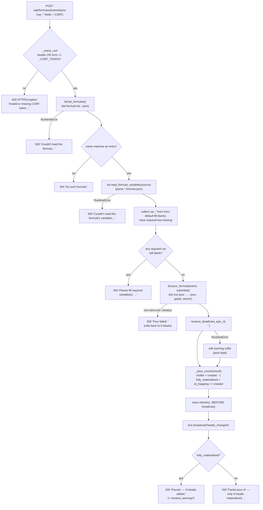

# Formula Pour Fan-Out

## What Happens

A **formula pour** takes a single user action — submitting the variable form in
the *"+ Pour Formula"* dialog — and fans it out into a whole **tree of beads**
materialized onto the board in one atomic step. The HTTP entry point
(`POST /api/formulas/{name}/pour`) runs a fixed pipeline: CSRF guard →
server-side required-variable pre-flight → `bd mol pour … --json` (the *fan-out*:
one formula template cooks inline into N child beads under a grouping
molecule-wrapper node) → best-effort rename of that wrapper → count-honesty
reconciliation → store refresh → SSE broadcast → a one-line acknowledgement
fragment swapped back into the dialog.

The "fan-out" is the heart of it: the user supplies a handful of variables, and
bd's `mol pour` expands the formula's declared `steps` into real, dependency-wired
beads (plus one hidden wrapper that parents the tree). bdboard then makes that
fan-out *honest* — it hides the wrapper from the visible count, detects a
**partial** materialization (bd reported more nodes than it mapped to real ids),
and refuses to dress a partial pour up as a clean win.

## Trigger

A `POST /api/formulas/{name}/pour` request, fired by the
`partials/formula_form.html` `<form>` (`hx-post`) when the user clicks **Pour
onto board**. The form carries one `var_<name>` field per declared variable plus
the per-process CSRF token (header `X-CSRF-Token` via `hx-headers`, with a hidden
`csrf_token` form-field fallback). This is the **only** formula write path — the
sibling `GET /api/formulas` (picker) and `GET /api/formulas/{name}/form`
(variable form) routes are read-only and never mutate.

## Outcome

On success: N new beads (the formula's expanded `steps`) appear on the board
under a grouping node titled `<formula> <id>`, every open tab re-renders via an
optimistic `beads_changed` SSE pulse, and the dialog's `#formula-pour-result`
region swaps in `Poured <formula> — N beads added to the board.` (N is the
**visible** count, i.e. bd's raw `created` minus the one hidden wrapper). On a
recoverable failure the dialog shows a friendly inline message
(`403`/`404`/`400`/`500`) and **zero** beads are created — `bd mol pour` is
atomic and rolls back on a non-zero exit, so the board is never left with orphan
wrapper epics.



## Step-by-Step

| # | What | Where (file:symbol) | Failure mode |
| --- | --- | --- | --- |
| 1 | Parse the request: `name` from the path, `csrf` from the `csrf_token` form field, `x_csrf_token` from the header | `src/bdboard/app.py:api_formula_pour` | None — FastAPI binding; missing token params are `None` and rejected in step 2 |
| 2 | CSRF guard: accept if **either** the header or form field equals the per-process `_CSRF_TOKEN` | `src/bdboard/app.py:_check_csrf` / `_CSRF_TOKEN` | Neither matches → raises `HTTPException(403)` before any work; no beads touched |
| 3 | `name = name.strip()`, then list formulas to resolve the target + its `source` path | `src/bdboard/bd.py:BdClient.list_formulas` (`bd formula list --json`, `FORMULA_LIST_TIMEOUT_S=8.0`) | `RuntimeError` (subprocess fail / non-list JSON) → `500` `"Couldn't load the formula…"` |
| 4 | Match `name` against each entry's `name` field | `src/bdboard/app.py:api_formula_pour` (`next((f for f in formulas if f.get("name") == name), None)`) | No match → `404` `"No such formula."` |
| 5 | Re-read the formula's declared variables from the on-disk `*.formula.json` (the CLI doesn't expose them reliably) | `src/bdboard/bd.py:BdClient.read_formula_variables` / `_parse_variables` / `_load_formula_json` | `RuntimeError` (missing/invalid file) → `500` `"Couldn't read this formula's variables…"` |
| 6 | Read the submitted form; for each declared variable take `form.get(f"var_{name}")`, `.strip()`, fall back to the variable's `default` when blank, and record any required (no-default) variable left empty | `src/bdboard/app.py:api_formula_pour` (the `for var in declared` loop) | Crafted `var_bogus` fields are ignored — only declared variables are collected into `submitted` |
| 7 | Pre-flight: if any required variable is still blank, block the pour | `src/bdboard/app.py:api_formula_pour` (`if missing:`) | `400` `"Please fill required variable(s): <names>."` — server-side mirror of the form's HTML `required` attribute |
| 8 | **Fan-out:** pour via `bd mol pour <name> --var k=v … --json`; cooks the formula inline and materializes its bead tree (steps + one wrapper) | `src/bdboard/bd.py:BdClient.pour_formula` (gated on `_subprocess_gate`, `POUR_TIMEOUT_S=30.0`, atomic) | Non-zero exit → `RuntimeError(stderr)` → `500` `"Pour failed: <bd stderr>"`; timeout → `500` `"Pour timed out…"`; **rolls back to zero beads** |
| 9 | Invalidate bd caches so the follow-up rename/list reads see post-pour state | `src/bdboard/bd.py:BdClient.invalidate_caches` (called inside `pour_formula`) | None |
| 10 | Derive the wrapper's short disambiguator (segment after the last `-` of `new_epic_id`) | `src/bdboard/app.py:_short_pour_id` | Falls back to the whole id if there's no `-` |
| 11 | Best-effort rename of the grouping node to `<name> <short_pour_id>` so repeat pours are distinguishable | `src/bdboard/bd.py:BdClient.rename_bead` (`bd update <id> --title`, `UPDATE_TIMEOUT_S=10.0`) | `RuntimeError` → soft warning suffix only; the (already-committed) pour is **kept** |
| 12 | Count-honesty reconciliation: `visible = created - 1` (hide the wrapper), `fully_materialized = len(id_mapping) == created` | `src/bdboard/app.py:_pour_counts` | A shortfall flags a **partial** pour (surfaced, not masked) |
| 13 | Refresh the store **before** broadcasting so the HTMX re-fetch sees the new beads (anti-race) | `src/bdboard/app.py:store.refresh` → `src/bdboard/store.py:Store.refresh` | Refresh failure logs + keeps the prior snapshot; the broadcast still fires |
| 14 | Optimistic SSE broadcast so every open tab re-fetches its live regions | `src/bdboard/app.py:bus.broadcast` → `src/bdboard/events.py:EventBus.broadcast` | Lossy under backpressure (drop-oldest); a dropped event is healed by the next refresh |
| 15 | Render the acknowledgement fragment (visible count, optional rename warning, partial-pour branch) | `src/bdboard/templates/partials/formula_pour_result.html` | None — pure render of the reconciled values |

## Data Transformations

Input → output at each hop:

1. **Browser form → request.** The `formula_form.html` `<form>` posts
   `application/x-www-form-urlencoded`: one `var_<name>=<value>` per variable,
   plus `csrf_token` (hidden fallback) and the `X-CSRF-Token` header. FastAPI
   binds `name` (path), `csrf` (`Form(None, alias="csrf_token")`) and
   `x_csrf_token` (`Header(None)`).

2. **Formula list → matched descriptor.** `bd formula list --json` →
   `list[dict]` each with at least `{name, description, source}`; `next(...)`
   selects the one whose `name` equals the path param. (The list payload's
   `vars` count is unreliable — always `0` — so it is **not** used.)

3. **`source` path → declared variables.** `read_formula_variables(source)`
   reads the on-disk `*.formula.json` and yields an ordered list of
   `{"name": str, "description": str, "default": str | None, "required": bool}`
   (`required` is `default is None`).

4. **Form values + declared vars → `submitted` / `missing`.** For each declared
   variable: `value = (form.get("var_<name>") or "").strip()`; if blank and a
   `default` exists, `value = str(default)`; if still blank and `required`, the
   name is appended to `missing`; otherwise `submitted[name] = value`. Result:
   `submitted: dict[str, str]` (only non-empty, only-declared variables) and
   `missing: list[str]`.

5. **`submitted` → bd argv → pour result.** `pour_formula` builds
   `["mol", "pour", name, "--var", "k=v", …, "--json"]`, runs it, and parses
   stdout into a result `dict` carrying `new_epic_id` (the wrapper), `id_mapping`
   (stepId → real bead id) and `created` (raw node count).

   ```json
   {
     "new_epic_id": "bdboard-mol-u72",
     "id_mapping": {
       "epic":  "bdboard-mol-u72",
       "audit": "bdboard-mol-a13",
       "fix":   "bdboard-mol-f44",
       "verify":"bdboard-mol-v91"
     },
     "created": 4
   }
   ```

6. **`new_epic_id` → short id → new title.** `_short_pour_id("bdboard-mol-u72")`
   → `"u72"`; `title = f"{name} u72"` → `rename_bead(new_epic_id, title)`.

7. **result → reconciled counts.** `_pour_counts(result)` →
   `(visible_count, created, fully_materialized)` =
   `(max(created - 1, 0), created, len(id_mapping) == created)`. For the example
   above: `(3, 4, True)` — three visible beads, the wrapper hidden.

8. **Counts → HTML fragment.** `formula_pour_result.html` renders either
   `Poured <name> — 3 beads added to the board.` (+ any `rename_warning`) or,
   when `fully_materialized` is `False`, the `Partial pour of <name> — only N
   beads materialized…` warning.

## Performance Characteristics

- **Sync vs async.** The handler is `async`, but the two bd mutations
  (`bd mol pour`, then `bd update --title`) are **serialized** behind
  `BdClient._subprocess_gate` (an `asyncio.Semaphore(1)`) because bd's embedded
  dolt store is single-writer. Concurrent pours from multiple tabs **queue**
  rather than run in parallel — there is no parallelism to exploit at the bd
  layer.
- **Latency budget.** Up to three sequential bd subprocesses on the happy path:
  `formula list` (`FORMULA_LIST_TIMEOUT_S=8.0`), `mol pour`
  (`POUR_TIMEOUT_S=30.0` — generous because the pour cooks the template inline
  **and** materializes the whole tree in one dolt commit), and `update --title`
  (`UPDATE_TIMEOUT_S=10.0`). The `*.formula.json` read in step 5 is a single
  synchronous file read (negligible), not a subprocess.
- **No N+1 fan-out cost.** Despite "fan-out", bdboard issues exactly **one**
  `mol pour` subprocess regardless of how many beads the formula expands into —
  bd does the tree materialization internally in a single atomic commit. There
  is no per-step bd call from bdboard.
- **Post-pour refresh.** `store.refresh()` runs one `bd list_active` +
  `bd list_closed` (and a history re-list only if that cache was already warm).
  The subsequent SSE broadcast is O(N) over connected tabs and content-free, so
  the actual re-render cost is paid by each tab re-fetching `/api/lanes` etc.,
  not by this handler.

## Failure Handling

- **CSRF (403).** Hard reject before any I/O — `_check_csrf` raises
  `HTTPException(403)`; no formula is touched. No retry; the user must refresh to
  pick up a valid token.
- **Unknown formula (404) / unreadable template (500).** Clean inline fragments;
  nothing is created. The list/variable reads have per-call timeouts, not
  retries — a transient bd hiccup degrades to the friendly message and the user
  re-submits.
- **Required-variable pre-flight (400).** A crafted POST that bypasses the
  browser's HTML `required` attribute is re-checked server-side and blocked
  **before** `bd mol pour` runs (belt-and-suspenders). No compensation needed —
  no mutation happened.
- **Pour failure (500) is atomic.** `bd mol pour` rolls back on a non-zero exit,
  so a failed pour leaves **zero** new beads — no orphan wrapper epics. bd's real
  stderr is surfaced verbatim because `bd mol pour --dry-run` does **not** catch
  every pour-blocker (e.g. a formula whose steps try to have a task block an
  epic), so pre-flight validation is necessary but not sufficient. Timeout
  yields a distinct `"Pour timed out…"` message; the pour may still be
  materializing, so the user is told to refresh rather than blindly retry.
- **Rename is best-effort compensation-free.** The pour is already committed and
  atomic; a rename failure must **not** lose it. The handler catches the
  `RuntimeError`, appends a soft warning to the success message, and the beads
  simply show under the bare formula name. No rollback, no retry.
- **Partial materialization is surfaced, not retried.** If
  `len(id_mapping) != created`, `_pour_counts` reports `fully_materialized=False`
  and the result fragment tells the user to check the formula's top-level
  `pour: true` and remove the incomplete epic before retrying — bdboard does not
  auto-clean a partial pour.
- **Refresh-before-broadcast ordering.** `store.refresh()` is awaited **before**
  `bus.broadcast("beads_changed")` so the optimistic broadcast can't race ahead
  of the snapshot and make tabs fetch stale cache data that omits the new beads.

## Key Log Messages

| Log line | Where | Means |
| --- | --- | --- |
| `bd formula list failed during pour: %s` | `src/bdboard/app.py:api_formula_pour` | The pre-pour `list_formulas` raised — the pour degraded to a `500` `"Couldn't load the formula…"` and nothing was created. |
| `read_formula_variables failed during pour: %s` | `src/bdboard/app.py:api_formula_pour` | The `*.formula.json` couldn't be read/parsed during the pour — `500` `"Couldn't read this formula's variables…"`. |
| `bd mol pour %s failed: %s` | `src/bdboard/app.py:api_formula_pour` | `bd mol pour` exited non-zero (or timed out); its stderr was surfaced to the user as `500 "Pour failed: …"`. The pour rolled back. |
| `pour rename of %s failed: %s` | `src/bdboard/app.py:api_formula_pour` | The post-pour `rename_bead` failed; the pour was kept and a soft warning appended. `%s` is the `new_epic_id`. |
| `pour of %s under-materialized: created=%s but id_mapping has %s entries` | `src/bdboard/app.py:api_formula_pour` | A **partial** pour — bd reported more `created` nodes than it mapped to real ids. The user saw the `Partial pour…` warning. |
| `store: bd list failed; keeping previous snapshot` | `src/bdboard/store.py:Store.refresh` | The post-pour `store.refresh()` couldn't re-list; the prior snapshot is kept and the broadcast still fires (the watcher will reconcile). |

## Common Issues

| Symptom | Likely cause | Fix |
| --- | --- | --- |
| Pour returns `403` even on a freshly-loaded page | The dialog's CSRF token is stale (server restarted → new per-process `_CSRF_TOKEN`) or the header/form field wasn't sent | Reload the page so `formula_form.html` re-renders with the current `_CSRF_TOKEN`; confirm `hx-headers='{"X-CSRF-Token": …}'` is present. |
| `400 Please fill required variable(s): …` despite filling the field | The form field name doesn't match `var_<declared-name>`, or the value is whitespace-only (`.strip()` empties it) and the variable has no `default` | Match the `*.formula.json` variable key exactly; required (no-default) variables must resolve to a non-empty value. |
| `500 Pour failed: <bd stderr>` mentioning a dependency/blocking error | The formula's `steps` declare an invalid edge (e.g. a task blocking an epic) — a case `bd mol pour --dry-run` can't catch | Fix the formula template's step dependencies; re-pour. bdboard intentionally surfaces bd's live stderr because pre-flight can't validate this. |
| `Partial pour … only N beads materialized` | bd reported more `created` nodes than it mapped to real ids — a vapor-pour regression or a formula that lost its top-level `pour: true` | Check the formula's top-level `pour: true` and the server log line, then **manually remove the incomplete epic** before retrying. |
| Pour succeeds but the grouping node shows the bare formula name | The best-effort `rename_bead` failed (logged `pour rename of … failed`); the success message carries the `(poured, but couldn't rename…)` suffix | Cosmetic only — rename it manually via `bd update <id> --title`, or ignore. The beads are correctly on the board. |
| Poured beads don't appear on the board until a manual reload | The optimistic `beads_changed` broadcast was dropped under backpressure, or the SSE stream is buffered by a reverse proxy | The next watcher-driven refresh heals it; for proxies, ensure `X-Accel-Buffering: no` is honored (see SSE events doc). |
| The success count looks "one short" of what bd created | **Expected** — `_pour_counts` hides the molecule wrapper, so visible = `created - 1` (count honesty) | Not a bug; the wrapper is deliberately hidden from the board and the count. |

## Related

- [Server startup & workspace resolution (Flow)](ServerStartup.md) — establishes
  the resolved workspace + `bd` binary this pour flow depends on for its
  subprocesses.
- [Formulas API (`/api/formulas`, form, pour)](../Endpoints/FormulasApi.md) — the
  HTTP contract for the three routes; this flow is the end-to-end story behind
  the `POST …/pour` write path (request/response shapes live there).
- [SSE events (`/api/events`)](../Endpoints/SseEvents.md) — the channel the
  post-pour optimistic `beads_changed` broadcast rides so every tab re-fetches
  the freshly poured beads.
- [Board page (`/`)](../Views/BoardPage.md) — hosts the *"+ Pour Formula"*
  `<dialog>` (`#formula-list` / `#formula-form` / `#formula-pour-result`) this
  flow starts and ends in, and re-renders its lanes when the broadcast lands.
- [bd CLI as runtime source of truth](../Concepts/BdCliSourceOfTruth.md) — why
  the fan-out bottoms out in `bd mol pour` and why variables/steps are read from
  the on-disk `*.formula.json` (the CLI doesn't expose them reliably).
- [Store snapshot cache & change detection](../Concepts/StoreSnapshotCache.md) —
  the `store.refresh()`-before-`broadcast` anti-race this flow depends on so
  clients don't fetch a stale snapshot that omits the new beads.
- [Watcher debounce/cooldown & self-feedback skip](../Concepts/WatcherScheduling.md)
  — the producer side that turns the pour's `.beads/` mutation into exactly one
  `beads_changed` pulse without spinning on bdboard's own reads.
- [HTMX + server-rendered partials](../Concepts/HtmxPartialsArchitecture.md) —
  the two-step-then-commit dialog swap flow, the CSRF header idiom, and the
  content-free `refresh from:body` fan-out this pour relies on.
- [Flows index](index.md) · [Architecture](../Architecture.md#key-flows) ·
  [Manifest](../_Manifest.md) — the flow catalog and system view this item sits in.
