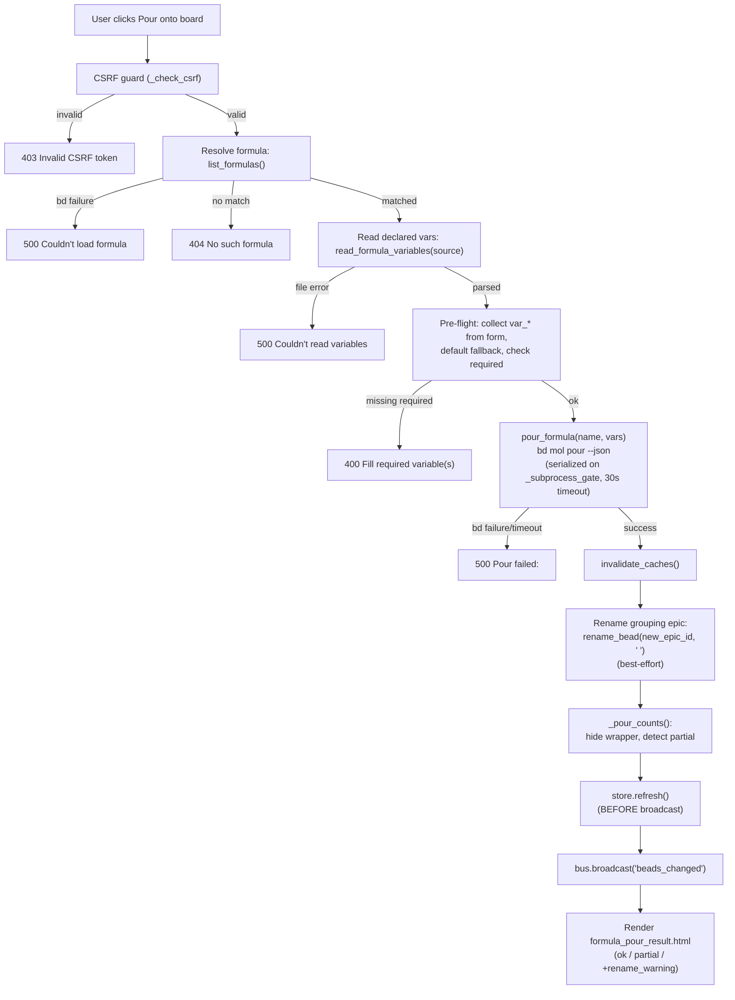

# Formula Pour Pipeline

## What Happens

A user picks a formula from the "Pour Formula" dialog, fills in any declared
variables, and submits. The server validates CSRF + required variables,
shells out to `bd mol pour` (which atomically materializes a whole bead tree
from a `*.formula.json` template), renames the grouping epic so repeat pours
are distinguishable, refreshes the store, and broadcasts an SSE event so every
open tab re-fetches the board with the freshly poured beads visible.

This is bdboard's **only write path that creates new beads** — every other
mutation edits or appends to existing ones.

## Trigger

**User submits the variable form** inside the "Pour Formula" `<dialog>` on the
[Board view](../Views/BoardView.md). The form (`partials/formula_form.html`)
fires an `hx-post` to `POST /api/formulas/{name}/pour` carrying each declared
variable as a `var_<name>` form field plus the CSRF token (hidden field +
`X-CSRF-Token` header). The submit button is disabled in-flight via
`hx-disabled-elt` to prevent double-submits.

The pipeline is preceded by two read hops that populate the dialog:

1. **Picker load** — `GET /api/formulas` fetches the formula list when the
   dialog opens (`load-formulas` custom trigger).
2. **Form render** — `GET /api/formulas/{name}/form` reads the formula's
   `*.formula.json` and renders the variable form + step disclosure when the
   user selects an option.

Both reads are documented in their own endpoint docs; this flow covers
**step 3 onward** — the write path that begins when the form is submitted.

## Outcome

- A new bead tree (epic + children) exists on the board, with the grouping
  epic titled `<formula> <suffix>` (e.g. `flowdoc-html u72`).
- The molecule wrapper node (bd's internal root) is hidden from the visible
  count — the user sees only the formula's step beads.
- The store is refreshed and a `beads_changed` SSE event has fired, so every
  open tab re-renders the board with the new beads in their lanes.
- On the acting tab, the `#formula-pour-result` region shows a success
  acknowledgement and the picker + form are reset.



## Step-by-Step

| # | What | Where (file:symbol) | Failure mode |
| --- | --- | --- | --- |
| 1 | CSRF guard — either the `X-CSRF-Token` header or `csrf_token` form field must match the process-lifetime token | `src/bdboard/app.py`:`_check_csrf` | `403` HTTPException — the form is stale or crafted |
| 2 | Resolve formula — shell `bd formula list --json`, find the entry whose `name` matches the path param | `src/bdboard/bd.py`:`BdClient.list_formulas` (→ `_run_json`, gated on `_subprocess_gate`, timeout `FORMULA_LIST_TIMEOUT_S = 8s`) | `RuntimeError` → `500` "Couldn't load the formula" |
| 3 | Match by name — `next((f for f in formulas if f.get("name") == name), None)` | `src/bdboard/app.py`:`api_formula_pour` | `None` → `404` "No such formula" |
| 4 | Read declared variables — parse `*.formula.json` at `source` path | `src/bdboard/bd.py`:`BdClient.read_formula_variables` (→ `_load_formula_json` + `_parse_variables`) | `RuntimeError` (file missing / bad JSON) → `500` "Couldn't read this formula's variables" |
| 5 | Pre-flight collect — iterate declared vars, read `var_<name>` from `await request.form()`, `.strip()`, fall back to `default`, mark blank-and-no-default vars as `missing` | `src/bdboard/app.py`:`api_formula_pour` (inline loop) | Missing required vars → `400` "Please fill required variable(s): ..." |
| 6 | Pour — `bd mol pour <name> --var k=v … --json`; serialized on `_subprocess_gate`; 30s subprocess timeout (`POUR_TIMEOUT_S`); atomic (failure = zero new beads) | `src/bdboard/bd.py`:`BdClient.pour_formula` | `RuntimeError` (non-zero exit / timeout / bad JSON) → `500` "Pour failed: \<bd stderr\>" |
| 7 | Invalidate caches — drop show/history/memories/status caches so follow-up reads see post-pour state | `src/bdboard/bd.py`:`BdClient.invalidate_caches` | Cannot fail (dict `.clear()`) |
| 8 | Rename grouping epic — `bd update <new_epic_id> --title "<formula> <suffix>"` so repeat pours are distinguishable; suffix is the segment after the last `-` in the bd-assigned id | `src/bdboard/app.py`:`_short_pour_id`; `src/bdboard/bd.py`:`BdClient.rename_bead` (→ `_run_mutate`) | Best-effort — `RuntimeError` is caught and becomes a soft `rename_warning` appended to the result, NOT a hard error (the pour already succeeded atomically) |
| 9 | Count reconciliation — `_pour_counts(result)` subtracts the hidden molecule wrapper from `created` (visible = `created − 1`, floored at 0) and compares `len(id_mapping)` to `created` to detect partial materialization | `src/bdboard/app.py`:`_pour_counts` | No exception — returns `(visible_count, created, fully_materialized)` |
| 10 | Store refresh — force the store to re-snapshot from the (now mutated) bd workspace **before** broadcasting, so the SSE-triggered re-fetch serves fresh data | `src/bdboard/store.py`:`Store.refresh` | Refresh failure would mean clients fetch stale data; see Failure Handling |
| 11 | SSE broadcast — push `beads_changed` to every connected EventSource client so all tabs re-fetch lanes | `src/bdboard/events.py`:`EventBus.broadcast("beads_changed")` | Enqueue-per-subscriber; full queues are drained-then-re-enqueued (lossy but non-blocking) |
| 12 | Render result — return `partials/formula_pour_result.html`: healthy pour → `formula-pour-ok` message; partial pour → `formula-error` alert; rename failure → appended warning | `src/bdboard/templates/partials/formula_pour_result.html` | Cannot fail at this stage |

## Data Transformations

**Form submission → submitted dict (step 5)**

Input (form-encoded):
```
csrf_token=<token>&var_target=both
```

Output (Python dict for bd):
```python
{"target": "both"}   # only declared var names, stripped, default-filled
```

Unknown `var_*` fields are discarded. Blank fields with a declared `default`
are filled from the default. Blank-and-no-default fields block the pour.

**bd mol pour → result dict (step 6)**

bd subprocess stdout (JSON):
```json
{
  "new_epic_id": "myproject-mol-u72",
  "id_mapping": {
    "root": "myproject-mol-u72",
    "build": "myproject-abc",
    "validate": "myproject-def"
  },
  "created": 3
}
```

- `new_epic_id` — the molecule wrapper's bead id (used for the rename).
- `id_mapping` — step template id → real bead id (used for count honesty).
- `created` — total node count including the hidden wrapper.

**_pour_counts → visible tuple (step 9)**

```python
visible_count = max(created - 1, 0)   # hide the wrapper
fully_materialized = (len(id_mapping) == created)
```

**Template context (step 12)**

```python
{
    "name": "flowdoc-html",
    "created": 2,                # visible count (wrapper excluded)
    "rename_warning": "",        # or the soft-warning string
    "fully_materialized": True,  # False triggers the alert variant
}
```

## Performance Characteristics

| Aspect | Detail |
| --- | --- |
| Serialization | The pour and the follow-up rename are both gated on `BdClient._subprocess_gate` (`asyncio.Semaphore(1)`) because bd's embedded Dolt is single-writer. Concurrent pours queue, not race. |
| Subprocess timeout | `POUR_TIMEOUT_S = 30s` — generous because pour cooks the formula inline and materializes a whole tree. The formula-list resolve uses `FORMULA_LIST_TIMEOUT_S = 8s`. |
| Sync file read | `read_formula_variables` (step 4) is a synchronous `Path.read_text` + `json.loads` — fast (single small JSON file), but blocks the event loop briefly. Acceptable for a single-user localhost dashboard. |
| No TTL cache on pour path | `list_formulas` on the pour path calls `_run_json` (not `_cached`) — no stale-formula risk, but every pour re-shells `bd formula list`. |
| Store refresh cost | `store.refresh()` re-snapshots the full active-issue set (one `bd list --json` subprocess call). Required before broadcast so clients don't fetch stale cache data. |
| Atomicity | `bd mol pour` is atomic: a failed pour rolls back to zero new beads. The board is never left with orphaned partial trees. |

## Failure Handling

| Stage | Failure | Behavior |
| --- | --- | --- |
| CSRF (step 1) | Token mismatch | `403` HTTPException. Form is stale → user refreshes. |
| Formula resolve (step 2) | bd subprocess failure | `RuntimeError` → `500` inline fragment. Dialog stays intact for retry. |
| Name match (step 3) | Unknown formula name | `404` inline fragment. |
| Variable read (step 4) | `*.formula.json` missing / bad JSON | `RuntimeError` → `500` inline fragment. |
| Pre-flight (step 5) | Required variable blank | `400` inline fragment listing missing var names. Form stays filled. |
| Pour (step 6) | bd non-zero exit | `RuntimeError` with bd's verbatim stderr → `500` "Pour failed: \<stderr\>". Zero new beads (atomic rollback). |
| Pour (step 6) | 30s timeout | Process killed (`_safe_kill`), pipes drained via `proc.communicate()` to prevent fd leaks. `RuntimeError` → `500` "Pour timed out." |
| Pour (step 6) | Valid exit but non-JSON / non-object stdout | `RuntimeError` → `500`. |
| Rename (step 8) | bd update fails | **Best-effort** — caught, logged, appended as `rename_warning`. The pour itself already succeeded; beads are on the board under the bare formula name. |
| Partial materialization (step 9) | `len(id_mapping) != created` | Logged as a warning. Result renders the `formula-error` alert variant (not the success variant) so the user knows only N beads landed. |
| Store refresh (step 10) | Refresh failure | Clients would fetch stale data on the SSE-triggered re-fetch. No explicit retry — the watcher cycle will catch up shortly. |

> [!CAUTION]
> The `store.refresh()` in step 10 **MUST** run before `bus.broadcast()` in
> step 11. Without it, the optimistic broadcast races ahead of the
> watcher→refresh cycle and clients re-fetch stale cache data that omits the
> freshly poured beads entirely (regression bdboard-dfl).

> [!WARNING]
> `bd mol pour --dry-run` is **not** sufficient to catch every pour-blocker
> (e.g. broken formula dependencies — the `--dry-run` flag is unreliable, see
> memory `bd-graph-no-dry-run`). The pre-flight required-variable check is
> necessary but not sufficient; bd's real stderr is surfaced on failure so the
> user sees the actual reason.

## Key Log Messages

| Log line | Where | Means |
| --- | --- | --- |
| `bd formula list failed during pour: %s` | `src/bdboard/app.py`:`api_formula_pour` | Could not resolve the formula — bd subprocess failed or returned non-list JSON. |
| `read_formula_variables failed during pour: %s` | `src/bdboard/app.py`:`api_formula_pour` | The `*.formula.json` file at `source` could not be read or parsed. |
| `bd mol pour %s failed: %s` | `src/bdboard/app.py`:`api_formula_pour` | The pour subprocess exited non-zero, timed out, or returned unparseable JSON. |
| `pour rename of %s failed: %s` | `src/bdboard/app.py`:`api_formula_pour` | Best-effort rename of the grouping epic failed (pour still succeeded). |
| `pour of %s under-materialized: created=%s but id_mapping has %s entries` | `src/bdboard/app.py`:`api_formula_pour` | Partial materialization detected — fewer nodes mapped than created. Likely a missing `pour: true` in the formula or a bd vapor-pour regression. |

## Common Issues

| Symptom | Likely cause | Fix |
| --- | --- | --- |
| Pour returns 403 | CSRF token expired or missing. The dialog's form bakes the token from the page-load; a long-idle tab may have a stale token vs. a restarted server. | Refresh the page to pick up the new process-lifetime token. |
| "Fill required variable(s)" even though the form shows a value | The `required` attribute is determined server-side from the `*.formula.json` `variables` block: a variable with no `default` key is required. A field prefilled by the browser (autocomplete) but empty after `.strip()` is treated as blank. | Ensure the variable has a non-empty value after whitespace stripping, or add a `default` to the formula template. |
| "Pour timed out" | The formula tree is large or bd's Dolt commit is slow. `POUR_TIMEOUT_S = 30s`. | Check server logs for the formula size; increase `POUR_TIMEOUT_S` if needed. The formula may still be materializing — refresh after a moment. |
| Partial pour — "only N beads materialized" | The formula's root step is missing `pour: true`, or a bd vapor-pour regression caused only the wrapper to materialize without its children. | Check the `*.formula.json` root step for `"pour": true`. Remove the incomplete epic from the board before retrying. See memory `formula-vapor-pour-gotcha`. |
| Beads don't appear on the board after a successful pour result | The `store.refresh()` before broadcast was skipped or failed — clients re-fetched stale cache data. | Hard-refresh the page. If recurring, check that the `store.refresh()` → `bus.broadcast()` ordering is intact (regression bdboard-dfl). |
| Grouping epic shows the bare formula name instead of `<formula> <suffix>` | The best-effort rename failed (logged as a warning). The pour itself succeeded. | Rename the epic manually via `bd update <id> --title "..."` or from the bead detail modal. |

## Related

- [GET /api/formulas](../Endpoints/GetApiFormulas.md) — step 0a: the formula
  picker list (loaded when the dialog opens).
- [GET /api/formulas/{name}/form](../Endpoints/GetApiFormulaForm.md) — step 0b:
  the variable form (rendered when the user selects a formula).
- [POST /api/formulas/{name}/pour](../Endpoints/PostApiFormulaPour.md) — the
  endpoint this flow documents (the write half).
- [Board (/)](../Views/BoardView.md) — the view whose "+ Pour Formula" dialog
  triggers this flow.
- [Feature: Formula Pour](../Features/index.md) — the feature this flow
  implements.
- [bd CLI as Source of Truth](../Concepts/BdCliSourceOfTruth.md) — why the
  pipeline shells out to `bd mol pour` and reads `*.formula.json` directly.
- [Subprocess Serialization & Caching](../Concepts/SubprocessSerializationAndCaching.md)
  — the `_subprocess_gate` that serializes the pour + rename, and the cache
  invalidation that follows.
- [SSE Event Bus](../Concepts/SseEventBus.md) — the `beads_changed` broadcast
  that pushes every tab to re-fetch after a pour.
- [CSRF Protection](../Concepts/CsrfProtection.md) — the token guard that
  fronts the pour POST.
- [Store Snapshot & Change Detection](../Concepts/StoreSnapshotChangeDetection.md)
  — the `store.refresh()` that must precede the SSE broadcast.
- [Flows index](index.md)
- [Back to docs index](../index.md)
