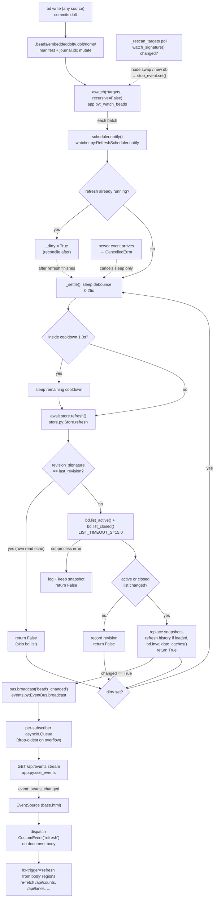

# Live-Refresh Pipeline

## What Happens

When `bd` mutates the workspace (a field edit, a formula pour, or a write from
*any* terminal/agent in the same `.beads/`), bdboard notices the filesystem
churn, re-reads the bead list **once**, decides whether anything actually
changed, and — only if it did — pushes a content-free `beads_changed` event to
every open browser tab. Each tab then re-fetches just its live HTML regions
(counts strip, swim lanes, closed lane, history, memory) over HTMX. The board
goes live without polling, without a websocket, and without shipping a single
byte of bead data down the SSE wire.

## Trigger

- **External:** any `bd` write — from a terminal, an agent, or another bdboard
  instance — commits dolt, which mutates `manifest` + `journal.idx` inside each
  database's `.beads/embeddeddolt/<db>/.dolt/noms/` directory. `watchfiles`
  fires for that FS activity.
- **Internal (optimistic):** bdboard's own write routes (`api_bead_field_update`,
  `pour_formula`'s handler, the rename path) call `bus.broadcast("beads_changed")`
  directly *after* a `store.refresh()`, so the acting tab and its siblings update
  immediately rather than waiting out the watcher's debounce + cooldown.
- **Bootstrap:** a freshly-connected `EventSource` receives a synthetic
  `beads_changed` (`data: bootstrap`) so a new tab paints live data at once.
- **Self-feedback (suppressed):** even a *read-only* `bd list --json` perturbs
  `noms/`, so the watcher fires for bdboard's own refresh ~1.3s later. This
  trigger is intentionally short-circuited (see `revision_signature` skip below)
  so the pipeline cannot spin on itself.

## Outcome

- Exactly **one** `store.refresh()` per logical mutation (burst-writes are
  coalesced by the debounce window).
- A `beads_changed` SSE event broadcast to all subscribers **iff** the
  active or closed bead list actually changed.
- Each browser tab re-fetches its `hx-trigger="load, refresh from:body"`
  regions and swaps in fresh server-rendered partials; the footer live-status
  dot reads `live · push`.
- No broadcast (and so no client work) when the FS event was bdboard's own read
  echoing back, an unrelated dolt-internal write, or a memory-only mutation.



## Step-by-Step

| # | What | Where (file:symbol) | Failure mode |
| --- | --- | --- | --- |
| 1 | On app boot, the lifespan handler spawns the watcher task `bdboard.watcher`; on shutdown it cancels and awaits it | `src/bdboard/app.py:lifespan` (`asyncio.create_task(_watch_beads(), name="bdboard.watcher")`) | Task crash is caught by the loop in step 4 and restarted after 2s; cancel-on-shutdown swallows `CancelledError` |
| 2 | Resolve the watch target set: each `.beads/embeddeddolt/<db>/.dolt/noms/` plus `.beads/` itself — observed **non-recursively** so the churning dolt object store can't exhaust `RLIMIT_NOFILE` | `src/bdboard/bd.py:BdClient.watch_targets` | Empty target list (`.beads/` absent) → sleep 2s and retry |
| 3 | Open `awatch(*targets, recursive=False, stop_event=...)`; each settled FS batch (~50ms) calls `scheduler.notify()` | `src/bdboard/app.py:_watch_beads` (`async for _changes in awatch(...)`) | `FileNotFoundError` → retry after 2s; any other exception → `log.exception("watcher crashed; restarting in 2s")` |
| 4 | A background poller fingerprints the targets via `(path, st_dev, st_ino)` and trips `stop_event` when a `noms/` inode is swapped or a new db appears, forcing a clean re-enumeration | `src/bdboard/app.py:_rescan_targets` + `src/bdboard/bd.py:BdClient.watch_signature` | A transient `stat()` hiccup is logged at debug and retried on the next `WATCHER_RESCAN_S=3.0` tick — never kills the poller |
| 5 | `notify()` debounces: if a refresh is already running it just sets `_dirty`; otherwise it cancels any pending settle and schedules a fresh `_settle()` | `src/bdboard/watcher.py:RefreshScheduler.notify` | An event arriving mid-refresh is **not** dropped — `_dirty` triggers exactly one reconcile pass afterward (bdboard-ywep) |
| 6 | `_settle()` sleeps the `DEBOUNCE_S=0.25` quiet-window, then waits out any remaining `COOLDOWN_S=1.0` since the last *successful* refresh | `src/bdboard/watcher.py:RefreshScheduler._settle` | A newer event cancels the **sleep only** (`CancelledError` → return); the in-flight refresh subprocess is never cancelled |
| 7 | Refresh phase begins (non-cancellable): set `_refreshing`, clear `_dirty`, `await refresh()` | `src/bdboard/watcher.py:RefreshScheduler._settle` (`self._refreshing = True`) | A raised `refresh()` is logged and returns **without advancing the cooldown clock**, so the next notify retries promptly (bdboard-xbc7 root cause #3) |
| 8 | Cheap self-feedback skip: compare the dolt `manifest` root-hash signature against `_last_revision`; if unchanged and the cache is populated, **skip the `bd list` subprocess** and report no change | `src/bdboard/store.py:Store.refresh` + `src/bdboard/bd.py:BdClient.revision_signature` | Empty signature (legacy JSONL-only workspace) → never skip; always refresh (safe direction) |
| 9 | Re-read both halves of the board: `bd list --no-pager --limit 0` (active) and the date-windowed closed query | `src/bdboard/bd.py:BdClient.list_active` / `BdClient.list_closed` (`timeout=LIST_TIMEOUT_S`) | Subprocess error/malformed JSON → `log.exception("store: bd list failed; keeping previous snapshot")`, return `False`; the stale cache is preserved by NOT mutating snapshots |
| 10 | Diff fresh vs. cached active/closed lists; on a real change, swap in new `_Snapshot`s (with rebuilt `by_id` indexes) | `src/bdboard/store.py:Store.refresh` (`active_changed`, `closed_changed`) | No change → record the new revision and return `False` (no broadcast) |
| 11 | If the History page's window-bounded closed cache was already lazy-loaded, re-fetch it with the **same** cutoff it currently holds | `src/bdboard/store.py:Store.refresh` (`self.bd.list_closed_history(closed_after=self._history_cutoff)`) | `list_closed_history` failure is logged and the previous history snapshot is kept |
| 12 | Invalidate the per-bead `bd show` / `bd history` caches so the next modal click reads post-mutation state, record `_last_revision`, return `True` | `src/bdboard/store.py:Store.refresh` (`self.bd.invalidate_caches()`) → `src/bdboard/bd.py:BdClient.invalidate_caches` | None — pure cache clear |
| 13 | On a `True` refresh, broadcast the content-free `beads_changed` to every subscriber queue (drop-oldest under backpressure) | `src/bdboard/watcher.py:RefreshScheduler._settle` → `src/bdboard/events.py:EventBus.broadcast` | A full slow-client queue drops its oldest event; if still full, `log.warning("event bus subscriber queue is hot; event lost")` — healed by the next refresh |
| 14 | After the refresh completes, advance the cooldown clock and, if `_dirty`, schedule one more settle so a write that overlapped the refresh isn't lost | `src/bdboard/watcher.py:RefreshScheduler._settle` (`if self._dirty: self._pending = asyncio.create_task(self._settle())`) | The reconcile pass usually hits the cheap revision-skip path (step 8) when the overlap was just our own read |
| 15 | Each subscriber's SSE generator pulls the event off its queue and yields `event: beads_changed\ndata: <ts>\n\n`; a 15s `TimeoutError` instead yields a `: heartbeat` comment | `src/bdboard/app.py:sse_events` (`stream()` async generator) | Client disconnect (`await request.is_disconnected()`) breaks the loop; the `subscribe()` context manager discards the queue |
| 16 | The browser `EventSource` handler dispatches a synthetic `CustomEvent('refresh')` on `document.body` | `src/bdboard/templates/base.html` (`es.addEventListener('beads_changed', ...)`) | `EventSource` `error` flips the dot to `reconnecting…`; built-in exponential backoff reconnects automatically |
| 17 | Every live region with `hx-trigger="load, refresh from:body"` re-fetches its partial and swaps the new HTML in place | `src/bdboard/templates/dashboard.html` (`#counts`, lanes), `partials/lanes.html`, `templates/history.html`, `templates/memory.html` | A failed partial fetch is an HTMX error swap; the region keeps its last content until the next refresh |

## Data Transformations

Input → output at each hop:

1. **dolt commit → FS event.** A `bd` write rewrites `manifest` (the ~150-byte
   file whose payload is dolt's current root hash) and re-touches `journal.idx`
   inside each `noms/` dir. `watchfiles` collapses ~50ms of activity into a
   `set[tuple[Change, str]]` batch — bdboard ignores the *contents* of the batch
   (`async for _changes`), treating any event as "something moved, go check".

2. **FS batch → scheduled refresh.** `notify()` → at most one live `_settle()`
   task. Multiple batches from one logical `bd update` (which spans 2–3 batches)
   cancel-and-reschedule, collapsing to a single refresh after the writes go
   quiet for `DEBOUNCE_S`.

3. **workspace path → revision signature.** `revision_signature()` →
   `frozenset[(manifest_path, manifest_bytes)]`, one entry per db. Example shape
   (bytes elided):

   ```json
   {
     "signature": [
       [".beads/embeddeddolt/bdboard/.dolt/noms/manifest", "<root-hash bytes>"]
     ]
   }
   ```

   Compared against `Store._last_revision`; identical → the whole `bd list` is
   skipped and `refresh()` returns `False`.

4. **bd argv → raw bead arrays.** `list_active()` runs
   `["list", "--no-pager", "--limit", "0"]`; `list_closed()` runs
   `["list", "--status", "closed", "--closed-after", "<cutoff>", "--sort",
   "closed", "--no-pager", "--limit", "0"]`. Each yields a JSON array of bead
   dicts with real fields such as `id`, `title`, `status`, `priority`,
   `issue_type`, `updated_at`, `closed_at`, `labels`, `dependencies`.

5. **raw arrays → diff decision → snapshots.** `prev_active != fresh_active`
   (and the closed equivalent) decide `changed`. On change, each becomes a
   `_Snapshot(beads=[...], by_id={id: bead})`. The boolean `changed` (`True` /
   `False`) is the *only* value that escapes `refresh()` to the scheduler.

6. **`changed=True` → SSE frame.** `bus.broadcast("beads_changed")` enqueues the
   bare string `"beads_changed"` onto every subscriber queue; the stream renders
   it as an SSE frame carrying **no bead payload** — just an epoch timestamp as
   `data`:

   ```text
   event: beads_changed
   data: 1717455224
   ```

7. **SSE frame → DOM event → HTTP GETs.** The `EventSource` `beads_changed`
   listener dispatches `new CustomEvent('refresh')` on `document.body`; HTMX's
   `refresh from:body` triggers fire `GET /api/counts`, `GET /api/lanes`
   (and `/api/lanes/closed`), `GET /api/history` / `GET /api/memory` on their
   respective pages — bare (no query params) so each region re-renders the same
   window it's currently viewing.

8. **partial HTML → swapped region.** Each endpoint returns a server-rendered
   fragment (e.g. `partials/lanes.html`, `partials/counts.html`) that HTMX swaps
   via `innerHTML`, completing the round trip from `bd` write to repainted board.

## Performance Characteristics

- **Sync vs async.** The entire pipeline is `asyncio`-cooperative on the single
  uvicorn event loop: the watcher task, the rescan poller, `store.refresh()`'s
  awaited subprocesses, and every SSE stream coroutine share one loop. The
  `bd list` subprocesses themselves run out-of-process.
- **One refresh per mutation, not per file.** The `DEBOUNCE_S=0.25` quiet-window
  collapses the 3–5 file writes of a single `bd update` (manifest, journal.idx,
  lock, …) into exactly one `store.refresh()`. `COOLDOWN_S=1.0` then caps a
  sustained write storm (dolt commit + auto-export + git-add hook) at one refresh
  per second.
- **The self-feedback skip is the throughput win.** `revision_signature()` is one
  tiny file read per db (no subprocess, no dolt lock). When the FS event was just
  bdboard's own `bd list` echoing back, `refresh()` short-circuits *before*
  spawning the ~15s-budget `bd list`, severing the refresh→read→event→refresh
  loop that otherwise wedged live-sync entirely (bdboard-ywep).
- **No N+1 over beads.** Each refresh issues exactly two `bd list` subprocesses
  (active + closed; plus one history list only when that cache is warm),
  regardless of how many beads changed. The diff is a single Python list
  comparison.
- **Broadcast cost is O(N) over tabs, not beads.** `EventBus.broadcast` does one
  `put_nowait` per subscriber queue with a content-free string; the actual render
  cost is paid by each tab's *own* partial re-fetch, parallelized across clients.
- **Refresh is serialized.** `Store.refresh` holds `self._refresh_lock`, so
  overlapping triggers (watcher + an optimistic route broadcast) can't double-run
  the diff; the second awaits the first and then usually takes the cheap
  revision-skip path.
- **Latency budget.** End-to-end: `DEBOUNCE_S` (0.25) + up-to-`COOLDOWN_S`
  remainder (≤1.0) + `bd list` time (sub-second typical, `LIST_TIMEOUT_S=15.0`
  ceiling) + SSE fanout (negligible) + the client's partial GET. Optimistic
  route broadcasts skip the debounce/cooldown for the acting tab entirely.

## Failure Handling

- **`bd list` failure degrades to stale, never empty.** A subprocess error or
  malformed JSON is logged (`store: bd list failed; keeping previous snapshot`)
  and `refresh()` returns `False` without touching the cache — the board keeps
  showing the last-known state rather than flashing empty on a transient hiccup.
- **Cooldown clock advances only on success.** If `refresh()` *raises*, the
  scheduler does **not** advance `_last_refresh_at`, so the next FS event retries
  promptly instead of being swallowed by a cooldown that was "earned" without
  actually syncing (bdboard-xbc7 root cause #3).
- **In-flight refresh is never cancelled.** `notify()` only pre-empts the
  cancellable debounce/cooldown *sleep*; once `bd list` starts it runs to
  completion, with concurrent events recorded via `_dirty` for a single
  follow-up reconcile. This is the fix for the freeze where `bd list`'s own
  `noms/` churn cancelled the very refresh that triggered it (bdboard-ywep).
- **Trailing/isolated writes always refresh.** A settle that lands inside the
  cooldown window waits out the remainder and *then* refreshes rather than
  dropping the event — so the last write of a burst (or a single isolated edit)
  is never lost (bdboard-xbc7 root cause #1).
- **Target-set drift self-heals.** `_rescan_targets` trips `awatch`'s
  `stop_event` on a `noms/` inode swap (dolt rename-over → dead kqueue inode on
  macOS) or a new db, forcing a clean re-enumeration with no process restart
  (bdboard-xbc7 root cause #2).
- **Watcher crash auto-restarts.** Any unhandled exception in the watch loop is
  logged and the loop sleeps 2s and re-enters `awatch` with fresh targets.
- **SSE backpressure is lossy by design.** A slow client's bounded
  (`_QUEUE_SIZE=16`) queue drops its oldest event under overflow rather than
  blocking the broadcaster; a dropped event is harmless because it's a
  content-free trigger and the next refresh re-fires the same re-fetch.
- **Heartbeats keep the stream open.** A 15s idle yields a `: heartbeat` SSE
  comment so proxies/load balancers don't kill the long-lived connection;
  `X-Accel-Buffering: no` disables nginx buffering when proxied.
- **EventSource reconnects itself.** On a dropped connection (e.g. server
  restart) the browser's `EventSource` auto-reconnects with exponential backoff;
  the footer dot shows `reconnecting…` then `live · push`, and the bootstrap
  event re-paints fresh data on reconnect.

## Key Log Messages

| Log line | Where | Means |
| --- | --- | --- |
| `watcher started for %s` | `src/bdboard/app.py:lifespan` | The watcher task launched at app boot; arg is `bd.beads_dir`. |
| `watcher observing %d target(s) (non-recursive): %s` | `src/bdboard/app.py:_watch_beads` | The resolved target set for this `awatch` session — the per-db `noms/` dirs plus `.beads/`. A handful of paths is expected; a huge count means the non-recursive guard regressed. |
| `watcher targets changed; re-enumerating` | `src/bdboard/app.py:_watch_beads` | `_rescan_targets` tripped `stop_event` — a `noms/` inode swap or new db — and the loop is re-entering `awatch` with fresh targets (healthy, not an error). |
| `watcher rescan: signature check failed; retrying` (debug) | `src/bdboard/app.py:_rescan_targets` | A transient `stat()` during fingerprinting; the poller keeps going. Benign unless it repeats forever. |
| `watcher crashed; restarting in 2s` | `src/bdboard/app.py:_watch_beads` | An unhandled exception in the watch loop; it will sleep 2s and restart. Investigate the stack trace. |
| `watcher: refresh raised; will retry on next change` | `src/bdboard/watcher.py:RefreshScheduler._settle` | `store.refresh()` raised; the cooldown clock was intentionally NOT advanced so the next event retries promptly. |
| `store: bd list failed; keeping previous snapshot` | `src/bdboard/store.py:Store.refresh` | The active/closed re-list failed; the prior snapshot is preserved and no broadcast fires. The board shows stale (not empty) data. |
| `store: bd list_closed_history failed; keeping previous history` | `src/bdboard/store.py:Store.refresh` | Only the History page's window cache failed to refresh; the board's active/closed refresh still succeeded. |
| `event bus subscriber queue is hot; event lost` | `src/bdboard/events.py:EventBus.broadcast` | A subscriber fell `>16` events behind even after dropping the oldest; one trigger was lost (healed by the next refresh). Indicates a stuck/slow client. |
| `watcher stopped` | `src/bdboard/app.py:lifespan` | Clean shutdown — the watcher task was cancelled and awaited. |

## Common Issues

| Symptom | Likely cause | Fix |
| --- | --- | --- |
| Board never updates after a `bd` write while it sits open | Watcher wedged (historically the self-feedback cancel loop) or the workspace has no embedded dolt dbs so `revision_signature` is empty and the cache path differs | Confirm `watcher observing N target(s)` logged on boot; on a dolt workspace verify `revision_signature` is non-empty. The bdboard-ywep fixes (non-cancellable refresh + revision skip) should prevent the classic freeze. |
| Updates lag ~1–1.3s behind the write | Expected: `DEBOUNCE_S=0.25` + up-to-`COOLDOWN_S=1.0` remainder + `bd list` time. The first event after a quiet period is fastest; mid-storm events wait out cooldown | Not a bug — optimistic route broadcasts skip this for the acting tab. Lower `WATCHER_DEBOUNCE_S`/`WATCHER_COOLDOWN_S` only if you understand the burst-collapse tradeoff. |
| Footer dot stuck on `reconnecting…` | The `EventSource` lost its connection (server restart, proxy idle-timeout shorter than 15s heartbeat, or buffering proxy) | Confirm the server is up; for proxies ensure SSE isn't buffered (`X-Accel-Buffering: no` is sent) and the idle timeout exceeds 15s. The browser auto-reconnects with backoff. |
| One tab updates, another doesn't | The lagging tab's SSE queue overflowed (`event bus subscriber queue is hot`) and dropped a trigger, or its connection silently died | The next refresh heals it; reload the tab if its `EventSource` is dead. Each tab has an independent queue — one slow client can't block others. |
| New dolt db (or recreated `noms/`) added after startup isn't watched | The rescan poller hasn't ticked yet, or `watch_signature` couldn't `stat()` the new path | Wait one `WATCHER_RESCAN_S=3.0` cycle; the signature change trips `stop_event` and re-enumerates targets automatically. |
| `OSError [Errno 24] Too many open files` after enabling recursive watch | Someone switched `awatch` to `recursive=True` over the churning `noms/` object store, exhausting `RLIMIT_NOFILE` | Keep `recursive=False` and watch only the `watch_targets()` set — that's the whole point of the non-recursive design. |
| Board flashed empty then recovered | A transient `bd list` failure briefly returned `False`; if you saw empty, the cache hadn't been populated yet (cold start) | The degrade-to-stale path prevents this once warm; check for `store: bd list failed` in the logs around the flash. |
| A memory-only `bd remember` doesn't repaint the board | Correct: the active/closed lists didn't change, so `refresh()` returns `False` and no `beads_changed` fires for the board | Expected. The `/memory` page's `refresh from:body` region still picks up memory changes on its own refresh trigger. |

## Related

- [Server startup & workspace resolution (Flow)](ServerStartup.md) — boots the
  watcher task and `Store`/`EventBus` singletons this pipeline runs on; this flow
  picks up exactly where that one's `watcher started` log leaves off.
- [SSE events (`/api/events`)](../Endpoints/SseEvents.md) — the HTTP contract for
  the stream this pipeline broadcasts on (frame format, heartbeat, headers);
  this flow is the producer side feeding it.
- [Lanes API (`/api/lanes`, `/api/lanes/closed`, `/api/counts`)](../Endpoints/LanesApi.md)
  — the endpoints the client re-fetches when a `beads_changed` event lands on the
  board.
- [Inline field-edit write path (Flow)](FieldEditWritePath.md) — a write flow that
  emits an optimistic `beads_changed` *and* relies on this pipeline to reconcile
  every other tab.
- [Formula pour fan-out (Flow)](FormulaPourFanout.md) — the pour write flow that
  also `store.refresh()`es before broadcasting; its `.beads/` churn rides this
  same pipeline (and the self-feedback skip keeps it from spinning).
- [Watcher debounce/cooldown & self-feedback skip](../Concepts/WatcherScheduling.md)
  — the deep dive on the `RefreshScheduler` timing logic at the heart of steps 5–7
  and 13–14.
- [Store snapshot cache & change detection](../Concepts/StoreSnapshotCache.md) —
  the cache + `revision_signature` oracle that decides whether a refresh is worth
  a subprocess and whether a broadcast fires.
- [bd CLI as runtime source of truth](../Concepts/BdCliSourceOfTruth.md) — why a
  read-only `bd list` still perturbs `.beads/` (the motivation for the
  self-feedback skip) and why bd is the only source of truth this refresh reads.
- [Derive layer (pure view shaping)](../Concepts/DeriveLayer.md) — shapes each
  refreshed snapshot into the lane/count/activity views the re-fetched partials
  render.
- [HTMX + server-rendered partials](../Concepts/HtmxPartialsArchitecture.md) — the
  `refresh from:body` trigger and `innerHTML` re-swap the broadcast ultimately
  drives.
- [Board page (`/`)](../Views/BoardPage.md) — the primary view that subscribes to
  the stream and re-fetches its lanes/counts when this pipeline fires.
- [Flows index](index.md) · [Architecture](../Architecture.md#system-diagram) ·
  [Manifest](../_Manifest.md) — the flow catalog and system view this item sits in.
