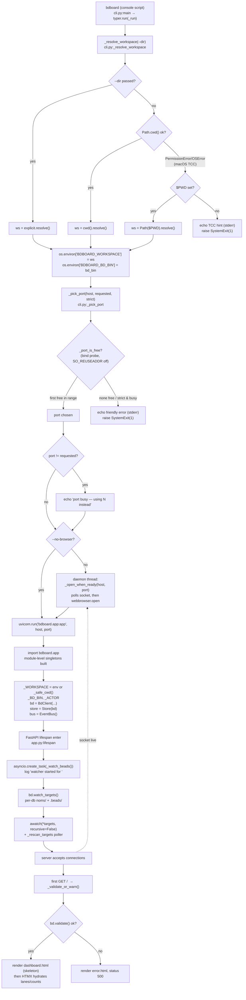

# Server Startup & Workspace Resolution

## What Happens

Running `bdboard` (the Typer entry point) bootstraps the whole process in one
straight line: it figures out **which directory is the bd workspace**, exports
that decision into the environment so the FastAPI app can pick it up at import,
finds a **free TCP port** (auto-incrementing past any busy one), spawns a
background thread that will open a browser tab the instant the socket starts
accepting, and then hands control to `uvicorn.run(...)`. As uvicorn imports
`bdboard.app`, the module-level singletons (`BdClient`, `Store`, `EventBus`) are
constructed from the env the CLI just set, and the FastAPI **lifespan** handler
launches the `.beads/` watcher task. The board is live before the user's browser
finishes its first paint — no config file, no manual port juggling, no `cd`
ceremony beyond standing in a bd workspace.

## Trigger

- **The `bdboard` console script** — `pyproject.toml`'s
  `[project.scripts] bdboard = "bdboard.cli:main"` → `typer.run(_run)`. This is
  the only first-class entry point.
- **`python -m bdboard`** — `src/bdboard/__main__.py` imports and calls the same
  `cli.main`, so the module form is identical to the console script.
- **`uvicorn bdboard.app:app --reload` (dev)** — bypasses the CLI entirely. The
  app module is imported directly, so workspace/bd-binary come from whatever
  `BDBOARD_WORKSPACE` / `BDBOARD_BD_BIN` are already in the environment (or the
  `_safe_cwd()` fallback). The lifespan watcher still boots; the CLI's port-pick
  and browser-open are simply not involved.

## Outcome

- `BDBOARD_WORKSPACE` and `BDBOARD_BD_BIN` (and optionally `BDBOARD_ACTOR`) are
  set in the process environment **before** `bdboard.app` is imported.
- A bound, listening uvicorn server on the first free port at/after the
  requested one (default `127.0.0.1:7332`), or a clean `SystemExit(1)` with a
  one-line message if no port is free (or `--strict-port` and the port is taken).
- The `.beads/` watcher task (`bdboard.watcher`) is running, having logged its
  resolved non-recursive target set; the live-refresh pipeline is armed.
- A browser tab opened on the live URL (unless `--no-browser`), fired only once
  the socket accepts a connection — never on a fixed sleep.
- A **deferred, visible** workspace-validation verdict: import never crashes on a
  bad workspace; instead the first full-page route (`/`, `/history`, `/memory`)
  renders `error.html` with HTTP 500 if `bd.validate()` fails.



## Step-by-Step

| # | What | Where (file:symbol) | Failure mode |
| --- | --- | --- | --- |
| 1 | `bdboard` (or `python -m bdboard`) invokes `typer.run(_run)`, parsing `--addr`, `--no-browser`, `--bd`, `--dir`, `--strict-port` | `src/bdboard/cli.py:main` → `src/bdboard/cli.py:_run` (and `src/bdboard/__main__.py`) | Bad option value → Typer prints usage and exits non-zero before any side effects |
| 2 | Resolve the workspace dir by preference order: `--dir` → `Path.cwd()` → `$PWD` → friendly error | `src/bdboard/cli.py:_resolve_workspace` | All three sources fail (sandboxed cwd **and** no `$PWD`) → echo the macOS-TCC hint to stderr and `raise SystemExit(1)` |
| 3 | Export the decision into the environment so the app picks it up at import: `BDBOARD_WORKSPACE`, `BDBOARD_BD_BIN` | `src/bdboard/cli.py:_run` (`os.environ[...] = ...`) | None — pure env write |
| 4 | Split `--addr` into `host` + `port` (default `127.0.0.1:7332`) and pick the first bindable port at/after it | `src/bdboard/cli.py:_run` → `src/bdboard/cli.py:_pick_port` → `src/bdboard/cli.py:_port_is_free` | No free port in `start..start+PORT_SEARCH_RANGE` (20), or `--strict-port` and the port is taken → friendly stderr message + `SystemExit(1)` |
| 5 | If the chosen port differs from the requested one, tell the user it auto-moved | `src/bdboard/cli.py:_run` (`typer.echo("port ... busy — using ... instead")`) | None — informational |
| 6 | Unless `--no-browser`, spawn a **daemon** thread that polls the socket for up to 10s and opens a browser tab once it accepts | `src/bdboard/cli.py:_open_when_ready` (via `threading.Thread(..., daemon=True)`) | Socket never comes up within 10s → `webbrowser.open` still fires at the deadline (harmless dead tab); daemon thread dies with the process |
| 7 | Hand off to `uvicorn.run("bdboard.app:app", host, port, log_level="info")` — this imports the app module | `src/bdboard/cli.py:_run` (`uvicorn.run(...)`) | Import-time exception in `bdboard.app` aborts startup with a traceback |
| 8 | At import, module singletons are built from env: `_WORKSPACE` (env **or** `_safe_cwd()`), `_BD_BIN`, `_ACTOR`, then `bd = BdClient(...)`, `store = Store(bd)`, `bus = EventBus()` | `src/bdboard/app.py` (module top-level) + `src/bdboard/app.py:_safe_cwd` + `src/bdboard/bd.py:BdClient.__init__` | `_safe_cwd()` survives TCC by falling back to `$PWD` then `/`; deliberately uses `or` short-circuit so `getcwd()` only runs when env is unset |
| 9 | FastAPI enters the `lifespan` context, creating the watcher task and logging `watcher started for <beads_dir>` | `src/bdboard/app.py:lifespan` (`asyncio.create_task(_watch_beads(), name="bdboard.watcher")`) | Task crash is caught + restarted by the watch loop (step 11); cancel-on-shutdown swallows `CancelledError` |
| 10 | The watcher resolves its **non-recursive** target set (each `.beads/embeddeddolt/<db>/.dolt/noms/` plus `.beads/` itself) and logs the count | `src/bdboard/app.py:_watch_beads` → `src/bdboard/bd.py:BdClient.watch_targets` | Empty target list (no `.beads/` yet) → sleep 2s and retry; never crashes |
| 11 | Open `awatch(*targets, recursive=False, stop_event=...)` and start the `_rescan_targets` poller to catch noms/ inode swaps or new dbs | `src/bdboard/app.py:_watch_beads` + `src/bdboard/app.py:_rescan_targets` + `src/bdboard/bd.py:BdClient.watch_signature` | `FileNotFoundError` → retry after 2s; any other exception → `log.exception("watcher crashed; restarting in 2s")` |
| 12 | uvicorn binds the socket and begins accepting; the `_open_when_ready` poll succeeds and the browser tab opens | `src/bdboard/cli.py:_open_when_ready` (`socket.create_connection`) | If the server dies before binding, the poll times out at 10s (step 6) |
| 13 | First full-page request runs `_validate_or_warn()` → `bd.validate()`: requires a `.beads/` dir **and** `bd` on PATH (no `issues.jsonl` requirement) | `src/bdboard/app.py:index` / `page_history` / `page_memory` → `src/bdboard/app.py:_validate_or_warn` → `src/bdboard/bd.py:BdClient.validate` | Missing `.beads/` or `bd` binary → render `error.html` with `status_code=500` (visible failure, not a blank board) |
| 14 | On a valid workspace, `/` renders `dashboard.html` (a cheap skeleton shell) immediately; HTMX `load` fetches hydrate counts + lanes | `src/bdboard/app.py:index` (`TEMPLATES.TemplateResponse("dashboard.html", ...)`) | A later partial fetch failure is an HTMX error swap; the shell still paints |
| 15 | On shutdown (Ctrl-C / SIGTERM), the lifespan `finally` cancels and awaits the watcher task, logging `watcher stopped` | `src/bdboard/app.py:lifespan` (`watcher_task.cancel()` → `await watcher_task`) | `CancelledError` is expected and swallowed; clean exit |

## Data Transformations

Input → output at each hop:

1. **CLI argv → option values.** Typer parses `bdboard --addr 127.0.0.1:7400
   --dir /repo --bd /usr/local/bin/bd --strict-port` into the typed parameters
   of `_run` (`addr: str`, `workspace: Path | None`, `bd_bin: str`,
   `strict_port: bool`, `no_browser: bool`). Absent options take the declared
   defaults (`"127.0.0.1:7332"`, `None`, `"bd"`, `False`, `False`).

2. **(`--dir`, cwd, `$PWD`) → resolved workspace `Path`.** `_resolve_workspace`
   collapses three candidate sources into one **absolute, symlink-resolved**
   `Path` (`.resolve()`). Example: `--dir ./myrepo` from `/home/a` →
   `/home/a/myrepo`; no `--dir` in `/home/a/proj` → `/home/a/proj`.

3. **workspace `Path` → environment strings.** The resolved path is stringified
   into `BDBOARD_WORKSPACE` and the binary name/path into `BDBOARD_BD_BIN`:

   ```text
   BDBOARD_WORKSPACE=/home/a/myrepo
   BDBOARD_BD_BIN=bd
   ```

   These are the **only** channel between the CLI process state and the app
   module (which is imported, not called) — deliberately so the dev
   `uvicorn ... --reload` path works with the same contract.

4. **`--addr` string → (host, port) → bound port int.** `addr.partition(":")`
   yields `("127.0.0.1", ":", "7332")`; `int(port_s or "7332")` gives the
   requested int. `_pick_port` probes `range(start, start + 1 or +20)` via a real
   `bind()` and returns the first success — e.g. requested `7332` busy → returns
   `7333`.

5. **env → app singletons.** At `bdboard.app` import,
   `_WORKSPACE = Path(os.environ.get("BDBOARD_WORKSPACE") or _safe_cwd())`,
   `_BD_BIN = os.environ.get("BDBOARD_BD_BIN", "bd")`,
   `_ACTOR = os.environ.get("BDBOARD_ACTOR") or None`. These flow into
   `BdClient(bd_bin=_BD_BIN, workspace=_WORKSPACE)` whose `__init__` re-`.resolve()`s
   the workspace and stamps every `bd` subprocess with `cwd=str(self.workspace)`
   (see `bd.py:_run_json`).

6. **workspace `Path` → watch target list.** `watch_targets()` walks
   `.beads/embeddeddolt/*/.dolt/noms` and appends `.beads/` itself, producing a
   small ordered `list[Path]` such as:

   ```text
   [.beads/embeddeddolt/bdboard/.dolt/noms,
    .beads/embeddeddolt/beads/.dolt/noms,
    .beads]
   ```

7. **target list → identity signature.** `watch_signature()` maps each target to
   a `(path, st_dev, st_ino)` tuple, frozen into a set the `_rescan_targets`
   poller diffs against its baseline to detect a new db or a noms/ inode swap.

8. **validation verdict → HTTP response.** `_validate_or_warn()` returns either
   `None` (→ render the real page) or an error string (→ `error.html` +
   `status_code=500`). The string is the human message from
   `RuntimeError`, e.g. `"workspace is missing a .beads/ directory — cd into a
   bd workspace first, or pass --dir"`.

## Performance Characteristics

- **Sync CLI prelude, async server core.** Steps 1–7 (workspace resolve, port
  pick, thread spawn) are plain synchronous Python and complete in
  microseconds-to-milliseconds — the only measurable cost is the bind probes.
  Everything after `uvicorn.run` is `asyncio`-cooperative on the single uvicorn
  event loop (the watcher task, the rescan poller, every route coroutine).
- **Port probing is O(ports tried), bounded.** `_pick_port` does at most
  `PORT_SEARCH_RANGE = 20` `bind()`/close cycles (one each, `strict` caps it at
  1). Each probe is a cheap kernel call; the bound is deliberate so a wedged
  environment fails fast instead of scanning the ephemeral range forever.
- **Browser open never blocks startup.** `_open_when_ready` runs on a **daemon**
  thread and polls with a 0.2s connect timeout + 0.1s sleep up to a 10s
  deadline, so a slow import or first paint can't stall the server — and the
  thread can't keep the process alive on exit.
- **Non-blocking first paint.** `/` renders `dashboard.html` (a skeleton shell)
  **without** awaiting `store.snapshot()` or any `bd` subprocess; the counts
  strip and swim lanes hydrate via subsequent HTMX `load` fetches. This was a
  deliberate fix for the worst-TTFP-of-three-pages problem where `/` blocked on
  bd before painting a pixel.
- **Watcher boot is cheap.** `watch_targets()` is a handful of `is_dir()` checks
  (no subprocess); `watch_signature()` is one `stat()` per target. The
  non-recursive watch opens only a tiny, fixed number of fds — the whole point of
  the design, since recursive watching of dolt's churning `noms/` store exhausted
  `RLIMIT_NOFILE` (bdboard-3sf).
- **Validation is lazy, not at boot.** `bd.validate()` (which calls
  `shutil.which`) runs on the first full-page request, not at import — so import
  stays crash-free in tests and the cost is paid once, off the hot path.

## Failure Handling

- **Sandboxed cwd degrades, never tracebacks.** macOS TCC blocks `getcwd()` for
  unsigned binaries in iCloud/Documents/Desktop. `_resolve_workspace` catches
  `PermissionError`/`OSError`, falls back to `$PWD`, and only then prints a
  one-line hint and `SystemExit(1)`. The app's `_safe_cwd()` mirrors this at
  import time (cwd → `$PWD` → `/`) so the module import never crashes even when
  the CLI is bypassed.
- **Busy port self-heals (or fails loud).** Without `--strict-port`, a taken
  port auto-increments through 20 candidates and tells the user it moved. With
  `--strict-port`, or if all 20 are taken, the user gets a friendly stderr line
  (plus an `lsof` hint in the range-exhausted case) and a clean `SystemExit(1)` —
  never a raw uvicorn `OSError` traceback.
- **`SO_REUSEADDR` is OFF during probing.** `_port_is_free` binds without
  `SO_REUSEADDR` so a `TIME_WAIT` socket reads as busy — we want a port we can
  *actually serve from*, not one that's merely almost free.
- **Watcher crash auto-restarts.** Any unhandled exception inside the watch loop
  is logged (`watcher crashed; restarting in 2s`) and the loop sleeps 2s and
  re-enters `awatch` with freshly resolved targets. A missing `.beads/`
  (`FileNotFoundError` / empty targets) is the same 2s retry, so launching before
  the workspace exists isn't fatal.
- **Target-set drift self-heals without a restart.** `_rescan_targets` trips
  `awatch`'s `stop_event` on a `noms/` inode swap (dolt rename-over → dead kqueue
  inode on macOS) or a new db, forcing a clean target re-enumeration on the next
  loop iteration (bdboard-xbc7 root cause #2).
- **Bad workspace fails visibly, not silently.** Validation is deferred to the
  first full-page route and surfaces `error.html` with HTTP 500 rather than
  rendering an empty board — `bd.validate()` requires only a `.beads/` dir + a
  `bd` binary on PATH (the deprecated `issues.jsonl` is intentionally *not*
  required).
- **Clean shutdown drains the watcher.** The lifespan `finally` cancels and
  awaits the watcher task and logs `watcher stopped`, so Ctrl-C / SIGTERM exits
  without leaking the background task or its subprocesses.

## Key Log Messages

| Log line | Where | Means |
| --- | --- | --- |
| `port <N> busy — using <M> instead (another bdboard running?)` | `src/bdboard/cli.py:_run` (`typer.echo`, stdout) | The requested port was taken; bdboard auto-incremented to the next free one. Informational — often just another bdboard instance. |
| `port <N> is already in use (use without --strict-port ...)` | `src/bdboard/cli.py:_pick_port` (stderr) | `--strict-port` was set and the exact port is taken; bdboard exits 1 rather than moving. Drop the flag to auto-pick. |
| `no free port in range <a>..<b>. Close another local server or pick a different --addr port.` | `src/bdboard/cli.py:_pick_port` (stderr) | All 20 candidate ports were busy; exits 1. The follow-up line suggests `lsof -iTCP -sTCP:LISTEN`. |
| `bdboard: can't determine the current directory (macOS sandboxing ...)` | `src/bdboard/cli.py:_resolve_workspace` (stderr) | cwd **and** `$PWD` both failed (sandboxed path); pass `--dir` explicitly. Exits 1. |
| `Uvicorn running on http://<host>:<port> (Press CTRL+C to quit)` | uvicorn (`log_level="info"`) | The server bound the socket and is accepting connections; the browser-open thread will fire any moment. |
| `watcher started for <beads_dir>` | `src/bdboard/app.py:lifespan` | The lifespan launched the watcher task at boot; arg is `bd.beads_dir`. |
| `watcher observing %d target(s) (non-recursive): %s` | `src/bdboard/app.py:_watch_beads` | The resolved target set for this `awatch` session (per-db `noms/` dirs + `.beads/`). A handful is expected; a huge count means the non-recursive guard regressed. |
| `watcher targets changed; re-enumerating` | `src/bdboard/app.py:_watch_beads` | `_rescan_targets` tripped `stop_event` (noms/ inode swap or new db); the loop re-enters `awatch` with fresh targets. Healthy, not an error. |
| `watcher crashed; restarting in 2s` | `src/bdboard/app.py:_watch_beads` | An unhandled exception in the watch loop; it sleeps 2s and restarts. Investigate the stack trace. |
| `watcher stopped` | `src/bdboard/app.py:lifespan` | Clean shutdown — the watcher task was cancelled and awaited. |

## Common Issues

| Symptom | Likely cause | Fix |
| --- | --- | --- |
| `bdboard: can't determine the current directory` then exit | Launched from an iCloud / Documents / Desktop folder where macOS TCC blocks `getcwd()` **and** `$PWD` is unset | Pass `--dir /path/to/workspace` explicitly, or launch from a non-sandboxed path (e.g. `~/code/...`). |
| Browser opens on a different port than you typed | Requested port was busy and `--strict-port` was not set, so `_pick_port` auto-incremented | Expected — read the `port N busy — using M instead` line. Use `--strict-port` to fail instead, or pick a free `--addr` port. |
| `no free port in range ...` and exit 1 | 20 consecutive ports from the start port are all bound | Free a local server (`lsof -iTCP -sTCP:LISTEN`), or start from a different `--addr` port with more headroom. |
| Server starts but every data view shows an error / the page is a 500 `error.html` | `bd.validate()` failed: no `.beads/` in the resolved workspace, or `bd` not on PATH | `cd` into a real bd workspace (or `--dir` it); install `bd` or pass `--bd /path/to/bd`. Note `issues.jsonl` is *not* required. |
| Browser tab never opens even though the server is up | `--no-browser` was passed, or the socket didn't accept within the 10s `_open_when_ready` deadline | Open `http://<host>:<port>/` manually; for slow boots, the URL is also printed by uvicorn. |
| `OSError [Errno 24] Too many open files` shortly after boot | Someone switched `awatch` to `recursive=True` over the churning `noms/` object store, blowing past `RLIMIT_NOFILE` | Keep `recursive=False` and watch only the `watch_targets()` set — that's the whole point of the non-recursive design (bdboard-3sf). |
| Dev `uvicorn bdboard.app:app --reload` ignores `--dir` | The CLI was bypassed, so workspace comes from `BDBOARD_WORKSPACE` / cwd, not a `--dir` flag uvicorn doesn't know about | Export `BDBOARD_WORKSPACE=/path` (and `BDBOARD_BD_BIN`) before launching uvicorn, or just use the `bdboard` console script. |
| New dolt db added after startup isn't watched yet | The `_rescan_targets` poller hasn't ticked, or `watch_signature` couldn't `stat()` the new path | Wait one `WATCHER_RESCAN_S` (3s) cycle; the signature change trips `stop_event` and re-enumerates targets automatically. |

## Related

- [Live-refresh pipeline (Flow)](LiveRefreshPipeline.md) — the watcher this
  startup flow boots; everything after `watcher started` is that pipeline's
  domain (debounce, cooldown, self-feedback skip, SSE broadcast).
- [Inline field-edit write path (Flow)](FieldEditWritePath.md) — a write flow
  whose subprocesses run with the `cwd=workspace` that this flow resolves and
  stamps onto `BdClient`.
- [Formula pour fan-out (Flow)](FormulaPourFanout.md) — another flow gated by the
  same resolved workspace + `bd` binary this startup path establishes.
- [Watcher debounce/cooldown & self-feedback skip](../Concepts/WatcherScheduling.md)
  — the `RefreshScheduler` the lifespan wires into `_watch_beads` at boot.
- [Store snapshot cache & change detection](../Concepts/StoreSnapshotCache.md) —
  the `Store` singleton constructed at import here and lazily populated on the
  first hydrate fetch.
- [bd CLI as runtime source of truth](../Concepts/BdCliSourceOfTruth.md) — why
  `validate()` only needs a `.beads/` dir + a `bd` binary (and why
  `issues.jsonl` is deliberately not required).
- [SSE events (`/api/events`)](../Endpoints/SseEvents.md) — the stream the
  EventBus (constructed at startup) feeds once the watcher fires.
- [Board page (`/`)](../Views/BoardPage.md) — the view the first request renders
  (skeleton-then-hydrate) after `_validate_or_warn` passes.
- [Flows index](index.md) · [Architecture](../Architecture.md#system-diagram) ·
  [Manifest](../_Manifest.md) — the flow catalog and system view this item sits in.
