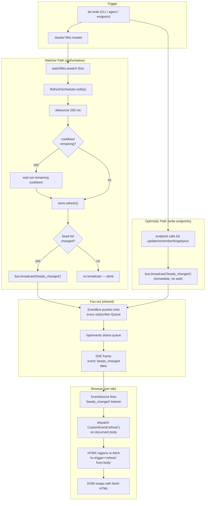

# SSE Live Update

## What Happens

A bead mutation occurs — either externally (a user runs `bd update` in a
terminal) or internally (a write endpoint like `POST /api/bead/{id}/field`
shells out to `bd update`). The change propagates through five layers and
arrives in every open browser tab as a re-rendered HTMX partial, without a
page reload, without polling, and without any client-side state diffing.

This is the **live-sync pipeline** — the end-to-end path that delivers
bdboard's "edit a bead anywhere and every tab updates within a second"
promise. Two parallel paths feed the same bus:

1. **Watcher path (authoritative):** `.beads/` files mutate →
   `watchfiles.awatch` fires → `RefreshScheduler` debounces (250 ms) then
   waits out any cooldown (1 s) → `store.refresh()` re-fetches `bd list
   --json` → compares with the cached snapshot → iff a bead changed,
   `bus.broadcast("beads_changed")`.
2. **Optimistic path (low-latency):** the four write endpoints
   (`api_bead_field_update`, `api_memory_create`, `api_memory_delete`,
   `api_formula_pour`) call `bus.broadcast("beads_changed")` **immediately**
   after their `bd` mutation so the acting tab updates without waiting out
   the watcher's debounce+cooldown.

From the bus onward the paths converge: `EventBus` pushes `"beads_changed"`
onto every per-subscriber `asyncio.Queue` → the `/api/events` handler drains
each queue and writes an SSE frame → the browser's `EventSource` fires its
`beads_changed` listener → a synthetic `CustomEvent('refresh')` is dispatched
on `<body>` → every HTMX region wired with
`hx-trigger="load, refresh from:body"` re-fetches its HTML partial → the DOM
swaps and the user sees fresh data.

## Trigger

**Any `beads_changed` broadcast on the `EventBus`.** This happens in exactly
two situations:

1. **Watcher broadcasts** — the filesystem watcher detected a `.beads/`
   mutation, `RefreshScheduler` debounced and cooled down, `store.refresh()`
   confirmed the bead list actually changed, and
   `bus.broadcast("beads_changed")` fires. This covers *all* mutations — CLI,
   agent, external tools — and is the authoritative path. The broadcast is
   gated on `changed = True` from `store.refresh()`, so spurious FS churn
   (e.g. the watcher's own read echoing back) does not fire a redundant
   refresh.

2. **Optimistic broadcasts** — the four write endpoints in `app.py` broadcast
   immediately after their `bd` write, before the watcher has time to notice
   the filesystem change. This gives the acting tab sub-100 ms latency instead
   of the ~1.25 s debounce+cooldown. When the watcher catches up later,
   `store.refresh()` finds the bead list already matches (because the
   optimistic path already served fresh data), returns `False`, and **no
   redundant broadcast fires** — the two paths reconcile, not duplicate.

## Outcome

- Every open browser tab re-fetches the HTMX partials wired to
  `hx-trigger="load, refresh from:body"`.
- The dashboard's counts strip (`#counts`) and swim lanes (`.lanes-region`)
  reflect the new bead state.
- The history page's `#history-region` and the memory page's `#memory-list`
  re-render if those pages are open.
- The masthead's live indicator stays `live · push` / `live-on` as long as
  the SSE stream is healthy.
- No full-page reload. No polling. No client JS state management. No diff
  payload — just a "go re-read" trigger and HTMX does the rest.



## Step-by-Step

| # | What | Where (file:symbol) | Failure mode |
| --- | --- | --- | --- |
| 1 | **Trigger** — a `bd` mutation writes files under `.beads/embeddeddolt/<db>/.dolt/noms/` (manifest, journal.idx, lock, object files). A single `bd update` typically writes 3–5 files in quick succession. | External (`bd` CLI) or `src/bdboard/bd.py`:`BdClient.update_field` / `remember` / `forget` / `pour_formula` | If `bd` itself fails the write never lands and no files change — no watcher fire. |
| 2 | **FS detection** — `watchfiles.awatch` (backed by kqueue on macOS, inotify on Linux) reports a batch of `(change, path)` events from the small, fixed set of watched directories (`bd.watch_targets()`). Non-recursive watch to avoid fd exhaustion. | `src/bdboard/app.py`:`_watch_beads` → `watchfiles.awatch` | `FileNotFoundError` if `.beads/` vanishes → caught, sleep 2 s, retry. General exception → logged, sleep 2 s, retry. |
| 3 | **Notify** — the watcher loop calls `scheduler.notify()` for each batch. If a refresh is already in flight (`_refreshing = True`), notify only sets `_dirty = True` and returns — it does NOT cancel the running subprocess (bdboard-ywep fix). Otherwise it cancels any pending settle task and starts a fresh one. | `src/bdboard/watcher.py`:`RefreshScheduler.notify` | Cannot fail — schedules a task or flips a flag. |
| 4 | **Debounce** — the settle task sleeps for `WATCHER_DEBOUNCE_S` (250 ms). If a new event arrives during the sleep, the task is cancelled and a new one starts — this collapses a 3–5 file burst into a single refresh. | `src/bdboard/watcher.py`:`RefreshScheduler._settle` | `CancelledError` → silently absorbed (a newer event owns the next refresh). |
| 5 | **Cooldown wait** — after debounce, the settle task checks whether the post-refresh cooldown (`WATCHER_COOLDOWN_S` = 1 s) from the *previous* refresh has elapsed. If not, it sleeps out the remaining cooldown rather than dropping the event (bdboard-xbc7 fix). | `src/bdboard/watcher.py`:`RefreshScheduler._settle` | `CancelledError` → silently absorbed. |
| 6 | **Revision skip** — `store.refresh()` reads `bd.revision_signature()` (dolt manifest root hashes). If the signature matches the last refresh and both caches are populated, the committed state is byte-identical, so the expensive `bd list` subprocess is skipped and `False` (no change) is returned. This breaks the refresh→read→event→refresh self-feedback loop (bdboard-ywep). | `src/bdboard/store.py`:`Store.refresh`; `src/bdboard/bd.py`:`BdClient.revision_signature` | Empty signature (legacy JSONL workspace, no dolt) → never skips, falls through to step 7. |
| 7 | **Re-fetch** — `store.refresh()` shells out `bd list --json` twice (active + closed) via `BdClient.list_active()` and `BdClient.list_closed()`, serialized on `_subprocess_gate` (`asyncio.Semaphore(1)`). Each has a `LIST_TIMEOUT_S` timeout. If the history cache was previously lazy-loaded, it is also re-fetched with the same `closed_after` cutoff it was originally loaded with. | `src/bdboard/store.py`:`Store.refresh`; `src/bdboard/bd.py`:`BdClient.list_active`, `BdClient.list_closed`, `BdClient.list_closed_history` | `bd list` failure → exception logged, previous cache preserved (stale but not empty), `False` returned. Cooldown NOT advanced so next event retries promptly. |
| 8 | **Change detection** — structural equality (`prev == new`) on the active and closed bead lists. Python's `==` on `list[dict]` compares every field of every bead — O(n) and cheap for typical workspace sizes. If both lists are identical, `False` is returned and no broadcast fires. | `src/bdboard/store.py`:`Store.refresh` | Cannot fail — Python `==` on dicts is deterministic. |
| 9 | **Cache update + invalidation** — on a real change, `Store` replaces the active/closed `_Snapshot`s (beads + by_id index), then calls `bd.invalidate_caches()` to drop per-bead show/history/memories/status caches so follow-up modal opens and SSE-triggered re-fetches serve post-mutation data. | `src/bdboard/store.py`:`Store.refresh`; `src/bdboard/bd.py`:`BdClient.invalidate_caches` | Cannot fail (dict `.clear()` + attribute assignment). |
| 10 | **Broadcast** — `bus.broadcast("beads_changed")` pushes the bare string `"beads_changed"` onto every subscriber's bounded `asyncio.Queue` (`_QUEUE_SIZE = 16`). Full queues drop the oldest event to make room (lossy but non-blocking — a slow tab cannot back up the broadcaster). | `src/bdboard/events.py`:`EventBus.broadcast` | `QueueFull` after drop → warning logged, event lost for that subscriber. Safe: the next event triggers the same full re-fetch. |
| 11 | **SSE framing** — the `/api/events` handler's `stream()` generator calls `await q.get()` (with a 15 s timeout for heartbeat). On receiving `"beads_changed"`, it yields `event: beads_changed\ndata: <unix_ts>\n\n`. The `data` value is inert — the client ignores it. | `src/bdboard/app.py`:`sse_events` (stream inner generator) | `TimeoutError` (15 s idle) → yields `: heartbeat\n\n` comment line (keep-alive, no client handler fires). Client disconnect → `request.is_disconnected()` breaks the loop; `subscribe().__aexit__` auto-removes the queue from `_subscribers`. |
| 12 | **Client dispatch** — the browser's `EventSource('/api/events')` fires its `beads_changed` event listener, which calls `document.body.dispatchEvent(new CustomEvent('refresh'))`. This synthetic DOM event bubbles to every ancestor. | `src/bdboard/templates/base.html`: EventSource IIFE | `EventSource` auto-reconnects with built-in exponential backoff on connection loss — the live indicator flips to `reconnecting…` / `live-off` until restored. |
| 13 | **HTMX re-fetch** — every region with `hx-trigger="load, refresh from:body"` re-issues its `hx-get` request (e.g. `GET /api/lanes`, `GET /api/counts`, `GET /api/history`, `GET /api/memory`). The server returns fresh HTML partials; HTMX swaps the content in-place with `hx-swap="innerHTML"`. | `src/bdboard/templates/dashboard.html` (`.lanes-region`, `#counts`); `src/bdboard/templates/history.html` (`#history-region`); `src/bdboard/templates/memory.html` (`#memory-list`); `src/bdboard/templates/partials/lanes.html` | Partial endpoint failures → HTMX handles per its error config; the page does not crash. Other regions still update independently. |

## Data Transformations

**Watcher path: FS events → "should we broadcast?"**

```
Input:   set of (change_type, file_path) from watchfiles
               ↓
         RefreshScheduler.notify() — just a flag flip, no data
               ↓
         store.refresh()
               ↓
         bd.revision_signature() → frozenset[tuple[str, bytes]]
         (manifest root hashes — changes IFF committed dolt state changes)
               ↓
         If unchanged → return False (no broadcast)
         If changed  → bd list_active() + list_closed()
               ↓
Output:  bool (True = bead list changed → broadcast)
```

**Bus → SSE wire**

```
Input:   bare string "beads_changed"
               ↓
         EventBus.broadcast pushes onto N subscriber Queues
               ↓
         sse_events stream() yields:
         "event: beads_changed\ndata: 1748900042\n\n"
               ↓
Output:  text/event-stream frame on the wire
```

**Client → HTMX**

```
Input:   SSE frame "event: beads_changed\ndata: ...\n\n"
               ↓
         EventSource fires 'beads_changed' listener
               ↓
         document.body.dispatchEvent(new CustomEvent('refresh'))
               ↓
         HTMX regions re-fetch their hx-get endpoints
               ↓
Output:  fresh HTML partials swapped into the DOM
```

> [!NOTE]
> The event carries **no data payload** — just the bare string
> `"beads_changed"`. The canonical data comes from re-fetching the endpoint
> partials. This keeps the bus decoupled from every view's shape (DRY:
> rendering logic lives in one place — the partial endpoints).

## Performance Characteristics

| Aspect | Detail |
| --- | --- |
| **Watcher latency** | ~250 ms debounce + up to 1 s cooldown = worst-case ~1.25 s from the last file write to the broadcast. In practice, most single `bd update` commands settle in <500 ms. |
| **Optimistic latency** | Near-zero: the four write endpoints broadcast immediately after the `bd` subprocess returns (no debounce, no cooldown). The acting tab sees the update within the time it takes to re-fetch the HTMX partial (~50–100 ms). |
| **Reconciliation** | The watcher catches up ~1 s later and finds `store.refresh()` returns `False` (the optimistic path already served the fresh data). No redundant broadcast, no double re-fetch. |
| **Self-feedback prevention** | `revision_signature()` hashes the dolt manifest on disk (stat, not read). If `bd list` only jiggled noms/ without changing committed state, the signature is unchanged and `store.refresh()` skips the subprocess entirely — breaking the refresh→read→event→refresh loop (bdboard-ywep). |
| **Fan-out cost** | O(N) per broadcast where N = subscriber count. At real scale (a handful of browser tabs), this is trivial. |
| **Backpressure** | Per-subscriber queues are bounded at 16. A tab that falls >16 events behind drops its oldest event — lossy but safe. Every `beads_changed` triggers the same full re-fetch, so a dropped event is a freshness blip the next event heals. |
| **Heartbeat** | 15 s idle interval keeps proxies from culling the long-lived SSE stream. Heartbeats are SSE comment lines (`: heartbeat`) — no client handler fires. |
| **Subprocess serialization** | All `bd` reads/writes are gated on `_subprocess_gate` (`asyncio.Semaphore(1)`) because bd's embedded Dolt is single-writer. Concurrent refresh calls queue, not race. |
| **No polling** | The entire pipeline is push-based. Zero periodic HTTP requests from the client. EventSource auto-reconnects with built-in exponential backoff on disconnect. |

## Failure Handling

| Stage | Failure | Behavior |
| --- | --- | --- |
| FS detection (step 2) | `.beads/` directory vanishes | `FileNotFoundError` caught → sleep 2 s → retry the outer `while True` loop. Board shows stale data until the directory reappears. |
| FS detection (step 2) | Unexpected exception | Logged with traceback → sleep 2 s → restart the watcher loop. |
| Target re-enumeration | noms/ inode replaced (dolt atomically swaps dirs) | `_rescan_targets` polls `bd.watch_signature()` every 3 s. If the target set's inode identity changes, it trips `awatch`'s `stop_event`, forcing a clean re-enumeration on the next loop iteration (bdboard-xbc7 root cause #2). |
| Debounce / cooldown sleep (steps 4–5) | `CancelledError` (newer event arrived) | Silently absorbed — the newer event owns the next settle cycle. |
| Refresh subprocess (step 7) | `bd list --json` fails (non-zero exit, timeout) | Exception logged; previous cache preserved (stale-but-present); `False` returned (no broadcast). Crucially, the cooldown clock is NOT advanced, so the next notify retries promptly instead of being swallowed by cooldown (bdboard-xbc7 root cause #3). |
| Refresh during cooldown | Event lands inside cooldown window | Event is NOT dropped. The settle task waits out the remaining cooldown and then refreshes — the core bdboard-xbc7 fix. |
| Refresh cancelled mid-subprocess (step 3) | Self-induced FS event from own `bd list` read | notify() during `_refreshing = True` only sets `_dirty`, does NOT cancel the running refresh. After the refresh completes, a reconcile pass fires (bdboard-ywep fix). |
| Broadcast (step 10) | Subscriber queue full (>16 events behind) | Oldest event dropped; newest enqueued. Warning logged. Safe — every event triggers the same full re-fetch. |
| SSE connection (step 11) | Client disconnects (tab close, navigation) | `request.is_disconnected()` → loop breaks. `subscribe().__aexit__` discards the queue from `_subscribers`. Clean, no leak. |
| SSE connection (step 11) | Server restart | `EventSource` auto-reconnects with exponential backoff. Live indicator flips to `reconnecting…` / `live-off` and heals within a few seconds. On reconnect, the bootstrap event triggers an immediate re-fetch. |
| HTMX re-fetch (step 13) | Partial endpoint failure (500, timeout) | HTMX error handling applies per the app's `htmx:beforeSwap` config. Other regions update independently — a failure in `/api/counts` does not block `/api/lanes`. |

> [!WARNING]
> **History page filter snap-back** (bdboard-li44): the history region's
> `hx-trigger="load, refresh from:body"` fires on *every* SSE `beads_changed`
> event. If the `hx-get` is a bare `/api/history` (no query params), the
> server returns the **default 30-day window**, discarding any user-selected
> range or custom dates. The `base.html` URL-preservation script injects the
> current `range` and `page_size` params into bare `refresh from:body`
> re-fetches to prevent this snap-back.

> [!IMPORTANT]
> The watcher path and optimistic path **reconcile, not duplicate**. The
> optimistic broadcast fires immediately; when the watcher catches up
> ~1 s later, `store.refresh()` finds the bead list unchanged and returns
> `False` — suppressing the redundant broadcast. If you add a new write
> endpoint that broadcasts optimistically, the watcher still reconciles
> correctly because change detection is structural (`prev == new`).

## Key Log Messages

| Log line | Where | Means |
| --- | --- | --- |
| `watcher started for %s` | `src/bdboard/app.py`:`lifespan` | The `_watch_beads` background task launched successfully, watching the given `.beads/` path. |
| `watcher observing %d target(s) (non-recursive): %s` | `src/bdboard/app.py`:`_watch_beads` | The watcher resolved its watch target directories (dolt noms/ dirs). Logged on each (re-)enumeration. |
| `watcher targets changed; re-enumerating` | `src/bdboard/app.py`:`_watch_beads` | The `_rescan_targets` poller detected an inode change (dolt replaced a noms/ dir) and triggered a clean re-enumeration. |
| `watcher crashed; restarting in 2s` | `src/bdboard/app.py`:`_watch_beads` | Unexpected exception in the watcher loop — logged with traceback, sleeping before retry. |
| `watcher: refresh raised; will retry on next change` | `src/bdboard/watcher.py`:`RefreshScheduler._settle` | `store.refresh()` threw an exception (transient `bd list` failure). Cooldown NOT advanced — next event retries promptly. |
| `store: bd list failed; keeping previous snapshot` | `src/bdboard/store.py`:`Store.refresh` | `bd list_active()` or `list_closed()` raised; the existing cache is preserved to avoid flashing an empty board. |
| `event bus subscriber queue is hot; event lost` | `src/bdboard/events.py`:`EventBus.broadcast` | A subscriber's queue was still full even after dropping the oldest event — the event is lost for that tab. Indicates a severely stalled client. |

## Common Issues

| Symptom | Likely cause | Fix |
| --- | --- | --- |
| Board doesn't update after a `bd update` in the terminal | The watcher's debounce+cooldown hasn't elapsed yet (~1.25 s worst case). If it persists, the watcher may have crashed — check the log for `watcher crashed; restarting in 2s`. | Wait ~2 s. If still stale, check the log and restart bdboard. |
| Live indicator says "reconnecting…" / `live-off` | SSE connection dropped (server restart, network hiccup). `EventSource` auto-reconnects with exponential backoff. | Wait a few seconds for auto-reconnect. If it stays off, check that the server is running and accessible. |
| Board updates on the acting tab but not on other tabs | The optimistic broadcast fired and reached the acting tab, but the watcher path is broken (not broadcasting). Check whether `store.refresh()` is consistently returning `False` (revision-skip or stale cache). | Check the log for `store: bd list failed` or `watcher: refresh raised`. If the revision signature is stuck, there may be a dolt corruption — restart bdboard. |
| All tabs update twice in quick succession after a write endpoint edit | Both the optimistic broadcast (immediate) and the watcher broadcast (delayed ~1 s) fired change events. This means `store.refresh()` found a difference, which usually means the optimistic path didn't refresh the store first. | For field edits (`api_bead_field_update`) the store is NOT explicitly refreshed before broadcast (unlike the pour path). The watcher catches up and reconciles. A transient double-refresh is expected and harmless — if persistent, verify `invalidate_caches()` is being called after the write. |
| History page snaps back to "30 days" on every SSE event | The `base.html` URL-preservation script is not injecting `range`/`page_size` into the bare `refresh from:body` re-fetch (bdboard-li44). | Check that the `htmx:configRequest` listener in `base.html` is present and correctly reads the URL's query params. |
| `bd` writes while the board is open seem to freeze the board | Self-feedback loop: `bd list` echoes back noms/ writes, triggering the watcher, which cancels the in-flight refresh (pre-bdboard-ywep bug). The fix: notify() during `_refreshing` only flips `_dirty`, plus the revision-skip prevents the loop from spinning. | Verify you're on the patched code (RefreshScheduler has `_refreshing` and `_dirty` attributes). If the freeze persists, check whether `revision_signature()` is returning `None` (no dolt) — in that case the skip path is disabled and the loop can spin. |

## Related

- [GET /api/events](../Endpoints/GetApiEvents.md) — the SSE endpoint that
  implements the server→browser push (step 11); documents the wire frame
  format, heartbeat, and backpressure.
- [SSE Event Bus](../Concepts/SseEventBus.md) — the `EventBus` pub/sub that
  powers step 10 (fan-out to per-subscriber queues); documents the
  drop-oldest backpressure policy and broadcast conventions.
- [Filesystem Watcher](../Concepts/FilesystemWatcher.md) — the upstream
  trigger (steps 2–5): watch targets, debounce, cooldown, self-feedback
  prevention.
- [Store Snapshot & Change Detection](../Concepts/StoreSnapshotChangeDetection.md)
  — the `store.refresh()` that drives steps 6–9: revision skip, structural
  change detection, cache update.
- [Subprocess Serialization & Caching](../Concepts/SubprocessSerializationAndCaching.md)
  — the `_subprocess_gate` semaphore that serializes the `bd list` calls in
  step 7 and the per-bead caches invalidated in step 9.
- [bd CLI as Source of Truth](../Concepts/BdCliSourceOfTruth.md) — why the
  pipeline re-fetches from `bd list --json` on every change rather than
  diffing files directly.
- [CSRF Protection](../Concepts/CsrfProtection.md) — the guard that fronts
  each of the four write endpoints before they reach their optimistic
  broadcast.
- [Board (/)](../Views/BoardView.md) — the dashboard whose `.lanes-region`
  and `#counts` are the primary consumers of `refresh from:body`.
- [History (/history)](../Views/HistoryView.md) — the history page whose
  `#history-region` re-fetches on `refresh from:body`.
- [Memory (/memory)](../Views/MemoryView.md) — the memory page whose
  `#memory-list` re-fetches on `refresh from:body`.
- [GET /api/lanes](../Endpoints/GetApiLanes.md) — the active swim lanes
  partial re-fetched on each SSE-driven refresh.
- [GET /api/lanes/closed](../Endpoints/GetApiLanesClosed.md) — the closed
  lane partial, also re-fetched on `refresh from:body`.
- [GET /api/counts](../Endpoints/GetApiCounts.md) — the masthead counts
  strip, re-fetched on `refresh from:body`.
- [GET /api/history](../Endpoints/GetApiHistory.md) — the history partial,
  re-fetched on `refresh from:body`.
- [GET /api/memory](../Endpoints/GetApiMemory.md) — the memory list partial,
  re-fetched on `refresh from:body`.
- [POST /api/bead/{id}/field](../Endpoints/PostApiBeadField.md) — one of the
  four write endpoints that broadcasts on the optimistic path.
- [POST /api/memory](../Endpoints/PostApiMemory.md) — optimistic broadcaster.
- [DELETE /api/memory/{key}](../Endpoints/DeleteApiMemory.md) — optimistic
  broadcaster.
- [POST /api/formulas/{name}/pour](../Endpoints/PostApiFormulaPour.md) —
  optimistic broadcaster.
- [Watcher Refresh Cycle](index.md) — sibling flow documenting
  the watcher's debounce → cooldown → refresh → broadcast cycle in isolation.
- [Field Edit Write Path](FieldEditWritePath.md) — sibling flow that includes
  an optimistic broadcast as its step 10.
- [Formula Pour Pipeline](FormulaPourPipeline.md) — sibling flow that includes
  a store refresh + optimistic broadcast as its steps 10–11.
- [Flows index](index.md)
- [Back to docs index](../index.md)
