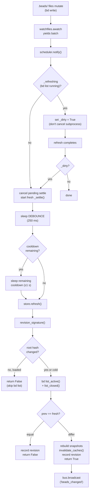

# Watcher Refresh Cycle

## What Happens

A `bd` mutation writes files under `.beads/embeddeddolt/<db>/.dolt/noms/`
(manifest, journal.idx, lock, object files). The filesystem watcher
(`watchfiles.awatch`) detects the change; the `RefreshScheduler` collapses the
multi-file burst into a single debounced settle, waits out any post-refresh
cooldown, then calls `store.refresh()`. The Store compares the dolt manifest
root-hash signature against the last refresh — if the committed state is
byte-identical (our own read echoing back), it skips the expensive `bd list`
subprocess entirely. Otherwise it re-fetches active + closed bead lists,
structurally compares them against the cached snapshot, and returns `True` iff
something actually changed. On a real change the scheduler broadcasts
`beads_changed` on the SSE `EventBus`, triggering every connected browser tab
to re-fetch its HTMX partials.

This is the **authoritative refresh path** — every external `bd` mutation (CLI,
agent, external tool) reaches the dashboard through this cycle. It is the
watcher's perspective of the larger [SSE Live Update](SseLiveUpdate.md)
pipeline, isolated into the lifecycle of a single filesystem event from
detection to conditional broadcast.

## Trigger

**Any file write inside the watched `.beads/` directories** that
`watchfiles.awatch` detects. In practice this means:

- A `bd update`, `bd create`, `bd close`, `bd remember`, `bd forget`, or
  `bd formula pour` command writing to the dolt object store under
  `.beads/embeddeddolt/<db>/.dolt/noms/`.
- A single `bd update` typically writes 3–5 files (manifest, journal.idx, lock,
  object files) in quick succession — each file write fires a separate event
  batch, but the debounce collapses them into one refresh.
- The watcher's own `bd list --json` read jiggling `noms/` files (self-feedback
  — caught and severed by the revision-signature skip).

The watcher observes a **small, fixed set of directories NON-recursively**
(`bd.watch_targets()` — the per-db `noms/` dirs plus `.beads/` itself). A
recursive whole-tree watch would exhaust `RLIMIT_NOFILE` on macOS against
dolt's churning object store and crash subprocess spawning with
`OSError [Errno 24]`.

## Outcome

- The in-memory `Store` caches (active, board-closed, and — if previously
  lazy-loaded — history-closed) reflect the post-mutation bead state.
- Per-bead detail caches (`show`, `history`, `memories`, `status`) are
  invalidated so follow-up modal opens serve fresh data.
- A `beads_changed` event is broadcast on the `EventBus` **iff** the bead data
  actually changed — spurious FS churn, self-feedback echoes, and
  memory-only `bd remember` writes that don't alter bead fields produce no
  broadcast.
- The cooldown clock advances only on a **successful** refresh, so a transient
  `bd list` failure does not wedge the next event into cooldown.



## Step-by-Step

| # | What | Where (file:symbol) | Failure mode |
| --- | --- | --- | --- |
| 1 | **Target enumeration** — `_watch_beads()` resolves the watch target directories via `bd.watch_targets()`: the per-db `noms/` dirs under `.beads/embeddeddolt/` plus `.beads/` itself. Targets are enumerated once before entering `awatch`. | `src/bdboard/app.py`:`_watch_beads`; `src/bdboard/bd.py`:`BdClient.watch_targets` | Empty target list (`.beads/` absent) → sleep 2 s, retry. |
| 2 | **Baseline fingerprint** — record `bd.watch_signature()` (frozenset of `(path, st_dev, st_ino)` for each target) as the identity baseline for the rescan poller. | `src/bdboard/app.py`:`_watch_beads`; `src/bdboard/bd.py`:`BdClient.watch_signature` | `OSError` on individual `stat()` → tuple omitted (partial signature is safe). |
| 3 | **Rescan poller start** — `_rescan_targets(baseline, stop_event)` launches as a background task, polling `watch_signature()` every `WATCHER_RESCAN_S` (3 s). If the signature changes (new db, inode swap), it sets `stop_event`, forcing `awatch` to exit and re-enumerate targets on the next loop iteration. | `src/bdboard/app.py`:`_rescan_targets` | Transient `stat()` failure → `log.debug`, retry on next poll. |
| 4 | **FS detection** — `watchfiles.awatch(*targets, recursive=False, stop_event=stop_event)` yields a batch of `(change, path)` events. The `recursive=False` keeps the fd count fixed and small (one fd per target dir, not per subdirectory in the dolt object store). | `src/bdboard/app.py`:`_watch_beads` → `watchfiles.awatch` | `FileNotFoundError` (`.beads/` vanishes) → sleep 2 s, retry. General exception → logged, sleep 2 s, restart loop. |
| 5 | **Notify** — for each batch, the loop calls `scheduler.notify()`. If a refresh is already in flight (`_refreshing = True`), notify only sets `_dirty = True` and returns — it does NOT cancel the running subprocess (bdboard-ywep fix). Otherwise it cancels any pending settle task and starts a fresh one. | `src/bdboard/watcher.py`:`RefreshScheduler.notify` | Cannot fail — schedules a task or flips a flag. |
| 6 | **Debounce** — the settle task sleeps `WATCHER_DEBOUNCE_S` (250 ms). If a newer event arrives during the sleep, the task is cancelled and a fresh one starts — collapsing a 3–5 file burst into a single refresh. | `src/bdboard/watcher.py`:`RefreshScheduler._settle` | `CancelledError` → silently absorbed (newer event owns the next refresh). |
| 7 | **Cooldown wait** — after debounce, the settle checks whether the post-refresh cooldown (`WATCHER_COOLDOWN_S` = 1 s) from the *previous* refresh has elapsed. If not, it sleeps out the remaining cooldown rather than dropping the event (bdboard-xbc7 fix). | `src/bdboard/watcher.py`:`RefreshScheduler._settle` | `CancelledError` → silently absorbed. |
| 8 | **Revision skip** — `store.refresh()` acquires `_refresh_lock`, reads `bd.revision_signature()` (frozenset of `(manifest_path, manifest_bytes)` — dolt root hashes). If the signature matches `_last_revision` and both active + closed caches are populated, the committed state is byte-identical → skip the expensive `bd list` subprocess and return `False`. | `src/bdboard/store.py`:`Store.refresh`; `src/bdboard/bd.py`:`BdClient.revision_signature` | Empty signature (no embedded dolt, legacy JSONL workspace) → never skips, falls through to step 9. `OSError` on manifest read → tuple omitted, partial signature means skip can't fire (safe direction). |
| 9 | **Re-fetch** — `bd.list_active()` and `bd.list_closed()` shell out to `bd list --json` (active-only and closed-with-date-window respectively), serialized on `_subprocess_gate` (`asyncio.Semaphore(1)`), each with `LIST_TIMEOUT_S` (15 s). If the history cache was previously lazy-loaded, it is also re-fetched with the same `_history_cutoff` it was originally loaded with. | `src/bdboard/store.py`:`Store.refresh`; `src/bdboard/bd.py`:`BdClient.list_active`, `BdClient.list_closed`, `BdClient.list_closed_history` | `bd list` failure → exception logged, previous cache preserved (stale-but-present), `False` returned. Cooldown NOT advanced so next event retries promptly (bdboard-xbc7 root cause #3 fix). |
| 10 | **Change detection** — structural equality (`prev == new`) on the active and closed bead lists. `bd list --json` returns deterministically-sorted lists of dicts, so Python's `==` directly answers "did any issue field change". O(n) and cheap at workspace scale. | `src/bdboard/store.py`:`Store.refresh` | Cannot fail — Python `==` on dicts is deterministic. |
| 11 | **Cache update + invalidation** — on a real change, `Store` replaces the active/closed `_Snapshot`s (new `beads` list + pre-built `by_id` index), refreshes the history snapshot if loaded, then calls `bd.invalidate_caches()` to drop per-bead show/history/memories/status caches. Records `_last_revision` so the next identical-state event can take the skip path. | `src/bdboard/store.py`:`Store.refresh`; `src/bdboard/bd.py`:`BdClient.invalidate_caches` | Cannot fail (dict `.clear()` + attribute assignment). |
| 12 | **Cooldown advance** — `RefreshScheduler` records `_last_refresh_at = monotonic()` only after a **successful** `refresh()` call (no exception). A failed refresh does not advance the clock, so the next notify retries promptly. | `src/bdboard/watcher.py`:`RefreshScheduler._settle` | — |
| 13 | **Conditional broadcast** — iff `refresh()` returned `True`, the scheduler calls `bus.broadcast("beads_changed")`, pushing the bare string onto every per-subscriber `asyncio.Queue`. | `src/bdboard/events.py`:`EventBus.broadcast` | `QueueFull` after drop → warning logged, event lost for that subscriber. Safe: next event triggers the same re-fetch. |
| 14 | **Dirty reconcile** — if `_dirty` was set during the refresh (an event arrived mid-subprocess), the scheduler schedules exactly one more settle cycle. When the event was just the self-induced read echo, the next refresh hits the revision-skip path and is cheap. | `src/bdboard/watcher.py`:`RefreshScheduler._settle` | Cannot fail — `asyncio.create_task` on another `_settle`. |

## Data Transformations

**FS events → notify flag (steps 4–5)**

```
Input:   set of (change_type, file_path) from watchfiles
         e.g. {(Change.modified, ".beads/embeddeddolt/bdboard/.dolt/noms/manifest"),
               (Change.added,    ".beads/embeddeddolt/bdboard/.dolt/noms/journal.idx")}
               ↓
         _watch_beads discards the batch contents — only the FACT matters
               ↓
Output:  scheduler.notify() — no data, just a "something changed" signal
```

**Revision signature (step 8)**

```
Input:   .beads/embeddeddolt/<db>/.dolt/noms/manifest files on disk
               ↓
         bd.revision_signature() reads each (~150 bytes, dolt root hash)
               ↓
Output:  frozenset[tuple[str, bytes]]
         e.g. frozenset({(".beads/embeddeddolt/bdboard/.dolt/noms/manifest",
                          b"5:datas-m9kc...|root-4vje...\n")})
               ↓
         compared against Store._last_revision
               ↓
         unchanged → skip (return False, no subprocess)
         changed   → proceed to re-fetch
```

**Re-fetch → change detection (steps 9–10)**

```
Input:   bd list --json (active) → list[dict]
         bd list --json (closed) → list[dict]
         Each dict carries real bd fields:
         {"id": "bdboard-x", "title": "...", "status": "open",
          "priority": 2, "created_at": "2026-06-05T...", ...}
               ↓
         Store compares prev_active == fresh_active,
                         prev_closed == fresh_closed
               ↓
Output:  bool (True = at least one list changed → broadcast)
```

**Cache rebuild (step 11)**

```
Input:   fresh bead list (list[dict])
               ↓
         _Snapshot(
             beads=fresh,
             by_id={b["id"]: b for b in fresh if isinstance(b.get("id"), str)}
         )
               ↓
Output:  immutable snapshot with O(1) bead-by-id index
```

> [!NOTE]
> The watcher carries **no bead data** through the notify→debounce→cooldown
> path. The `RefreshScheduler` is purely a timing gate — it knows only "an
> event happened" and "did refresh report a change". All data flows through
> `Store.refresh()`, which reads `bd list --json` fresh each time.

## Performance Characteristics

| Aspect | Detail |
| --- | --- |
| **Debounce** | 250 ms trailing quiet-window. Collapses a single `bd update`'s 3–5 file burst (spanning 2–3 `watchfiles` batches over ~50–150 ms) into one refresh. Comfortably longer than the burst, far shorter than human perception. |
| **Cooldown** | 1 s post-refresh suppression. Paces the refresh cadence under a sustained write storm (dolt commit + auto-export fan-out + git-add hook). A settle that lands inside cooldown waits out the remainder — it does NOT drop the event. |
| **Worst-case latency** | ~1.25 s from the last file write to the broadcast (250 ms debounce + up to 1 s cooldown). In practice, most single `bd update` commands settle in <500 ms because no previous cooldown is active. |
| **Revision skip cost** | One tiny file read per db (~150 bytes per `.dolt/noms/manifest`). No subprocess, no dolt lock contention. Fires on every self-induced echo (~1.3 s after each real refresh). |
| **Subprocess serialization** | All `bd list` calls are gated on `BdClient._subprocess_gate` (`asyncio.Semaphore(1)`) because dolt's embedded store is single-writer. Concurrent refresh calls queue, not race. |
| **Refresh lock** | `Store._refresh_lock` (`asyncio.Lock`) serializes `refresh()` itself so a burst of watcher events results in exactly one `bd list` — not N parallel ones. |
| **Change detection** | Structural equality (`==`) on `list[dict]`. O(n) where n = number of beads. Cheap at expected workspace sizes (dozens to low hundreds of beads). |
| **Watch fd count** | Fixed and small: one fd per `noms/` dir + one for `.beads/` itself (typically 2–3 total). The recursive watch it replaced opened one fd per directory in the whole `.beads/` tree (hundreds), exhausting `RLIMIT_NOFILE`. |
| **Target rescan** | Every 3 s, a handful of `stat()` calls. Catches new dbs and inode swaps without a process restart. |
| **No polling** | The entire pipeline is push-based (kqueue/inotify → event → refresh). Zero periodic `bd list` calls. |

## Failure Handling

| Stage | Failure | Behavior |
| --- | --- | --- |
| Target enumeration (step 1) | `.beads/` directory absent | `watch_targets()` returns empty → sleep 2 s, retry the outer loop. Board shows stale (or empty, on first boot) data until the directory appears. |
| FS detection (step 4) | `FileNotFoundError` (`.beads/` vanishes mid-watch) | Caught → sleep 2 s → restart the watcher loop. |
| FS detection (step 4) | Unexpected exception | Logged with traceback → sleep 2 s → restart. The watcher is designed to be crash-resilient — the outer `while True` loop never exits. |
| Target identity change (step 3) | noms/ inode replaced (dolt atomically swaps dirs) or new db appears | `_rescan_targets` polls `watch_signature()` every 3 s. If the target set's `(path, st_dev, st_ino)` identity changes, it trips `awatch`'s `stop_event`, forcing a clean re-enumeration on the next loop iteration (bdboard-xbc7 root cause #2 fix). |
| Debounce/cooldown sleep (steps 6–7) | `CancelledError` (newer event arrived) | Silently absorbed — the newer event owns the next settle cycle. |
| Revision signature (step 8) | `OSError` on manifest read | Tuple omitted from the frozenset. A partial signature means the skip can't fire — safe direction (refresh rather than miss a change). |
| Re-fetch (step 9) | `bd list --json` fails (non-zero exit, timeout) | Exception logged; previous cache preserved (stale but not empty); `False` returned (no broadcast). Cooldown NOT advanced so next notify retries promptly (bdboard-xbc7 root cause #3 fix). |
| Re-fetch (step 9) | History re-fetch fails while active/closed succeeded | History exception logged separately; active/closed caches are still updated. The History page keeps its previous snapshot. |
| Refresh cancelled mid-subprocess (step 5) | Self-induced FS event from own `bd list` read (~1.3 s later) | `notify()` during `_refreshing = True` only sets `_dirty`, does NOT cancel the running refresh. After the refresh completes, a reconcile pass fires if `_dirty` is set (bdboard-ywep fix). |
| Broadcast (step 13) | Subscriber queue full (>16 events behind) | Oldest event dropped; newest enqueued. Warning logged. Safe — every event triggers the same full re-fetch. |
| Watcher task crash | Unhandled exception in `_watch_beads` | Logged → sleep 2 s → restart. The `while True` loop is intentionally unkillable except by `CancelledError` from `lifespan` shutdown. |

> [!WARNING]
> **Cooldown on failure is the silent killer.** The pre-fix code (bdboard-xbc7
> root cause #3) advanced `_last_refresh_at` even when `store.refresh()` raised
> — so a transient `bd list` hiccup earned a cooldown it never worked for. The
> very next real event then landed inside that cooldown and was dropped (root
> cause #1), permanently wedging live-sync until an out-of-cooldown write
> appeared. The fix: advance the clock only after a successful refresh.

> [!IMPORTANT]
> **Self-feedback is the other silent killer.** A read-only `bd list` re-touches
> `journal.idx`/`manifest` inside the watched `noms/` dir, so the watcher fires
> for its own read ~1.3 s later. The pre-fix code (bdboard-ywep) cancelled the
> in-flight refresh on every event — including this self-induced one — and
> because `bd list` on a large `noms/` takes LONGER than the self-trigger
> latency, the refresh was cancelled mid-subprocess every time and never
> completed. The fix has two halves: (1) `notify()` during `_refreshing` only
> flips `_dirty` instead of cancelling, and (2) `revision_signature()` lets
> `store.refresh()` skip when the root hash is unchanged.

## Key Log Messages

| Log line | Where | Means |
| --- | --- | --- |
| `watcher started for %s` | `src/bdboard/app.py`:`lifespan` | The `_watch_beads` background task launched successfully on app boot, watching the given `.beads/` path. |
| `watcher observing %d target(s) (non-recursive): %s` | `src/bdboard/app.py`:`_watch_beads` | The watcher resolved its watch target directories. Logged on each (re-)enumeration. |
| `watcher targets changed; re-enumerating` | `src/bdboard/app.py`:`_watch_beads` | The `_rescan_targets` poller detected an inode/identity change and triggered a clean re-enumeration of watch targets. |
| `watcher crashed; restarting in 2s` | `src/bdboard/app.py`:`_watch_beads` | Unexpected exception in the watcher loop — logged with traceback, sleeping before retry. |
| `watcher rescan: signature check failed; retrying` | `src/bdboard/app.py`:`_rescan_targets` | A transient `stat()` hiccup in the rescan poller. Not fatal — retry on next poll. |
| `watcher: refresh raised; will retry on next change` | `src/bdboard/watcher.py`:`RefreshScheduler._settle` | `store.refresh()` threw an exception. Cooldown NOT advanced — next event retries promptly. |
| `watcher stopped` | `src/bdboard/app.py`:`lifespan` | The watcher task was cleanly cancelled during app shutdown. |
| `store: bd list failed; keeping previous snapshot` | `src/bdboard/store.py`:`Store.refresh` | `bd list_active()` or `list_closed()` raised; existing cache preserved to avoid flashing an empty board. |
| `store: bd list_closed_history failed; keeping previous history` | `src/bdboard/store.py`:`Store.refresh` | The history re-fetch failed independently of the active/closed re-fetch. History page keeps its previous snapshot. |

## Common Issues

| Symptom | Likely cause | Fix |
| --- | --- | --- |
| Board doesn't update after a `bd update` in the terminal | The watcher's debounce+cooldown hasn't elapsed yet (~1.25 s worst case). If it persists, the watcher may have crashed. | Wait ~2 s. If still stale, check the log for `watcher crashed; restarting in 2s`. Restart bdboard if the watcher loop is wedged. |
| Board freezes after opening — new beads never appear | Self-feedback loop: `bd list` echoes back noms/ writes, and the old `notify()` cancelled the in-flight refresh every time (pre-bdboard-ywep). On patched code, verify `RefreshScheduler` has `_refreshing` and `_dirty` attributes. If the freeze persists, check whether `revision_signature()` returns an empty frozenset (no dolt) — in that case the skip path is disabled and the loop can spin. | Verify patched code. If `revision_signature()` is empty, the workspace may be a legacy JSONL-only setup — the watcher still works but cannot break self-feedback, so each cycle pays full `bd list` cost. |
| `OSError [Errno 24] Too many open files` on subprocess spawn | Watching `.beads/` recursively (the old bug). Dolt's churning object store creates hundreds of directories; kqueue opens one fd per directory, exhausting `RLIMIT_NOFILE`. | Verify `recursive=False` in the `awatch` call. Check `watch_targets()` returns only the `noms/` dirs + `.beads/`, not the whole tree. |
| Watcher silently stops detecting changes after a `bd` upgrade or dolt db replacement | The `noms/` dir was atomically replaced (new inode), but `awatch` is still watching the old inode. The `_rescan_targets` poller should catch this within 3 s. | Check the log for `watcher targets changed; re-enumerating`. If absent, verify `WATCHER_RESCAN_S` is set and `_rescan_targets` is running. |
| Board shows stale data for ~15 s after a transient `bd list` failure | The refresh failed but the cooldown clock was advanced (pre-bdboard-xbc7 fix). On patched code the cooldown is NOT advanced on failure. | Verify `_last_refresh_at` is only updated after the `try` block succeeds in `_settle()`, not in the `except` or `finally`. |
| Every `bd update` triggers two refreshes in quick succession | The watcher fires for the mutation write, then ~1.3 s later for the `bd list` read echo. On patched code the second refresh should hit the revision-skip and return `False` (no broadcast). | Check that `revision_signature()` is returning non-empty (dolt workspace) and that `_last_revision` is being recorded. If the workspace lacks embedded dolt, double-refresh is expected but harmless. |

## Related

- [SSE Live Update](SseLiveUpdate.md) — the full end-to-end pipeline from
  mutation to DOM swap; this flow covers the watcher's authoritative refresh
  path that feeds the first half of that pipeline.
- Board First Paint ([Flows index](index.md)) — the initial load path; the
  watcher is inactive during first paint but every subsequent live update rides
  this cycle.
- [Field Edit Write Path](FieldEditWritePath.md) — a write-path flow whose
  optimistic broadcast fires immediately; the watcher catches up ~1 s later and
  reconciles (no redundant broadcast).
- [Formula Pour Pipeline](FormulaPourPipeline.md) — another write-path flow
  with an optimistic broadcast; the watcher reconciles the same way.
- [Filesystem Watcher](../Concepts/FilesystemWatcher.md) — the concept doc
  covering conventions, anti-patterns, and the "why" behind non-recursive
  watching, debounce/cooldown, and self-feedback prevention.
- [Store Snapshot & Change Detection](../Concepts/StoreSnapshotChangeDetection.md)
  — the Store that `refresh()` mutates: three caches, lazy loading, revision
  skip, structural change detection.
- [SSE Event Bus](../Concepts/SseEventBus.md) — the `EventBus` that fans out
  the `beads_changed` broadcast to per-subscriber queues.
- [Subprocess Serialization & Caching](../Concepts/SubprocessSerializationAndCaching.md)
  — the `BdClient` layer that owns `_subprocess_gate`, `watch_targets`,
  `watch_signature`, `revision_signature`, and the detail caches invalidated
  on a real change.
- [bd CLI as Source of Truth](../Concepts/BdCliSourceOfTruth.md) — why the
  pipeline re-fetches from `bd list --json` rather than reading `.beads/` files
  directly.
- [GET /api/events](../Endpoints/GetApiEvents.md) — the SSE endpoint that
  consumes the `beads_changed` broadcast and writes it to the wire.
- [GET /api/lanes](../Endpoints/GetApiLanes.md) — the active swim lanes partial
  that re-fetches on every SSE-driven refresh.
- [GET /api/lanes/closed](../Endpoints/GetApiLanesClosed.md) — the closed lane
  partial, also re-fetched on refresh.
- [GET /api/counts](../Endpoints/GetApiCounts.md) — the masthead counts strip,
  re-fetched on refresh.
- [Flows index](index.md)
- [Back to docs index](../index.md)
