# Flow: Inline field-edit write path

## What happens

A maintainer edits **one** field of **one** bead from the bead-detail modal and
the change is committed to the workspace, attributed to the human, fanned out to
every connected tab, and reflected in place — all from a single HTMX form POST.
The acting tab submits `POST /api/bead/{id}/field` carrying the field name, the
new value, an optimistic-lock token, and a CSRF token. The server CSRF-checks
the request, looks the field up in a server-side **registry** to decide whether
it is editable *and* which `bd update` flag to use (the client never picks the
flag), runs two gates against a single **live** read of the bead (a lifecycle
lock and an optimistic-lock precondition), then serializes a `bd update`
subprocess that mutates exactly that field. On success it broadcasts a
`beads_changed` SSE event, re-reads the bead, and returns *just* the
re-rendered field row (plus, for `priority`, an out-of-band header-badge swap)
for an in-place HTMX `outerHTML` swap of `#field-row-<field>`. One save → one
field changed → the row updates and every other tab re-fetches.

## Trigger

A maintainer opens the per-field edit affordance in the bead modal — a native
`
` disclosing either an **inline edit form** (replace-semantics
fields: `title`, `description`, `acceptance_criteria`, `design`, `priority`,
`assignee`, `issue_type`, `external_ref`, `estimate`) or an **Add-a-note form**
(append-only `notes`) — fills the control and clicks **Save** / **Add note**.
Both forms are rendered by the shared `field_form` macro in
[`partials/field_row.html`](../../src/bdboard/templates/partials/field_row.html)
and POST to the same endpoint with identical CSRF + swap-target boilerplate;
only the inner control and the presence of the `expected_updated_at` token
differ. The modal that hosts these rows is itself rendered by the read half of
the feature — see [Endpoint: Bead detail API](../Endpoints/bead-detail-api.md).

## Outcome

On success:

- Exactly one field's VALUE is changed on exactly one bead, committed by a
  serialized `bd update <id> <flag> <value> [--actor …]` subprocess. No shape,
  graph, or lifecycle field can be touched (see [Data Transformations](#data-transformations)).
- The edit is **attributed to the human** via `--actor $BDBOARD_ACTOR` when set,
  so the audit trail does not credit the change to an agent identity.
- bd's per-bead detail cache (and sibling caches) are invalidated so the
  immediate re-read returns post-edit state instead of an up-to-10s-stale
  snapshot.
- A `beads_changed` event is broadcast on the SSE bus, so every connected tab
  re-fetches `/api/lanes` and any open modal reconciles.
- The acting tab receives the freshly re-rendered field row and HTMX swaps it
  `outerHTML` into `#field-row-<field>`, collapsing the editor and announcing
  "Saved." For a `priority` edit, an out-of-band copy of the modal-header
  priority badge is appended so the badge updates in the same swap.

On failure the workspace is left untouched (every pre-mutation gate returns
*before* `bd update` runs; a `bd update` failure is atomic per-field), no
broadcast fires, the row is **never wiped**, and an HTML error fragment with
`role="alert"` is routed into the row's aria-live feedback region. See
[Failure Handling](#failure-handling).

## Diagram

```mermaid
flowchart TD
    A[POST /api/bead/&#123;id&#125;/field<br/>field + value + expected_updated_at + csrf] --> B{_check_csrf}
    B -->|invalid| B1[403 HTTPException]
    B -->|ok| C[_field_spec&#40;field&#41;<br/>registry lookup]
    C -->|not editable / no flag| C1[400 'field is not editable']
    C -->|editable| D{append_only<br/>and blank value?}
    D -->|yes| D1[400 'Nothing to add']
    D -->|no| E[show_long&#40;id, fresh=True&#41;<br/>single LIVE read]
    E -->|read failed| H[skip gates — degrade]
    E -->|bead read| F{_bead_is_editable?}
    F -->|locked: in_progress/closed| F1[403 'no longer open']
    F -->|open| G{expected_updated_at<br/>moved? &#40;non-append&#41;}
    G -->|stale| G1[409 'bead changed, refresh']
    G -->|fresh / no token / append| H
    H --> I[update_field&#40;id, spec.flag, value, --actor&#41;<br/>bd update, serialized]
    I -->|RuntimeError| I1[500 'Could not save: stderr']
    I -->|ok, caches cleared| J[bus.broadcast&#40;'beads_changed'&#41;]
    J --> K[show_long&#40;id&#41; post-edit re-read]
    K -->|row found| L[200 re-rendered field_row.html<br/>+ OOB badge if priority]
    K -->|field filtered out| L2[200 'Saved.' status]
    K -->|unreadable| L3[200 'reopen the bead' nudge]
    J -.SSE fan-out.-> M[Every connected tab<br/>re-fetch /api/lanes]
```

## Step-by-step

| # | What | Where | Failure mode |
| --- | --- | --- | --- |
| 1 | CSRF guard — reject the POST unless the `X-CSRF-Token` header **or** `csrf_token` form field matches the per-process `_CSRF_TOKEN`. | [`app.py:api_bead_field_update`](../../src/bdboard/app.py) → [`app.py:_check_csrf`](../../src/bdboard/app.py) | `403` `HTTPException` ("Invalid or missing CSRF token. Please refresh the page and try again.") — flow stops, nothing mutates. |
| 2 | `field.strip()`, then `_field_spec(field)` resolves the `FieldSpec` from `_FIELD_REGISTRY`. The spec carries `editable`, the exact bd `flag`, the `editor` kind, and `append_only`. A field absent from the registry returns the shared read-only spec. | [`app.py:_field_spec` / `_FIELD_REGISTRY` / `FieldSpec`](../../src/bdboard/app.py) | `400` (`
Field "…" is not editable.
`) if `not spec.editable or not spec.flag`. The client-supplied name can never widen what's editable. |
| 3 | Normalize the value: markdown editors (`md`) keep the raw value verbatim; everything else is `.strip()`ed. For append-only fields (`notes`) reject an empty/whitespace value. | [`app.py:api_bead_field_update`](../../src/bdboard/app.py) | `400` ("Nothing to add.") for an empty append — never sent to bd. |
| 4 | One **LIVE** (`fresh=True`) read of the bead, shared by the next two gates so bd is never double-shelled. `fresh=True` drops the cached entry first so a stale snapshot can't hide a just-claimed status or a moved `updated_at`. | [`bd.py:BdClient.show_long`](../../src/bdboard/bd.py) (`fresh=True`, `SHOW_TIMEOUT_S`) | If the live read fails, both gates are **skipped** (degrade-open) — the registry whitelist already bounds the blast radius to value edits on whitelisted fields. |
| 5 | **Lifecycle gate** — reject ALL field writes (value-edit or append) when the live bead's status is locked: `in_progress` or any closed status. | [`app.py:_bead_is_editable` / `_LOCKED_EDIT_STATUSES`](../../src/bdboard/app.py) (reuses `derive.CLOSED_STATUSES`) | `403` ("This bead is `<status>` and can no longer be edited — only open beads are editable."). Logged `log.info`. |
| 6 | **Optimistic-lock gate** (replace-semantics fields only) — if `expected_updated_at` is present and differs from the live `updated_at`, reject the stale submit. Append-only `notes` is exempt (an append never clobbers); a missing/empty token skips the lock (last-write-wins). | [`app.py:api_bead_field_update`](../../src/bdboard/app.py) | `409` ("This bead changed since you opened it — please refresh and re-apply your edit…"). Logged `log.info`. |
| 7 | Mutate: `bd update <id> <spec.flag> <value> [--actor $BDBOARD_ACTOR]`, serialized on `_subprocess_gate` (bd's embedded Dolt is single-writer). Long markdown (`description`/`design`) is streamed on stdin via `--body-file -` / `--design-file -`. Caches are cleared on success. | [`bd.py:BdClient.update_field`](../../src/bdboard/bd.py) → `_run_mutate` (`UPDATE_TIMEOUT_S = 10s`) | `500` ("Could not save: `<err>`") on non-zero exit (bd's stderr surfaced) or timeout. Workspace untouched on failure. |
| 8 | `bus.broadcast("beads_changed")` fans the change out over SSE to **every** connected tab, which re-fetch `/api/lanes`. | `bus.broadcast` (see [Endpoint: SSE events](../Endpoints/sse-events.md)) | If no listeners, broadcast is a no-op; the acting tab still gets its row. |
| 9 | Post-edit re-read: `show_long(id)` (cache just cleared in step 7). Falls back to `store.snapshot()` + `store.bead(id)` if the live read momentarily fails. | [`bd.py:BdClient.show_long`](../../src/bdboard/bd.py) / [Concept: Store snapshot cache](../Concepts/store-snapshot-cache.md) | If both reads fail: `200` "Saved, but could not refresh — reopen the bead…" (the write committed). |
| 10 | Locate the edited field in `_ordered_fields(bead)` and render `partials/field_row.html` for the in-place swap. If the field is no longer in the rendered set (e.g. cleared to empty and filtered out), return a small `Saved.` `role="status"` acknowledgement instead. | [`app.py:_ordered_fields`](../../src/bdboard/app.py) + [`partials/field_row.html`](../../src/bdboard/templates/partials/field_row.html) | `200` `Saved.` fallback — never an error; the SSE refresh reconciles. |
| 11 | If the edited field is `priority`, append an **out-of-band** render of [`partials/bead_priority_badge.html`](../../src/bdboard/templates/partials/bead_priority_badge.html) (`oob=True`) so the modal-header badge updates in the same response. | [`app.py:api_bead_field_update`](../../src/bdboard/app.py) | — (terminal success step). |

## Data Transformations

The edit reshapes data four times as it crosses the boundaries:

1. **Form → validated intent (raw → whitelisted).** The HTMX form posts
   `field`, `value`, `expected_updated_at`, and `csrf_token`. The route
   `.strip()`s `field` and resolves it through `_FIELD_REGISTRY`. Crucially the
   client supplies a field *name* only — the server derives the `bd update`
   **flag** from the matched `FieldSpec`. A crafted POST for `status`,
   `story_points`, `parent`, `labels`, or any timestamp simply isn't in the
   registry and resolves to the read-only fallback → `400`. This is the
   open/closed extensibility seam: making a field editable is **one entry** in
   the registry, never a new branch in the handler.

2. **Value → editor-correct payload (verbatim vs. trimmed).** Markdown editors
   (`description`, `design`, `acceptance_criteria`, `notes`) keep the raw value
   so prose whitespace survives; every other editor trims. Append-only `notes`
   additionally requires non-blank content.

3. **Value → CLI invocation (arg vs. stdin).** `update_field` consults
   `_STDIN_FLAG_ALIASES` (`--description` → `--body-file -`, `--design` →
   `--design-file -`) and streams long markdown on the child's stdin rather than
   passing it as a positional arg, sidestepping shell arg-length limits.
   `notes` maps to `--append-notes` (never `--notes`, which would replace and
   destroy history). `--actor` is appended only when `$BDBOARD_ACTOR` is set.

4. **Mutated bead → single row (full bead → one `#field-row-<key>`).** After the
   write, the whole bead is re-read and run through `_ordered_fields`, but only
   the row matching the edited `field` is rendered back. The remaining fields
   are *not* re-sent — the SSE-driven `/api/lanes` re-fetch and any modal
   reconciliation handle wider consistency. The newly written value only
   re-enters the board view on the next `store.refresh()` via the
   [derive layer](../Concepts/derive-layer.md), exactly like any other bead.

## Failure Handling

Every failure mode is handled so the maintainer is never left guessing, the
board is never left inconsistent, and a failed save **never wipes the row**:

- **Pre-mutation gates return before any write.** CSRF (`403`), non-editable
  field (`400`), empty append (`400`), locked lifecycle (`403`), and stale
  optimistic-lock (`409`) all short-circuit *before* `bd update` runs — the
  workspace is untouched and no broadcast fires.
- **Live-read failure degrades open, not closed.** If the `show_long(fresh=True)`
  precondition read fails, the lifecycle and optimistic-lock gates are skipped
  rather than blocking the edit outright — the registry whitelist already bounds
  what can be written. This is a deliberate availability-over-strictness call.
- **`bd update` failure (step 7)** surfaces bd's **stderr verbatim** in a `500`
  fragment ("Could not save: …"); a 10s timeout returns a friendlier "Request
  timed out while saving. Please try again." A per-field write is atomic, so a
  failure leaves the field unchanged.
- **Post-write re-read failure (steps 9–10)** never turns a committed write into
  an error: it degrades to a `200` "Saved." acknowledgement or a "reopen the
  bead" nudge. The write already happened; the SSE refresh reconciles the view.
- **Client-side error routing.** HTMX does not swap non-2xx responses, but the
  `htmx:beforeSwap` handler in
  [`base.html`](../../src/bdboard/templates/base.html) explicitly cancels the
  row swap for 4xx/5xx and renders the server's error fragment into the row's
  `[data-edit-feedback]` polite aria-live region — the edit form stays open with
  the message announced.

> [!WARNING]
> The optimistic-lock and lifecycle gates are enforced **server-side**, not just
> by the UI. The modal hides edit affordances for locked beads and the form
> carries `expected_updated_at`, but a crafted POST that omits the token or
> targets an `in_progress`/closed bead is still rejected (`409`/`403`) at the
> route. The browser hints are convenience; the server checks are the real gate.

> [!IMPORTANT]
> `show_long(bead_id, fresh=True)` MUST be used for the precondition read. A
> cached read (up to `SUCCESS_TTL_S = 10s` old) could report a stale
> `updated_at` or an out-of-date status and let a concurrent edit slip through
> undetected, silently clobbering another writer. The freshness bypass is the
> whole point of the precondition.

> [!CAUTION]
> Never let the client choose the `bd update` flag, and never edit `notes` with
> a replace-style flag. The flag always comes from `_FIELD_REGISTRY`
> (`notes` is pinned to `--append-notes` and marked `append_only`); `bd update
> --notes` REPLACES the field and would nuke agent verification / bug-discovery
> history. Bypassing the endpoint to call `bd update --notes` by hand is the
> documented anti-pattern.

## Debugging

How to observe and trace this flow:

- **Server logs.** The route logs `log.info` on every gated rejection
  (`locked field edit rejected: <id> <field> status=…`, `stale field edit
  rejected: <id> <field> expected=… live=…`) and `log.warning` on a bd write
  failure (`bd update <id> <flag> failed: …`, with bd's stderr). Tail the
  syslog to watch a live edit.
- **Reproduce by hand.** Use the `curl` recipe in
  [Endpoint: Bead field-edit API → curl example](../Endpoints/bead-field-edit-api.md#curl-example):
  supply the per-process CSRF token, the `field`, the `value`, and (for replace
  fields) the `expected_updated_at` you want to test the lock against.
- **Inspect the registry.** `_FIELD_REGISTRY` in
  [`app.py`](../../src/bdboard/app.py) is the single source of which fields are
  editable and which flag each uses — read it to confirm whether a field can be
  written at all.
- **Verify the fan-out.** Open two tabs; edit a field in one and confirm the
  other updates — that exercises `update_field` → `bus.broadcast` →
  [`/api/events`](../Endpoints/sse-events.md) → `/api/lanes` re-fetch.
- **Tests.** Four suites cover this flow:
  - [`tests/test_field_edit.py`](../../tests/test_field_edit.py) — the core
    handler + `BdClient.update_field`: CSRF (`test_field_update_requires_csrf_token`,
    `test_field_update_accepts_csrf_form_field`), registry validation
    (`test_field_update_rejects_non_editable_field`,
    `test_field_update_uses_registry_flag_not_client_input`), append safety
    (`test_field_update_notes_uses_append_flag`,
    `test_field_update_append_only_rejects_empty`), re-render + SSE
    (`test_field_update_broadcasts_sse_and_renders_row`,
    `test_priority_edit_appends_oob_header_badge`), error surfacing
    (`test_field_update_surfaces_bd_error`), and the CLI arg/stdin construction
    (`test_update_field_streams_markdown_via_stdin`,
    `test_update_field_design_uses_design_file`,
    `test_update_field_omits_actor_when_none`,
    `test_update_field_clears_show_cache`,
    `test_show_long_fresh_bypasses_show_cache`).
  - [`tests/test_field_edit_concurrency.py`](../../tests/test_field_edit_concurrency.py)
    — the optimistic lock: `test_stale_form_rejected_without_clobber` (409, no
    write), `test_matching_updated_at_proceeds`, `test_no_token_skips_lock`,
    `test_notes_append_skips_lock_even_if_stale`,
    `test_unreadable_precondition_does_not_block_write`,
    `test_rendered_row_carries_fresh_token`.
  - [`tests/test_field_edit_status_gate.py`](../../tests/test_field_edit_status_gate.py)
    — the lifecycle lock: `_bead_is_editable` truth table plus
    `test_edit_rejected_on_in_progress_bead`, `test_edit_rejected_on_closed_bead`,
    `test_append_note_also_rejected_on_locked_bead`,
    `test_edit_allowed_on_open_bead`,
    `test_unreadable_live_status_does_not_block_edit`, and the modal-affordance
    rendering assertions.
  - [`tests/test_field_registry.py`](../../tests/test_field_registry.py) — the
    registry itself: the v1 whitelist, the read-only default, and that every
    editable spec carries a flag.

  The route tests stub `bd.update_field` / `bd.show_long` / `bus.broadcast` so
  they exercise handler logic without shelling a real `bd`; the client tests
  replace the `bd` binary with a fake script to assert exact arg/stdin
  construction.

## Related

- [Endpoint: Bead field-edit API](../Endpoints/bead-field-edit-api.md) — the request/response contract this flow anchors (the `POST /api/bead/{id}/field` write half).
- [Endpoint: Bead detail API](../Endpoints/bead-detail-api.md) — the read/display half that renders the editable rows this flow writes back.
- [Feature: Bead detail & inline editing](../Features/bead-detail-and-inline-editing.md) — the end-user capability this flow powers.
- [Flow: Formula pour fan-out](formula-pour-fanout.md) — the sibling write flow sharing the CSRF + serialized-mutation + refresh/re-read-then-broadcast posture.
- [Flow: Live-refresh pipeline](live-refresh-pipeline.md) — the broadcast→re-fetch machinery the edit piggybacks on to fan out to every tab.
- [Endpoint: Memory API](../Endpoints/memory-api.md) — the other sibling write path (remember/forget) whose CSRF + serialized-mutation plumbing this flow reuses.
- [Endpoint: SSE events](../Endpoints/sse-events.md) — the `beads_changed` broadcast that fans the edit out to every connected tab.
- [View: Board page](../Views/board-page.md) — hosts the bead modal whose field rows this flow edits.
- [Concept: bd CLI as runtime source of truth](../Concepts/bd-cli-source-of-truth.md) — why every write is a serialized `bd update` subprocess.
- [Concept: Store snapshot cache & change detection](../Concepts/store-snapshot-cache.md) — the cache the mutation invalidates and the `fresh=True` precondition bypasses.
- [Concept: Derive layer (pure view shaping)](../Concepts/derive-layer.md) — how the edited bead is reshaped into lanes on the next refresh.
- [Concept: Watcher debounce/cooldown & self-feedback skip](../Concepts/watcher-scheduling.md) — why the route broadcasts explicitly instead of waiting for the filesystem watcher.
- [Concept: HTMX + server-rendered partials](../Concepts/htmx-partials-architecture.md) — why the response is a single re-rendered field row (plus an OOB badge swap) rather than a full page.
