# Flow: Formula pour fan-out

## What happens

A single user "pour" of a *formula* (an on-disk `*.formula.json` template)
fans out into a whole **tree of beads** on the board in one atomic operation,
then propagates that change to *every* connected browser tab. The acting tab
submits the pour form; the server CSRF-checks it, re-validates the declared
variables, runs a single `bd mol pour … --json` subprocess that materializes
the formula's molecule wrapper plus all its step beads, renames the grouping
node so repeat pours stay distinguishable, refreshes the in-process snapshot
cache, and broadcasts a `beads_changed` SSE event. The acting tab gets an HTML
acknowledgement of what landed; all tabs (including the actor) react to the SSE
fan-out by re-fetching fresh lanes. One click → N new beads → every tab updated.

## Trigger

The user fills the variable form in the **Pour a Formula** dialog and submits
it, issuing `POST /api/formulas/{name}/pour`. The form was itself reached via
the two read steps of the picker flow (`GET /api/formulas` →
`GET /api/formulas/{name}/form`) documented in
[Endpoint: Formulas API](../Endpoints/formulas-api.md). This Flow doc covers the
**write/fan-out half** — what the `POST` does and how its effects propagate.

## Outcome

On success:

- A new bead tree exists in the workspace: one hidden **molecule wrapper**
  (`new_epic_id`) parenting one bead per formula step, all created atomically by
  `bd mol pour`.
- The wrapper is **renamed** to `"<formula> <short-id>"` so two pours of the
  same formula are distinguishable on the board (best-effort — a rename failure
  does not undo the pour).
- The store snapshot cache is rebuilt (`store.refresh()`) and a
  `beads_changed` event is broadcast on the SSE bus, so every connected tab
  re-fetches and the poured beads appear on the board near-instantly.
- The acting tab receives a `formula_pour_result.html` fragment reporting the
  **visible** bead count (raw `created` minus the one hidden wrapper).

On failure the workspace is left untouched (pour is atomic — a failed pour rolls
back to zero new beads), no broadcast fires, and the acting tab receives an
inline error fragment. See [Failure Handling](#failure-handling).

## Diagram

```mermaid
flowchart TD
    A[POST /api/formulas/&#123;name&#125;/pour<br/>csrf_token + var_*] --> B{_check_csrf}
    B -->|invalid| B1[403 HTTPException]
    B -->|ok| C[list_formulas&#40;&#41;<br/>resolve source path]
    C -->|bd error| C1[500 inline error]
    C -->|no match| C2[404 No such formula]
    C -->|match| D[read_formula_variables&#40;source&#41;]
    D -->|read error| D1[500 inline error]
    D -->|ok| E[Collect var_* from form<br/>apply defaults, find missing]
    E -->|missing required| E1[400 Please fill required variable&#40;s&#41;]
    E -->|complete| F[pour_formula&#40;name, vars&#41;<br/>bd mol pour --json]
    F -->|RuntimeError| F1[500 Pour failed: stderr]
    F -->|result dict| G[rename_bead&#40;new_epic_id&#41;<br/>best-effort]
    G -->|rename fails| G1[append soft rename_warning]
    G --> H[_pour_counts&#40;result&#41;<br/>visible = created - 1]
    G1 --> H
    H --> I[store.refresh&#40;&#41;]
    I --> J[bus.broadcast&#40;'beads_changed'&#41;]
    J --> K[200 formula_pour_result.html<br/>visible count + warnings]
    J -.SSE fan-out.-> L[Every connected tab<br/>re-fetches /api/lanes]
```

## Step-by-step

| # | What | Where | Failure mode |
| --- | --- | --- | --- |
| 1 | CSRF guard — reject the POST unless the `X-CSRF-Token` header **or** `csrf_token` form field matches the per-process `_CSRF_TOKEN`. | [`app.py:api_formula_pour`](../../src/bdboard/app.py) → [`app.py:_check_csrf`](../../src/bdboard/app.py) | `403` `HTTPException` ("Invalid or missing CSRF token") — flow stops, nothing mutates. |
| 2 | `name.strip()`, then `list_formulas()` to resolve the formula and its `source` (absolute `*.formula.json` path). | [`app.py:api_formula_pour`](../../src/bdboard/app.py) → [`bd.py:BdClient.list_formulas`](../../src/bdboard/bd.py) (`bd formula list --json`) | `500` inline ("Couldn't load the formula…") on bd error; `404` ("No such formula.") if no name matches. |
| 3 | Re-read the formula's declared variables (name/description/default/required) by parsing the on-disk template — the server-side mirror of the form's `required` attribute. | [`bd.py:BdClient.read_formula_variables`](../../src/bdboard/bd.py) → `_load_formula_json` / `_parse_variables` | `500` inline ("Couldn't read this formula's variables…") on read error. |
| 4 | Collect submitted `var_<name>` fields, `.strip()` each, substitute the variable's `default` when blank, and accumulate any blank-and-`required` vars into `missing`. | [`app.py:api_formula_pour`](../../src/bdboard/app.py) (the `for var in declared` loop) | `400` ("Please fill required variable(s): …") if `missing` is non-empty — pre-flight blocks the pour *before* any subprocess runs. |
| 5 | Pour: `bd mol pour <name> --var k=v … --json`, serialized on `_subprocess_gate` (bd's embedded dolt is single-writer). Returns `{new_epic_id, id_mapping, created}`. | [`bd.py:BdClient.pour_formula`](../../src/bdboard/bd.py) (`POUR_TIMEOUT_S = 30s`) | `500` ("Pour failed: <stderr>") on non-zero exit; timeout raises a "still materializing — refresh in a moment" `RuntimeError` → `500`. Caches invalidated on success. |
| 6 | Rename the grouping node to `"<name> <_short_pour_id(new_epic_id)>"` so repeat pours are distinguishable. Best-effort. | [`app.py:_short_pour_id`](../../src/bdboard/app.py) → [`bd.py:BdClient.rename_bead`](../../src/bdboard/bd.py) (`bd update <id> --title`) | Soft `rename_warning` appended to the success fragment — the (atomic) pour is **never** lost to a cosmetic rename failure. |
| 7 | Reconcile counts: `_pour_counts` returns `(visible_count, created, fully_materialized)`; `visible_count = max(created − 1, 0)` hides the wrapper. | [`app.py:_pour_counts`](../../src/bdboard/app.py) | Under-materialized pour (`len(id_mapping) < created`) ⇒ `fully_materialized=False` → warning fragment instead of a clean win; a `log.warning` is emitted. |
| 8 | `store.refresh()` **before** broadcasting so the HTMX re-fetch sees the new beads. | `store.refresh()` (see [Concept: Store snapshot cache](../Concepts/store-snapshot-cache.md)) | If refresh raised, the broadcast would not fire; in practice the explicit refresh guards against the stale-snapshot race (`bdboard-dfl`). |
| 9 | `bus.broadcast("beads_changed")` fans the change out over SSE to **every** connected tab, which re-fetch `/api/lanes`. | `bus.broadcast` (see [Endpoint: SSE events](../Endpoints/sse-events.md)) | If no listeners, broadcast is a no-op; the acting tab still gets its result fragment. |
| 10 | Render `formula_pour_result.html` with the visible count, any `rename_warning`, and `fully_materialized` to the acting tab. | [`partials/formula_pour_result.html`](../../src/bdboard/templates/partials/formula_pour_result.html) | — (terminal success step). |

## Data Transformations

The pour reshapes data three times as it crosses the boundaries:

1. **Form → call args (raw → validated).** The HTMX form posts namespaced
   `var_<name>` fields plus `csrf_token`. The route strips each value,
   back-fills missing fields from each variable's `default`, drops empties, and
   collapses the result into a flat `dict[str, str]` of *only* the variables the
   formula actually declares. Unknown fields are never forwarded (and bd would
   ignore unknown `--var` anyway). Required-but-blank vars short-circuit to a
   `400` and never reach bd.

2. **CLI JSON → reconciled counts (materialized → board-honest).** `bd mol pour
   … --json` returns `{new_epic_id, id_mapping, created}`. `created` counts
   **every** node bd made — *including* the molecule wrapper that bdboard
   deliberately hides from the board ("Option A"). `_pour_counts` derives the
   *visible* count `max(created − 1, 0)` and a `fully_materialized` flag
   (`len(id_mapping) == created`, treated as `True` when `id_mapping` is
   absent so we never cry wolf). Reporting raw `created` would over-count by one
   — the count-honesty bug this guards against.

3. **Wrapper id → display title (id → human label).** `_short_pour_id` takes
   the segment after the last `-` of `new_epic_id` (bd's already-unique suffix —
   zero new entropy, collision-free) and the route renames the wrapper to
   `"<formula> <suffix>"`.

The *new beads themselves* are not shaped by this route — they are written by
`bd` into the Dolt DB and only re-enter bdboard on the next `store.refresh()`,
which runs the snapshot through the [derive layer](../Concepts/derive-layer.md)
exactly like any other bead before they render into lanes.

## Failure Handling

Every failure mode is handled so the user is never left guessing and the board
is never left inconsistent:

- **Atomic pour.** `bd mol pour` either materializes the whole tree or rolls
  back to zero new beads — there are no half-poured orphan epics on a hard
  failure.
- **CSRF / lookup / pre-flight failures (steps 1–4)** all return *before* any
  mutation: `403` (bad CSRF), `404` (unknown formula), `400` (missing required
  var), or `500` (bd list / variable-read errors). The workspace is untouched
  and no broadcast fires.
- **Pour failure (step 5).** bd's **stderr is surfaced verbatim** in a `500`
  fragment ("Pour failed: …") because `--dry-run` cannot catch every
  pour-blocker (e.g. a broken-formula dependency); pre-flight is necessary but
  not sufficient. A 30s timeout returns a friendlier "may still be
  materializing — refresh in a moment" message.
- **Rename failure (step 6)** is intentionally *soft*: the pour already
  succeeded atomically, so a cosmetic rename failure appends a warning to the
  success fragment rather than 500-ing and pretending the pour didn't happen.
- **Partial materialization (step 7).** If bd reports more nodes than it mapped
  to real ids, `fully_materialized=False` renders an `alert`-role warning
  (advising to check the formula's top-level `pour: true` and remove the
  incomplete epic) instead of a clean success, and a `log.warning` records the
  shortfall.

> [!WARNING]
> The required-variable pre-flight is enforced **server-side**, not just by the
> form's `required` attribute. A crafted POST that omits a required variable is
> rejected `400` before `bd mol pour` ever runs — the browser `required` is a
> convenience, the server check is the real gate.

> [!IMPORTANT]
> `store.refresh()` MUST run **before** `bus.broadcast("beads_changed")`.
> Without the explicit refresh the optimistic broadcast races ahead of the
> watcher→refresh cycle and clients re-fetch a stale snapshot that omits the
> freshly poured beads (regression `bdboard-dfl`). The filesystem watcher alone
> is too slow/debounced to rely on here — see
> [Concept: Watcher debounce/cooldown](../Concepts/watcher-scheduling.md).

> [!CAUTION]
> Do not "simplify" the reported count to bd's raw `created`. It includes the
> hidden molecule wrapper and will over-report by one ("6 beads added" when 5
> are visible). Always route the count through `_pour_counts`.

## Debugging

How to observe and trace this flow:

- **Server logs.** The route logs `log.warning` on every degraded path:
  `bd formula list failed during pour`, `read_formula_variables failed during
  pour`, `bd mol pour <name> failed: …` (with bd's stderr), `pour rename of
  <id> failed: …`, and `pour of <name> under-materialized: created=… but
  id_mapping has … entries`. Tail the syslog to watch a live pour.
- **Reproduce the pour by hand.** Use the `curl` recipe in
  [Endpoint: Formulas API → curl example](../Endpoints/formulas-api.md#curl-example):
  list → form → pour, supplying the per-process CSRF token and `var_*` fields.
- **Inspect what bd actually created.** Run `bd mol pour <name> --var … --json`
  directly in the workspace and read `new_epic_id` / `id_mapping` / `created`;
  compare `len(id_mapping)` against `created` to confirm whether a pour was
  fully materialized.
- **Verify the fan-out.** Open two tabs; pour in one and confirm the other
  updates — that exercises `store.refresh()` → `bus.broadcast` →
  [`/api/events`](../Endpoints/sse-events.md) → `/api/lanes` re-fetch.
- **Tests.** [`tests/test_formula_pour.py`](../../tests/test_formula_pour.py)
  stubs `list_formulas` / `read_formula_variables` / `pour_formula` /
  `rename_bead` and the SSE broadcast so the handler logic is exercised without
  a real `bd`. The fan-out-relevant cases: `test_pour_requires_csrf` (403),
  `test_pour_blocks_missing_required_var` (400, never pours),
  `test_pour_success_renames_and_broadcasts` (renames the wrapper, broadcasts
  `beads_changed`, reports the visible `created − 1` count),
  `test_pour_uses_default_when_field_blank` (default substitution),
  `test_pour_surfaces_bd_stderr_on_failure` (500 with bd's real stderr), and
  `test_pour_soft_warns_when_rename_fails` (pour still succeeds; rename failure
  is a soft warning).

## Related

- [Endpoint: Formulas API](../Endpoints/formulas-api.md) — the three-call surface (list → form → pour) whose `POST` half this flow expands.
- [Feature: Formula pour](../Features/formula-pour.md) — the end-user capability this flow powers.
- [Flow: Live-refresh pipeline](live-refresh-pipeline.md) — the broadcast→re-fetch machinery the pour piggybacks on to fan out to every tab.
- [Flow: Inline field-edit write path](field-edit-write-path.md) — the sibling write flow sharing the CSRF + serialized-mutation + refresh-then-broadcast posture.
- [Endpoint: SSE events](../Endpoints/sse-events.md) — the `beads_changed` broadcast that fans the pour out to every connected tab.
- [View: Board page](../Views/board-page.md) — hosts the `#formula-dialog` and the board the poured beads land on.
- [Concept: bd CLI as runtime source of truth](../Concepts/bd-cli-source-of-truth.md) — why pour is a serialized `bd mol pour` subprocess.
- [Concept: Store snapshot cache & change detection](../Concepts/store-snapshot-cache.md) — the cache the pour invalidates and the explicit `store.refresh()` rebuilds before broadcasting.
- [Concept: Watcher debounce/cooldown & self-feedback skip](../Concepts/watcher-scheduling.md) — why the route refreshes explicitly instead of leaving it to the filesystem watcher.
- [Concept: Derive layer (pure view shaping)](../Concepts/derive-layer.md) — how the freshly poured beads are shaped into lanes on the next refresh.
- [Concept: HTMX + server-rendered partials](../Concepts/htmx-partials-architecture.md) — why the pour response is an HTML fragment swapped into the dialog region.
