# Flow: Live-refresh pipeline

## What happens

A `bd` write made *outside* the browser — by a CLI command, another agent, a
`/bead-chain` run, or any process touching the workspace — appears on every open
bdboard tab within about a second, with no polling and no manual reload. bdboard
is a pure **observer** on the dolt-native source of truth: it never writes beads
during this flow, it only notices that they changed and re-renders. The chain is
`bd writes dolt → files mutate inside .beads/embeddeddolt/<db>/.dolt/noms/ →
watchfiles fires → RefreshScheduler debounces+cooldowns the burst → Store.refresh()
re-runs bd list --json → if the bead list actually changed, EventBus broadcasts a
beads_changed SSE event → every connected browser fires a synthetic refresh DOM
event → all hx-trigger="refresh from:body" regions re-fetch their HTML partials`.
The same broadcast half is also driven *optimistically* by bdboard's own write
routes (field edit, formula pour, memory mutations) so the acting tab and its
peers update instantly without waiting for the filesystem to settle.

## Trigger

Two distinct entry points push the **same** `beads_changed` event onto the bus:

1. **Filesystem change (the canonical path).** `bd` (or anything else) commits to
   the embedded dolt DB, which rewrites `manifest`/`journal.idx` inside the watched
   `noms/` directories. [`watchfiles.awatch`](../../src/bdboard/app.py) yields a
   batch and the watcher calls `scheduler.notify()`. This is the trigger this doc
   centers on — it is what makes *external* writes show up live.
2. **Optimistic in-process broadcast.** A bdboard write route mutates via `bd`,
   calls `store.refresh()` itself, then `bus.broadcast("beads_changed")` directly —
   so it doesn't have to wait for the watcher→refresh latency. See
   [Flow: Inline field-edit write path](field-edit-write-path.md) and
   [Flow: Formula pour fan-out](formula-pour-fanout.md). Those flows own the
   *write*; this flow owns the **fan-out machinery they reuse**.

A third, implicit trigger: a brand-new browser connection gets a synthetic
`bootstrap` event the instant it subscribes (see [Step-by-step](#step-by-step) #7)
so a freshly opened tab paints immediately rather than waiting for the first write.

## Outcome

Once the flow completes:

- The in-process [snapshot cache](../Concepts/store-snapshot-cache.md) holds
  the post-write bead list (active + board-closed, and the history cache too if it
  was lazy-loaded).
- A `beads_changed` SSE frame has been delivered to **every** connected tab's
  `EventSource('/api/events')` — *only if* the bead list actually changed
  (`store.refresh()` returned `True`). Pure dolt-internal churn or a no-op write
  produces no broadcast and therefore no client work.
- Each tab has re-fetched its live regions (`#lanes-region` via
  [`/api/lanes`](../Endpoints/lanes-api.md), `#counts` via `/api/counts`, the
  history/memory regions on their pages) and swapped fresh HTML in place, so the
  board, KPI strip, and lanes reflect the new state.
- The masthead live-status pill reads `live · push`.

On any failure the board is left showing the last-good snapshot rather than
flashing empty, and the live-status pill flips to `reconnecting…` if the SSE
connection itself dropped. See [Failure Handling](#failure-handling).

## Diagram

```mermaid
flowchart TD
    W[bd writes dolt<br/>manifest + journal.idx mutate] --> FS[watchfiles.awatch batch]
    FS --> N[scheduler.notify&#40;&#41;]
    N -->|refresh in flight| D[set _dirty<br/>do NOT cancel]
    N -->|idle / sleeping| DEB[debounce ~250ms]
    DEB --> COOL{within cooldown?}
    COOL -->|yes| CW[wait out remaining cooldown]
    COOL -->|no| RF
    CW --> RF[store.refresh&#40;&#41;]
    RF --> SIG{revision_signature<br/>== last?}
    SIG -->|unchanged + cache loaded| SKIP[skip bd list<br/>return False]
    SIG -->|changed signal| LIST[bd list --json<br/>active + closed]
    LIST -->|raise| ERR[keep prev snapshot<br/>cooldown NOT advanced<br/>return False]
    LIST --> CMP{prev == new?}
    CMP -->|equal| NOCH[return False]
    CMP -->|differ| UPD[update caches<br/>invalidate detail caches<br/>return True]
    UPD --> BC[bus.broadcast&#40;'beads_changed'&#41;]
    BC -.SSE fan-out.-> ES[Every tab: EventSource]
    ES --> DOM[body.dispatchEvent&#40;'refresh'&#41;]
    DOM --> HX[hx-trigger='refresh from:body' regions<br/>re-fetch /api/lanes, /api/counts, ...]
    SKIP --> END[no broadcast]
    NOCH --> END
    OPT[Write route:<br/>field edit / pour / memory] --> ORF[store.refresh&#40;&#41;] --> BC
```

## Step-by-step

| # | What | Where | Failure mode |
| --- | --- | --- | --- |
| 1 | On boot, `lifespan` spawns the `_watch_beads()` task. It enumerates a **small, fixed** target set — each db's `.dolt/noms/` plus `.beads/` itself — and watches them **non-recursively**. | [`app.py:lifespan`](../../src/bdboard/app.py) → [`app.py:_watch_beads`](../../src/bdboard/app.py) → [`bd.py:BdClient.watch_targets`](../../src/bdboard/bd.py) | If `.beads/` isn't there yet, loop sleeps 2s and retries. A watcher crash is logged and restarts in 2s. |
| 2 | A background poller compares `bd.watch_signature()` (path + `st_dev` + `st_ino` per target) against the baseline; if it differs (new db, or a `noms/` dir atomically replaced) it trips `awatch`'s `stop_event` to force clean target re-enumeration. | [`app.py:_rescan_targets`](../../src/bdboard/app.py) → [`bd.py:BdClient.watch_signature`](../../src/bdboard/bd.py) | A transient `stat` hiccup is swallowed and retried next poll (`WATCHER_RESCAN_S = 3.0s`). |
| 3 | Each `awatch` batch calls `scheduler.notify()`. If a refresh is **already running**, it only sets `_dirty` (never cancels the in-flight `bd list`); otherwise it (re)schedules a `_settle()` task. | [`app.py:_watch_beads`](../../src/bdboard/app.py) → [`watcher.py:RefreshScheduler.notify`](../../src/bdboard/watcher.py) | A newer event cancels the *sleep* phase and reschedules — never the running subprocess. |
| 4 | `_settle()` waits the **debounce** quiet-window (`~250ms`) to collapse a burst (one `bd update` writes 3–5 files), then waits out any **cooldown** remainder so a write storm can't chain-fire refreshes at FS speed. | [`watcher.py:RefreshScheduler._settle`](../../src/bdboard/watcher.py) (`DEBOUNCE 0.25s`, `COOLDOWN 1.0s`) | Cancellation at any sleep point silently aborts — the newer event owns the next refresh. |
| 5 | Refresh phase (**not** cancellable by `notify`): `await store.refresh()`. The store first compares the dolt `revision_signature()`; if unchanged and a cache is already loaded, it **skips** the `bd list` subprocess and returns `False` (the self-feedback skip). Otherwise it runs `bd list --json` for active + closed and structurally compares to the previous snapshot. | [`watcher.py:RefreshScheduler._settle`](../../src/bdboard/watcher.py) → [`store.py:Store.refresh`](../../src/bdboard/store.py) → [`bd.py:BdClient.revision_signature`](../../src/bdboard/bd.py) / `list_active` / `list_closed` | On `bd list` failure the previous snapshot is kept (serve stale, never flash empty), the cooldown clock is **not** advanced, and the next event retries promptly. |
| 6 | If (and only if) `refresh()` returned `True`, the scheduler calls `broadcast()` → `bus.broadcast("beads_changed")`, which pushes the event onto every subscriber queue (drop-oldest on overflow). | [`watcher.py:RefreshScheduler._settle`](../../src/bdboard/watcher.py) → [`events.py:EventBus.broadcast`](../../src/bdboard/events.py) | A full subscriber queue drops its oldest event (lossy but safe — the next event re-triggers the same re-fetch). |
| 7 | The `/api/events` SSE endpoint, subscribed once per page load, relays each `beads_changed` frame to the browser (plus a 15s heartbeat to defeat proxy idle timeouts, and a one-shot `bootstrap` frame on connect). | [`app.py:sse_events`](../../src/bdboard/app.py) → [`events.py:EventBus.subscribe`](../../src/bdboard/events.py) | On client disconnect the stream loop breaks and the subscription is auto-discarded by the `subscribe()` context manager. |
| 8 | The browser's `EventSource` `beads_changed` listener dispatches a synthetic `refresh` `CustomEvent` on `document.body`. | [`base.html`](../../src/bdboard/templates/base.html) (SSE wiring block) | `EventSource` auto-reconnects with backoff on a dropped connection; the pill shows `reconnecting…`. |
| 9 | Every region with `hx-trigger="load, refresh from:body"` re-fetches its partial: lanes (`/api/lanes` + background `/api/lanes/closed`), counts (`/api/counts`), and on their pages the history/memory regions. HTMX swaps the fresh HTML in place. | [`dashboard.html`](../../src/bdboard/templates/dashboard.html), [`partials/lanes.html`](../../src/bdboard/templates/partials/lanes.html), [`history.html`](../../src/bdboard/templates/history.html), [`memory.html`](../../src/bdboard/templates/memory.html) | A bare SSE refresh re-fetches each region's **default** window (no query params); page-state filters are re-applied client-side after swap. |

## Data Transformations

The change is reshaped at each boundary as it crosses from dolt to pixels:

1. **Dolt files → "did anything change?" (bytes → boolean).** The watcher never
   reads bead *data* from the filesystem. It only learns that *something* under a
   watched dir moved. Two cheap fingerprints turn that raw FS noise into a
   decision: `watch_signature()` (`path, st_dev, st_ino`) answers *"are we still
   watching the right inodes?"*, and `revision_signature()` (the tiny dolt
   `manifest` root-hash bytes per db) answers *"did the committed content actually
   change, or is this our own read echoing back?"*. Only a real root-hash change
   warrants the expensive subprocess.

2. **bd list JSON → cached snapshot (raw rows → indexed + diffed).** `store.refresh()`
   runs `bd list --json` for active and closed sets, builds `_Snapshot(beads,
   by_id)` (pre-indexing `by_id` for O(1) bead lookups), and **structurally
   compares** (`prev == new`) to decide whether anything user-visible changed. That
   boolean is the broadcast gate — equality means "watcher fired but no issue state
   changed", so no event fans out. See
   [Concept: Store snapshot cache & change detection](../Concepts/store-snapshot-cache.md).

3. **Snapshot → SSE frame (boolean → wire event).** A `True` from refresh becomes a
   single opaque string `"beads_changed"` on the bus. The payload carries **no bead
   data** — it's a pure "go re-fetch" signal. This is deliberate: the SSE channel
   stays tiny and the authoritative render always comes from a fresh partial fetch,
   never from data smuggled through the event.

4. **SSE frame → DOM event → HTML (event → re-render).** The browser translates the
   wire event into a synthetic `refresh` DOM event, which HTMX turns into GET
   requests for each live region. Those endpoints run the cached snapshot through
   the [derive layer](../Concepts/derive-layer.md) (pure view-shaping into lanes,
   activity, counts) and return server-rendered HTML partials that HTMX swaps in —
   so the *only* place beads become markup is the normal request path, identical to
   first paint. See [Concept: HTMX + server-rendered partials](../Concepts/htmx-partials-architecture.md).

## Failure Handling

Every link in the chain degrades toward "show last-good state" rather than
"break" or "spin":

- **Watcher crash / missing `.beads/`.** `_watch_beads()` wraps the loop in a
  catch-all that logs and restarts after 2s; a not-yet-present `.beads/` simply
  retries. The watcher can never permanently die from a transient error.
- **Target inode swap / new db (`bdboard-xbc7` #2).** Because macOS kqueue watches
  inodes not paths, a replaced `noms/` dir or a new db would silently stop firing
  events. The `_rescan_targets` poller detects the signature change and re-enters
  `awatch` with fresh targets — no process restart needed.
- **Trailing/isolated write swallowed by cooldown (`bdboard-xbc7` #1).** The old
  scheduler dropped an event that landed inside the cooldown window assuming "a
  later event will retrigger" — but the *last* event of a burst has no successor,
  so a single `bd update` could go unseen. The fix: a settle inside cooldown
  **waits out the remainder and then refreshes** rather than dropping.
- **Transient `bd list` failure wedging sync (`bdboard-xbc7` #3).** A failed
  refresh must **not** advance the cooldown clock; the old code did, so the next
  real event got swallowed by a cooldown it "earned" without syncing. Now the
  clock only advances after a *successful* refresh, so a hiccup self-heals on the
  next event. The existing snapshot is preserved on failure (serve stale, never
  flash empty).
- **Self-feedback loop (`bdboard-ywep`).** A read-only `bd list` itself mutates the
  watched `noms/` dir, so the watcher fires for our own read ~1.3s later. Two
  guards sever the loop: (a) `notify()` never cancels an **in-flight** refresh —
  only the cancellable sleep — so the slow `bd list` can no longer be killed
  mid-subprocess by the event it triggered (an overlapping real write sets `_dirty`
  for exactly one reconcile pass afterward); and (b) `Store.refresh()` skips the
  subprocess entirely when the dolt `revision_signature()` is byte-identical to
  last time. Together they stop the refresh→read→event→refresh spin.
- **Slow / dead SSE client.** Each subscriber has a bounded (16-deep) queue;
  overflow drops the oldest event. A slow tab can never back-pressure the
  broadcaster — losing a freshness blip is fine because the next event re-triggers
  the same re-fetch. A dropped connection is healed by `EventSource`'s built-in
  exponential-backoff reconnect.

> [!WARNING]
> A read-only `bd list` is **not** side-effect-free at the filesystem level — dolt
> rewrites `journal.idx`/`manifest` even for reads. Any change to the refresh path
> must preserve the `revision_signature()` skip and the "don't cancel in-flight
> refresh" rule, or the self-feedback loop (`bdboard-ywep`) returns and the board
> freezes until relaunch.

> [!IMPORTANT]
> The broadcast is **gated on `refresh()` returning `True`**. Never broadcast
> unconditionally on a watcher event — pure dolt-internal churn and memory-only
> `bd remember` writes produce no issue-state change, and a flood of no-op
> broadcasts would make every tab re-fetch for nothing. Equality of the cached
> snapshot is the dedup.

> [!CAUTION]
> Do not stuff bead data into the SSE payload to "save a round-trip." The event is
> intentionally a content-free `"beads_changed"` signal; the authoritative render
> always comes from a fresh partial fetch through the derive layer. Smuggling data
> through the event would create a second, divergent render path and defeat the
> single-source-of-truth posture.

## Debugging

How to observe and trace this flow end to end:

- **Watcher boot log.** On startup look for `watcher started for <.beads dir>` and
  `watcher observing N target(s) (non-recursive): …`. A re-enumeration logs
  `watcher targets changed; re-enumerating`. A crash logs `watcher crashed;
  restarting in 2s`.
- **Refresh failures.** `store: bd list failed; keeping previous snapshot` and
  `watcher: refresh raised; will retry on next change` are the two lines to grep
  when the board stops updating but the process is alive. Tail the syslog while
  making a `bd` write.
- **Confirm the FS→event path by hand.** With the board open, run a `bd update` in
  the workspace and watch a tab update within ~debounce+cooldown (≈1.25s). If it
  doesn't, check the live-status pill: `reconnecting…` means the SSE socket dropped
  (server side); `live · push` with no update means the watcher/refresh half is the
  suspect.
- **Inspect the SSE stream directly.** `curl -N http://127.0.0.1:7332/api/events`
  prints the `bootstrap` frame, then a `beads_changed` line on each real change and
  `: heartbeat` every 15s. This isolates the broadcast half from the browser.
- **Subscriber count.** `EventBus.subscriber_count` is exposed for diagnostics —
  one per open tab.
- **Tests.** The timing logic is unit-tested without FastAPI/watchfiles/bd:
  - [`tests/test_watcher_scheduler.py`](../../tests/test_watcher_scheduler.py) —
    `test_isolated_event_refreshes_and_broadcasts`,
    `test_trailing_event_after_cooldown_still_refreshes` (the `bdboard-xbc7` #1
    fix), `test_burst_collapses_to_single_refresh` (debounce),
    `test_no_change_suppresses_broadcast` (broadcast dedup),
    `test_transient_refresh_failure_does_not_wedge_live_sync` and
    `test_failure_does_not_advance_cooldown_clock` (#3).
  - [`tests/test_watcher_self_feedback.py`](../../tests/test_watcher_self_feedback.py)
    — `test_revision_signature_*` (manifest fingerprinting),
    `test_store_refresh_skips_bd_list_when_revision_unchanged`,
    `test_store_refresh_runs_bd_list_when_revision_changes`,
    `test_store_refresh_never_skips_without_dolt_signal`, and
    `test_inflight_refresh_is_not_cancelled_by_self_event` (the `bdboard-ywep`
    fix).
  - [`tests/test_watch_targets.py`](../../tests/test_watch_targets.py) —
    `test_targets_*` (non-recursive bounded watch),
    `test_signature_changes_when_new_db_appears`,
    `test_signature_changes_when_noms_inode_replaced`,
    `test_signature_stable_when_only_file_contents_change`.

## Related

- [Concept: Watcher debounce/cooldown & self-feedback skip](../Concepts/watcher-scheduling.md) — the timing model (debounce, cooldown, in-flight protection) this flow's scheduler implements.
- [Concept: Store snapshot cache & change detection](../Concepts/store-snapshot-cache.md) — the cache `refresh()` rebuilds and the structural-equality diff that gates the broadcast.
- [Concept: bd CLI as runtime source of truth](../Concepts/bd-cli-source-of-truth.md) — why bdboard observes dolt via `bd list` subprocesses instead of reading files directly.
- [Concept: HTMX + server-rendered partials](../Concepts/htmx-partials-architecture.md) — how the synthetic `refresh` event drives the partial re-fetch/swap.
- [Concept: Derive layer (pure view shaping)](../Concepts/derive-layer.md) — how the refreshed snapshot is shaped into lanes/activity/counts on each re-fetch.
- [Endpoint: SSE events (/api/events)](../Endpoints/sse-events.md) — the long-lived stream, heartbeat, and bootstrap frame this flow pushes onto.
- [Endpoint: Lanes API (/api/lanes)](../Endpoints/lanes-api.md) — the primary region re-fetched on each `refresh`.
- [Flow: Inline field-edit write path](field-edit-write-path.md) — a write flow that drives the optimistic-broadcast half of this pipeline.
- [Flow: Formula pour fan-out](formula-pour-fanout.md) — the sibling write flow that piggybacks on this broadcast→re-fetch machinery to fan one click out to every tab.
- [View: Board page](../Views/board-page.md) — the page whose lanes/counts regions this flow keeps live, and host of the live-status pill.
