# Flow: Server startup & workspace resolution

## What happens

Launching bdboard turns a bare shell command into a live HTTP server bound to a
single bd workspace. The CLI ([`cli.py:_run`](../../src/bdboard/cli.py)) does the
imperative bootstrapping that must happen *before* the FastAPI app exists:
it **resolves which directory is the workspace**, exports that decision plus the
`bd` binary path into the process environment, **picks a free TCP port**, kicks
off a deferred browser-open thread, and hands control to `uvicorn.run(...)`.
Uvicorn then imports [`bdboard.app`](../../src/bdboard/app.py), whose module body
reads those env vars back out and constructs the one-per-process singletons
([`BdClient`](../../src/bdboard/bd.py), [`Store`](../../src/bdboard/store.py),
[`EventBus`](../../src/bdboard/events.py), the `FastAPI` instance). On app boot
the `lifespan` context manager spawns the `.beads/` watcher task that drives the
[live-refresh pipeline](live-refresh-pipeline.md). Workspace *validation* is
deliberately **lazy** — it runs on the first page request, not at import — so the
process can boot (and tests can import the module) even in a directory with no
`.beads/`. The whole point of this flow is that workspace identity is decided
**once, up front, by the CLI** and threaded everywhere else through environment
variables, so there is exactly one source of truth for "which beads am I
showing?".

## Trigger

Any of the three entry points that start the process:

1. **`bdboard [--addr ...] [--dir ...] [--no-browser] [--bd ...] [--strict-port]`**
   — the `[project.scripts]` console script, which calls
   [`cli.py:main`](../../src/bdboard/cli.py) → `typer.run(_run)`. This is the
   normal user path and the only one that runs workspace resolution + port
   picking.
2. **`python -m bdboard`** — [`__main__.py`](../../src/bdboard/__main__.py)
   re-exports the same `main()`, so it is identical to entry point #1.
3. **`uvicorn bdboard.app:app --reload`** (dev) — imports the app module
   *directly*, bypassing the CLI entirely. There is no `_run`, so no port pick
   and no workspace resolution: the module falls back to its env-or-cwd defaults
   (see [Step-by-step](#step-by-step) #6). This is why the module-level defaults
   must stand on their own and must never crash on import.

## Outcome

Once the flow completes:

- `os.environ["BDBOARD_WORKSPACE"]` holds the resolved absolute workspace path and
  `os.environ["BDBOARD_BD_BIN"]` holds the bd binary name/path (only set on the
  CLI path).
- A uvicorn server is listening on the first bindable port at/after the requested
  one (default `127.0.0.1:7332`), having logged the substitution if it had to
  move.
- The module singletons exist: a `BdClient` rooted at `_WORKSPACE`, a `Store`
  wrapping it, an `EventBus`, and the `FastAPI` app with `/static` mounted.
- The `lifespan`-spawned `bdboard.watcher` task is running, observing the
  workspace's dolt `noms/` dirs (logged as `watcher started for <.beads dir>`
  and `watcher observing N target(s)`).
- Unless `--no-browser` was passed, a background thread has polled the port until
  it accepts a connection and then opened `http://<host>:<port>/`.

On a non-startable condition the user gets a **one-line, actionable error and a
clean `exit 1`** rather than a traceback: an unresolvable workspace, no free port
in range, or (later, on first request) a workspace missing `.beads/` or a bd
binary not on `PATH`.

## Diagram

```mermaid
flowchart TD
    CMD[bdboard / python -m bdboard] --> RUN[cli._run]
    RUN --> RW[_resolve_workspace]
    RW -->|--dir given| WS[resolved workspace]
    RW -->|else Path.cwd&#40;&#41;| WS
    RW -->|cwd blocked by TCC| PWD[$PWD fallback]
    PWD --> WS
    RW -->|nothing works| FAIL1[friendly error<br/>SystemExit 1]
    WS --> ENV[os.environ:<br/>BDBOARD_WORKSPACE + BDBOARD_BD_BIN]
    ENV --> PORT[_pick_port]
    PORT -->|free port found| OK[port chosen]
    PORT -->|none free / strict busy| FAIL2[friendly error<br/>SystemExit 1]
    OK -->|not --no-browser| TH[_open_when_ready thread]
    OK --> UV[uvicorn.run&#40;'bdboard.app:app'&#41;]
    UV --> IMP[import bdboard.app]
    IMP --> SING[module singletons:<br/>BdClient, Store, EventBus, FastAPI]
    SING --> LIFE[lifespan: spawn _watch_beads task]
    LIFE --> LIVE[server live]
    TH -.poll until accepting.-> OPENB[webbrowser.open /]
    LIVE --> REQ[first GET /]
    REQ --> VAL[_validate_or_warn -> bd.validate]
    VAL -->|ok| BOARD[render dashboard shell]
    VAL -->|missing .beads/ or bd| ERRPAGE[error.html · 500]
```

## Step-by-step

| # | What | Where | Failure mode |
| --- | --- | --- | --- |
| 1 | The console script or `-m` invocation calls `main()`, which wraps the command in Typer: `typer.run(_run)` parses `--addr`, `--dir`, `--no-browser`, `--bd`, `--strict-port` and invokes `_run`. | [`cli.py:main`](../../src/bdboard/cli.py) → [`cli.py:_run`](../../src/bdboard/cli.py), [`__main__.py`](../../src/bdboard/__main__.py) | A bad flag value makes Typer print usage and exit non-zero before any side effects. |
| 2 | **Resolve the workspace.** Preference order: `--dir` (always wins, `.resolve()`d) → `Path.cwd()` → `$PWD` env var → friendly error + `exit 1`. The cwd→$PWD fallback exists because macOS TCC blocks `getcwd()` for unsigned binaries inside iCloud / Documents / Desktop, but the shell still exports `PWD`. | [`cli.py:_resolve_workspace`](../../src/bdboard/cli.py) | If every option raises `PermissionError`/`OSError`, prints the "can't determine the current directory … pass --dir" message and `raise SystemExit(1)` — never a raw traceback. |
| 3 | **Export the decision to the environment** so the app module (imported later, in a possibly different import context under uvicorn `--reload`) reads the *same* workspace: `os.environ["BDBOARD_WORKSPACE"]` and `os.environ["BDBOARD_BD_BIN"]`. | [`cli.py:_run`](../../src/bdboard/cli.py) | Env is process-local; a child uvicorn worker inherits it. (Multi-worker `--workers` is not used; bdboard is single-process by design.) |
| 4 | **Parse the listen address** `host:port` from `--addr` (default `127.0.0.1:7332`); a missing port part defaults to `7332`. | [`cli.py:_run`](../../src/bdboard/cli.py) (`addr.partition(":")`) | A non-numeric port raises `ValueError` from `int(...)` → Typer surfaces it. |
| 5 | **Pick a bindable port.** `_pick_port` probes `_port_is_free(host, port)` (a real `bind()` with `SO_REUSEADDR` *off*, so a `TIME_WAIT` socket doesn't false-positive) across `[start, start+PORT_SEARCH_RANGE)` (20 ports). With `--strict-port` only the requested port is tried. A substitution is echoed: "port N busy — using M instead". | [`cli.py:_pick_port`](../../src/bdboard/cli.py) / [`cli.py:_port_is_free`](../../src/bdboard/cli.py) (`PORT_SEARCH_RANGE = 20`) | No free port (or strict + busy) prints a one-line error (plus an `lsof -iTCP -sTCP:LISTEN` hint for the range case) and `raise SystemExit(1)`. |
| 6 | **Import & module singletons.** `uvicorn.run("bdboard.app:app", ...)` imports the app module, whose body reads `BDBOARD_WORKSPACE` (falling back to `_safe_cwd()` via the `or` short-circuit), `BDBOARD_BD_BIN` (default `"bd"`), and optional `BDBOARD_ACTOR`, then builds `bd = BdClient(...)`, `store = Store(bd)`, `bus = EventBus()`, and `app = FastAPI(lifespan=lifespan)` with `/static` mounted. | [`app.py`](../../src/bdboard/app.py) module body, [`app.py:_safe_cwd`](../../src/bdboard/app.py) | `_safe_cwd()` survives TCC by falling back `getcwd()` → `$PWD` → `/`, so **import never crashes** even in a sandboxed dir; real errors are deferred to validation (step 9). |
| 7 | **Lifespan boot.** When uvicorn starts the app, the `lifespan` async context manager spawns the `bdboard.watcher` task (`_watch_beads()`) and logs `watcher started for <.beads dir>`. On shutdown it cancels and awaits the task. | [`app.py:lifespan`](../../src/bdboard/app.py) → [`app.py:_watch_beads`](../../src/bdboard/app.py) | A missing `.beads/` makes the watcher sleep-and-retry every 2s rather than failing boot; the HTTP server is up regardless (see [live-refresh pipeline](live-refresh-pipeline.md)). |
| 8 | **Deferred browser open.** Unless `--no-browser`, a daemon thread (`_open_when_ready`) polls `socket.create_connection((host, port))` until the server accepts (≤10s deadline), then `webbrowser.open("http://host:port/")`. Polling beats a fixed sleep — it works even on slow imports. | [`cli.py:_open_when_ready`](../../src/bdboard/cli.py) | If the server never comes up within 10s the thread opens the URL anyway and exits (daemon, so it never blocks shutdown). |
| 9 | **Lazy workspace validation (first request).** The page routes call `_validate_or_warn()` → `bd.validate()`, which checks the `.beads/` dir exists and the bd binary is on `PATH`. On failure the route renders `error.html` with the message + workspace path at HTTP 500. | [`app.py:_validate_or_warn`](../../src/bdboard/app.py) → [`bd.py:BdClient.validate`](../../src/bdboard/bd.py); rendered by [`app.py:index`](../../src/bdboard/app.py) | Validation is intentionally NOT at import/boot — it would crash test imports and the `--reload` dev flow. The cost is one `is_dir()` + one `shutil.which()` per page load (negligible). |

## Data Transformations

The workspace identity is reshaped at each hop from a user intent to a rooted
client:

1. **CLI flags → resolved `Path` (intent → absolute dir).** `_resolve_workspace`
   collapses the `--dir` / `cwd` / `$PWD` cascade into a single `.resolve()`d
   absolute `Path`. After this step the "which directory?" question has exactly
   one answer; nothing downstream re-decides it.

2. **`Path` → environment strings (in-process value → cross-import contract).**
   The resolved path and bd binary are stringified into `BDBOARD_WORKSPACE` /
   `BDBOARD_BD_BIN`. The env is the hand-off boundary: the CLI writes it, the app
   module (imported afterward, possibly in a reloader subprocess) reads it. This
   is why the app uses an `or` short-circuit (`os.environ.get(...) or _safe_cwd()`)
   and **never** an eager default arg — a default arg would call `getcwd()` on
   every import even when the env var is set, re-introducing the TCC crash the
   CLI worked to avoid.

3. **Env strings → `BdClient.workspace` (string → rooted client).** `BdClient`
   takes the workspace string, `.resolve()`s it again, and derives `beads_dir`
   (`<workspace>/.beads`), the watcher's `watch_targets()` (per-db `.dolt/noms/`),
   and the subprocess `cwd` for every `bd` call. From here on, *all* bd reads run
   from this one directory.

4. **`host:port` request → bound port (desired → actual).** `_pick_port` turns a
   *requested* port into an *actually bindable* one, so the substitution is a real
   probe, not a guess. The chosen integer is what uvicorn binds and what the
   browser-open thread connects to.

## Failure Handling

Every startup failure resolves to either a friendly `exit 1` (pre-serve) or a
visible error page (post-serve), never a raw traceback or a silent half-start:

- **Unresolvable workspace.** `_resolve_workspace` exhausts `--dir` / cwd / `$PWD`
  and prints the macOS-TCC-aware "pass --dir" message, then `SystemExit(1)`. This
  catches the iCloud/Documents/Desktop sandbox case that would otherwise surface
  as a bare `PermissionError`.
- **No free port.** `_pick_port` scans 20 ports; exhaustion (or `--strict-port`
  on a busy port) prints a targeted one-liner — including an `lsof` hint for the
  range-exhausted case — and `SystemExit(1)`. `SO_REUSEADDR` is left *off* during
  probing so a `TIME_WAIT` socket can't trick us into "binding" a port we can't
  actually serve from.
- **Import in a sandboxed dir.** `_safe_cwd()` degrades `getcwd()` → `$PWD` → `/`
  so the *module* can always import, decoupling "can the process start?" from
  "is this a valid workspace?". The latter is answered later by validation.
- **Missing `.beads/` or absent bd binary.** Deferred to `bd.validate()` on the
  first request; the page renders `error.html` (HTTP 500) with the exact message
  ("workspace is missing a .beads/ directory …" or "bd binary not found on PATH
  …") and the workspace path, instead of an empty board.
- **Watcher can't start (`.beads/` not present yet).** The `_watch_beads` loop
  sleeps 2s and retries; a crash is logged (`watcher crashed; restarting in 2s`)
  and restarted. Boot of the HTTP server never depends on the watcher succeeding.
- **Browser never opens.** `_open_when_ready` is a daemon thread with a 10s
  deadline; failure to connect is non-fatal and the URL is opened best-effort.
  `--no-browser` skips it entirely (the right call for CI/headless).

> [!IMPORTANT]
> Workspace identity is decided **once** in `_resolve_workspace` and propagated by
> environment variables. Do not add a second `getcwd()`/`--dir` read in the app
> module or in `BdClient` — the env var is the contract, and re-deriving the
> workspace risks the app pointing at a different directory than the CLI chose
> (especially under uvicorn `--reload`, where the reloader re-imports the module).

> [!WARNING]
> Never pass `os.getcwd()` as the default argument to `os.environ.get("BDBOARD_WORKSPACE", ...)`.
> Python evaluates default args eagerly, so `getcwd()` would run on *every* import
> even when the env var is set — re-introducing the macOS TCC crash in iCloud /
> Documents / Desktop folders. Use the `or` short-circuit so `_safe_cwd()` only
> runs when the env var is genuinely absent.

> [!CAUTION]
> Do not move `bd.validate()` to import time or into `lifespan` to "fail fast".
> Eager validation crashes `uvicorn bdboard.app:app --reload` and every test that
> merely imports the module in a directory without `.beads/`. Validation must stay
> request-time and lazy ([`_validate_or_warn`](../../src/bdboard/app.py)).

## Debugging

How to observe and trace this flow:

- **Confirm the resolved workspace.** The dashboard shell shows the workspace
  name/path (`index` passes `workspace` / `workspace_path` to `dashboard.html`).
  Out of band, inspect `BDBOARD_WORKSPACE` in the server's environment, or hit a
  page in a non-bd dir and read the `error.html` body — it echoes the exact path
  it tried.
- **Port substitution.** Watch stdout for `port 7332 busy — using 7333 instead
  (another bdboard running?)`. To force a specific port and fail loudly instead of
  hopping, use `--strict-port`. List current listeners with
  `lsof -iTCP -sTCP:LISTEN`.
- **Watcher boot.** Uvicorn's `info` log prints `watcher started for <.beads dir>`
  and `watcher observing N target(s) (non-recursive): …` right after boot. Their
  absence means the watcher task didn't start (check for an exception in the
  lifespan).
- **Browser-open timing.** If the tab opens before the page is ready, that's the
  poll deadline elapsing; if it never opens, you likely passed `--no-browser` or
  the connect poll timed out (10s) — the server may still be fine, just slow to
  bind.
- **Reproduce the TCC fallback.** Run from an iCloud-synced folder where
  `getcwd()` is blocked; with no `--dir` the CLI should fall back to `$PWD` and
  still boot. Unset `PWD` too and you should get the friendly "pass --dir" error,
  not a traceback.
- **Tests.** Workspace validation behavior is covered by
  [`tests/test_page_memory.py`](../../tests/test_page_memory.py)
  (`test_memory_page_surfaces_workspace_error` — a validation failure renders the
  error page, not an empty view), and `BdClient`'s workspace-rooted fingerprints
  by [`tests/test_watcher_self_feedback.py`](../../tests/test_watcher_self_feedback.py)
  and [`tests/test_watch_targets.py`](../../tests/test_watch_targets.py)
  (`_make_workspace` builds a fake rooted workspace).

## Related

- [Architecture](../Architecture.md) — the big-picture composition of CLI → app → BdClient/Store this flow bootstraps.
- [Concept: bd CLI as runtime source of truth](../Concepts/bd-cli-source-of-truth.md) — why the resolved workspace becomes the `cwd` for every `bd` subprocess.
- [Concept: Store snapshot cache & change detection](../Concepts/store-snapshot-cache.md) — the `Store` singleton constructed during startup and lazily populated on first request.
- [Flow: Live-refresh pipeline](live-refresh-pipeline.md) — the watcher task that `lifespan` spawns at the end of startup, and how `.beads/` changes fan out to browsers.
- [View: Board page](../Views/board-page.md) — the `/` page whose first request triggers lazy workspace validation and renders the error page on failure.
- [Endpoint: SSE events (/api/events)](../Endpoints/sse-events.md) — the long-lived stream a freshly-started server exposes for the live pipeline.
