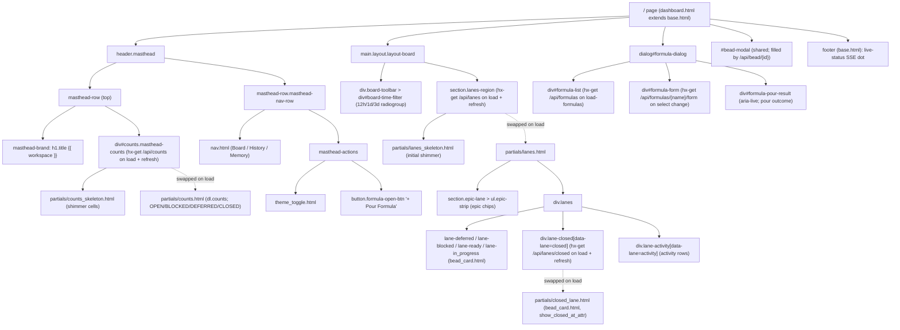
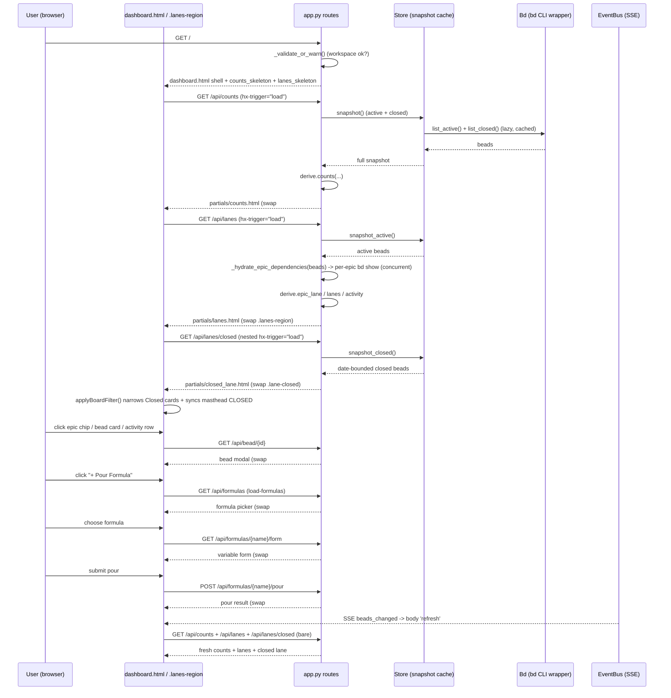

# Board Page (/)

## Overview

| Route | Auth | Purpose |
| --- | --- | --- |
| `GET /` | None (localhost single-user tool); the page and its `/api/counts`, `/api/lanes`, `/api/lanes/closed` reads are unauthenticated and read-only. The only mutating action reachable from this view — pouring a formula (`POST /api/formulas/{name}/pour`) — is CSRF-guarded by `_check_csrf`, but the board view itself carries no auth | The primary live work surface: an Epics strip plus the Deferred / Blocked / Ready / In Progress / Closed swim lanes and an Activity feed, with a client-side 12h/1d/3d recency filter over the date-bounded Closed set and a "+ Pour Formula" dialog. The short-window complement to the History page's long-window 7d/30d/90d/All closed record |

The `/` route is a cheap, non-blocking shell: `index` renders `dashboard.html`
(which extends `base.html`) instantly with skeletons, then the masthead counts
strip and the swim lanes hydrate via HTMX `load` fetches to `/api/counts` and
`/api/lanes`. The route never blocks on a `bd` subprocess — every `bd`-backed
read (the active snapshot, the epic dependency hydration, and the deferred
closed-lane fetch) happens on the partial endpoints, which derive over the
snapshots the `Store` already holds.

> [!NOTE]
> Before bdboard-0yy the `/` route awaited `store.snapshot()` **and** a
> per-epic `bd show` hydration pass before returning any HTML, giving the board
> the worst time-to-first-paint of the three pages. It is now symmetric with
> `/memory` and `/history`: instant shell, async hydration.

## URL Params

The `/` **page route** itself takes **no** path or query params — it always
renders the same shell. The recency window selection lives entirely
client-side (the 12h/1d/3d badges show/hide already-fetched cards via
`applyBoardFilter` in `base.html`); it never round-trips to the server.

| Param | Type | Required | Notes |
| --- | --- | --- | --- |
| _(none on the page route)_ | — | — | `GET /` ignores all query params; it always renders the same shell, hydrated by the first `/api/counts` + `/api/lanes` fetches. The Closed lane then loads via a nested `/api/lanes/closed` fetch |
| _(no params on `/api/lanes`)_ | — | — | `/api/lanes` fetches the active-only snapshot and renders the Epics strip + Deferred/Blocked/Ready/In Progress lanes + Activity; it takes no query params |
| _(no params on `/api/lanes/closed`)_ | — | — | `/api/lanes/closed` renders only the Closed lane from the date-bounded closed snapshot; the time window is applied client-side, not via a query param |

> [!IMPORTANT]
> The board time filter is **client-only**: the selected window
> (`12h`/`1d`/`3d`) is persisted in `sessionStorage['bdboard-time-filter']` and
> applied by `applyBoardFilter`, which shows/hides cards with a `data-closed-at`
> attribute and re-syncs the masthead CLOSED count. There is no `?range=` on the
> board — that pattern belongs to the History page (`/api/history`).

## What It Does

The Board page is the single human-facing surface for live, in-flight work. On
load it paints a two-row masthead (workspace title + a counts strip skeleton;
nav + theme toggle + "+ Pour Formula") and a full swim-lane skeleton, then swaps
in the live counts from `/api/counts` and the live lanes from `/api/lanes`. The
lanes region renders the Epics strip (a horizontal, dependency-ordered chain of
active epics), the active Deferred / Blocked / Ready / In Progress lanes, and an
Activity feed; the heavy Closed lane lazy-loads afterward via a nested
`/api/lanes/closed` fetch for faster first paint. A board-wide 12h/1d/3d recency
filter narrows the Closed lane client-side (and keeps the masthead CLOSED stat
in lockstep). Clicking any epic chip, bead card, or activity row opens the
shared bead modal (reuse, not rebuild). The "+ Pour Formula" button opens a
native `<dialog>` two-step flow (pick a formula → fill its variables → pour).
The whole board re-fetches live whenever the watcher detects a `.beads/` change
(SSE `refresh from:body`), so a bead changing state while you watch appears
without a manual reload.

## User Actions

- **Filter by recency** — click `12h` / `1d` / `3d` in the board toolbar;
  `applyBoardFilter` (in `base.html`) shows/hides Closed cards by their
  `data-closed-at` age, updates the lane's `[data-closed-count]` badge, and
  mirrors that visible count into the masthead CLOSED cell via
  `syncMastheadClosedCount`. The active badge reads `aria-checked="true"`; the
  choice persists to `sessionStorage['bdboard-time-filter']` (default `1d`).
- **Open a bead** — click any epic chip, bead card (active or closed lane), or
  activity row; the element fires `hx-get="/api/bead/{id}"` with
  `hx-target="#bead-modal"` and `hx-disabled-elt="this"` (prevents double-fire),
  swapping the shared bead modal.
- **Pour a formula** — click **+ Pour Formula** to `showModal()` the
  `#formula-dialog`; `openFormulaDialog()` clears any prior form/result and
  `htmx.trigger('#formula-list', 'load-formulas')` loads the picker fresh.
  Choosing a formula from the `<select>` swaps its variable form into
  `#formula-form`; submitting pours and renders the outcome into
  `#formula-pour-result`. New beads arrive live via the watcher→SSE pipeline
  plus the route's optimistic broadcast.
- **Toggle theme** — the shared theme toggle in the masthead actions row.
- **Navigate** — the shared `nav.html` links to History (`/history`) and Memory
  (`/memory`); the Board link carries `aria-current="page"`.

## Components

| Component | Responsibility | File |
| --- | --- | --- |
| Page shell | Full-page board view; two-row masthead (brand + counts host, nav + theme + Pour), the board time-filter toolbar, the single `.lanes-region` swap target, and the pour `<dialog>`; never blocks on `bd` | `src/bdboard/templates/dashboard.html` |
| Base layout | `<head>`, HTMX + SSE wiring, theme bootstrap, board time-filter JS (`applyBoardFilter`/`wireFilterBadges`/`syncMastheadClosedCount`), footer live-status | `src/bdboard/templates/base.html` |
| Primary nav | Board / History / Memory links with `aria-current` on the active page | `src/bdboard/templates/partials/nav.html` |
| Theme toggle | Light/dark switch (shared, `aria-pressed`) | `src/bdboard/templates/partials/theme_toggle.html` |
| Counts skeleton | Shimmer counts cells reserved in the masthead `#counts` host until the live `<dl>` lands | `src/bdboard/templates/partials/counts_skeleton.html` |
| Counts strip | The masthead KPI `<dl class="counts">` (OPEN/BLOCKED/DEFERRED/CLOSED, `data-count-status` hooks); CLOSED is re-synced client-side to the filtered lane | `src/bdboard/templates/partials/counts.html` |
| Lanes skeleton | Epic strip + five lane columns + activity rendered as shimmer until the first `/api/lanes` swap; `aria-hidden` | `src/bdboard/templates/partials/lanes_skeleton.html` |
| Lanes partial | The HTMX swap target body: Epics strip, the four active lanes, the lazy-loading Closed lane placeholder, and the Activity feed | `src/bdboard/templates/partials/lanes.html` |
| Closed-lane partial | The Closed lane card list + count, swapped in by `/api/lanes/closed` after the active lanes paint (`data-closed-at` for the recency filter) | `src/bdboard/templates/partials/closed_lane.html` |
| Bead card | Shared clickable tile used by active lanes, the closed lane, and History; opens the bead modal; honors `show_closed_at_attr`/`meta` context vars | `src/bdboard/templates/partials/bead_card.html` |
| Bead-card skeleton | Shimmer card placeholder used by both the lanes skeleton and the closed-lane loading state | `src/bdboard/templates/partials/bead_card_skeleton.html` |
| Formula picker | `<select>` of formulas; choosing one HTMX-loads its variable form into `#formula-form` | `src/bdboard/templates/partials/formula_list.html` |
| Page route handler | Validates workspace, renders the shell; surfaces workspace errors as `error.html` 500 | `src/bdboard/app.py:index` |
| Counts API handler | Renders the masthead counts strip from the full snapshot | `src/bdboard/app.py:api_counts` |
| Active-lanes API handler | Fetches the active-only snapshot, hydrates epic dependencies, derives the epic strip + lanes + activity | `src/bdboard/app.py:api_lanes` |
| Closed-lane API handler | Fetches the date-bounded closed snapshot and renders the Closed lane partial | `src/bdboard/app.py:api_lanes_closed` |
| Epic dependency hydration | Loads per-epic dependency detail concurrently so the strip can order wired chains | `src/bdboard/app.py:_hydrate_epic_dependencies` |
| Lane/strip/activity derivations | Pure snapshot derivations: epic chain ordering, lane bucketing, activity feed, counts | `src/bdboard/derive/lanes.py:epic_lane`, `lanes`, `activity`, `counts` |
| Active snapshot source | Active-only (~5KB) snapshot for fast first paint | `src/bdboard/store.py:Store.snapshot_active` |
| Closed snapshot source | Date-bounded closed snapshot for the Closed lane | `src/bdboard/store.py:Store.snapshot_closed` |
| Full snapshot source | Active + closed snapshot used by the counts strip | `src/bdboard/store.py:Store.snapshot` |

## State Management

| State | Source | Updated by |
| --- | --- | --- |
| Counts strip (`{open, blocked, deferred, closed, ...}`) | `derive.counts` over `Store.snapshot()` (full active + closed) | First `load` swap of `#counts`, SSE `refresh from:body`; the CLOSED cell is then re-synced client-side by `syncMastheadClosedCount` to the filtered lane |
| Epic strip (`epic_lane` list, each enriched with `status_key`/`status_icon`/`status_label`) | `derive.epic_lane` over `_hydrate_epic_dependencies(Store.snapshot_active())` | First `/api/lanes` swap and every SSE `refresh from:body` |
| Active lanes (`{deferred, ready, in_progress, blocked, closed}` buckets) | `derive.lanes` over `Store.snapshot_active()` (the `closed` bucket is empty here — see the closed-lane note) | First `/api/lanes` swap and SSE refresh |
| Activity feed (`[{id, title, actor, verb, ts, ts_epoch, priority}]`) | `derive.activity` over `Store.snapshot_active()` (active events on first paint; closed events appear after a full-snapshot SSE refresh) | First `/api/lanes` swap and SSE refresh |
| Closed lane (`closed` list, sorted by `closed_at` desc) | `Store.snapshot_closed()` rendered via `closed_lane.html` | Nested `/api/lanes/closed` `load` fetch after the active lanes paint, plus SSE `refresh from:body` |
| Recency window (`12h` / `1d` / `3d`) | `sessionStorage['bdboard-time-filter']` (default `1d`); rendered as `aria-checked`/`filter-badge-active` on the badges | Badge clicks call `applyBoardFilter`; `htmx:afterSettle` re-applies it after the lanes/closed/counts regions swap |
| Filtered Closed count | `applyBoardFilter` counts visible `.bead-card[data-closed-at]` within the window | Recompiled on every filter click and after each closed-lane/counts settle; mirrored into `[data-closed-count]` and the masthead CLOSED cell |
| Pour dialog (open/closed + picker/form/result) | Native `<dialog>` `showModal()`/`close()`; `#formula-list`, `#formula-form`, `#formula-pour-result` regions | `openFormulaDialog()` resets + opens and triggers `load-formulas`; `<select>` change loads the variable form; submit fills the result region (`aria-live`) |
| `aria-busy` on `#counts` / `.lanes-region` | Set `true` in `dashboard.html` | Cleared when the hydrated partials land and by `base.html`'s global `htmx:afterSettle` |
| Live-status (SSE connection) | `EventSource('/api/events')` in `base.html` | `open`/`error`/`beads_changed` listeners update `#live-status` + `#live-dot`; `beads_changed` dispatches the `refresh` body event |

> [!NOTE]
> `/api/lanes` deliberately fetches the **active-only** snapshot, so any bead
> that blocks on a *closed* bead is conservatively shown as Blocked until the
> next full-snapshot SSE refresh corrects it — an accepted tradeoff for the
> ~100x payload reduction (bdboard-0yy). See `api_lanes`' docstring.

## Data Flow

## API Dependencies

| Endpoint | Used for | Doc |
| --- | --- | --- |
| `GET /api/counts` | Hydrates the masthead counts strip on load + every SSE refresh | [LanesApi](../Endpoints/LanesApi.md) |
| `GET /api/lanes` | Hydrates the Epics strip + active lanes (Deferred/Blocked/Ready/In Progress) + Activity on load + SSE refresh | [LanesApi](../Endpoints/LanesApi.md) |
| `GET /api/lanes/closed` | Lazy-loads the heavy Closed lane after the active lanes paint; re-fetched on SSE refresh | [LanesApi](../Endpoints/LanesApi.md) |
| `GET /api/bead/{id}` | Opens the shared bead modal from an epic chip, bead card, or activity row | [BeadDetailApi](../Endpoints/BeadDetailApi.md) |
| `GET /api/formulas` | Loads the formula picker when the pour dialog opens | [FormulasApi](../Endpoints/FormulasApi.md) |
| `GET /api/formulas/{name}/form` | Loads a formula's variable form when one is picked | [FormulasApi](../Endpoints/FormulasApi.md) |
| `POST /api/formulas/{name}/pour` | Pours the selected formula's beads onto the board | [FormulasApi](../Endpoints/FormulasApi.md) |
| `GET /api/events` | SSE stream; a `beads_changed` event fires `refresh` on `<body>`, re-fetching the counts strip and all lanes (live state changes as you watch) | [SseEvents](../Endpoints/SseEvents.md) |

## States

- **Loading** — `#counts` ships `partials/counts_skeleton.html` and
  `.lanes-region` ships `partials/lanes_skeleton.html` (epic strip + five lane
  columns + activity rows of shimmer, `aria-hidden="true"`), both with
  `aria-busy="true"`. The first `/api/counts` and `/api/lanes` swaps replace
  them; the Closed lane shows three skeleton cards until `/api/lanes/closed`
  lands. No blank flash, no layout jump.
- **Empty (no active epics)** — the Epics strip renders a single
  *"(no active epics)"* `lane-empty` row.
- **Empty (an active lane)** — Deferred/Blocked/Ready/In Progress each render an
  *"(empty)"* `lane-empty` row when their bucket is empty.
- **Empty (Closed lane)** — `closed_lane.html` renders *"(empty)"* when the
  date-bounded closed set is empty; if the filter hides every card, the count
  badge and masthead CLOSED cell read `0` and pick up `counts-cell-zero` muting.
- **Empty (Activity)** — the Activity lane renders *"no activity yet"* when
  there are no timestamped beads.
- **Populated** — the Epics strip (dependency-ordered chips with status
  icon/label), the four active lanes (priority-then-recency sorted cards), the
  Closed lane (most-recent-first cards within the selected window), and the
  Activity feed (synthesized "current state as event" rows, newest first).
- **Pour dialog — empty formulas** — `formula_list.html` renders the
  *"No formulas found…"* hint when `bd formula list` returns nothing.
- **Error (workspace)** — if `_validate_or_warn()` fails, `GET /` returns
  `error.html` with HTTP 500 instead of an empty board.
- **Error (formula load)** — `/api/formulas` degrades to a friendly inline
  *"Couldn't load formulas right now…"* `role="status"` message (HTTP 200), not
  a broken swap.
- **Error (bead not found)** — `/api/bead/{id}` returns a 404 `modal-error`
  partial ("We couldn't find that bead…") if neither the live `bd show` nor the
  cached snapshot has it.
- **Live (SSE)** — a `beads_changed` event re-fetches counts + lanes + closed
  lane so a state change appears without a manual reload; the footer dot reads
  *live · push* / *reconnecting…* as the `EventSource` connects/drops.

## Accessibility

- **Time-filter** — wrapped in `role="radiogroup"` with
  `aria-label="Time window filter"`; each badge is a `role="radio"` carrying
  `aria-checked` for the active window and a descriptive `aria-label` ("Show
  beads from the last 24 hours"), so the active state isn't colour-only.
- **Epic strip** — `ul.epic-strip role="list"`; each chip exposes the status as
  text (`epic-status-text`) plus an `aria-hidden` icon and an
  `aria-label="Status: <label>"`, so status survives greyscale / icon-blindness.
- **Lanes & cards** — each lane is an `<ul>` of `bead-card`s; every card is a
  single clickable tile with `hx-disabled-elt="this"` to prevent double-fire,
  and the closed-lane card timestamp carries the raw ISO value in `data-closed-at`.
- **Activity rows** — clickable `activity-row`s with a humanized time, a
  verb class, the actor, and the title; same `hx-disabled-elt="this"` guard.
- **Loading announcement** — both skeletons are `aria-hidden="true"` so AT waits
  for real data; `aria-busy` flags `#counts` and `.lanes-region` as loading
  until the hydrated partials settle.
- **Pour dialog** — a native `<dialog>` (built-in focus trap) with
  `aria-labelledby` pointing at its title; the open button exposes
  `aria-haspopup="dialog"`; the picker `<select>` is labelled; the pour-result
  region is `aria-live="polite"` so outcomes are announced.
- **Counts strip** — each cell carries a stable `data-count-status` hook (the
  visible label is text-transformed and must not be relied on); zero values get
  `counts-cell-zero` muting rather than disappearing, keeping header geometry
  stable.
- **Nav** — the active page link carries `aria-current="page"` and uses three
  non-colour cues (ink + bold + baseline rule), satisfying WCAG 2.2 AA's
  not-by-colour-alone requirement.
- **Contrast** — colours come from the shared light/dark token palette in
  `styles.css`, authored to WCAG AA; the theme toggle exposes `aria-pressed`.

## Responsive Behavior

- The page uses `.layout.layout-board`; the `.lanes` grid reflows from a
  multi-column board to stacked columns at the shared `styles.css` breakpoints
  so lanes never overflow horizontally on narrow viewports.
- The Epics strip (`ul.epic-strip`) is a horizontally scrollable row of chips,
  so a long active-epic chain scrolls in place rather than blowing out the
  layout.
- The two-row masthead collapses at the shared breakpoints
  (`@media (max-width: 900px)` and below): the brand + counts strip stack and
  the nav/theme/Pour actions row reflows; the board toolbar (12h/1d/3d) stays
  right-aligned above the lanes.
- The pour `<dialog>` is width-constrained and scrolls its inner content on
  short viewports; the picker, variable form, and result stack vertically.
- Motion respects `@media (prefers-reduced-motion: reduce)` (skeleton shimmer
  and transitions are disabled), so the loading state degrades gracefully.

## Related

- [Server startup & workspace resolution (Flow)](../Flows/ServerStartup.md) —
  the boot path that resolves the workspace, validates it, and renders this
  page's skeleton shell on the first `GET /`.
- [Swim-lane board (Feature)](../Features/SwimLaneBoard.md) — the feature this
  page is the primary UI for.
- [Live auto-refresh (Feature)](../Features/LiveAutoRefresh.md) — the
  watcher→SSE behavior that re-fetches the board on `.beads/` changes.
- [Formula pour (Feature)](../Features/FormulaPour.md) — the feature behind the
  "+ Pour Formula" dialog on this page.
- [Lanes API (/api/lanes, /api/lanes/closed, /api/counts)](../Endpoints/LanesApi.md) —
  the endpoints this page calls for the strip, lanes, closed lane, and counts.
- [Bead detail API (/api/bead/{id})](../Endpoints/BeadDetailApi.md) — the
  endpoint behind the shared bead modal each chip/card/row opens.
- [Bead field-edit API (POST /api/bead/{id}/field)](../Endpoints/BeadFieldEditApi.md) —
  the write path behind the inline edit / add-note affordances on each modal
  field row.
- [Formulas API (/api/formulas, form, pour)](../Endpoints/FormulasApi.md) — the
  endpoints driving the two-step pour dialog.
- [Formula pour fan-out (Flow)](../Flows/FormulaPourFanout.md) — the end-to-end
  pour pipeline this page's "+ Pour Formula" dialog kicks off and re-renders on.
- [SSE events (/api/events)](../Endpoints/SseEvents.md) — the live-refresh
  stream that re-fetches the board on `.beads/` changes.
- [Live-refresh pipeline (Flow)](../Flows/LiveRefreshPipeline.md) — the full
  bd-write → watcher → refresh → broadcast → re-fetch flow that repaints this
  page's lanes and counts.
- [History page (/history)](HistoryPage.md) and [Memory page (/memory)](MemoryPage.md) —
  sibling pages sharing the masthead, nav, and shell pattern.
- [Derive layer (pure view shaping)](../Concepts/DeriveLayer.md) — where the
  epic-strip / lane / activity / counts derivations live.
- [Store snapshot cache & change detection](../Concepts/StoreSnapshotCache.md) —
  the active/closed/full snapshots this page reads from.
- [bd CLI as runtime source of truth](../Concepts/BdCliSourceOfTruth.md) — why
  the lanes, counts, and epic hydration come from `bd`.
- [HTMX + server-rendered partials](../Concepts/HtmxPartialsArchitecture.md) —
  the swap/partial pattern this page is built on.
- [Architecture](../Architecture.md) — system-wide view & API surface.
