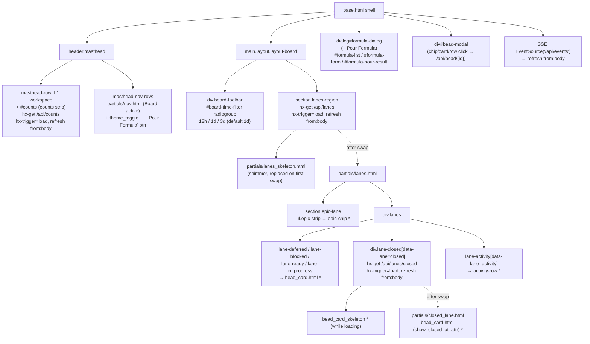
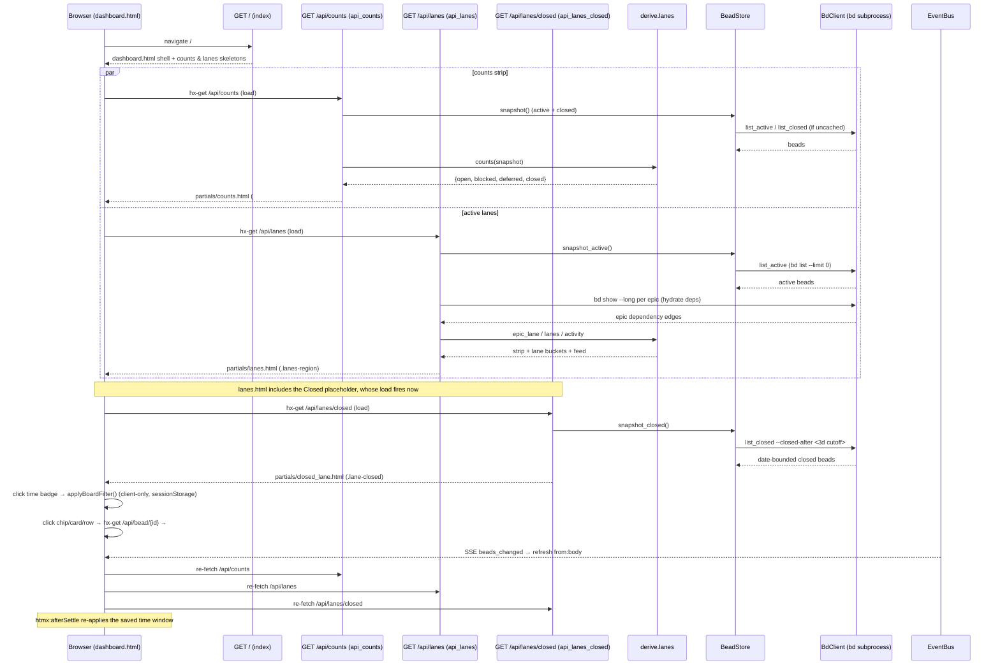

# Board (/)

## Overview

| Route | Auth | Purpose |
| --- | --- | --- |
| `GET /` | None (single-user localhost dashboard; the board's only write is the CSRF-guarded inline field edit fired from the bead modal — the board surface itself issues no unguarded writes) | The full-page live board: bdboard's default landing view. A horizontal **epic strip** (dependency-sequenced active epics) above a row of **swim lanes** (Deferred / Blocked / Ready / In Progress / Closed) plus an **Activity** feed, with a right-aligned **time-window filter** (12h/1d/3d) and a **+ Pour Formula** dialog. A cheap shell that paints skeletons instantly, then hydrates the masthead counts from `GET /api/counts`, the active lanes + epic strip + activity from `GET /api/lanes`, and the heavy Closed lane separately from `GET /api/lanes/closed`. |

The page is one of bdboard's three server-rendered views (Board `/`,
History `/history`, Memory `/memory`), each extending `base.html` and
hydrating its data region with HTMX rather than blocking the route on a `bd`
subprocess. It is the live **now** surface — the short 12h/1d/3d closed window
and the active lanes — and the long-window retrospective lives on the
History page (`/history`).

## URL Params

The **page** route `GET /` takes **no path or query parameters** — it is a
static shell (it runs `_validate_or_warn()`, then renders `dashboard.html`
unconditionally on success). The board has **no server-side filter params at
all**: the 12h/1d/3d time window is applied **entirely client-side** by JS in
`base.html` (it shows/hides already-fetched Closed cards via their
`data-closed-at` attribute and never re-hits the server). The selection is
persisted in `sessionStorage` under `bdboard-time-filter`, not in the URL.

| Param | Type | Required | Notes |
| --- | --- | --- | --- |
| _(none on the page route)_ | — | — | `GET /` accepts no path/query params; it renders `dashboard.html` unconditionally after `_validate_or_warn()` passes. The time filter is client-only state (`sessionStorage['bdboard-time-filter']`), never a query param. |

## What It Does

The Board is bdboard's primary surface — it answers "what is happening right
now, and what's next?" at a glance, where History answers "what got done over
time." It lets a maintainer:

- **See the epic plan, sequenced** — a horizontal **Epics** strip of active
  (non-closed) epics, ordered predecessor→successor left-to-right by their
  `blocks`/`blocked-by` dependency edges, with the currently-relevant epic
  (in-progress, else next-ready) anchored at position 0. Each chip shows the
  epic's id, priority, title, derived status (open-with-unmet-blocker renders
  as **Blocked**), and assignee.
- **Read live swim lanes** — non-epic, non-`molecule` beads bucketed into **Deferred / Blocked / Ready / In Progress / Closed**. Open lanes sort by
  priority (P0 first) then most-recently-updated; the Closed lane sorts by
  close time, newest first.
- **Scan recent activity** — a synthesized **Activity** feed (newest 25) that
  turns each bead's most-recent timestamp into a "created/updated/in
  progress/blocked/closed" event row.
- **Narrow the Closed window** — a right-aligned **12h / 1d / 3d** badge group
  (default `1d`) that filters the Closed lane client-side and keeps the
  masthead CLOSED count in lockstep.
- **Open any bead** — clicking an epic chip, lane card, or activity row opens
  the **shared bead modal** (`GET /api/bead/{id}`), whose fields can be edited
  inline (CSRF-guarded `POST /api/bead/{id}/field`).
- **Pour a formula** — a **+ Pour Formula** dialog (a native `<dialog>`) picks
  a formula, fills its variables, and pours its beads onto the board; new beads
  arrive live via the watcher→SSE pipeline.

Because the page is a thin shell, navigating to `/` paints instantly (a counts
skeleton + a full lanes skeleton), then the real data streams in over three
independent HTMX `load` fetches. The split is a deliberate
time-to-first-paint optimization (bdboard-0yy): the active lanes (~5KB) paint
first, and the heavy Closed lane (~495KB on large workspaces) loads separately
from `GET /api/lanes/closed` after the active lanes are visible — a ~100x
payload reduction on first paint.

> [!NOTE]
> The masthead CLOSED count and the Closed lane count reflect the **same**
> date-bounded set: `bd.list_closed` fetches only beads closed within
> `BOARD_CLOSED_WINDOW_DAYS` (3) at fetch time, and the client time filter
> narrows both numbers identically thereafter (bdboard-p8v / bdboard-de4z).
> Anything older than 3 days lives on the History page, not the board.

> [!WARNING]
> Because `/api/lanes` fetches only the **active** snapshot for fast first
> paint, a bead whose blocking dependency is a *closed* bead will
> conservatively render in **Blocked** until the first SSE refresh pulls the
> full snapshot. This is the intentional payload-reduction tradeoff
> (bdboard-0yy); the UI self-corrects on `refresh from:body`.

## User Actions

- **Load the page** → three regions hydrate independently: the masthead
  `#counts` strip's `hx-trigger="load"` fetches `GET /api/counts`; the
  `.lanes-region`'s `hx-trigger="load"` fetches `GET /api/lanes` (epic strip +
  active lanes + activity); and once `lanes.html` swaps in, the
  `.lane-closed` placeholder's own `hx-trigger="load"` fetches
  `GET /api/lanes/closed`.
- **Click a time-window badge (`12h`/`1d`/`3d`)** → `applyBoardFilter()` in
  `base.html` shows/hides Closed cards by `data-closed-at` age, updates the
  lane count badge **and** the masthead CLOSED cell, sets `aria-checked`, and
  persists the choice to `sessionStorage['bdboard-time-filter']`. **No server
  round-trip.**
- **Click an epic chip / lane card / activity row** → `hx-get="/api/bead/{id}"`
  targeting `#bead-modal` opens the shared bead detail modal; the modal then
  lazily loads its audit trail from `GET /api/bead/{id}/audit`.
- **Edit a field in the modal** → an editable `field_row` POSTs
  `/api/bead/{id}/field` (CSRF-guarded); the watcher→SSE pipeline then
  broadcasts the change.
- **Click "+ Pour Formula"** → `openFormulaDialog()` clears any prior form +
  result, `showModal()`s the native `<dialog>`, and fires the picker's
  `load-formulas` HTMX trigger (`GET /api/formulas`). Picking a formula loads
  its variable form (`GET /api/formulas/{name}/form`); submitting pours
  (`POST /api/formulas/{name}/pour`).
- **A change in another tab / on disk** → the page's single SSE subscription
  (`EventSource('/api/events')` in `base.html`) fires `refresh from:body`,
  re-fetching `/api/counts`, `/api/lanes`, and `/api/lanes/closed` so the board
  stays live without a reload. `htmx:afterSettle` re-applies the active time
  filter to the freshly-swapped Closed lane.

## Components

| Component | Responsibility | File |
| --- | --- | --- |
| Page shell + masthead | The full-page template: masthead (brand = workspace name, `#counts` strip, nav, theme toggle, Pour-Formula button), the board time-filter toolbar, the `.lanes-region` swap target with its skeleton, the Pour-Formula `<dialog>`, and `openFormulaDialog()`. | `src/bdboard/templates/dashboard.html` |
| Page route | Validates the workspace, then renders `dashboard.html` (cheap shell, no `bd` call); surfaces a workspace error for parity with `/memory` and `/history`. | `src/bdboard/app.py` → `index` (`GET /`) |
| Lanes region partial | Renders the epic strip, the four active lanes, the Closed-lane placeholder (with its own lazy `load` fetch + skeleton), and the Activity feed. The main HTMX swap target body. | `src/bdboard/templates/partials/lanes.html` |
| Lanes region endpoint | Pulls the active-only snapshot, hydrates epic dependency edges, and renders `lanes.html` with `epic_lane` / `lanes` / `activity`. | `src/bdboard/app.py` → `api_lanes` (`GET /api/lanes`) |
| Closed lane partial | Renders just the Closed-lane title (`data-closed-count`) + card list, swapped into the `.lane-closed` placeholder. | `src/bdboard/templates/partials/closed_lane.html` |
| Closed lane endpoint | Pulls the date-bounded closed snapshot and renders `closed_lane.html` separately for fast first paint (bdboard-0yy). | `src/bdboard/app.py` → `api_lanes_closed` (`GET /api/lanes/closed`) |
| Counts strip partial | The masthead `<dl class="counts">` with a `data-count-status` hook per cell; omits `in_progress` (single-flight noise). | `src/bdboard/templates/partials/counts.html` |
| Counts endpoint | Renders `counts.html` from `derive.counts` over the full snapshot. | `src/bdboard/app.py` → `api_counts` (`GET /api/counts`) |
| Loading skeletons | `lanes_skeleton.html` (epic strip + five lanes + activity, all shimmer, `aria-hidden`) shown until the first `/api/lanes` swap; `bead_card_skeleton.html` fills the Closed placeholder; `counts_skeleton.html` reserves the masthead columns. | `src/bdboard/templates/partials/lanes_skeleton.html`, `bead_card_skeleton.html`, `counts_skeleton.html` |
| Shared bead card | The clickable lane/closed tile (`hx-get /api/bead/{id}` → `#bead-modal`); the closed lane passes `show_closed_at_attr` so each card carries `data-closed-at` for the client time filter. | `src/bdboard/templates/partials/bead_card.html` |
| Bead modal | The shared detail modal: field grid + lazily-loaded audit trail + status timeline; opened by every clickable board element. | `src/bdboard/templates/partials/bead_modal.html`; `src/bdboard/app.py` → `api_bead`, `api_bead_audit` |
| Pour-Formula dialog | Native `<dialog>` picker → variable form → pour result, wired via HTMX to the `/api/formulas*` endpoints. | `src/bdboard/templates/dashboard.html` (`#formula-dialog`); `partials/formula_list.html`, `formula_form.html`, `formula_pour_result.html` |
| Epic strip derive | Builds the sequenced epic strip: active epics only, topologically ordered by dependency component, anchored by lane rank, with derived `status_key`/`status_icon`/`status_label`. | `src/bdboard/derive/lanes.py` → `epic_lane` (+ `_epic_lane_rank`, `_topo_component_order`, `_has_unmet_blocking_dep`) |
| Epic dependency hydration | Grafts per-epic dependency edges onto the active snapshot via per-epic `bd show --long` (because `bd list` omits expanded dependency arrays). | `src/bdboard/app.py` → `_hydrate_epic_dependencies`, `_load` |
| Lane bucketing derive | Buckets non-epic, non-`molecule` beads into the five lanes; sorts open lanes by priority then `updated_at` desc, Closed by `closed_at` desc. | `src/bdboard/derive/lanes.py` → `lanes` (+ `_is_epic`, `_is_molecule`, `_is_closed`, `_has_unmet_blocking_dep`) |
| Activity derive | Synthesizes a 25-item "current state as event" feed from each bead's most-recent timestamp + inferred verb. | `src/bdboard/derive/lanes.py` → `activity` |
| Counts derive | Fixed-order status counts (`open`/`blocked`/`deferred`/`closed` + any extant non-standard statuses); `in_progress` intentionally omitted. | `src/bdboard/derive/lanes.py` → `counts` |
| Dependency field helpers | Normalize bd's field-name variations when reading dependency edges (`deps`/`dependencies`, `type`/`dependency_type`, `depends_on_id`/`target`/…). | `src/bdboard/derive/lanes.py` → `get_dependency_list`, `get_dependency_type`, `get_dependency_target_id` |
| Active/closed snapshots | The active-only fast snapshot and the date-bounded closed snapshot feeding the two lane fetches; lazy-loaded + cached. | `src/bdboard/store.py` → `BeadStore.snapshot_active`, `snapshot_closed`, `snapshot`, `_load_active`, `_load_closed` |
| `bd` list calls | `bd list --limit 0` (active) and `bd list --status closed --closed-after <cutoff> --sort closed --limit 0` (board-bounded closed). | `src/bdboard/bd.py` → `BdClient.list_active`, `list_closed` |
| Time helpers | `_epoch` sort key for lane ordering; the `humanize_ts` Jinja filter for activity timestamps. | `src/bdboard/derive/timeutil.py` → `_epoch`, `humanize_ts` |
| SSE bus | Fan-out of `beads_changed` to every open tab so a bead changing while you watch appears live. | `src/bdboard/events.py` → `EventBus`; `src/bdboard/app.py` → `bus`, `sse_events` |
| Time-filter + SSE JS | The client-only board time filter (`applyBoardFilter`, `wireFilterBadges`, `syncMastheadClosedCount`), the `htmx:afterSettle` re-apply hook, and the shared `EventSource` → `refresh from:body` dispatch. | `src/bdboard/templates/base.html` |

## State Management

| State | Source | Updated by |
| --- | --- | --- |
| Active lanes + epic strip + activity (`epic_lane`, `lanes`, `activity`) | `derive.epic_lane` / `derive.lanes` / `derive.activity` over `store.snapshot_active()` (epics enriched by `_hydrate_epic_dependencies`). | The `.lanes-region`'s `hx-get="/api/lanes"` on `load` and on `refresh from:body` (SSE) — each returns a fresh region swap. |
| Closed lane (`closed`) | `store.snapshot_closed()` (date-bounded by `BOARD_CLOSED_WINDOW_DAYS` at `bd list` fetch time), sorted `closed_at` desc. | The `.lane-closed` placeholder's own `hx-get="/api/lanes/closed"` on `load` (fired after `lanes.html` swaps) and on `refresh from:body`. |
| Masthead counts (`counts`) | `derive.counts` over `store.snapshot()` (full active+closed). | `#counts`'s `hx-get="/api/counts"` on `load` and `refresh from:body`; the CLOSED cell is then re-synced client-side to the filtered set by `syncMastheadClosedCount`. |
| Active time window (`12h`/`1d`/`3d`) | The clicked `.filter-badge`'s `data-filter`, restored from `sessionStorage['bdboard-time-filter']` (default `1d`). | `applyBoardFilter()` on badge click (client-only — no fetch); re-applied on every lanes/closed/counts swap via `htmx:afterSettle` → `wireFilterBadges`. |
| Visible Closed count | Recomputed by `applyBoardFilter()` from cards passing the window. | Written to both the lane's `[data-closed-count]` badge and the masthead `[data-count-status="closed"]` cell so header and lane can't drift (bdboard-de4z). |
| Open bead modal | `GET /api/bead/{id}` (live `bd show --long`, else cached snapshot fallback) rendered into `#bead-modal`; audit lazily via `GET /api/bead/{id}/audit`. | Clicking any epic chip / lane card / activity row; closed by the close button / backdrop click (clears `#bead-modal.innerHTML`). |
| Pour dialog state | `#formula-list` / `#formula-form` / `#formula-pour-result` regions inside the native `<dialog>`. | `openFormulaDialog()` resets + opens; HTMX swaps the picker → form → result through the `/api/formulas*` endpoints. |
| Theme (`data-theme`) | `localStorage['bdboard-theme']` + the anti-FOUC `<head>` script. | The shared theme toggle; follows OS `prefers-color-scheme` when no explicit choice is stored. |
| Live-connection indicator (`#live-dot` / `#live-status`) | The shared `EventSource('/api/events')` in `base.html`. | `open` → `live · push`; `error` → `reconnecting…`; `beads_changed` → dispatches `refresh` on `<body>`. |

## Data Flow

## API Dependencies

| Endpoint | Used for | -> Endpoint doc |
| --- | --- | --- |
| `GET /api/lanes` | Initial + SSE re-fetch of the epic strip, the four active lanes, and the Activity feed (`.lanes-region`). | [GET /api/lanes](../Endpoints/GetApiLanes.md) |
| `GET /api/lanes/closed` | Lazy + SSE re-fetch of the heavy Closed lane (`.lane-closed`), split out for fast first paint. | [GET /api/lanes/closed](../Endpoints/GetApiLanesClosed.md) |
| `GET /api/counts` | Initial + SSE re-fetch of the masthead counts strip (`#counts`). | [GET /api/counts](../Endpoints/GetApiCounts.md) |
| `GET /api/bead/{id}` | Opening the shared bead modal when an epic chip, lane card, or activity row is clicked. | [GET /api/bead/{id}](../Endpoints/index.md) |
| `GET /api/bead/{id}/audit` | The modal's lazily-loaded audit trail + status timeline. | [GET /api/bead/{id}/audit](../Endpoints/index.md) |
| `POST /api/bead/{id}/field` | Inline field edits from the modal (CSRF-guarded). | [POST /api/bead/{id}/field](../Endpoints/index.md) |
| `GET /api/formulas` | The Pour-Formula picker list (loaded when the dialog opens). | [GET /api/formulas](../Endpoints/index.md) |
| `GET /api/formulas/{name}/form` | The variable form for a picked formula. | [GET /api/formulas/{name}/form](../Endpoints/GetApiFormulaForm.md) |
| `POST /api/formulas/{name}/pour` | Pouring the chosen formula's beads onto the board. | [POST /api/formulas/{name}/pour](../Endpoints/index.md) |
| `GET /api/events` | The shared SSE subscription (in `base.html`) that fires `refresh from:body` so the board stays live across tabs. | [GET /api/events](../Endpoints/GetApiEvents.md) |

## States

- **Loading.** On first paint the masthead renders a counts skeleton
  (`#counts`, `aria-busy="true"`), the `.lanes-region` renders
  `lanes_skeleton.html` (epic strip + five lanes + activity, all shimmer,
  `aria-busy="true"`), and once the real `lanes.html` swaps in, the Closed lane
  shows three `bead_card_skeleton`s while `/api/lanes/closed` resolves. The
  skeletons mirror the real layout so there is no jump when data arrives.
- **Empty epic strip.** When there are no active epics, the strip renders
  `(no active epics)` via `.lane-empty`.
- **Empty lane.** Each active lane with no beads renders `(empty)`; the Closed
  lane likewise renders `(empty)` when nothing closed inside the board window.
- **Empty activity.** With no timestamped beads, the Activity feed renders
  `no activity yet`.
- **Closed window narrowed to zero.** Selecting a tighter window (e.g. `12h`)
  that excludes every closed card hides them all; both the lane
  `[data-closed-count]` badge and the masthead CLOSED cell read `0` (and gain
  the `counts-cell-zero` muting) without a server round-trip.
- **Closed dep shown as blocked (transient).** Until the first SSE refresh,
  a bead blocked only by a *closed* bead conservatively appears in **Blocked**
  because `/api/lanes` fetches active-only (bdboard-0yy); it self-corrects on
  `refresh from:body`.
- **Bead not found.** If `GET /api/bead/{id}` can resolve neither live nor
  cached data, the modal renders a 404 "We couldn't find that bead" message.
- **Cached-fallback modal.** When live `bd show --long` fails, the modal
  renders from the cached snapshot and shows a `modal-warning` banner instead of
  hard-failing.
- **Broken workspace.** If `_validate_or_warn()` fails, `GET /` returns
  `error.html` (HTTP 500) naming the workspace, rather than an empty board.

## Accessibility

- **Time filter is a labelled radiogroup.** `#board-time-filter` is
  `role="radiogroup" aria-label="Time window filter"`; each badge is a
  `<button role="radio">` whose active state is signalled by **both**
  `aria-checked="true"` and the `.filter-badge-active` styling (not colour
  alone), with a descriptive `aria-label` (e.g. *"Show beads from the last 24
  hours"*).
- **Skeletons hidden from AT.** `lanes_skeleton.html` and the Closed-lane
  skeleton list are `aria-hidden` / `aria-hidden="true"`, and the live regions
  carry `aria-busy` while loading, so assistive tech waits for real content
  rather than reading shimmer.
- **Epic + lane semantics.** The epic strip is `aria-label="Epic lane"` with a
  `role="list"`; each epic status carries an `aria-label="Status: <label>"`
  while its glyph icon is `aria-hidden` (the text label conveys the state).
- **Clickable tiles announce themselves.** Epic chips, lane cards, and activity
  rows are HTMX click targets carrying `hx-disabled-elt="this"` to prevent
  double-fires; the bead modal traps focus and closes on backdrop click / the
  close button.
- **Pour dialog is a native `<dialog>`.** `#formula-dialog` is opened via
  `showModal()`, which traps keyboard focus automatically and closes on `Esc`;
  it is `aria-labelledby` its title, the open button is `aria-haspopup="dialog"`,
  and the pour-result region is `aria-live="polite"`.
- **Live count cell announced consistently.** The masthead CLOSED cell stays in
  lockstep with the filtered lane via `syncMastheadClosedCount`, so AT reading
  the counts strip never sees a number that disagrees with the visible lane.
- **Active nav uses non-colour cues.** The Board nav link is marked by ink
  colour **and** bold weight **and** an inset baseline rule plus
  `aria-current="page"` — not colour alone.

## Responsive Behavior

- The page uses `.layout-board`, a horizontal swim-lane layout (unlike the
  History/Memory single-column flow): the epic strip scrolls horizontally above
  the lanes row, and the lanes row itself flexes/scrolls across the available
  width.
- The **two-row masthead** keeps the brand + counts strip on the top row and
  the nav + theme toggle + Pour-Formula action on the second row; the counts
  `dl.counts` strip reflows its cells on narrow screens.
- The **board toolbar** is right-aligned above the lanes (mirroring the History
  page's range toolbar, bdboard-150t); its 12h/1d/3d badges wrap on narrow
  viewports.
- Each **lane** is a vertically-scrolling column of cards; the epic strip is a
  horizontally-scrolling row of chips so a long plan stays scannable without
  squashing.
- The **Pour-Formula `<dialog>`** centres itself and is width-constrained so it
  reads well on small viewports; the **bead modal** scrolls its body
  (`.modal-scroll`) when content exceeds the viewport.

## Related

- [Views index](index.md) — the three pages; History (`/history`) and Memory
  (`/memory`) are this view's siblings (shared masthead, nav, and SSE wiring).
- [History (/history)](HistoryView.md) — the long-window retrospective sibling;
  this board's short 12h/1d/3d closed window hands off to History's 7d/30d/90d/All.
- [Memory (/memory)](MemoryView.md) — the sibling full-page view this one shares
  shell structure with (cheap shell + HTMX-hydrated regions).
- [Live Board](../Features/index.md) — the end-to-end feature this page is the
  surface for.
- [Formula Pour](../Features/index.md) — the pour-onto-board feature behind the
  "+ Pour Formula" dialog.
- [POST /api/formulas/{name}/pour](../Endpoints/PostApiFormulaPour.md) — the
  write endpoint the "+ Pour Formula" dialog submits to.
- [Formula Pour Pipeline](../Flows/FormulaPourPipeline.md) — the end-to-end
  preflight → pour → rename → refresh flow the dialog drives.
- [Live Updates](../Features/index.md) — the cross-tab live refresh this page
  participates in via `refresh from:body`.
- [Endpoints index](../Endpoints/index.md) — GET /api/lanes, GET /api/lanes/closed,
  GET /api/counts, GET /api/bead/{id}, GET /api/events.
- [bd CLI as Source of Truth](../Concepts/BdCliSourceOfTruth.md) — why this page
  reads its data through `bd` snapshots instead of touching `.beads/` directly.
- [Subprocess Serialization & Caching](../Concepts/SubprocessSerializationAndCaching.md)
  — the semaphore + TTL cache behind the `bd list`/`bd show` calls.
- [Store Snapshot & Change Detection](../Concepts/StoreSnapshotChangeDetection.md)
  — the active/closed snapshot caches behind the two lane fetches.
- [Derive Layer](../Concepts/DeriveLayer.md) — the pure `derive.lanes` functions
  that shape the strip, lanes, activity, and counts.
- [Epic Lane Sequencing](../Concepts/EpicLaneSequencing.md) — how the epic strip
  is topologically ordered and anchored.
- [SSE Event Bus](../Concepts/SseEventBus.md) — the `beads_changed` broadcast
  that keeps this view live across tabs.
- [Filesystem Watcher](../Concepts/FilesystemWatcher.md) — the `.beads/` change
  detection that triggers those broadcasts.
- [Field Editability Registry](../Concepts/FieldEditabilityRegistry.md) — the
  read-only-by-default registry gating the modal's inline field edits.
- [CSRF Protection](../Concepts/CsrfProtection.md) — the guard fronting the
  modal's field-edit write path.
- [Back to docs index](../index.md)
