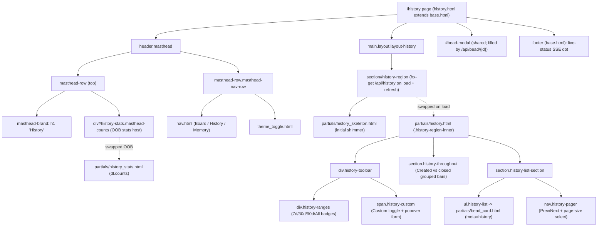

# History Page (/history)

## Overview

| Route | Auth | Purpose |
| --- | --- | --- |
| `GET /history` | None (localhost single-user tool); the page and its `/api/history` reads are unauthenticated and read-only — there are no mutating actions on this view, so no CSRF token is involved | Browse the long-window record of **closed** beads: a range-scoped KPI strip, a combined created-vs-closed throughput chart, and a paginated, modal-openable list of closed beads — the complement to the board's short-window 12h/1d/3d lane filter and 50-cap closed lane |

The page route is a cheap, non-blocking shell: `page_history` renders
`history.html` (which extends `base.html`) instantly with skeletons, then the
real region hydrates via an HTMX `load` fetch to `/api/history`. The route
never blocks on a `bd` subprocess — every `bd`-backed read and all derivation
happens on `/api/history`, which derives purely over the snapshot the `Store`
already holds.

## URL Params

The `/history` **page route** itself takes **no** path or query params — it
always renders the same shell. The window/paging selection lives on the
*partial* fetch to `/api/history`, fired by the range buttons, pager, and the
Custom date-range form, not on the page URL.

| Param | Type | Required | Notes |
| --- | --- | --- | --- |
| _(none on the page route)_ | — | — | `GET /history` ignores all query params; it always renders the same shell with the default 30d window hydrated by the first `/api/history` fetch |
| `range` (on `/api/history`) | string (query) | No | One of `7d` / `30d` / `90d` / `all`; unknown/empty degrades to `30d` (`derive.DEFAULT_HISTORY_RANGE`) inside `api_history`. Sent by the preset range badges |
| `page` (on `/api/history`) | int (query) | No | 1-based page of the closed list; clamped to `max(1, page)`. Sent by the Prev/Next pager |
| `page_size` (on `/api/history`) | int (query) | No | Rows per page; clamped to the allowed set `{25, 50, 100}` via `derive.clamp_page_size`, defaulting to `50` on missing/invalid. Sent by the per-page `<select>` and mirrored into `load`/SSE fetches from `localStorage` by `base.html` |
| `from_date` (on `/api/history`) | string `YYYY-MM-DD` (query) | No | Inclusive start-of-day lower bound of a custom window; when it (or `to_date`) parses it **supersedes** `range=`. Sent by the Custom popover form |
| `to_date` (on `/api/history`) | string `YYYY-MM-DD` (query) | No | Custom window upper bound; resolved to an EXCLUSIVE start-of-next-day ceiling so the chosen `to` day is included. Inverted `from`/`to` are swapped in `derive.custom_bounds` |

## What It Does

The History page is the single human-facing surface for the long-window closed
record. On load it paints a range toolbar, a "Created vs closed" chart, and a
closed-bead list as shimmer skeletons, then swaps in the live region from
`/api/history`. The masthead carries a range-scoped KPI strip (Total / Closed
all-time from `bd status`, plus range-derived Avg lead / Closed (range) /
Median lead / Throughput) that arrives **out-of-band** in the same response.
A range control (7d / 30d / 90d / All, default 30d) plus a Custom date-range
popover scope every surface; the closed list is server-side paginated with a
persisted page-size selector. Clicking any closed card opens the shared bead
modal (reuse, not rebuild). The whole region re-fetches live whenever the
watcher detects a `.beads/` change (SSE `refresh from:body`), so a bead closing
while you watch appears without a manual reload.

## User Actions

- **Pick a preset range** — click `7d` / `30d` / `90d` / `All`; the badge fires
  `hx-get="/api/history?range=<r>&page=1&page_size=<size>"` with
  `hx-target="#history-region"`, re-swapping the whole region and (OOB) the
  masthead stats. The active badge reads `aria-pressed="true"`.
- **Pick a custom date range** — click `Custom` to open the popover, fill From
  and/or To, click **Apply**; the `<form>` submits `from_date`/`to_date` to
  `/api/history`, which supersede `range=`. **Clear** returns to the active
  preset. Selecting any preset also dismisses the popover.
- **Page through closed beads** — `‹ Newer` / `Older ›` re-fetch the adjacent
  page within the current window (preserving `page_size` and any custom dates
  via `window_qs`).
- **Change rows per page** — the per-page `<select>` (25/50/100) resets to page
  1, re-swaps the region, and persists the choice to `localStorage`
  (`bdboard-history-page-size`) so it survives reloads/navigation.
- **Open a closed bead** — click a card; `hx-get="/api/bead/{id}"` targets
  `#bead-modal` (the shared modal used by the board too).
- **Toggle theme** — the shared theme toggle in the masthead second row.
- **Navigate** — the shared `nav.html` links to Board (`/`) and Memory
  (`/memory`).



## Components

| Component | Responsibility | File |
| --- | --- | --- |
| Page shell | Full-page history view; two-row masthead (brand + OOB stats host, nav + theme) and the single `#history-region` swap target; never blocks on `bd` | `src/bdboard/templates/history.html` |
| Base layout | `<head>`, HTMX + SSE wiring, theme bootstrap, page-size persistence + active-window injectors, Custom popover JS, footer live-status | `src/bdboard/templates/base.html` |
| Primary nav | Board / History / Memory links with `aria-current` on the active page | `src/bdboard/templates/partials/nav.html` |
| Theme toggle | Light/dark switch (shared, `aria-pressed`) | `src/bdboard/templates/partials/theme_toggle.html` |
| Region skeleton | Range bar + one chart + six list rows of shimmer shown until the first `/api/history` swap; `aria-hidden` | `src/bdboard/templates/partials/history_skeleton.html` |
| Stats skeleton | Six shimmer counts cells reserved in the masthead host until the OOB stats `<dl>` lands | `src/bdboard/templates/partials/counts_skeleton.html` |
| History region partial | The HTMX swap target body: range toolbar, Custom popover, combined chart, paginated closed list, pager; includes the OOB stats fragment | `src/bdboard/templates/partials/history.html` |
| Masthead stats fragment | The range-scoped KPI `<dl class="counts">` emitted with `hx-swap-oob="true"` into `#history-stats`; info-icon popovers explain each metric | `src/bdboard/templates/partials/history_stats.html` |
| Closed-bead card | Clickable tile (`meta="history"`: assignee + close reason + humanized close time) opening the bead modal | `src/bdboard/templates/partials/bead_card.html` |
| Page route handler | Validates workspace, renders the shell; surfaces workspace errors as `error.html` 500 | `src/bdboard/app.py:page_history` |
| Region API handler | Resolves the window once, derives window/throughput/stats/created/combined, fetches `bd status` summary, renders the region + OOB stats | `src/bdboard/app.py:api_history` |
| Window/series derivations | Pure snapshot derivations: pagination, per-day bucketing, lead-time stats | `src/bdboard/derive/history.py:history_window`, `throughput`, `created`, `combined`, `lead_time_stats` |
| Window resolver | Single source of truth for `(cutoff, ceiling)` shared by the bd query bound and every in-memory slice | `src/bdboard/derive/history.py:resolve_history_bounds` |
| History snapshot source | Window-aware active + closed-history snapshot, bounded by `closed_after` | `src/bdboard/store.py:Store.snapshot_history` |
| Closed-history fetch | The unbounded/`--closed-after` `bd list` for the long window | `src/bdboard/bd.py:Bd.list_closed_history` |

## State Management

| State | Source | Updated by |
| --- | --- | --- |
| Closed-bead window (`{items, page, page_size, total, has_more}`) | `derive.history_window` over `Store.snapshot_history(closed_after=cutoff)` | First `load` swap, range/pager/page-size clicks, Custom Apply, and SSE `refresh from:body` |
| Combined per-day series (`[{day, created, closed}]`) | `derive.combined` over the same snapshot | Same fetches as the window (one `/api/history` response carries both) |
| Range-scoped KPIs (`stats = {n, median_lead_h, avg_cycle_h, ...}`, `created_total`, `avg_per_day`) | `derive.lead_time_stats` + `derive.created` + arithmetic in `api_history` | Re-derived on every `/api/history` response; swapped OOB into `#history-stats` |
| Workspace-global totals (`bd_summary = {total_issues, closed_issues, ...}`) | `Store.bd.status_summary()` (`bd status --json`), TTL-cached | Each `/api/history` call; template omits the cells if `bd_summary` is `None` |
| Active window (`range_key` / `is_custom` / `from_date` / `to_date`) | Query params resolved in `api_history`; rendered as `active_range`/`aria-pressed` on the badges | Preset/Custom clicks set it; `base.html` re-injects the live DOM window into bare `load`/SSE fetches so a refresh keeps the selected window |
| Page size | `<select id="history-page-size-select">` value, rendered server-side from `active_page_size` | User change → `localStorage['bdboard-history-page-size']`; `base.html` `htmx:configRequest` injects it into param-less `/api/history` fetches |
| Custom popover open/closed | `#history-custom-range` `[hidden]` attribute + `#history-custom-toggle` `aria-expanded` | `base.html` delegated click/Escape/click-outside JS; always ships `[hidden]` from the server so it self-closes after Apply or a preset swap |
| `aria-busy` on `#history-region` / `#history-stats` | Set `true` in `history.html` | The hydrated region partial / OOB stats `<dl>` land with `aria-busy="false"`; `base.html`'s global `htmx:afterSettle` also clears `aria-busy` on settled regions |
| Live-status (SSE connection) | `EventSource('/api/events')` in `base.html` | `open`/`error`/`beads_changed` listeners update `#live-status` + `#live-dot`; `beads_changed` dispatches the `refresh` body event |

## Data Flow

```mermaid
sequenceDiagram
    participant U as User (browser)
    participant V as history.html / #history-region
    participant A as app.py routes
    participant ST as Store (snapshot cache)
    participant BD as Bd (bd CLI wrapper)
    participant BUS as EventBus (SSE)

    U->>A: GET /history
    A-->>V: history.html shell + history_skeleton + counts_skeleton

    V->>A: GET /api/history (hx-trigger="load", window injected by base.html JS)
    A->>A: resolve_history_bounds(range, from_date, to_date) -> (cutoff, ceiling)
    A->>ST: snapshot_history(closed_after=cutoff)
    ST->>BD: list_closed_history(closed_after=cutoff) -> bd list --status closed --closed-after
    BD-->>ST: closed beads (+ cached active)
    ST-->>A: active + history-closed snapshot
    A->>A: history_window / combined / lead_time_stats / created
    A->>BD: status_summary() -> bd status --json (TTL-cached)
    BD-->>A: {total_issues, closed_issues, ...} or None
    A-->>V: partials/history.html (swap #history-region) + history_stats.html (OOB -> #history-stats)

    U->>V: click 90d / Custom Apply / pager / page-size
    V->>A: GET /api/history?range=90d&page=1... (or from_date/to_date)
    A->>ST: snapshot_history(closed_after=new cutoff)
    ST-->>A: snapshot (window cache reused if it already covers the cutoff)
    A-->>V: re-rendered region + OOB stats

    U->>V: click a closed card
    V->>A: GET /api/bead/{id}
    A-->>V: bead modal (swap #bead-modal)

    BUS-->>V: SSE beads_changed -> body 'refresh'
    V->>A: GET /api/history (bare; base.html re-injects active window)
    A-->>V: fresh region + OOB stats for the same window
```

## API Dependencies

| Endpoint | Used for | Doc |
| --- | --- | --- |
| `GET /api/history?range=&page=&page_size=&from_date=&to_date=` | Region hydration + every range/pager/page-size/custom re-swap; renders `partials/history.html` and the OOB `partials/history_stats.html` | [HistoryApi](../Endpoints/HistoryApi.md) |
| `GET /api/bead/{id}` | Opens the shared bead modal when a closed card is clicked | [BeadDetailApi](../Endpoints/BeadDetailApi.md) |
| `GET /api/events` | SSE stream; a `beads_changed` event fires `refresh` on `<body>`, re-fetching `#history-region` (live close-as-you-watch) | [SseEvents](../Endpoints/SseEvents.md) |

## States

- **Loading** — `#history-region` ships `partials/history_skeleton.html`
  (range bar + one chart block + six list rows, `aria-hidden="true"`) and the
  masthead `#history-stats` ships `counts_skeleton.html` (six shimmer cells),
  both with `aria-busy="true"`. The first `/api/history` swap replaces both; the
  hydrated region/`<dl>` land with `aria-busy="false"` and `base.html`'s
  `htmx:afterSettle` also clears it. No blank flash, no layout jump.
- **Empty (nothing closed in window)** — the closed-list section shows
  *"Nothing closed in the last `<window>` — try a wider range."* (custom
  windows read *"Nothing closed in `<from> to <to>`…"*). The chart section
  shows *"No beads created or closed to chart in `<window>`."* and KPI cells
  carry the `counts-cell-zero` muting.
- **Empty (page past the end)** — when `page > 1` and the page has no items, the
  list shows *"Nothing on page `<n>` — back to page 1"* with a `link-button`
  that re-fetches page 1 of the same window.
- **Populated** — the combined "Created vs closed" grouped-bar chart (legend
  with created/closed totals), then `Closed beads <total>` over a
  `<ul class="history-list">` of cards, then the `‹ Newer` / `Older ›` pager,
  `Page <n>` indicator, and per-page selector.
- **Custom window active** — `is_custom` flips the synthetic `custom` preset
  active: the preset badges read `aria-pressed="false"` and the Custom badge
  owns the highlight; the date inputs repopulate from `from_date`/`to_date`
  after each swap.
- **Error (workspace)** — if `_validate_or_warn()` fails, `GET /history`
  returns `error.html` with HTTP 500 instead of an empty page.
- **Error (bd status unavailable)** — `status_summary()` returns `None` on any
  `bd` hiccup; `history_stats.html` simply omits the Total/Closed-all-time
  cells, leaving the range-derived KPIs as the primary surface (graceful
  degradation, not a 500).
- **Error (history fetch failure)** — `Store._load_history` logs and keeps the
  history cache empty/previous on a `bd list_closed_history` failure, so the
  region degrades to an empty-window render rather than breaking the swap.

## Accessibility

- **Range control** — wrapped in `role="group"` with `aria-label="History time
  range"`; each badge carries `aria-pressed` for the active window and a
  descriptive `aria-label` ("Show history for the last 30 days"), so the active
  state isn't colour-only.
- **Custom popover** — the toggle exposes `aria-haspopup="dialog"`,
  `aria-controls`, and `aria-expanded`; the popover is a real `<form
  role="dialog">` with labelled date inputs. Opening focuses the first date
  input; Escape closes and returns focus to the toggle; click-outside dismisses.
- **Stats strip** — `role="status" aria-live="polite"` so screen readers hear
  range-scoped KPI changes; each cell has an accessible info-icon
  (`aria-describedby` ties the always-present tooltip text to the button) so the
  fuller explanation is announced regardless of hover/focus state.
- **Loading announcement** — skeletons are `aria-hidden="true"` so AT waits for
  the real data; `aria-busy` flags both regions as loading; the OOB stats `<dl>`
  lands with `aria-live` so AT is notified once real data arrives.
- **Chart not colour-only** — a legend names each series, the created bars/swatch
  carry a diagonal hatch (survives greyscale / colour-blindness), and the chart
  plus every day cell carry descriptive text `aria-label`s conveying both counts
  and the date span; the chart container is `role="img"`.
- **Closed list** — `<ul role="list">` of cards; each card is a single
  clickable tile with `hx-disabled-elt="this"` to prevent double-fire; the close
  timestamp carries a `title` with the raw ISO value.
- **Pager** — `<nav aria-label="History pages">` with labelled Prev/Next
  buttons and a labelled per-page `<select>`.
- **Nav** — the active page link carries `aria-current="page"` and uses three
  non-colour cues (ink + bold + baseline rule), satisfying WCAG 2.2 AA's
  not-by-colour-alone requirement.
- **Contrast** — colours come from the shared light/dark token palette in
  `styles.css`, authored to WCAG AA; the theme toggle exposes `aria-pressed`.

## Responsive Behavior

- The page uses `.layout.layout-history`; `#history-region` is the single
  column that reflows, so there is no multi-column grid to break on narrow
  viewports.
- The combined throughput chart lives in a FIXED-HEIGHT container
  (`.throughput-chart`) so it can never collapse to zero height; the day cells
  are a horizontal `<ul class="throughput-bars">` that fills the available
  width, with per-day labels truncated to `MM-DD` (`d.day[5:]`).
- The two-row masthead collapses at the shared `styles.css` breakpoints
  (`@media (max-width: 900px)` and below); the brand + stats strip stack and the
  nav/theme row reflows, while the history column simply reflows as a single
  linear column.
- The closed-list cards (`.history-card`) are full-width within the column and
  wrap long titles/ids rather than overflowing.
- Motion respects `@media (prefers-reduced-motion: reduce)` (skeleton shimmer
  and transitions are disabled), so the loading state degrades gracefully.

## Related

- [History & trends (Feature)](../Features/HistoryAndTrends.md) — the feature
  this page is the UI for.
- [History API (/api/history)](../Endpoints/HistoryApi.md) — the endpoint this
  page calls for the range-scoped window, charts, and KPIs.
- [Bead detail API (/api/bead/{id})](../Endpoints/BeadDetailApi.md) — the
  endpoint behind the shared bead modal each closed card opens.
- [SSE events (/api/events)](../Endpoints/SseEvents.md) — the live-refresh
  stream that re-fetches the region on `.beads/` changes.
- [Board page (/)](BoardPage.md) and [Memory page (/memory)](MemoryPage.md) —
  sibling pages sharing the masthead, nav, and shell pattern.
- [Derive layer (pure view shaping)](../Concepts/DeriveLayer.md) — where the
  window/throughput/stats derivations live.
- [Store snapshot cache & change detection](../Concepts/StoreSnapshotCache.md) —
  the window-aware `snapshot_history` cache this page reads from.
- [bd CLI as runtime source of truth](../Concepts/BdCliSourceOfTruth.md) — why
  the closed record and `bd status` totals come from `bd`.
- [HTMX + server-rendered partials](../Concepts/HtmxPartialsArchitecture.md) —
  the swap/partial (and OOB-swap) pattern this page is built on.
- [Architecture](../Architecture.md) — system-wide view & API surface.