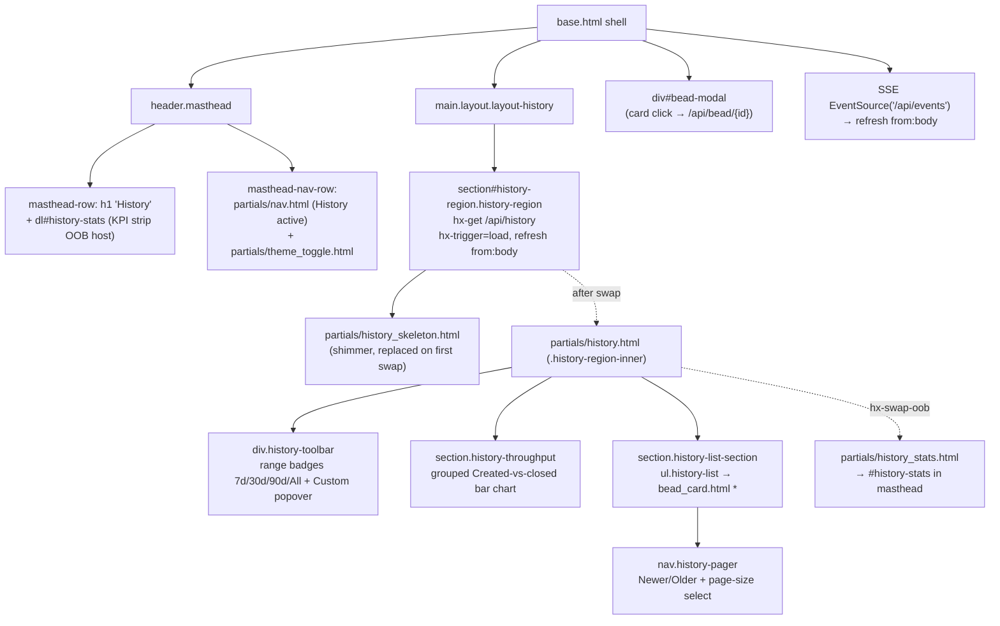
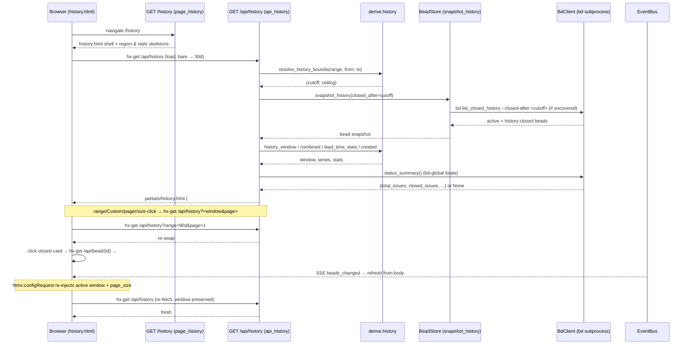

# History (/history)

## Overview

| Route | Auth | Purpose |
| --- | --- | --- |
| `GET /history` | None (single-user localhost dashboard; the History page is read-only, so there are no CSRF-guarded writes on it at all) | The full-page History view: a long-window retrospective on closed beads — a range/custom-date control, a masthead KPI strip (avg lead, median lead, closed-in-range, throughput), a grouped "Created vs closed" per-day bar chart, and a paginated newest-closed-first list whose cards open the shared bead modal. A cheap shell that hydrates its single `#history-region` from `GET /api/history` over HTMX. |

The page is one of bdboard's three server-rendered views (Board `/`,
History `/history`, Memory `/memory`), each extending `base.html` and
hydrating its data region with HTMX rather than blocking the route on a `bd`
subprocess. It is the long-window complement to the board's short 12h/1d/3d
lane filter and 50-cap closed lane.

## URL Params

The **page** route `GET /history` takes **no path or query parameters** — it is
a static shell (it only runs a workspace-validity check, then renders
`history.html`). Every parameter below is sent by the in-region controls to the
**API** endpoint `GET /api/history`, not to this page route. They are listed
here because they are the user-facing state of the view.

| Param | Type | Required | Notes |
| --- | --- | --- | --- |
| _(none on the page route)_ | — | — | `GET /history` accepts no path/query params; it renders `history.html` unconditionally after `_validate_or_warn()` passes. |
| `range` _(on `GET /api/history`)_ | `str` (query) | No | One of `7d` / `30d` / `90d` / `all`; selects the time window. Defaults to `derive.DEFAULT_HISTORY_RANGE` (`"30d"`); unknown/empty values degrade to the default inside `derive`. Bound as `range: str = derive.DEFAULT_HISTORY_RANGE` in `api_history`. |
| `page` | `int` (query) | No | 1-based page of the paginated closed list. Defaults to `1`; clamped to `max(1, page)` so a non-positive value can't break paging. |
| `page_size` | `int \| None` (query) | No | Rows per page. Clamped by `derive.clamp_page_size` to the allowed set `{25, 50, 100}`; missing/invalid → default `50` (`derive.HISTORY_PAGE_SIZE`). |
| `from_date` | `str \| None` (query) | No | Custom-window inclusive lower bound, `YYYY-MM-DD`. When it (or `to_date`) parses, it **supersedes** `range=` and flips the control to the synthetic `custom` preset. Parsed by `derive._parse_date`. |
| `to_date` | `str \| None` (query) | No | Custom-window upper bound, `YYYY-MM-DD`. Treated as an **exclusive** start-of-next-day ceiling (so a `to` of `2026-05-30` includes everything on the 30th). Inverted `from`/`to` are swapped by `derive.custom_bounds`. |

## What It Does

The History view is bdboard's retrospective surface — it answers "what got
done, how fast, and at what rate?" over a long window, where the board only
shows the live now. It lets a maintainer:

- **Pick a window** — `7d` / `30d` / `90d` / `All` presets, or a **Custom**
  from/to date range via a popover anchored to the toolbar. The default is
  `30d`.
- **Read range-scoped KPIs** in the masthead — average lead (mean claim→close
  cycle time), closed-all-time and total (workspace-global, via `bd`), closed
  in range, median lead (filed→closed), and throughput (closed/day) — all but
  the `bd`-global pair recomputed for the active window.
- **See throughput at a glance** — a single day-bucketed grouped-bar chart
  plotting **created** (violet, hatched) against **closed** (blue) per day on
  one shared y-axis, so net flow / backlog burn reads instantly.
- **Browse the closed beads** — a paginated, newest-closed-first list of cards;
  clicking a card opens the **shared** bead modal (reused, not rebuilt).

Because the page is a thin shell, navigating to `/history` paints instantly
(masthead + a stats skeleton + a region skeleton), then the real region streams
in from `GET /api/history` (default 30-day window). The KPI strip is delivered
in the **same** response as an `hx-swap-oob` fragment that targets the masthead
`#history-stats` host, so charts/list and header stats stay in sync on every
range change and SSE refresh with a single round-trip.

> [!NOTE]
> The History data lives in one `#history-region` swap target. Every range
> button, the Custom Apply form, the pager, and the page-size selector
> re-fetch `GET /api/history` with `hx-target="#history-region"`, so the entire
> control surface stays server-driven with **zero** client framework.

## User Actions

- **Load the page** → the region's `hx-trigger="load"` immediately fetches
  `GET /api/history` (bare, so the server default 30d window) and swaps in the
  range control, chart, KPI strip (OOB into the masthead), and closed list.
- **Click a range preset (`7d`/`30d`/`90d`/`All`)** → `hx-get="/api/history?range=<r>&page=1&page_size=<active>"`
  re-swaps `#history-region` for that window; the clicked badge reads
  `aria-pressed="true"`.
- **Click "Custom"** → toggles a popover (`#history-custom-range`, a real
  `<form role="dialog">`) holding `from`/`to` date inputs plus **Apply** and
  **Clear**. The `base.html` JS handles open/close, click-outside, and `Esc`.
- **Submit the Custom form (Apply)** → `hx-get="/api/history"` serialises
  `from_date`/`to_date` (+ `page=1`, `page_size`); they supersede `range=`, the
  region re-swaps, and the popover re-renders hidden (self-closing).
- **Click "Clear" in the popover** → `hx-get="/api/history?range=<range_key>&page_size=<active>"`
  drops the custom window and returns to the active preset.
- **Click "‹ Newer" / "Older ›"** → the pager re-fetches the adjacent page
  within the current window (`window_qs` preserves the custom range when one is
  active), re-swapping the region.
- **Change "Per page" (25/50/100)** → `hx-trigger="change"` resets to page 1 and
  re-swaps with the chosen size; `base.html` mirrors the choice into
  `localStorage['bdboard-history-page-size']` so it survives reloads/navigation.
- **Click a closed-bead card** → `hx-get="/api/bead/{id}"` targeting
  `#bead-modal` opens the shared bead detail modal (same component the board
  uses).
- **A change in another tab / on disk** → the page's SSE subscription fires
  `refresh from:body`, re-fetching `GET /api/history` so the view stays live
  without a reload. The `base.html` `htmx:configRequest` hook re-injects the
  active window + page size onto these bare fetches so SSE doesn't snap you back
  to 30d.

## Components

| Component | Responsibility | File |
| --- | --- | --- |
| Page shell + masthead | The full-page template: masthead (brand `History`, stats host, nav, theme toggle) and the `#history-region` swap target with its skeleton. | `src/bdboard/templates/history.html` |
| Page route | Validates the workspace then renders `history.html` (cheap shell, no `bd` call). | `src/bdboard/app.py` → `page_history` (`GET /history`) |
| Region partial | Renders the range/Custom control, the "Created vs closed" chart, the paginated closed list + pager, and includes the stats fragment as an OOB swap. The single HTMX swap target body. | `src/bdboard/templates/partials/history.html` |
| Stats fragment (OOB) | The KPI `<dl class="counts history-stats">` delivered `hx-swap-oob="true"` into the masthead `#history-stats`; carries `bd`-global totals + range-derived KPIs and an info-icon popover per cell. | `src/bdboard/templates/partials/history_stats.html` |
| Loading skeleton | Shimmer placeholders mirroring the region layout (range bar, one chart, closed list) shown until the first `/api/history` swap; `aria-hidden`. | `src/bdboard/templates/partials/history_skeleton.html` |
| Stats skeleton (masthead) | Reserves the KPI columns in the masthead with shimmer cells until the OOB stats `<dl>` lands. | `src/bdboard/templates/partials/counts_skeleton.html` (included with `cells = 6`) |
| Shared bead card | The clickable closed-bead tile (`meta="history"`, `show_closed_when=true`); opens the bead modal. Same partial the board lanes use. | `src/bdboard/templates/partials/bead_card.html` |
| Primary nav | The shared Board/History/Memory nav; marks History active via `aria-current="page"`. | `src/bdboard/templates/partials/nav.html` |
| Theme toggle | Light/dark toggle shared across pages. | `src/bdboard/templates/partials/theme_toggle.html` |
| Region endpoint | Resolves the window once, pulls a window-bounded snapshot, derives the window/series/stats, and renders `partials/history.html` (+ OOB stats). | `src/bdboard/app.py` → `api_history` (`GET /api/history`) |
| Snapshot source | Returns active + history-closed beads bounded by `closed_after`, with a window-aware cache (a wider cached window covers narrower sub-windows). | `src/bdboard/store.py` → `BeadStore.snapshot_history`, `_load_history`, `_history_covers` |
| Window resolver | Single source of truth for `(cutoff, ceiling)`: custom from/to supersede the preset; shared by the route's `--closed-after` bound and every derive slice. | `src/bdboard/derive/history.py` → `resolve_history_bounds` / `_resolve_bounds`, `custom_bounds`, `_range_to_cutoff`, `_parse_date` |
| Paginated list derive | Closed beads in `[cutoff, ceiling)`, newest-closed first, sliced into `{items, page, page_size, total, has_more}`. | `src/bdboard/derive/history.py` → `history_window` (over `_closed_in_window`) |
| Per-day series derive | Closed-per-day, created-per-day, and the merged created+closed timeline feeding the grouped chart; plus gap-free day fill. | `src/bdboard/derive/history.py` → `throughput`, `created`, `combined`, `_daily_count_series`, `_bucket_by_day`, `_fill_daily_series`, `_iter_day_span` |
| KPI derive | Lead/cycle-time stats over closed beads in the window: `n`, median/p90 lead, median/p90/avg cycle. | `src/bdboard/derive/history.py` → `lead_time_stats` (+ `_percentile`) |
| Page-size clamp | Coerces `page_size` to `{25,50,100}`, default 50 — one place both the route and tests agree on. | `src/bdboard/derive/history.py` → `clamp_page_size` |
| `bd`-global summary | Workspace-wide totals (`total_issues`, `closed_issues`, …) for the non-range KPI cells; `None` on any `bd` hiccup so the cells gracefully omit. | `src/bdboard/store.py` → `BeadStore.bd.status_summary` |
| Time helpers | ISO parsing, epoch sort key, local-day bucketing, and the `humanize_ts` / `humanize_hours` Jinja filters used by the cards + KPI strip. | `src/bdboard/derive/timeutil.py` → `_parse_dt`, `_epoch`, `_day_bucket`, `humanize_ts`, `humanize_hours` |
| SSE bus | Fan-out of `beads_changed` to every open tab so a bead closing while you watch appears live. | `src/bdboard/events.py` → `EventBus`; `src/bdboard/app.py` → `bus` |
| Window/size persistence JS | Re-injects the active window + persisted page size onto bare (load/SSE) `/api/history` fetches via `htmx:configRequest`; manages the Custom popover open/close. | `src/bdboard/templates/base.html` (`htmx:configRequest` handlers, custom-popover JS) |

## State Management

| State | Source | Updated by |
| --- | --- | --- |
| Closed-bead page (`window.items`, `window.total`, `window.page`, `window.has_more`, `window.page_size`) | `derive.history_window` over `store.snapshot_history(closed_after=cutoff)`. | The region's `hx-get="/api/history"` on `load`, on every range/Custom/pager/size click, and on `refresh from:body` (SSE) — each returns a fresh `#history-region` swap. |
| Active window (`range_key`, `is_custom`, `active_range`, `from_date`, `to_date`) | Query params resolved by `derive.resolve_history_bounds`; `active_range` is `"custom"` when a from/to parses, else `range_key`. | Range badges set `range=`; the Custom Apply form sets `from_date`/`to_date`; Clear returns to `range=`. On bare load/SSE fetches the `base.html` `htmx:configRequest` hook re-reads the active window from the DOM and re-injects it so the window survives. |
| KPI strip (`stats`, `created_total`, `avg_per_day`, `bd_summary`) | `derive.lead_time_stats` + `derive.created` totals + `BeadStore.bd.status_summary`, rendered into `history_stats.html`. | Recomputed on every `/api/history` response and swapped **out-of-band** into `#history-stats`; `aria-live="polite"` announces the change. |
| Chart series (`combined_series`, `combined_peak`, `created_total`) | `derive.combined` (created+closed per day) with a shared peak for comparable bar scaling. | Recomputed per request for the resolved window; empty window → "No beads created or closed…" message. |
| Page size | The `#history-page-size-select` value, rendered `selected` server-side from `active_page_size`. | User `change` (resets to page 1) + `localStorage['bdboard-history-page-size']`; the JS injects the persisted size onto bare fetches (skipping the server default 50). |
| Custom popover open state | `#history-custom-toggle` `aria-expanded` + the `hidden` attribute on `#history-custom-range`. | `base.html` JS toggles it on click; click-outside and `Esc` close it; the server **always** renders it hidden, so Apply/Clear/any preset dismiss it for free. |
| Live-connection indicator (`#live-dot` / `#live-status`) | The shared `EventSource('/api/events')` in `base.html`. | `open` → `live · push`; `error` → `reconnecting…`; `beads_changed` → dispatches `refresh` on `<body>`. |

## Data Flow

## API Dependencies

| Endpoint | Used for | -> Endpoint doc |
| --- | --- | --- |
| `GET /api/history` | Initial region load, every range/Custom/pager/page-size change, and SSE-driven re-fetch of the whole `#history-region` (+ the OOB masthead stats). | [GET /api/history](../Endpoints/index.md) |
| `GET /api/bead/{id}` | Opening the shared bead detail modal when a closed-bead card is clicked. | [GET /api/bead/{id}](../Endpoints/index.md) |
| `GET /api/events` | The shared SSE subscription (in `base.html`) that fires `refresh from:body` so the history view stays live across tabs. | [GET /api/events](../Endpoints/index.md) |

## States

- **Loading.** On first paint the masthead renders a 6-cell stats skeleton
  (`#history-stats`, `aria-busy="true"`) and `#history-region` renders
  `partials/history_skeleton.html` — a range bar, one chart block, and six list
  rows, all shimmer — with `aria-busy="true"`. The `hx-trigger="load"` fetch
  replaces both on the first swap (the stats land via OOB). The skeleton mirrors
  the real layout so there is no jump when data arrives.
- **Empty (nothing closed/created to chart).** When the window has no charting
  data, `history.html` shows *"No beads created or closed to chart in
  &lt;window&gt;."* via `.history-empty` instead of the bar chart.
- **Empty (no closed beads in window).** The closed-list section shows *"Nothing
  closed in the last &lt;window&gt; — try a wider range."* (or, for a custom
  window, *"Nothing closed in &lt;from to to&gt; — try a wider range."*).
- **Empty (page past the end).** If `page > 1` but the slice is empty, it shows
  *"Nothing on page N —"* with a **"back to page 1"** link button that
  re-fetches `?<window_qs>&page=1`.
- **`bd` summary unavailable.** `status_summary()` returns `None` on any `bd`
  hiccup; `history_stats.html` simply omits the Total/Closed-all-time cells and
  leaves the range-derived KPIs as the primary surface — the masthead degrades
  gracefully rather than erroring.
- **KPI "no data" cells.** Cells whose metric is `None`/`0` (e.g. `avg_cycle_h`,
  `median_lead_h`, zero throughput) render an em-dash via `humanize_hours` and
  carry the `.counts-cell-zero` muting class so empty windows read cleanly.

> [!WARNING]
> An SSE-driven `refresh from:body` re-fetches a **bare** `/api/history`. Left
> alone, the server would resolve the default 30d window and silently discard
> the user's selected range/custom dates — on a busy workspace SSE fires
> constantly, so the filter would look broken (bdboard-li44). The fix lives in
> `base.html`'s `htmx:configRequest` hook, which re-injects the active window
> (and persisted page size) onto bare fetches; explicit control clicks already
> carry their window and are left untouched.

## Accessibility

- **Range control is a labelled group.** `.history-ranges` is
  `role="group" aria-label="History time range"`; each preset badge is a
  `<button>` with `aria-pressed` reflecting the active window and a descriptive
  `aria-label` (*"Show history for the last 30 days"*). State is signalled by
  the `.filter-badge-active` styling **and** `aria-pressed`, not colour alone.
- **Custom range is a real dialog.** The Custom toggle carries
  `aria-haspopup="dialog"`, `aria-controls`, and `aria-expanded`; the popover is
  a `<form role="dialog" aria-label="Custom date range">` so Enter submits and
  the from/to inputs have semantic `` labels + `aria-label`s. `Esc` and
  click-outside close it (handled in `base.html`).
- **Chart is not colour-only.** `.history-throughput` is `aria-label`-ed; the
  created series carries a diagonal **hatch** (not just violet) so it survives
  greyscale/colour-blind viewing, a legend names each series with its count, and
  the chart plus every day cell carry text `aria-label`s conveying both counts,
  the peak, and the date span. The numeric peak/count labels are
  `aria-hidden` because the parent `aria-label` already announces them.
- **Live KPI strip is announced.** `#history-stats` is
  `role="status" aria-live="polite"`, so range changes are announced without the
  region stealing focus. Each KPI cell has an info-icon `<button>` tied to its
  explanation via `aria-describedby` so the fuller "claim→close vs created→close,
  range scope" wording is always available to AT, not just on hover.
- **Skeletons hidden from AT.** Both skeletons are `aria-hidden`; the region and
  stats host carry `aria-busy` while loading so assistive tech waits for the
  real data (which announces via its own `aria-live`) rather than reading
  shimmer.
- **Pager is navigable and labelled.** `.history-pager` is
  `<nav aria-label="History pages">`; Newer/Older buttons carry `aria-label`s,
  the page indicator is plain text, and the page-size `<select>` has
  `aria-label="Closed beads per page"`.
- **Active nav uses non-colour cues.** The History nav link is marked by ink
  colour **and** bold weight **and** an inset baseline rule plus
  `aria-current="page"` — not colour alone.
- **Cards are keyboard-reachable.** Closed-bead cards open the modal via HTMX;
  the shared bead modal traps focus and closes on backdrop click / `Esc` (see
  `base.html` `#bead-modal`).

## Responsive Behavior

- The page uses `.layout-history`, a vertical-scrolling column layout (unlike
  the dashboard's horizontal lanes row), so the toolbar → chart → list stack
  flows top-to-bottom and scrolls as one column.
- The **two-row masthead** keeps the brand + KPI strip on the top row and the
  nav + theme toggle on the second row; the KPI `dl.counts` strip reuses the
  board's masthead-counts typography/spacing so the columns reflow consistently
  on narrow screens.
- The **"Created vs closed" chart** lives in a **fixed-height** container
  (`.throughput-chart`) so it can never collapse to zero height; the grouped
  per-day bar pairs flex across the available width, with day labels shown as
  `MM-DD` (the `day[5:]` slice) to stay compact.
- The **range toolbar** wraps its badges; the **Custom popover** is
  absolutely positioned relative to its toggle (a `position: relative` wrapper)
  so it anchors to the badge rather than the toolbar row regardless of width.
- The **closed list** is a single-column stack of `.history-card`s that wrap
  fluidly; the pager keeps Newer/Older, the page indicator, and the per-page
  select on one row that wraps on small viewports.

## Related

- [Views index](index.md) — the three pages; Board (`/`) and Memory
  (`/memory`) are this view's siblings (shared masthead, nav, and SSE wiring).
- [Memory (/memory)](MemoryView.md) — the sibling full-page view this one mirrors
  in shell structure (cheap shell + single HTMX-hydrated region).
- [History & Analytics](../Features/index.md) — the end-to-end feature this page
  is the surface for.
- [Live Updates](../Features/index.md) — the cross-tab live refresh this page
  participates in via `refresh from:body`.
- [Endpoints index](../Endpoints/index.md) — GET /api/history, GET /api/bead/{id},
  GET /api/events.
- [bd CLI as Source of Truth](../Concepts/BdCliSourceOfTruth.md) — why this page
  reads its data through `bd` snapshots instead of touching `.beads/` directly.
- [Store Snapshot & Change Detection](../Concepts/StoreSnapshotChangeDetection.md)
  — the window-aware history cache behind `snapshot_history`.
- [Derive Layer](../Concepts/DeriveLayer.md) — the pure `derive.history`
  functions that shape the window, series, and KPIs.
- [SSE Event Bus](../Concepts/SseEventBus.md) — the `beads_changed` broadcast
  that keeps this view live across tabs.
- [Filesystem Watcher](../Concepts/FilesystemWatcher.md) — the `.beads/` change
  detection that triggers those broadcasts.
- [Back to docs index](../index.md)
