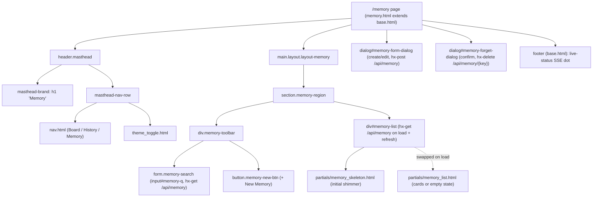
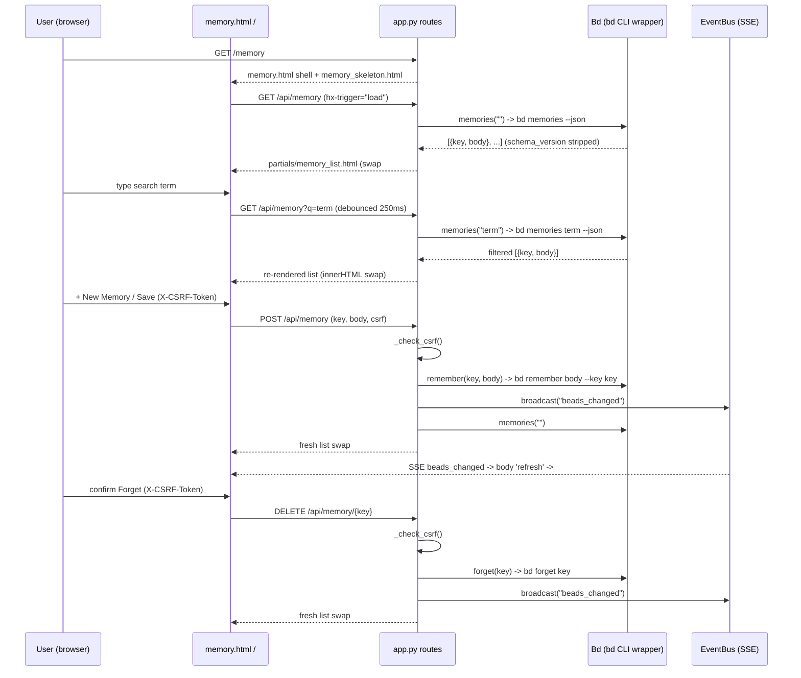

# Memory Page (/memory)

## Overview

| Route | Auth | Purpose |
| --- | --- | --- |
| `GET /memory` | None (localhost single-user tool); list reads are unauthenticated, mutating POST/DELETE are guarded by a double-submit CSRF token | Browse, search, create/update, and delete the workspace's `bd` memories — the notes injected into every agent session at `bd prime` |

The page itself is a cheap, non-blocking shell: `page_memory` renders
`memory.html` (which extends `base.html`) instantly with a skeleton, then the
real list hydrates via an HTMX `load` fetch to `/api/memory`. The route never
blocks on a `bd` subprocess — every `bd`-backed read/write happens on the
`/api/memory` endpoints.

## URL Params

The `/memory` page route itself takes **no** path or query params. The search
term is sent on the *partial* fetch to `/api/memory`, not on the page URL.

| Param | Type | Required | Notes |
| --- | --- | --- | --- |
| _(none on the page route)_ | — | — | `GET /memory` ignores all query params; it always renders the same shell |
| `q` (on `/api/memory`) | string (query) | No | Search term forwarded to `bd memories <term> --json`; empty/omitted lists all memories. Sent by the debounced search input's `hx-get`, not part of the `/memory` URL |
| `key` (on `DELETE /api/memory/{key:path}`) | string (path) | Yes | Memory key to forget; `:path` so keys containing `/` survive; client URL-encodes via `encodeURIComponent` |

## What It Does

The Memory page is the single human-facing surface for the `bd` memory store.
On load it paints a four-card shimmer skeleton, then swaps in the live list of
`{key, body}` memories (alphabetical by key, bodies rendered from markdown).
A debounced search box filters server-side; a `+ New Memory` button opens a
modal `<dialog>` to create or update a memory; each card carries edit and
forget affordances. Forgetting requires explicit confirmation in a second
modal because a stray forget silently degrades every future agent session. The
list re-fetches live whenever the watcher detects a `.beads/` change (SSE
`refresh from:body`), so mutations made elsewhere (other tabs, the `bd` CLI)
appear without a manual reload.

## User Actions

- **Search** — type in the search box; after a 250 ms debounce the list region
  re-fetches `/api/memory?q=<term>` and swaps in matches. Clearing the native
  search input re-fires (`search` event) and returns to the full list.
- **Create / update a memory** — click `+ New Memory`, fill Key + Body, Save.
  The form POSTs to `/api/memory` (upsert: existing key → body replaced).
- **Edit a memory** — click the edit button on a card; the form dialog opens
  pre-filled with that memory's key (read-only — keys can't be renamed via
  `bd remember`) and body. Save POSTs the new body.
- **Forget a memory** — click the forget button; a confirm dialog opens with
  the key shown and a warning. Confirming issues `DELETE /api/memory/<key>`.
- **Toggle theme** — the shared theme toggle in the masthead second row.
- **Navigate** — the shared `nav.html` links to Board (`/`) and History
  (`/history`).

## Components

| Component | Responsibility | File |
| --- | --- | --- |
| Page shell | Full-page memory view; masthead + toolbar + list region; never blocks on `bd` | `src/bdboard/templates/memory.html` |
| Base layout | `<head>`, HTMX + SSE wiring, theme bootstrap, footer live-status, shared body block | `src/bdboard/templates/base.html` |
| Primary nav | Board / History / Memory links with `aria-current` on the active page | `src/bdboard/templates/partials/nav.html` |
| Theme toggle | Light/dark switch (shared, `aria-pressed`) | `src/bdboard/templates/partials/theme_toggle.html` |
| List skeleton | Four shimmer cards shown until the first `/api/memory` swap; `aria-hidden` | `src/bdboard/templates/partials/memory_skeleton.html` |
| List partial | The HTMX swap target: result-count status + memory cards (key heading + markdown body + edit/forget buttons) or empty state | `src/bdboard/templates/partials/memory_list.html` |
| Create/Edit dialog | Native modal `<dialog>` with key + body fields; posts to `/api/memory`; `editMemory()` pre-fills + locks key | `src/bdboard/templates/memory.html` (`#memory-form-dialog`, JS `editMemory`) |
| Forget confirm dialog | Native modal warning; `confirmForget()` wires `hx-delete` to the right key URL | `src/bdboard/templates/memory.html` (`#memory-forget-dialog`, JS `confirmForget`) |
| Page route handler | Renders the shell, surfaces workspace validation errors | `src/bdboard/app.py:page_memory` |
| List/search handler | `bd memories(q)` → renders `memory_list.html`; degrades to friendly message on `bd` failure | `src/bdboard/app.py:api_memory` |
| Create/update handler | CSRF-checked `bd remember`; broadcasts SSE; re-renders list | `src/bdboard/app.py:api_memory_create` |
| Delete handler | CSRF-checked `bd forget`; broadcasts SSE; re-renders list | `src/bdboard/app.py:api_memory_delete` |

## State Management

| State | Source | Updated by |
| --- | --- | --- |
| Memory list (`[{key, body}]`) | `bd memories [term] --json` via `Bd.memories()` (TTL-cached, semaphore-gated) | First `load` swap, debounced search swap, post-mutation re-render, and SSE `refresh from:body` |
| Search term (`q`) | The `#memory-q` `<input type="search">` value | User keystrokes → `hx-get="/api/memory"` on `keyup changed delay:250ms, search`; `hx-sync="this:replace"` cancels in-flight |
| `aria-busy` on `#memory-list` | Set `true` in the template; flipped `false` after each settle | `base.html` global `htmx:afterSettle` handler clears `aria-busy` on any settled region |
| Dialog open/closed + mode | Native `<dialog>` modal state + `editMemory`/`confirmForget`/`close` JS | `showModal()`/`close()`; the form-dialog `close` listener resets title/key/body so the next "New Memory" starts fresh |
| Forget target key | `#forget-key-display` text + `hx-delete` attribute on `#forget-confirm-btn` | `confirmForget(key)` sets both, then `htmx.process()` re-parses the button so HTMX sees the new URL |
| CSRF token | `secrets.token_urlsafe(32)` injected as a Jinja global at startup | `app.py` `_CSRF_TOKEN` → `TEMPLATES.env.globals["csrf_token"]`; sent via `hx-headers` (`X-CSRF-Token`) and a hidden `csrf_token` form field |
| Live-status (SSE connection) | `EventSource('/api/events')` in `base.html` | `open`/`error`/`beads_changed` listeners update `#live-status` + `#live-dot` |

## Data Flow

## API Dependencies

| Endpoint | Used for | Doc |
| --- | --- | --- |
| `GET /api/memory?q=` | Initial list hydration + debounced server-side search; renders `memory_list.html` | [MemoryApi](../Endpoints/MemoryApi.md) |
| `POST /api/memory` | Create/update (upsert) a memory via `bd remember`; CSRF-guarded; returns fresh list | [MemoryApi](../Endpoints/MemoryApi.md) |
| `DELETE /api/memory/{key:path}` | Forget a memory via `bd forget`; CSRF-guarded; returns fresh list | [MemoryApi](../Endpoints/MemoryApi.md) |
| `GET /api/events` | SSE stream; a `beads_changed` event triggers a `refresh` on `<body>`, re-fetching `#memory-list` | [SseEvents](../Endpoints/SseEvents.md) |

## States

- **Loading** — `#memory-list` ships with `partials/memory_skeleton.html`
  (four shimmer cards, `aria-hidden="true"`) and `aria-busy="true"`. The first
  `/api/memory` swap replaces the skeleton; `base.html`'s `htmx:afterSettle`
  handler flips `aria-busy` to `false`. No blank flash, no layout jump.
- **Empty (no memories at all)** — `memory_list.html` renders the count (`0
  memories`) plus a guidance line: *"No memories yet — click + New Memory or
  run `bd remember` to add one."*
- **Empty (no search matches)** — when `q` is set but nothing matches, the
  count reads `0 matching "<q>"` and the body shows *"No memories matching
  "<q>"."*
- **Populated** — count (`N memory`/`N memories`, or `N matching "<q>"`) in an
  `aria-live="polite"` region, then a `<ul class="memory-list">` of cards
  (monospace key heading + markdown-rendered `.prose` body + edit/forget).
- **Error (list)** — if `bd memories` raises, `api_memory` returns HTTP 200
  with a friendly inline `role="status" aria-live="polite"` message
  (*"Couldn't load memories right now. Please try again in a moment."*) rather
  than 500-ing and breaking the swap.
- **Error (create)** — empty key/body → HTTP 400 `role="alert"` message; a
  `bd remember` failure → HTTP 500 `role="alert"` (*"Could not save: …"*).
- **Error (delete)** — empty key → HTTP 400; a `bd forget` failure → HTTP 500
  `role="alert"` (*"Could not delete: …"*).
- **Error (CSRF)** — a missing/invalid token on POST/DELETE raises HTTP 403
  ("Invalid or missing CSRF token. Please refresh the page and try again.").
- **Error (workspace)** — if `_validate_or_warn()` fails, `GET /memory` returns
  `error.html` with HTTP 500 instead of an empty page.

## Accessibility

- **Search control** — wrapped in `role="search"`; the input has both a visible
  `<label for="memory-q">` and an `aria-label`, with `autocomplete=off`,
  `autocapitalize=none`, `spellcheck=false`.
- **Live regions** — the result-count `
` is
  `role="status" aria-live="polite"` so screen readers hear filter/result
  changes; the list-load error reuses the same polite pattern.
- **Loading announcement** — the skeleton is `aria-hidden="true"` so assistive
  tech waits for the real list (which self-announces via its count); `aria-busy`
  on `#memory-list` marks the region as loading until settle.
- **Modals** — native `<dialog>` elements (`showModal()`) trap focus
  automatically; each is `aria-labelledby` its title. The edit flow moves focus
  to the body textarea (`bodyInput.focus()`).
- **Buttons** — `+ New Memory` has `aria-haspopup="dialog"`; each card's
  edit/forget buttons have descriptive `aria-label`s ("Edit `<key>`" / "Forget
  `<key>`") and `title`s, so the emoji glyphs aren't the sole label.
- **Destructive friction** — forget is a two-step confirm with an explicit
  warning explaining the `bd prime` injection consequence; nothing deletes on a
  single click.
- **Focus visibility** — `.memory-search-input:focus-visible` draws a 2px
  `--brand-blue` outline (offset 1px) for keyboard users.
- **Nav** — the active page link carries `aria-current="page"` and uses three
  non-colour cues (ink + bold + baseline rule), satisfying WCAG 2.2 AA's
  not-by-colour-alone requirement.
- **Contrast** — colours come from the shared light/dark token palette in
  `styles.css`, authored to WCAG AA; the theme toggle exposes `aria-pressed`.

## Responsive Behavior

- The page uses `.layout.layout-memory`, which switches from the dashboard's
  flex lane row to a single scrollable block column (`display: block; overflow:
  auto`).
- `.memory-region` is a vertical flex column capped at `max-width: 760px` and
  centered (`margin: 0 auto`), so the reading column stays comfortable on wide
  screens and fills the viewport on narrow ones (`width: 100%`).
- Cards (`.memory-card`) are full-width within that column; keys use
  `word-break: break-word` so long slugs wrap rather than overflow.
- The shared masthead breakpoints (`@media (max-width: 900px)` and below in
  `styles.css`) collapse the two-row masthead for small screens; the memory
  column simply reflows since it's a single linear column with no multi-column
  grid to break.
- Motion respects `@media (prefers-reduced-motion: reduce)` (skeleton shimmer
  and transitions are disabled), so the loading state degrades gracefully.

## Related

- [Memory management (Feature)](../Features/MemoryManagement.md) — the feature
  this page is the UI for.
- [Memory API (/api/memory)](../Endpoints/MemoryApi.md) — the endpoints this
  page calls for list/search/create/delete.
- [SSE events (/api/events)](../Endpoints/SseEvents.md) — the live-refresh
  stream that re-fetches the list on `.beads/` changes.
- [Board page (/)](BoardPage.md) and [History page (/history)](HistoryPage.md) —
  sibling pages sharing the masthead, nav, and shell pattern.
- [bd CLI as runtime source of truth](../Concepts/BdCliSourceOfTruth.md) — why
  every memory read/write shells out to `bd`.
- [HTMX + server-rendered partials](../Concepts/HtmxPartialsArchitecture.md) —
  the swap/partial pattern this page is built on.
- [Architecture](../Architecture.md) — system-wide view & API surface.
