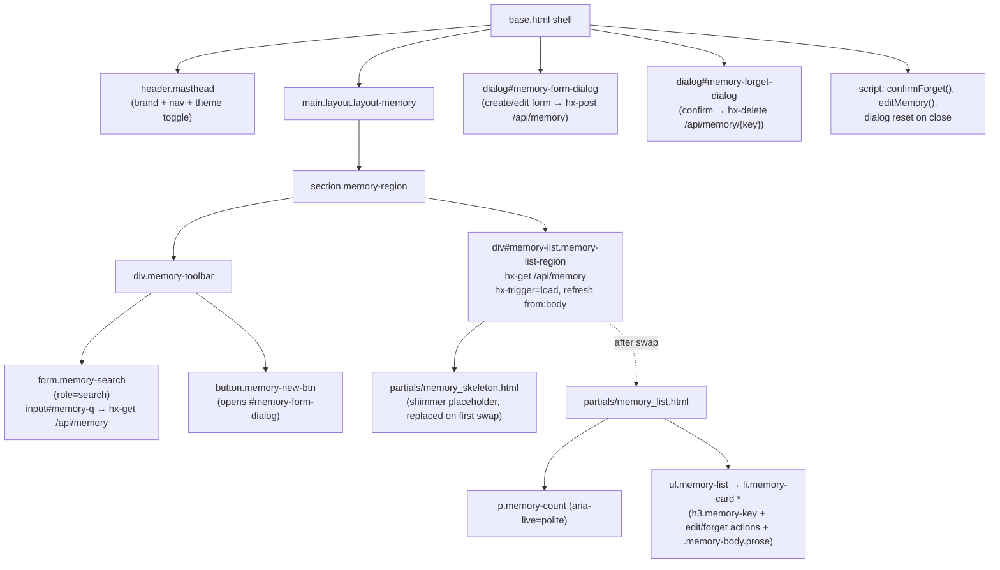
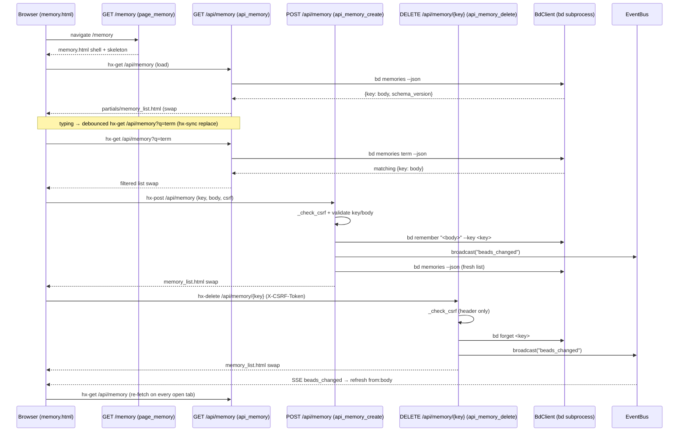

# Memory (/memory)

## Overview

| Route | Auth | Purpose |
| --- | --- | --- |
| `GET /memory` | None (single-user localhost dashboard; writes are CSRF-guarded, reads are not) | The full-page Memory curation surface: browse, search, create/update, and forget the `bd` memories that are injected at `bd prime`. A cheap shell that hydrates its list region from `GET /api/memory` over HTMX and mutates via `POST`/`DELETE /api/memory`. |

The page is one of bdboard's three server-rendered views (Board `/`,
History `/history`, Memory `/memory`), each extending `base.html` and
hydrating its data region with HTMX rather than blocking the route on a `bd`
subprocess.

## URL Params

The **page** route `GET /memory` takes **no path or query parameters** — it is
a static shell. The single user-supplied parameter in the Memory feature, the
search term `q`, is sent by the search input to the **API** endpoint
`GET /api/memory`, not to this page.

| Param | Type | Required | Notes |
| --- | --- | --- | --- |
| _(none on the page route)_ | — | — | `GET /memory` accepts no path/query params; it renders `memory.html` unconditionally (after a workspace validity check). |
| `q` _(on `GET /api/memory`)_ | `str` (query) | No | The search term the list region sends. Empty/whitespace → list all. Forwarded verbatim to `bd memories <term> --json`, which does bd's own case-insensitive substring match across key + body. Bound as `q: str = ""` in `api_memory`. |

## What It Does

The Memory view is bdboard's window onto the workspace's **`bd` memories** —
the persistent `key → body` notes that bd re-injects into every agent session
at `bd prime`. It lets a maintainer:

- **See** every memory as a card (monospace key heading + markdown-rendered
  body), with a live result count.
- **Search** them by substring with a 250 ms debounced, server-side filter that
  reuses bd's own matching (no client-side filtering, no re-implemented search).
- **Create or update** a memory through a modal form (upsert: an existing key's
  body is replaced).
- **Forget** a memory behind an explicit confirmation dialog, because a stray
  forget silently degrades every future agent session that relied on it.

Because the page is a thin shell, navigating to `/memory` paints instantly
(masthead + search strip + a shimmer skeleton), then the real list streams in
from `GET /api/memory`. Mutations re-render the list optimistically and also
fire an SSE `beads_changed` broadcast so every other open tab refreshes too.

## User Actions

- **Load the page** → the list region's `hx-trigger="load"` immediately fetches
  `GET /api/memory` and swaps in the full memory list.
- **Type in the search box** → debounced `keyup changed delay:250ms` posts `q`
  to `GET /api/memory`; `hx-sync="this:replace"` cancels any in-flight search so
  only the latest term wins. Clearing the native search field re-fires via the
  `search` event and returns to the full list.
- **Click "+ New Memory"** → opens the `<dialog id="memory-form-dialog">` modal
  (native `<dialog>.showModal()` traps focus). Submitting `POST`s key + body to
  `/api/memory` and swaps the returned fresh list into `#memory-list`.
- **Click the edit (pencil) button on a card** → `editMemory(key, body)` pre-fills the
  same modal, makes the key field `readonly` (you can't rename a key via
  `bd remember`), and submits the same `POST` (upsert replaces the body).
- **Click the forget (trash) button on a card** → `confirmForget(key)` opens the
  separate confirm dialog with the key pre-filled and points the confirm
  button's `hx-delete` at `/api/memory/<urlencoded key>`. Confirming issues the
  `DELETE`.
- **A change in another tab / on disk** → the page's SSE subscription fires
  `refresh from:body`, re-fetching `GET /api/memory` so the list stays live
  without a reload.

## Components

| Component | Responsibility | File |
| --- | --- | --- |
| Page shell + masthead + toolbar + dialogs | The full-page template: masthead (brand/nav/theme), search strip, list region, create/edit dialog, forget-confirm dialog, and the wiring `<script>`. | `src/bdboard/templates/memory.html` |
| Page route | Validates the workspace then renders `memory.html` (cheap shell, no bd call). | `src/bdboard/app.py` → `page_memory` (`GET /memory`) |
| List partial | Renders the result-count status + memory cards (or an empty state). HTMX swap target for every list fetch. | `src/bdboard/templates/partials/memory_list.html` |
| Loading skeleton | Shimmer placeholder cards shown until the first `/api/memory` swap; `aria-hidden`. | `src/bdboard/templates/partials/memory_skeleton.html` |
| Primary nav | The shared Board/History/Memory nav; marks Memory active via `aria-current="page"`. | `src/bdboard/templates/partials/nav.html` |
| Theme toggle | Light/dark toggle shared across pages. | `src/bdboard/templates/partials/theme_toggle.html` |
| List read endpoint | Renders the list region from `bd memories(q)`; degrades to a friendly inline message on bd failure. | `src/bdboard/app.py` → `api_memory` (`GET /api/memory`) |
| Create/update endpoint | CSRF-guards, validates key/body, calls `bd.remember`, broadcasts SSE, returns the fresh list. | `src/bdboard/app.py` → `api_memory_create` (`POST /api/memory`) |
| Delete endpoint | CSRF-guards (header only), calls `bd.forget`, broadcasts SSE, returns the fresh list. | `src/bdboard/app.py` → `api_memory_delete` (`DELETE /api/memory/{key:path}`) |
| bd client: read | `bd memories [term] --json`, strips the `schema_version` sentinel, returns `{"key","body"}` sorted by key. | `src/bdboard/bd.py` → `BdClient.memories` |
| bd client: upsert | `bd remember "<body>" --key <key>`; clears the memories cache. | `src/bdboard/bd.py` → `BdClient.remember` |
| bd client: delete | `bd forget <key>`; clears the memories cache. | `src/bdboard/bd.py` → `BdClient.forget` |
| SSE bus | Fan-out of `beads_changed` to every open tab so mutations appear live. | `src/bdboard/events.py` → `EventBus`; `src/bdboard/app.py` → `bus` |
| CSRF guard | The first line of both write endpoints; per-process token. | `src/bdboard/app.py` → `_check_csrf`, `_CSRF_TOKEN` |
| Markdown filter | Renders each memory body to HTML for the `.prose` block. | `src/bdboard/md.py` → `render` (registered as the `md` Jinja filter) |

## State Management

| State | Source | Updated by |
| --- | --- | --- |
| Memory list (`memories: [{key, body}]`) | `bd memories [q] --json` via `BdClient.memories`, parsed + sorted server-side. | The list region's `hx-get="/api/memory"` on `load`, on each debounced search, on `refresh from:body` (SSE), and as the swap response of every create/delete. |
| Search term (`q`) | The `#memory-q` `<input type="search">` value. | User typing (debounced `keyup changed delay:250ms`) and the native clear (`search` event); sent as the `q` query param. `hx-sync="this:replace"` ensures only the latest term's request resolves. |
| Result count + empty-state copy | Derived in `memory_list.html` from `memories\|length` and the `query`. | Recomputed on every list swap; announced via `aria-live="polite"`. |
| Create/edit dialog open + field values | Native `<dialog>` open state; `#memory-key-input` / `#memory-body-input`. | `showModal()` from the "+ New Memory" button or `editMemory()`; reset to "New Memory" defaults on the dialog's `close` event. |
| Forget dialog target key + `hx-delete` URL | `#forget-key-display` text + the confirm button's `hx-delete` attribute. | `confirmForget(key)` sets both and calls `htmx.process()` so HTMX re-reads the new URL. |
| CSRF token | Per-process `_CSRF_TOKEN`, published as the Jinja global `csrf_token`. | Minted once at startup; embedded in the form's hidden input + `hx-headers` and the forget button's `hx-headers`. |
| Live-connection indicator (`#live-dot` / `#live-status`) | The shared `EventSource('/api/events')` in `base.html`. | `open` → `live · push`; `error` → `reconnecting…`. |

## Data Flow

## API Dependencies

| Endpoint | Used for | -> Endpoint doc |
| --- | --- | --- |
| `GET /api/memory` | Initial list load, debounced search, and SSE-driven re-fetch of the list region. | [GET /api/memory](../Endpoints/index.md) |
| `POST /api/memory` | Create or update (upsert) a memory from the modal form. | [POST /api/memory](../Endpoints/index.md) |
| `DELETE /api/memory/{key}` | Forget a memory after the confirm dialog. | [DELETE /api/memory/{key}](../Endpoints/DeleteApiMemory.md) |
| `GET /api/events` | The shared SSE subscription (in `base.html`) that fires `refresh from:body` so the list stays live across tabs. | [GET /api/events](../Endpoints/index.md) |

## States

- **Loading.** On first paint the list region renders
  `partials/memory_skeleton.html` — four shimmer cards (`aria-hidden`) — and the
  region carries `aria-busy="true"`. The `hx-trigger="load"` fetch replaces the
  skeleton on first swap. There is no spinner; the skeleton reserves layout so
  there is no jump when real cards arrive.
- **Empty (no memories at all).** `memory_list.html` shows
  *"No memories yet — click + New Memory or run `bd remember` to add one."* via
  `.memory-empty`, with the count reading `0 memories`.
- **Empty (no search match).** When `q` is set but nothing matches, the partial
  shows *"No memories matching "&lt;q&gt;"."* and the count reads
  `0 matching "<q>"`.
- **Error (read).** If `bd memories` raises, `api_memory` logs a warning and
  returns **HTTP 200** with a friendly inline message
  (*"Couldn't load memories right now. Please try again in a moment."*,
  `role="status"`) rather than 500-ing the swap — so the page chrome stays
  intact and the next SSE/search retry can recover.
- **Error (write).** `api_memory_create` returns `400` for an empty key
  (*"Key cannot be empty."*) or empty body (*"Body cannot be empty."*), and
  `500` with *"Could not save: &lt;err&gt;"* on a `bd remember` failure (all as
  `role="alert"` partials). `api_memory_delete` returns `400` for an empty key
  and `500` with *"Could not delete: &lt;err&gt;"* on a `bd forget` failure
  (e.g. key-not-found, which bd exits non-zero on).
- **CSRF failure.** A stale page (e.g. after a server restart mints a new token)
  gets `403` *"Invalid or missing CSRF token. Please refresh the page and try
  again."* from `_check_csrf` before any `bd` mutation runs.

## Accessibility

- **Search is announced and reachable.** The form is `role="search"`; the input
  has a visible `<label for="memory-q">` plus an `aria-label`, with
  `autocomplete="off"`, `autocapitalize="none"`, `spellcheck="false"` to avoid
  noisy assistive behavior.
- **Live result count.** `p.memory-count` is `role="status" aria-live="polite"`,
  so screen-reader users hear the count change after each filter/swap without
  the list itself stealing focus.
- **Skeleton is hidden from AT.** `partials/memory_skeleton.html` is
  `aria-hidden="true"` and the region is `aria-busy="true"` while loading, so
  assistive tech waits for the real list (which announces via its own
  `aria-live` count) instead of reading shimmer placeholders.
- **Native modals trap focus.** Both dialogs are native `<dialog>` opened with
  `showModal()`, which traps keyboard focus and closes on `Esc` for free.
  `editMemory()` moves focus to the body textarea after opening.
- **Labelled dialogs and controls.** Each dialog is `aria-labelledby` its title;
  card action buttons carry descriptive `aria-label`s
  (`Edit <key>` / `Forget <key>`) and `title`s.
- **Destructive action has friction + a warning.** Forget routes through a
  separate confirm dialog whose warning explains the consequence
  (memories are injected at `bd prime`); the confirm button uses the danger
  styling.
- **Visible focus + non-colour cues.** Controls use `:focus-visible` outlines
  (e.g. the search input and "+ New Memory" button), and the active nav item is
  signalled by ink colour **and** bold weight **and** an inset baseline rule
  (not colour alone) plus `aria-current="page"`.
- **Keys are escaped.** Card markup escapes `m.key`/`m.body`
  (`\| e`) into `data-*` attributes and the forget `onclick`, so special
  characters in keys/bodies can't break the markup or the JS handlers.

## Responsive Behavior

- The page uses `.layout-memory` (a single scrollable block column) instead of
  the dashboard's horizontal lanes row: `display: block; overflow: auto`.
- `.memory-region` is a vertical flex column capped at `max-width: 760px` and
  centered (`margin: 0 auto`), so the reading column stays comfortable on wide
  screens while filling narrow ones (`width: 100%`).
- `.memory-toolbar` lays the search strip and "+ New Memory" button side by side
  (`display: flex; align-items: flex-end`); the search flexes to fill
  (`flex: 1`) while the button keeps its size (`white-space: nowrap`).
- Cards and the markdown `.prose` bodies wrap fluidly; the dialogs cap at
  `max-width: 520px` so the modal stays readable on large viewports and shrinks
  on small ones.
- Card action buttons (edit/forget) reveal on `.memory-card:hover` on pointer
  devices but remain reachable via keyboard focus regardless.

## Related

- [Views index](index.md) — the three pages; Board (`/`) and History
  (`/history`) are this view's siblings (shared masthead, nav, and SSE wiring).
- [Board (/)](BoardView.md) — the live-now sibling full-page view this one
  shares shell structure with (cheap shell + HTMX-hydrated regions).
- [History (/history)](HistoryView.md) — the sibling full-page view this one
  mirrors in shell structure (cheap shell + single HTMX-hydrated region).
- [Memory Curation](../Features/index.md) — the end-to-end feature this page is
  the surface for.
- [Live Updates](../Features/index.md) — the cross-tab live refresh this page
  participates in.
- [Endpoints index](../Endpoints/index.md) — GET /api/memory, POST /api/memory,
  DELETE /api/memory/{key}, GET /api/events.
- [DELETE /api/memory/{key}](../Endpoints/DeleteApiMemory.md) — the forget write
  path this view's confirm dialog fires.
- [bd CLI as Source of Truth](../Concepts/BdCliSourceOfTruth.md) — why this page
  shells `bd memories`/`remember`/`forget` instead of touching `.beads/` directly.
- [Subprocess Serialization & Caching](../Concepts/SubprocessSerializationAndCaching.md)
  — the semaphore + TTL cache behind `BdClient.memories`.
- [SSE Event Bus](../Concepts/SseEventBus.md) — the `beads_changed` broadcast
  that keeps this list live across tabs.
- [CSRF Protection](../Concepts/CsrfProtection.md) — the guard fronting the
  create/delete write paths.
- [Back to docs index](../index.md)
