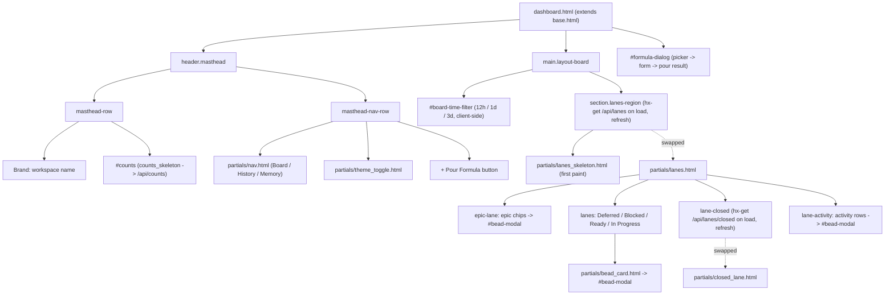

# View: Board page (`/`)

## Route

| Path | Handler | Template |
| --- | --- | --- |
| `/` | [`app.py:index`](../../src/bdboard/app.py) | [`templates/dashboard.html`](../../src/bdboard/templates/dashboard.html) |

Like the History (`/history`) and Memory (`/memory`) routes, the handler is
deliberately thin and **never calls `bd`**. It runs the shared
[`_validate_or_warn()`](../../src/bdboard/app.py) workspace guard — rendering
[`error.html`](../../src/bdboard/templates/error.html) with a `500` on failure so
a broken workspace fails *visibly* rather than painting an empty board — and, on
success, renders `dashboard.html` with only three context values: `workspace`,
`workspace_path`, and `active="board"`. Every byte of actual board data
(counts, lanes, closed lane) is fetched lazily by HTMX `load` triggers *after*
first paint. This is a deliberate correction: `index` previously awaited
`store.snapshot()` **and** a per-epic `bd show` hydration pass before returning
any HTML, giving the board the worst time-to-first-paint of the three pages. It
is now symmetric with the other two pages — cheap route, instant shell, async
hydration (design §D4; see
[HTMX + server-rendered partials](../Concepts/htmx-partials-architecture.md)).

## What it does

The Board is the dashboard's **what-is-in-flight** surface and the app's home
page. Where [History](history-page.md) answers *what got done and how fast* and
[Memory](memory-page.md) holds *durable knowledge*, the Board shows the current
state of work as a kanban-style set of swim lanes derived live from `bd`. It
presents, top to bottom:

1. A **masthead** carrying the workspace name (brand), a live **counts strip**
   (one cell per status: open / in_progress / blocked / closed / …), the shared
   Board / History / Memory nav, the theme toggle, and the **+ Pour Formula**
   entry point.
2. A **board-wide time-window toolbar** (`12h` / `1d` / `3d`, default `1d`) that
   scopes the time-sensitive Closed lane client-side.
3. A horizontal **epic strip** of the active epics, topologically ordered, each
   chip showing id / priority / status / assignee.
4. The **swim lanes** themselves — `Deferred`, `Blocked`, `Ready`,
   `In Progress`, `Closed` — each a column of clickable bead cards, plus an
   **Activity** column of recent events.

Clicking any epic chip, bead card, or activity row opens that bead in the shared
modal. Everything stays live: a change under `.beads/` re-renders the lanes and
counts automatically over the SSE pipeline.

## Why it exists

A maintainer's first question every session is *"what's actionable right now,
and what's stuck?"* On the CLI that means stitching together `bd ready`,
`bd list --status=blocked`, `bd list --status=in_progress`, and manual epic/dep
reasoning. The Board collapses all of that into a single glanceable kanban whose
columns map directly to the lifecycle states `bd` already tracks, with the
blocking-dependency math (`Ready` vs `Blocked`) done for you in the
[derive layer](../Concepts/derive-layer.md). It deliberately shares chrome with
the other two pages (same masthead, same filter-badge idiom, same SSE
live-refresh) so the three feel like one product, and it reuses the snapshot the
rest of the app already holds rather than spawning a `bd` subprocess per render
(design §4; see [bd CLI as runtime source of truth](../Concepts/bd-cli-source-of-truth.md)).
The split-fetch shape (active lanes first, heavy Closed lane second) exists to
keep first paint near-instant on large workspaces (bdboard-0yy).

## User actions

- **Open a bead** — click any bead card in a lane (or any epic chip, or any
  Activity row). Each fires `hx-get /api/bead/{id}` with
  `hx-target="#bead-modal"`, loading the bead detail into the shared modal. See
  [Bead detail API](../Endpoints/bead-detail-api.md).
- **Scope the time window** — click a badge in the board toolbar
  (`12h` / `1d` / `3d`). This is a **client-side** filter: it shows/hides
  already-fetched Closed-lane cards by their `data-closed-at` timestamp and never
  hits the server. The active badge is tracked with `aria-checked`, the choice is
  persisted to `sessionStorage` (`bdboard-time-filter`), and the masthead
  **Closed** count is re-synced to the visible set so header and lane can't drift
  (bdboard-de4z). The `3d` ceiling matches the Closed lane's historical limit;
  longer windows are the [History page](history-page.md)'s job.
- **Pour a formula** — click **+ Pour Formula** to open the native `<dialog>`.
  It loads the formula picker (`/api/formulas`), swaps in a formula's variable
  form on selection (`/api/formulas/{name}/form`), and pours on submit
  (`/api/formulas/{name}/pour`). Newly poured beads arrive live via the watcher →
  `Store.refresh` → SSE pipeline plus the route's optimistic broadcast. See
  [Formula pour](../Features/formula-pour.md) and
  [Formulas API](../Endpoints/formulas-api.md).
- **See live updates** — any change under `.beads/` (a close from the CLI,
  another tab, a pour) re-renders the lanes, closed lane, and counts
  automatically via the shared SSE `refresh` pipeline (see [State](#state)).
- **Switch pages / toggle theme** — the shared masthead nav
  ([`partials/nav.html`](../../src/bdboard/templates/partials/nav.html)) and
  theme toggle
  ([`partials/theme_toggle.html`](../../src/bdboard/templates/partials/theme_toggle.html))
  are present on every page.

## Page structure

## Components / partials

| Partial | Purpose |
| --- | --- |
| [`base.html`](../../src/bdboard/templates/base.html) | Layout shell: HTML scaffold, the `EventSource('/api/events')` SSE wiring, theme bootstrap, and the **board time-filter JS** (`applyBoardFilter` / `wireFilterBadges` / `syncMastheadClosedCount`) that drives the client-side Closed-lane window and keeps the masthead Closed count in lockstep. |
| [`dashboard.html`](../../src/bdboard/templates/dashboard.html) | The page body itself: two-row masthead, the board time-filter toolbar, the `.lanes-region` swap target (seeded with the skeleton), and the `+ Pour Formula` `<dialog>` plus its `openFormulaDialog()` script. |
| [`partials/nav.html`](../../src/bdboard/templates/partials/nav.html) | Shared primary nav (Board / History / Memory) with `aria-current` + `.is-active` on the active page. |
| [`partials/theme_toggle.html`](../../src/bdboard/templates/partials/theme_toggle.html) | Light/dark theme toggle, shared across all pages. |
| [`partials/counts_skeleton.html`](../../src/bdboard/templates/partials/counts_skeleton.html) | Shimmer placeholder for the masthead `#counts` host so the strip is reserved before the first `/api/counts` swap lands — no layout shift. |
| [`partials/counts.html`](../../src/bdboard/templates/partials/counts.html) | The status counts `<dl>` swapped into `#counts`. Each cell carries `data-count-status` — the stable hook the board filter JS uses to update the Closed cell (don't key off the visible label text). |
| [`partials/lanes_skeleton.html`](../../src/bdboard/templates/partials/lanes_skeleton.html) | Decorative (`aria-hidden`) shimmer mirroring the real lane scaffold (epic strip + five lanes + activity) so `.lanes-region` never flashes empty before `/api/lanes` lands. |
| [`partials/lanes.html`](../../src/bdboard/templates/partials/lanes.html) | The `/api/lanes` swap body: the epic strip, the four active lanes (`Deferred` / `Blocked` / `Ready` / `In Progress`), the lazy-loading `lane-closed` placeholder, and the Activity column. |
| [`partials/closed_lane.html`](../../src/bdboard/templates/partials/closed_lane.html) | The Closed lane's card list + count, swapped into `.lane-closed` by `/api/lanes/closed` after the active lanes paint. |
| [`partials/bead_card.html`](../../src/bdboard/templates/partials/bead_card.html) | Shared clickable bead tile (single source of truth across active lanes, closed lane, and History). A bare include is the board card; the Closed lane includes it `with show_closed_at_attr = true` so the time filter has a `data-closed-at` to act on. Opens `/api/bead/{id}` in `#bead-modal`. |
| [`partials/bead_card_skeleton.html`](../../src/bdboard/templates/partials/bead_card_skeleton.html) | Per-card shimmer used by both the lanes skeleton and the Closed-lane placeholder while their fetches are in flight. |
| [`partials/formula_form.html`](../../src/bdboard/templates/partials/formula_form.html) · [`partials/formula_list.html`](../../src/bdboard/templates/partials/formula_list.html) · [`partials/formula_pour_result.html`](../../src/bdboard/templates/partials/formula_pour_result.html) | The three regions of the `+ Pour Formula` dialog: picker, variable form, and pour outcome. |
| [`partials/bead_modal.html`](../../src/bdboard/templates/partials/bead_modal.html) | The shared `#bead-modal` host that every card / chip / row swaps detail into. |

## State

- **Time window (`12h` / `1d` / `3d`)** — purely client-side, default `1d`,
  persisted to `sessionStorage` (`bdboard-time-filter`). It never appears on the
  `/` route or in any request: `applyBoardFilter()` in `base.html` shows/hides
  already-fetched Closed-lane cards by their `data-closed-at` attribute, updates
  the lane count badge, and calls `syncMastheadClosedCount()` to mirror that
  visible total into the masthead **Closed** cell. Only the Closed lane is
  timestamped, so the other lanes are window-invariant and keep their
  server-rendered totals.
- **Theme** — read from `localStorage` and applied by the base-layout anti-FOUC
  bootstrap; the toggle's `aria-pressed` reflects current mode.
- **SSE live-refresh** — `.lanes-region`, the inner `.lane-closed`, and the
  masthead `#counts` strip each carry `hx-trigger="load, refresh from:body"`.
  `base.html` opens an `EventSource('/api/events')`; on a `beads_changed` server
  event it dispatches a bubbling `refresh` DOM event on `<body>`, re-fetching all
  three regions. An `htmx:afterSettle` listener re-runs `wireFilterBadges()`
  whenever the lanes region, closed lane, or counts strip re-swaps, so the active
  time window is re-applied to freshly-rendered cards and the Closed cell never
  drifts back to the unfiltered server total (bdboard-de4z). See the
  [live-refresh pipeline](../Flows/live-refresh-pipeline.md).
- **Formula dialog** — transient per-open client state. `openFormulaDialog()`
  clears the prior variable form + pour result, `showModal()`s the native
  `<dialog>` (which traps focus), and triggers a fresh picker fetch so a
  newly-added formula shows without a reload.

> [!IMPORTANT]
> The page route holds **no** board data — it renders only the shell. All of it
> is read on demand from `bd` by the three HTMX endpoints and shaped by the pure
> [derive layer](../Concepts/derive-layer.md) (`epic_lane` / `lanes` /
> `activity` / `counts`). The active lanes and the Closed lane are intentionally
> fetched from **separate** snapshots — `store.snapshot_active()` (~5 KB) for the
> fast first paint and `store.snapshot_closed()` (up to ~500 KB) lazily after —
> a ~100× payload reduction on large workspaces (bdboard-0yy). See
> [store snapshot cache](../Concepts/store-snapshot-cache.md).

> [!WARNING]
> Because the initial `/api/lanes` fetch sees only *active* issues, the
> `Ready` vs `Blocked` split is computed without closed beads in view: a bead
> whose only blocker is already closed will conservatively render as **Blocked**
> on first paint and correct itself to **Ready** on the next SSE `refresh` (when
> the full snapshot is available). This is the accepted tradeoff for the ~100×
> faster first paint, not a bug. The Activity column has the same property —
> closed-bead events appear after the first refresh.

## API dependencies

| Endpoint | Used for |
| --- | --- |
| `GET /api/counts` | Hydrates the masthead `#counts` status strip. Fired on page `load` and on SSE `refresh from:body`. See [Lanes API](../Endpoints/lanes-api.md). |
| `GET /api/lanes` | Renders the epic strip + active lanes (`Deferred` / `Blocked` / `Ready` / `In Progress`) + Activity from the active-only snapshot. Fired on `load` and SSE `refresh`. See [Lanes API](../Endpoints/lanes-api.md). |
| `GET /api/lanes/closed` | Renders the Closed lane separately, from the closed snapshot, after the active lanes paint. Fired on `load` of the `.lane-closed` placeholder and SSE `refresh`. See [Lanes API](../Endpoints/lanes-api.md). |
| `GET /api/bead/{id}` | Loads a clicked bead (card / epic chip / activity row) into the shared `#bead-modal`. See [Bead detail API](../Endpoints/bead-detail-api.md). |
| `GET /api/formulas`, `GET /api/formulas/{name}/form`, `POST /api/formulas/{name}/pour` | Drive the three steps of the **+ Pour Formula** dialog. See [Formulas API](../Endpoints/formulas-api.md). |
| `GET /api/events` | SSE stream wired in `base.html`; a `beads_changed` event triggers a `refresh` of the lanes, closed lane, and counts. See [SSE events](../Endpoints/sse-events.md). |

## Related

- [Endpoint: Lanes API (`/api/lanes`, `/api/lanes/closed`, `/api/counts`)](../Endpoints/lanes-api.md)
- [Endpoint: Bead detail API (`/api/bead/{id}`, `/audit`, `/raw`)](../Endpoints/bead-detail-api.md)
- [Endpoint: Formulas API (`/api/formulas`, form, pour)](../Endpoints/formulas-api.md)
- [Endpoint: SSE events (`/api/events`)](../Endpoints/sse-events.md)
- [Feature: Swim-lane board](../Features/swim-lane-board.md)
- [Feature: Bead detail & inline editing](../Features/bead-detail-and-inline-editing.md)
- [Feature: Formula pour](../Features/formula-pour.md)
- [Feature: Live auto-refresh](../Features/live-auto-refresh.md)
- [Flow: Live-refresh pipeline](../Flows/live-refresh-pipeline.md)
- [Flow: Formula pour fan-out](../Flows/formula-pour-fanout.md)
- [View: History page (`/history`)](history-page.md)
- [View: Memory page (`/memory`)](memory-page.md)
- [Concept: Derive layer (pure view shaping)](../Concepts/derive-layer.md)
- [Concept: Store snapshot cache & change detection](../Concepts/store-snapshot-cache.md)
- [Concept: HTMX + server-rendered partials](../Concepts/htmx-partials-architecture.md)
- [Concept: bd CLI as runtime source of truth](../Concepts/bd-cli-source-of-truth.md)
- [Architecture](../Architecture.md)
- [FlowDoc Authoring Guide](../_FlowDocGuide.md)
