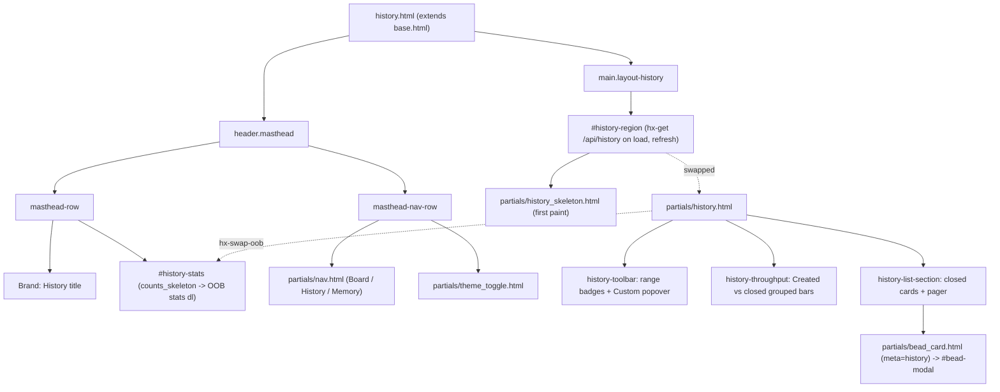

# View: History page (`/history`)

## Route

| Path | Handler | Template |
| --- | --- | --- |
| `/history` | [`app.py:page_history`](../../src/bdboard/app.py) | [`templates/history.html`](../../src/bdboard/templates/history.html) |

Like the Board (`/`) and Memory (`/memory`) routes, the handler is deliberately
thin: it runs the shared [`_validate_or_warn()`](../../src/bdboard/app.py)
workspace guard (rendering [`error.html`](../../src/bdboard/templates/error.html)
with a `500` on failure so a broken workspace fails *visibly* rather than
painting an empty page) and, on success, renders `history.html` with only three
context values — `workspace`, `workspace_path`, and `active="history"`. It
**never** calls `bd`. All of the actual history data is fetched lazily by the
page's HTMX `load` trigger against
[`/api/history`](../Endpoints/history-api.md), so first paint stays instant and
the slow snapshot/derive work is kept off the page-render path. This is the same
"trivial page shell + lazy region fetch" shape the whole dashboard shares (design
§D4) — see [HTMX + server-rendered partials](../Concepts/htmx-partials-architecture.md).

## What it does

The History page is the dashboard's **analytics / retrospective** surface. Where
the Board shows *what is in flight* and Memory shows *durable knowledge*, History
answers *what got done, how fast, and at what rate*. It presents three things
over a selectable time window:

1. A **masthead stats strip** of headline KPIs — bd's workspace-global totals
   (Total / Closed all-time) alongside range-scoped metrics (Avg lead, Closed in
   range, Median lead, Throughput).
2. A **"Created vs closed" grouped-bar chart** — created and closed counts
   per day on one shared timeline, so net flow / backlog burn reads at a glance.
3. A **paginated list of closed beads**, newest-closed first, each card opening
   the shared bead modal on click.

Everything reacts to a single time-range control (7d / 30d / 90d / All, default
30d) plus an optional custom from/to date window.

## Why it exists

Throughput, lead time, and the closed backlog are the data a maintainer needs to
reason about velocity and cycle time, but on the CLI those answers are scattered
across ad-hoc `bd list --status=closed` invocations and manual date math.
Surfacing them as a first-class, range-filterable dashboard page turns "how are
we trending?" into a glance. It deliberately mirrors the Board's chrome (same
masthead, same filter-badge idiom, same SSE live-refresh) so the three pages feel
like one product, and it reuses the snapshot the rest of the app already holds —
the entire region is **pure derivation over one `bd` snapshot, no new subprocess
per render** (design §4; see [Derive layer](../Concepts/derive-layer.md)).

## User actions

- **Switch the time window** — click a range badge (`7d` / `30d` / `90d` /
  `All`). Each fires `hx-get /api/history?range=<r>&page=1&page_size=<active>`
  with `hx-target="#history-region"`, re-rendering the whole region (charts,
  KPIs, and list) for that window. `aria-pressed` marks the active range.
- **Pick a custom date range** — click the **Custom** badge to open the
  `#history-custom-range` popover (a real `<form role="dialog">` with From/To
  `type="date"` inputs). Submitting `hx-get`s `/api/history` with
  `from_date`/`to_date`, which supersede `range=` server-side; the region
  re-swaps with the popover re-rendered hidden, and **Clear** returns to the
  last preset.
- **Page through closed beads** — the pager's **‹ Newer** / **Older ›**
  buttons re-fetch the adjacent page within the current window (preserving the
  active range or custom dates via `window_qs`).
- **Change page size** — the "Per page" `<select>` (25 / 50 / 100) resets to
  page 1 and re-swaps the region; the chosen size is mirrored into
  `localStorage` (`bdboard-history-page-size`) by `base.html` so it survives
  reloads and SSE refreshes, like the theme toggle.
- **Open a closed bead** — click any history card to `hx-get`
  `/api/bead/{id}` into the shared `#bead-modal`. The card is reused from the
  Board ([`partials/bead_card.html`](../../src/bdboard/templates/partials/bead_card.html)),
  rendered with `meta="history"` so it shows assignee + close reason and the
  humanized close timestamp.
- **See live updates** — a bead closing elsewhere (another tab, the CLI)
  re-renders the region automatically via the shared SSE `refresh` pipeline
  (see [State](#state)).
- **Switch pages / toggle theme** — the shared masthead nav
  ([`partials/nav.html`](../../src/bdboard/templates/partials/nav.html)) and
  theme toggle
  ([`partials/theme_toggle.html`](../../src/bdboard/templates/partials/theme_toggle.html))
  are present on every page.

## Page structure

## Components / partials

| Partial | Purpose |
| --- | --- |
| [`base.html`](../../src/bdboard/templates/base.html) | Layout shell: HTML scaffold, the `EventSource('/api/events')` SSE wiring, theme bootstrap, the History page-size persistence + bare-`/api/history` active-window injection, and the Custom-popover open/close/Escape/click-outside JS. |
| [`partials/nav.html`](../../src/bdboard/templates/partials/nav.html) | Shared primary nav (Board / History / Memory) with `aria-current` + `.is-active` on the active page. |
| [`partials/theme_toggle.html`](../../src/bdboard/templates/partials/theme_toggle.html) | Light/dark theme toggle, shared across all pages. |
| [`partials/counts_skeleton.html`](../../src/bdboard/templates/partials/counts_skeleton.html) | Instant shimmer placeholder for the masthead `#history-stats` host (rendered `with cells = 6`) so the stats columns are reserved before the first OOB stats swap lands — no layout shift. |
| [`partials/history_skeleton.html`](../../src/bdboard/templates/partials/history_skeleton.html) | Decorative (`aria-hidden`) shimmer mirroring the region's real layout (range toolbar → one combined chart → closed list) so `#history-region` never flashes empty before the first `/api/history` fetch. |
| [`partials/history.html`](../../src/bdboard/templates/partials/history.html) | The HTMX swap-target body: range control + Custom popover, the "Created vs closed" grouped-bar chart, the paginated closed list + pager + page-size selector — and, appended, the OOB stats fragment. |
| [`partials/history_stats.html`](../../src/bdboard/templates/partials/history_stats.html) | The KPI `<dl>` emitted with `hx-swap-oob="true"`; HTMX peels it off the same `/api/history` response and swaps it into the masthead `#history-stats` host. Carries `aria-live` + per-cell info-icon popovers explaining each metric. |
| [`partials/bead_card.html`](../../src/bdboard/templates/partials/bead_card.html) | Shared clickable bead tile, reused here with `card_class="history-card"`, `show_closed_when=true`, `meta="history"`; opens `/api/bead/{id}` in `#bead-modal`. |

## State

- **Time range (`range`)** — `7d` / `30d` / `90d` / `all`; transient state
  carried only in the query string the range badges fire (not on the `/history`
  route itself). An unknown/missing value degrades to the default (`30d`) inside
  [`derive.resolve_history_bounds`](../../src/bdboard/derive/history.py). The active
  badge is rendered server-side from `active_range` so it survives every swap.
- **Custom window (`from_date`/`to_date`)** — `YYYY-MM-DD` values from the
  Custom popover. When either parses, `is_custom` is true, `active_range`
  becomes the synthetic `custom` preset, and the window supersedes `range=` for
  the charts, KPIs, *and* the closed list (the precedence is resolved once in the
  derive layer). The inputs echo the submitted values so the popover repopulates
  after each swap.
- **Pagination (`page` / `page_size`)** — `page` is server-clamped to `>= 1`;
  `page_size` is clamped to the allowed set `{25, 50, 100}` via
  [`derive.clamp_page_size`](../../src/bdboard/derive/history.py) (default `50`) so a bad
  query param can never break paging. The page-size choice is persisted to
  `localStorage` (`bdboard-history-page-size`) and re-injected by `base.html`
  onto bare `/api/history` fetches.
- **Theme** — read from `localStorage` and applied by the base-layout
  bootstrap; the toggle's `aria-pressed` reflects current mode.
- **SSE live-refresh** — `#history-region` carries
  `hx-trigger="load, refresh from:body"`. `base.html` opens an
  `EventSource('/api/events')`; on a `beads_changed` server event it dispatches a
  bubbling `refresh` DOM event on `<body>`, re-fetching the region. Because that
  refresh hits a **bare** `/api/history` (no params), `base.html` reads the
  active range/custom window + persisted page size from the live DOM and
  re-injects them onto the request so a live refresh re-renders the *same* window
  the user is viewing instead of snapping back to the 30d default (bdboard-li44).
  See the [live-refresh pipeline](../Flows/live-refresh-pipeline.md).

> [!IMPORTANT]
> The page route holds **no** history data. All of it lives in `bd`'s dolt store,
> read on demand by `/api/history` via
> [`store.snapshot_history(closed_after=cutoff)`](../../src/bdboard/store.py) and
> shaped by the pure [derive layer](../Concepts/derive-layer.md)
> (`history_window` / `throughput` / `lead_time_stats` / `created` / `combined`).
> The view is intentionally stateless beyond the transient range/page query
> string. The resolved lower bound is pushed down into the snapshot fetch so a
> narrow range only pulls the beads closed inside its window — `range=all`
> resolves to an unbounded fetch by design (see
> [store snapshot cache](../Concepts/store-snapshot-cache.md)).

## API dependencies

| Endpoint | Used for |
| --- | --- |
| `GET /api/history` | Renders the entire `#history-region` (range control, chart, paginated closed list) **and** the masthead `#history-stats` strip out-of-band, in one round-trip. Fired on page `load`, on SSE `refresh from:body`, and on every range / custom / pager / page-size interaction. See [History API](../Endpoints/history-api.md). |
| `GET /api/bead/{id}` | Loads the clicked closed bead's detail into the shared `#bead-modal`. See [Bead detail API](../Endpoints/bead-detail-api.md). |
| `GET /api/events` | SSE stream wired in `base.html`; a `beads_changed` event triggers a `refresh` of the region. See [SSE events](../Endpoints/sse-events.md). |

> [!WARNING]
> The KPI strip mixes two scopes that look alike but are not: **Total** and
> **Closed (all time)** come from bd's workspace-global `status_summary()` and do
> **not** react to the range control, while **Avg lead**, **Closed (range)**,
> **Median lead**, and **Throughput** are range-scoped derivations. The info-icon
> popover on each cell spells out the scope precisely so the two are never
> conflated. If `bd status` hiccups, `bd_summary` is `None` and the two global
> cells are simply omitted — the range-derived KPIs remain as the primary
> surface, so the masthead degrades gracefully rather than 500-ing.

## Related

- [Endpoint: History API (`/api/history`)](../Endpoints/history-api.md)
- [Endpoint: Bead detail API (`/api/bead/{id}`, `/audit`, `/raw`)](../Endpoints/bead-detail-api.md)
- [Endpoint: SSE events (`/api/events`)](../Endpoints/sse-events.md)
- [Feature: History & trends](../Features/history-and-trends.md)
- [Feature: Live auto-refresh](../Features/live-auto-refresh.md)
- [Flow: Live-refresh pipeline](../Flows/live-refresh-pipeline.md)
- [View: Board page (`/`)](board-page.md)
- [View: Memory page (`/memory`)](memory-page.md)
- [Concept: Derive layer (pure view shaping)](../Concepts/derive-layer.md)
- [Concept: Store snapshot cache & change detection](../Concepts/store-snapshot-cache.md)
- [Concept: HTMX + server-rendered partials](../Concepts/htmx-partials-architecture.md)
- [Concept: bd CLI as runtime source of truth](../Concepts/bd-cli-source-of-truth.md)
- [Architecture](../Architecture.md)
- [FlowDoc Authoring Guide](../_FlowDocGuide.md)
