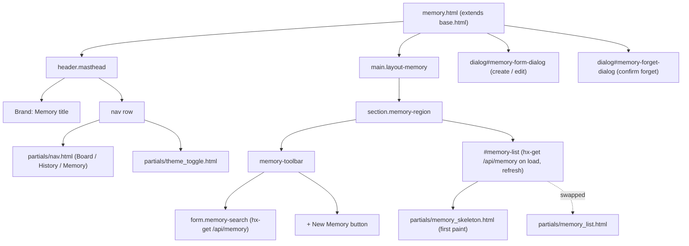

# View: Memory page (`/memory`)

## Route

| Path | Handler | Template |
| --- | --- | --- |
| `/memory` | [`app.py:page_memory`](../../src/bdboard/app.py) | [`templates/memory.html`](../../src/bdboard/templates/memory.html) |

The handler is deliberately trivial: it runs the shared
[`_validate_or_warn()`](../../src/bdboard/app.py) workspace guard and, on
success, renders `memory.html` with only three context values
(`workspace`, `workspace_path`, `active="memory"`). It never calls `bd` —
the actual memory data is fetched lazily by the page's HTMX `load` trigger
against [`/api/memory`](../Endpoints/memory-api.md). This keeps first paint
instant and keeps the slow subprocess off the page-render path, mirroring
the Board (`/`) and History (`/history`) routes.

## What it does

The Memory page is the human-facing console for **bd memories** — the
keyed knowledge snippets that `bd` injects into every agent session at
`bd prime`. It presents the full memory corpus as a searchable list of
cards (key heading + markdown-rendered body) and gives a maintainer the
three CRUD affordances that the CLI exposes (`bd memories`, `bd remember`,
`bd forget`) without leaving the browser. Because a stray edit or delete
silently degrades *every future agent run*, the page is built around safe,
deliberate curation: debounced search, a modal create/edit form, and a
confirm-before-forget dialog.

## Why it exists

Memories are the project's durable, cross-session knowledge layer, but on
the CLI they are only visible via ad-hoc `bd memories` invocations and are
easy to forget you even have. Surfacing them as a first-class dashboard
page makes the corpus discoverable, searchable, and editable at a glance —
turning an invisible side-channel into a curatable knowledge base that
sits alongside the Board and History views (design parity, AGENTS
"persistent knowledge" workflow).

## User actions

- **Search memories** — type in the search strip; a debounced
  (`keyup changed delay:250ms`) `hx-get` to `/api/memory?q=…` swaps the
  list region with server-side substring matches. The native search-field
  clear () re-fires via the `search` event, returning to the full list.
- **Create a memory** — click **+ New Memory** to open the
  `#memory-form-dialog` modal, enter a key + body (markdown), and submit;
  the form `hx-post`s to `/api/memory` and swaps the refreshed list in.
- **Edit a memory** — click the edit (pencil) button on a card.
  `editMemory(key, body)` pre-fills the same dialog, marks the key input
  `readonly` (you cannot rename a key — `bd remember` upserts by key), and
  submitting re-saves the body.
- **Forget a memory** — click the forget (trash) button on a card.
  `confirmForget(key)` opens the
  dedicated `#memory-forget-dialog` confirmation modal; confirming fires an
  `hx-delete` to `/api/memory/{key}` and swaps in the updated list.
- **See live updates** — edits made elsewhere (another tab, the CLI)
  appear automatically via the SSE `refresh` pipeline (see [State](#state)).
- **Switch pages / toggle theme** — the shared masthead nav
  ([`partials/nav.html`](../../src/bdboard/templates/partials/nav.html)) and
  theme toggle
  ([`partials/theme_toggle.html`](../../src/bdboard/templates/partials/theme_toggle.html))
  are present on every row.

## Page structure

## Components / partials

| Partial | Purpose |
| --- | --- |
| [`partials/nav.html`](../../src/bdboard/templates/partials/nav.html) | Shared primary nav (Board / History / Memory) with `aria-current` on the active page. |
| [`partials/theme_toggle.html`](../../src/bdboard/templates/partials/theme_toggle.html) | Light/dark theme toggle, shared across all pages. |
| [`partials/memory_skeleton.html`](../../src/bdboard/templates/partials/memory_skeleton.html) | Decorative shimmer placeholder (`aria-hidden`) painted instantly so the list never flashes empty before the first `/api/memory` fetch. |
| [`partials/memory_list.html`](../../src/bdboard/templates/partials/memory_list.html) | The HTMX swap target body: an `aria-live` result count, the `memory-card` list (key heading, edit/forget actions, `md`-rendered body), and the three context-appropriate empty states. |
| `dialog#memory-form-dialog` (inline in `memory.html`) | Native `<dialog>` modal for create/edit; `hx-post`s to `/api/memory` and self-closes via JS on submit. |
| `dialog#memory-forget-dialog` (inline in `memory.html`) | Native `<dialog>` confirmation modal; its button's `hx-delete` URL is set dynamically by `confirmForget(key)`. |
| [`base.html`](../../src/bdboard/templates/base.html) | Layout shell: HTML scaffold, `EventSource('/api/events')` SSE wiring, theme bootstrap, and the bare-URL HTMX request shaping. |

## State

- **Search query (`q`)** — transient client state held only in the search
  input; passed to `/api/memory?q=…` and echoed back in the
  `memory-count` status line. Not persisted; not a URL param on `/memory`
  itself (the page route takes no query string).
- **Theme** — read from `localStorage` and applied by the base-layout
  bootstrap; the toggle's `aria-pressed` reflects current mode.
- **CSRF token** — `csrf_token`, injected as a Jinja global
  ([`app.py` `TEMPLATES.env.globals["csrf_token"]`](../../src/bdboard/app.py)),
  embedded both as a hidden form field and an `X-CSRF-Token` header on the
  create and delete requests; validated server-side by
  [`_check_csrf`](../../src/bdboard/app.py).
- **SSE live-refresh** — the `#memory-list` region carries
  `hx-trigger="load, refresh from:body"`. `base.html` opens an
  `EventSource('/api/events')`; on a `beads_changed` server event it
  dispatches a bubbling `refresh` DOM event on `<body>`, which re-fetches
  the list. Mutations also call `bus.broadcast("beads_changed")` so other
  tabs/clients converge. See the
  [HTMX + server-rendered partials](../Concepts/htmx-partials-architecture.md)
  concept and the [live-refresh pipeline](../Flows/live-refresh-pipeline.md).
- **Dialog state** — the create/edit modal is reset to "New Memory" on its
  `close` event (clears inputs, removes the `readonly` flag) so the next
  open starts fresh; this is plain JS in `memory.html`, not server state.

> [!IMPORTANT]
> The page route holds **no** memory data. All memory state lives in `bd`'s
> dolt store and is read on demand via `/api/memory`, which is in turn
> cached/deduped by [`Bd.memories`](../../src/bdboard/bd.py) (see the
> [store snapshot cache](../Concepts/store-snapshot-cache.md) concept). The
> view is intentionally stateless beyond the transient search box.

## API dependencies

| Endpoint | Used for |
| --- | --- |
| `GET /api/memory` | Renders the `memory_list.html` region; fired on page `load`, on SSE `refresh from:body`, and on every debounced search keystroke. See [Memory API](../Endpoints/memory-api.md). |
| `POST /api/memory` | Create/upsert a memory (the create/edit dialog form); returns the refreshed list partial for the swap. |
| `DELETE /api/memory/{key}` | Forget a memory (confirm dialog); returns the refreshed list partial. |
| `GET /api/events` | SSE stream wired in `base.html`; a `beads_changed` event triggers a `refresh` of the list region. See [SSE events](../Endpoints/sse-events.md). |

> [!WARNING]
> Forget is destructive and irreversible — there is no undo. The confirm
> dialog exists precisely because a dropped memory silently degrades every
> future `bd prime`. The forget button's `hx-delete` target is rewritten at
> click time by `confirmForget(key)` and re-processed with `htmx.process`,
> so it always points at the correct path-encoded key (keys with `/` work
> because the route uses `{key:path}`).

## Related

- [Endpoint: Memory API (`/api/memory` GET/POST/DELETE)](../Endpoints/memory-api.md)
- [Endpoint: SSE events (`/api/events`)](../Endpoints/sse-events.md)
- [Feature: Memory management](../Features/memory-management.md)
- [Feature: Live auto-refresh](../Features/live-auto-refresh.md)
- [Flow: Live-refresh pipeline](../Flows/live-refresh-pipeline.md)
- [View: Board page (`/`)](board-page.md)
- [View: History page (`/history`)](history-page.md)
- [Concept: HTMX + server-rendered partials](../Concepts/htmx-partials-architecture.md)
- [Concept: bd CLI as runtime source of truth](../Concepts/bd-cli-source-of-truth.md)
- [Concept: Store snapshot cache & change detection](../Concepts/store-snapshot-cache.md)
- [Architecture](../Architecture.md)
- [FlowDoc Authoring Guide](../_FlowDocGuide.md)
