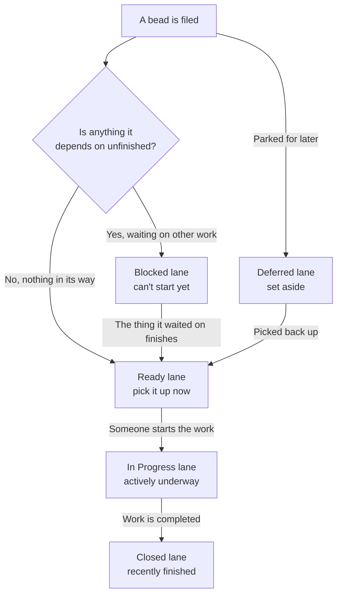

# Concept: Bead lifecycle & the lanes

## What is it

A bead's **lifecycle** is the journey a single piece of work takes from the
moment it's filed to the moment it's finished — and **the lanes** are the
columns on the Board that show you, at a glance, where every bead is on that
journey right now. Each lane is a stage: work that's parked, work that's
waiting on something else, work that's ready to pick up, work in progress, and
work that's done. A bead always sits in exactly one lane, and as its situation
changes it slides from one lane to the next.

## Why this approach

When you glance at a project you don't want a flat list of tasks — you want to
know *what state everything is in*. Which things can I start right now? What's
stuck? What's already underway? What just got finished? A single list can't
answer those questions without a lot of squinting, so bdboard arranges your
beads into stage-based lanes instead, like a kanban board.

Two design decisions make the lanes genuinely useful rather than just pretty:

- **Lane membership is worked out for you, not set by hand.** A bead's lane is
  *derived* from its real situation — its status plus whether anything it
  depends on is still unfinished. You never drag a card between columns to keep
  the board honest; the board reads the true state and places the bead where it
  belongs. That means the Board can't drift out of sync with reality, because
  it *is* a reading of reality, not a separate copy you have to maintain.
- **"Ready" and "Blocked" are about more than a label.** A bead can be marked
  open and still be unable to start because it's waiting on another bead to
  finish first. bdboard notices that and shows it in the **Blocked** lane even
  though nobody flipped a "blocked" switch on it. The flip side — an open bead
  with nothing in its way — lands in **Ready**, your shortlist of things you
  can genuinely pick up *now*. This is the whole point: the board tells you
  what's *actionable*, not just what's *labelled*.

The alternative — one undifferentiated to-do list, or columns you shuffle cards
between manually — either hides the stuck work or makes you do bookkeeping to
keep appearances accurate. Deriving the lanes from the real state gives you a
truthful, low-effort picture every time you look.

## How it works

Think of a bead's life like **a dish moving through a restaurant kitchen**. An
order is written up (the bead is filed). Some orders can be started straight
away — those go on the "fire now" rail (**Ready**). Others can't begin until a
prep step finishes — the sauce has to reduce first — so they wait on the
"waiting" rail (**Blocked**). When a cook actually picks up an order and starts
plating, it moves to the pass (**In Progress**). Once it's done, it goes out
(**Closed**). And an order that's been set aside for later — a special that
isn't on tonight — sits on the "parked" shelf (**Deferred**). Nobody manually
re-sorts the rails; an order's rail is simply *wherever its real situation puts
it*. The board is the expo station: one look tells you what's ready to fire,
what's waiting, what's on the pass, and what's gone out.

Here's the same journey as the path a single bead takes, and which lane it lands
in at each stage:

On the Board you'll see these as columns, plus two extras that round out the
picture:

- **The Epics strip** runs along the top. Epics are the big, multi-step efforts
  that group smaller beads together. They're laid out left-to-right in the order
  they need to happen — when one epic must finish before another can begin, the
  earlier one sits to the left — and the one that's actively underway (or the
  next one ready to go) leads the strip so your current focus is front and
  centre. Finished epics drop off the strip; it's a view of live work, not a
  history.
- **Deferred** — open work that's been set aside and isn't being lined up to
  start. Think "not now, maybe later".
- **Blocked** — work that can't start yet, either because it's explicitly marked
  blocked *or* because something it depends on hasn't finished. This is the lane
  that catches the "looks ready but actually isn't" beads.
- **Ready** — open work with nothing standing in its way. This is your shortlist:
  anything here can be picked up immediately.
- **In Progress** — work that's actively being done right now. bdboard is a
  single-focus workflow, so in practice this lane holds the one thing currently
  underway rather than a crowd.
- **Closed** — work that's recently been finished. The Board only keeps the last
  few days of closures here so it stays a fresh snapshot of "what just got done";
  anything older lives on the History page.
- **Activity** — a running feed of the most recent goings-on (filed, updated,
  blocked, finished), newest first, so you can see momentum at a glance.

A plain worked example, start to finish:

1. A new bead is filed. Nothing it relies on is outstanding, so it appears in
   the **Ready** lane — you could start it today.
2. A second bead is filed, but it depends on the first one finishing. Even
   though it's open, bdboard places it in **Blocked**, because its blocker isn't
   done.
3. You (or your tooling) start the first bead. It moves out of Ready and into
   **In Progress**, and the Activity feed notes the change.
4. The first bead is completed. It drops into the **Closed** lane — and, with
   its blocker now finished, the second bead automatically moves from **Blocked**
   to **Ready** without anyone touching it.
5. A few days later the first bead ages out of the Board's Closed lane. It hasn't
   vanished — it's just older than the Board shows, and you'll still find it on
   the History page.

> [!IMPORTANT]
> The counts in the strip at the top of the page — open, blocked, deferred,
> closed — mirror the lanes. There's deliberately no "in progress" number up
> there: because only one thing is underway at a time, a count that only ever
> reads 0 or 1 would be noise. The **In Progress** lane already shows you the one
> active bead, which is all you need.

> [!WARNING]
> A bead's lane is decided by its real state, which is set through the bead
> tooling on your machine — not by dragging cards on the Board. Browsing the
> Board never moves anything between lanes. The only lane that responds to the
> recent-work time filter is **Closed**; the open lanes show your standing
> regardless of the time window you pick.

## Where it shows up

- **The Board** — the lanes are the Board. The Epics strip sits across the top,
  with Deferred, Blocked, Ready, In Progress, Closed, and Activity columns below
  it. This is the main place the lifecycle is visible.
- **The top-of-page counts** — the open / blocked / deferred / closed tallies in
  the masthead are lane sizes in miniature, giving you the shape of your workload
  in a single line.
- **A bead's detail panel** — open any bead and its status is shown near the top,
  which is the same status that decides its lane.
- **The History page** — once work ages out of the Board's Closed lane, your
  finished beads keep living on History, which is the long-term home for closed
  work.

## Good habits

> [!IMPORTANT]
> - **Read the Ready lane as your to-do shortlist.** It's the set of work you can
>   genuinely start right now, with no blockers in the way. When you're deciding
>   what to do next, start there.
> - **Treat the Blocked lane as a prompt, not a dead end.** If something you want
>   to do is sitting in Blocked, look at what it's waiting on — finishing the
>   blocker is what frees it up, and the board will move it to Ready for you the
>   moment that happens.
> - **Use the Epics strip to keep the big picture.** Glance at the leading epic to
>   confirm the overall effort you're working toward, then drop into the lanes for
>   the individual beads under it.
> - **Trust the counts for a quick pulse.** A growing Blocked tally or an empty
>   Ready lane tells you something about flow before you've read a single card.

## Things to avoid

> [!CAUTION]
> - **Don't try to drag cards between lanes.** Lanes are derived from each bead's
>   real state — there's nothing to drag, and the board stays accurate precisely
>   because you *can't* push cards around to fake it. Change a bead's actual state
>   (through the bead tooling) and the lane follows.
> - **Don't read an open bead in the Blocked lane as a mistake.** A bead can be
>   open and still blocked because something it depends on isn't finished. That's
>   the board doing its job — surfacing that the work isn't actually startable yet
>   — not a glitch.
> - **Don't assume an empty Closed lane means nothing got done.** The Board only
>   keeps the last few days of closures. Older finished work hasn't disappeared;
>   it's on the History page. Widen your view there before concluding nothing
>   shipped.
> - **Don't expect the In Progress lane to fill up.** bdboard is a single-focus
>   tool, so seeing just one bead (or none) underway is normal, not a sign that
>   work has stalled.

## Related

- [What is a bead?](what-is-a-bead.md) — the unit of work that travels through
  these stages in the first place.
- [Time ranges & recent work](time-ranges-and-recent-work.md) — why the Closed
  lane only shows recent finishes and how the recent-work filter narrows it.
- [Your data is local & safe](your-data-is-local-and-safe.md) — why browsing the
  lanes never changes anything, and where the state behind them actually lives.
- [Take your first look](../Guides/take-your-first-look.md) — the orientation
  tour that walks you across the Board and its lanes for the first time.
- [Edit a bead](../Guides/edit-a-bead.md) — what you can and can't change on a
  bead, and why some beads (in progress or closed) are locked for editing.
- [Explore history & trends](../Guides/explore-history-and-trends.md) — where
  your beads go to live once they age out of the Closed lane.
- [Features](../Features/index.md) — includes *The board*, the surface these
  lanes live on, and *Live updates*, which keeps them current as work changes.
