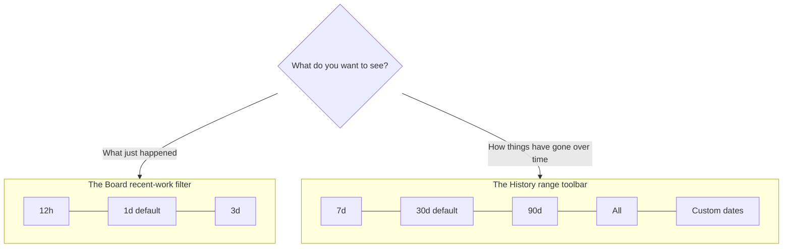

# Concept: Time ranges & recent work

## What is it

A **time range** is the slice of time bdboard is showing you at any moment — "the
last day", "the last 30 days", or a span of dates you pick yourself. The app has
two different time controls for two different jobs: a small **recent-work filter**
on the Board for "what just happened", and a wider **range toolbar** on the
History page for "what happened over the longer haul".

## Why this approach

Beads pile up over time, and you almost never want to look at *all of them at
once*. But "the right amount of time to show" depends entirely on what you're
trying to do:

- When you're checking in on **today's progress**, a month of finished work just
  buries the three things that closed this morning. You want a tight, recent
  window.
- When you're reviewing **how the project has been going**, a single day tells
  you nothing about the trend. You want a wide window — weeks or months — and the
  freedom to zoom into a specific stretch.

Rather than cram both jobs into one control with one awkward compromise window,
bdboard splits them. The **Board** stays a *recent-activity* surface with short
windows, so it always feels like a live snapshot of "now". The **History** page
is the *retrospective* surface with long windows and custom date spans, so it can
answer trend questions without cluttering the day-to-day view. Each screen offers
exactly the ranges that make sense for what it's for.

The alternative — one universal time picker shared by every page — sounds tidier
but reads worse: you'd constantly be resetting it as you bounce between "what's
happening now" and "how's the month looking", and the Board would feel sluggish
every time you nudged the window. Two purpose-built controls keep each screen fast
and focused.

## How it works

Think of it like **two windows in your house looking at the same garden**. The
small kitchen window by the door shows you just the patch right outside — perfect
for a quick "is anything happening right now?" glance. The big bay window in the
study looks out over the whole garden — that's where you stand when you want to
see how everything has grown over the season. Same garden, two deliberately
different framings, each suited to a different question.

Here are the two controls, side by side:

**The Board's recent-work filter.** Above the lanes, a small strip of buttons
offers three short windows: **12h**, **1d**, and **3d**. It opens on **1d** (the
last 24 hours) so the Board greets you with just today's activity. These buttons
narrow the **Closed** lane — the column of recently-finished work — to only the
beads finished inside the window you pick, and the "closed" tally at the top of
the page updates to match so the two numbers always agree. The lanes for work
that's still open, ready, blocked, or deferred aren't affected by this filter:
they show your current standing regardless of time, because "what's still on my
plate" isn't a question about *when*. Switching windows here is instant — the
Board simply shows or hides cards it already has, with no waiting.

> [!IMPORTANT]
> The Board's longest window is **3 days**. It's a recent-activity view on
> purpose. The moment you want to look further back than that, that's your cue to
> step over to the History page.

**The History page's range toolbar.** Across the top of History sits a wider set
of buttons: **7d**, **30d**, **90d**, and **All**, plus a **Custom** button for
choosing your own start and end dates. History opens on **30d** (the last 30
days). Whichever range you choose reshapes the whole page at once — the list of
closed beads, the per-day bars showing how much was created and finished each day,
and the summary figures like how long work tends to take. Picking **Custom** opens
a little panel where you set a "from" date, a "to" date, or both, and the page
re-draws to exactly that span.

> [!IMPORTANT]
> A few headline totals on History describe your whole workspace as it stands
> *right now* and so don't shrink when you narrow the range — they're a snapshot
> of the project overall, sitting next to the figures that *do* respond to the
> range you've picked. If a number doesn't budge when you change the window, it's
> one of these whole-project totals by design.

A plain worked example, start to finish:

1. You open the Board first thing. It's on **1d**, so the Closed lane shows just
   what finished in the last 24 hours — a clean read on today.
2. A teammate asks "did we wrap up that thing on Monday?" — two days ago. You tap
   **3d** on the Board and Monday's closures appear.
3. They follow up with "how did last month actually go?" That's beyond the
   Board's reach, so you switch to the **History** page. It opens on **30d** and
   you can see the month's rhythm in the daily bars.
4. You want just the first week of the previous month. You tap **Custom**, set
   the two dates, and the whole History page redraws to that exact span.

## Where it shows up

- **The Board** — the recent-work filter strip (12h / 1d / 3d) sits just above the
  lanes; it trims the **Closed** lane and the matching "closed" count at the top of
  the page.
- **The History page** — the range toolbar (7d / 30d / 90d / All / Custom) runs
  across the top; it reshapes the closed list, the per-day created/finished bars,
  and the time-based summary figures.
- **The "ago" labels everywhere** — throughout the app, timestamps read in plain
  relative terms like "14m ago", "2h ago", or "May 19" rather than raw clock
  times, so you can gauge how recent something is at a glance no matter which
  window you're in.

## Good habits

> [!IMPORTANT]
> - **Match the window to the question.** "What just happened?" → stay on the
>   Board and keep the window short. "How have we been doing?" → go to History and
>   widen it. You'll save yourself a lot of squinting.
> - **Start narrow, then widen.** Open on the default (1d on the Board, 30d on
>   History) and only reach for a bigger window when you actually need older work.
>   It keeps each screen fast and uncluttered.
> - **Use Custom for "that specific week".** When you know the exact dates you care
>   about — a sprint, a release week — the History page's Custom range beats
>   eyeballing a preset that's close-but-not-quite.
> - **Trust the "ago" labels.** They're the quickest way to judge recency without
>   doing date math in your head.

## Things to avoid

> [!CAUTION]
> - **Don't go hunting for old work on the Board.** Its windows stop at 3 days. If
>   something isn't there, it hasn't vanished — it's just older than the Board
>   shows. Head to History instead of widening in circles.
> - **Don't assume an empty Closed lane means "nothing got done".** It may just
>   mean nothing finished *inside the window you've picked*. Widen the filter (or
>   check History) before concluding the work isn't there.
> - **Don't expect the open lanes to change when you adjust the recent-work
>   filter.** Ready, in-progress, blocked, and deferred work shows regardless of
>   the time window — only the Closed lane responds. That's intended, not a glitch.
> - **Don't be thrown when a History total ignores your range.** The whole-project
>   headline figures stay put on purpose; the range-aware numbers are the ones that
>   move with your window.

## Related

- [Bead lifecycle & the lanes](bead-lifecycle-and-lanes.md) — what the Closed lane
  (and the other lanes the filter leaves alone) actually represent.
- [Your data is local & safe](your-data-is-local-and-safe.md) — why your chosen
  window and appearance settings are remembered on your own machine.
- [Explore history & trends](../Guides/explore-history-and-trends.md) — a
  step-by-step walk through the History range toolbar and custom dates.
- [Take your first look](../Guides/take-your-first-look.md) — the orientation tour
  that introduces the Board and its recent-work filter.
- [Features](../Features/index.md) — includes *The board* and *History & trends*,
  the two surfaces these time controls live on.
