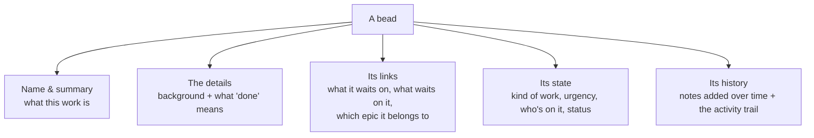

# Concept: What is a bead?

## What is it

A **bead** is a single piece of work — one task, one bug, one feature, one
decision to make. It's the basic unit that bdboard is built around: every card
you see on the Board, every row in History, and every item you open to read the
details of is a bead. If a project is a strand of work, each bead is one of the
beads threaded onto it — small, self-contained, and countable.

## Why this approach

Big efforts are hard to reason about as one lump. "Redesign the onboarding" is
too large to start, too vague to finish, and impossible to track. Breaking work
into beads — one nameable, finishable thing each — gives you something you can
actually pick up, hand off, and tick off.

A few deliberate choices make beads more useful than a plain to-do entry:

- **Each bead carries its own context.** A bead isn't just a title. It holds the
  background (what needs doing and why), what "done" looks like, who's on it,
  how urgent it is, what kind of work it is, and a running log of notes added as
  the work progresses. So when you open one, you get the whole story in one
  place rather than hunting through chats and documents.
- **Beads know how they relate to each other.** A bead can depend on another
  bead finishing first, and big multi-step efforts (called *epics*) gather many
  smaller beads underneath them. Because those links live on the beads
  themselves, bdboard can tell you what's genuinely ready to start versus what's
  waiting on something else — instead of leaving you to remember the order in
  your head.
- **One bead, one outcome.** Keeping each bead focused on a single result is
  what lets the Board count things honestly and show you progress. A vague,
  everything-bucket "task" can never really be *done*; a well-shaped bead can.

The alternative — a flat list of loosely worded reminders — hides the
relationships, loses the context, and never gives you a trustworthy sense of
where things stand. Beads trade a little up-front shape for a project you can
actually read at a glance.

## How it works

Think of a bead like **an order ticket in a busy kitchen**. The ticket names one
dish (the title), spells out how it should be made and what counts as ready to
serve (the background and the "done" check), shows who's cooking it and how
urgent the table is, and gathers any notes the cooks scribble on as they go.
Some tickets can't start until another one is finished — the sauce has to reduce
first — and a big banquet order is really a stack of tickets that belong
together. One ticket, one dish; a stack of tickets, one event. That's a bead and
an epic.

Every bead you open shows the same kinds of information, laid out top to bottom:

What you'll typically find on a bead:

- **A name and a short summary** — the headline that identifies the bead, plus a
  fuller description of what the work actually involves.
- **A "done" check** — the acceptance criteria: the plain statement of what has
  to be true before the bead can be considered finished.
- **A kind** — whether it's a bug, a task, a feature, a decision, a chore, and so
  on, so similar work is easy to recognise and group.
- **An urgency** — a priority badge (the lower the number, the more urgent) that
  helps you decide what to reach for first.
- **People** — who it's assigned to and who owns it.
- **Links to other beads** — what this bead is waiting on, what's waiting on it,
  and which larger epic (if any) it sits under.
- **A running log** — notes that build up as the work moves along, plus timestamps
  for when it was filed, started, last touched, and finished.

A plain worked example, start to finish:

1. Someone files a bead: *"Sign-in button is hard to read in dark mode."* They
   give it a description, mark it a bug, set it as fairly urgent, and write a
   "done" check: *the button text meets the readability standard in dark mode.*
2. The bead appears on the Board as a card. Because nothing is standing in its
   way, it lands in the lane for work that's ready to start.
3. Someone picks it up. As they investigate, they add notes to the bead — what
   they found, what they changed — so the bead becomes the record of the work,
   not just a label for it.
4. The work is completed and the bead is finished. It drops into the recently
   finished lane on the Board, and later settles into History as part of the
   long-term record.

> [!IMPORTANT]
> A bead is meant to be *one* finishable thing. The clearer and more
> single-purpose its "done" check is, the more useful it is — both for whoever
> works it and for the Board that's trying to show you honest progress.

> [!WARNING]
> Not every bead has every field filled in. A quickly-filed bead might have just
> a name and a kind, while a well-groomed one carries a full description, a
> "done" check, links, and a thick log of notes. An empty section on a bead
> means that detail simply wasn't recorded — not that something is broken.

## Where it shows up

Beads are everywhere in bdboard — they're the thing the whole app exists to
show:

- **The Board** — every card in the lanes is a bead, and the counts across the
  top are simply how many beads sit in each state.
- **A bead's detail panel** — click any card and the full bead opens up: its
  name, description, "done" check, links, state, and notes, all in one view.
- **The Epics strip** — the larger efforts along the top of the Board are beads
  too, each one gathering a group of smaller beads beneath it.
- **The Activity feed** — the running list of recent goings-on is a stream of
  things happening *to* beads: filed, updated, blocked, finished.
- **History** — once beads are finished, they live on as the long-term record of
  what got done.

## Good habits

> [!IMPORTANT]
> - **Read a bead before you start it.** Open the card and skim its description
>   and "done" check first — that's where the real instructions live, not in the
>   one-line title.
> - **Let the "done" check settle arguments.** When you're unsure whether a bead
>   is finished, the acceptance criteria is the agreed answer. If it's met, it's
>   done; if it's vague, that's a sign the bead needs sharpening, not guesswork.
> - **Follow the links.** If a bead seems stuck or out of order, check what it's
>   waiting on and which epic it belongs to — the relationships explain the
>   sequence.
> - **Treat the notes as the bead's memory.** The running log is where the story
>   of the work lives. Reading it catches you up; adding to it keeps the next
>   person (or your future self) in the loop.

## Things to avoid

> [!CAUTION]
> - **Don't cram several jobs into one bead.** A bead that's really three tasks
>   in a trench coat can never be cleanly finished and quietly breaks the Board's
>   ability to show honest progress. Split it into separate beads instead.
> - **Don't judge a bead by its title alone.** The headline is a label, not the
>   full picture. Skipping the description and "done" check is how work gets done
>   wrong or declared finished too early.
> - **Don't mistake a sparse bead for a problem.** Missing fields just mean those
>   details weren't recorded. An empty section is a blank, not a bug.
> - **Don't assume a finished bead is gone.** A completed bead leaves the active
>   lanes but isn't deleted — it lives on in History as part of the record.

## Related

- [Bead lifecycle & the lanes](bead-lifecycle-and-lanes.md) — the journey a bead
  takes from filed to finished, and the Board columns that show where each one is
  right now.
- [Your data is local & safe](your-data-is-local-and-safe.md) — where your beads
  actually live, and why browsing them never changes anything.
- [Time ranges & recent work](time-ranges-and-recent-work.md) — how the time
  window shapes which finished beads you see.
- [Take your first look](../Guides/take-your-first-look.md) — the orientation
  tour that introduces beads and the Board for the first time.
- [Edit a bead](../Guides/edit-a-bead.md) — how to change a bead's details, and
  why some beads are locked for editing.
- [Create beads from a formula](../Guides/create-beads-from-a-formula.md) — a
  quick way to pour several related beads at once.
- [Features](../Features/index.md) — the parts of bdboard that present and work
  with your beads.
