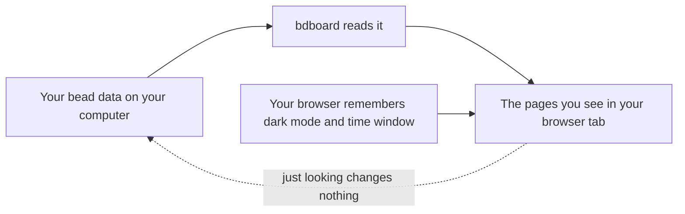

# Concept: Your data is local & safe

## What is it

bdboard is a window onto bead data that lives **on your own computer**.
Everything you see on the Board, History, and Memory pages is read straight from
your own project, on your own machine — there is no account, no sign-in, and
nothing is sent off to a cloud service or a third party for you to use it.

## Why this approach

Your beads are your work — the record of what you and your tools have done. That
record should stay where you put it, under your control, and it should keep
working whether or not you're connected to the internet. Building bdboard as a
purely local window has three pay-offs:

- **Privacy by default.** Because the data never leaves your machine just to be
  displayed, there's nothing to opt out of and no account to lock down. The
  things you read on screen don't travel anywhere to get there.
- **Trust while you browse.** Looking around can't damage what you're looking
  at. You can click every bead, flip every page, and change the view as much as
  you like, confident that *browsing* never alters your work.
- **It works offline.** Since the data is already on your computer, bdboard
  keeps showing it even with no network connection — there's no remote service
  it has to phone for permission or content.

The alternative — a hosted dashboard that uploads your beads to someone else's
server — would mean handing over your project's record just to look at it, and
going dark whenever the connection (or the service) does. That trade isn't worth
it for a tool whose whole job is to *show you your own work*.

## How it works

Think of bdboard like a **pair of reading glasses for a notebook that never
leaves your desk**. The notebook (your bead data) sits on your computer.
bdboard is the glasses: it helps you *read* the notebook clearly — laying the
pages out as swim lanes, counts, and history — but the notebook itself stays put.
Putting glasses on, or taking them off, never rewrites a single page.

Here's the same idea as the path your information actually takes:

A plain worked example, start to finish:

1. You launch bdboard from inside your project and a browser tab opens at an
   address that is private to your own computer — only your machine can reach it.
2. The Board fills in with your lanes, counts, and activity. All of that was read
   from the bead data already sitting on your machine. Nothing was fetched from
   the internet to show it to you.
3. You click a bead open, switch to History, flip on dark mode, narrow the time
   window — and your work is exactly as it was. Browsing is read-only.
4. Your appearance and time-window choices are remembered by *your browser*, on
   your computer, so they stick for next time without being stored anywhere else.

There is one deliberate exception to "just looking": when you *choose* to make a
change — editing a bead, or pouring new beads from a formula — bdboard hands that
change to the same bead tooling on your machine, which records it in your local
data. That edit, too, stays on your computer; it only travels elsewhere if you
later take a separate, deliberate step to back up or share your project. bdboard
never quietly ships your data off the machine in the background.

> [!IMPORTANT]
> "Local" is about where the data *lives and is read from*, not a promise that
> you can never share it. You remain free to back up or hand your project to a
> teammate — that's always an action *you* take on purpose, never something
> bdboard does silently while you browse.

## Where it shows up

This isn't a button you press — it's a property of the whole app, so it quietly
shapes every page:

- **The Board** — the lanes, counts, and activity feed are all read from your own
  machine; opening and re-opening beads never changes them.
- **History** — your finished work, drawn from the same local record, with
  nothing uploaded to chart it.
- **Memory** — saved notes shown straight from your project on your computer.
- **The address bar** — the tab bdboard opens points at your own machine, not a
  website out on the internet.
- **Dark mode & the time-window buttons** — these stick because *your browser*
  remembers them locally.

## Good habits

> [!IMPORTANT]
> - **Browse freely.** Since looking never changes anything, explore the whole
>   board, open beads, and switch pages without worry — you can't break your data
>   by reading it.
> - **Treat backing up as your job.** Because your data stays on your machine, it
>   is only as safe as your machine. If the work matters, keep your own backup or
>   sync of your project — bdboard shows your data but doesn't guard it against a
>   lost laptop.
> - **Know when you're actually changing something.** Editing a bead or pouring a
>   formula *does* alter your data (on your machine). Everything else is just a
>   view. See [Edit a bead](../Guides/edit-a-bead.md) and
>   [Create beads from a formula](../Guides/create-beads-from-a-formula.md) for
>   the deliberate actions that write.

## Things to avoid

> [!CAUTION]
> - **Don't assume bdboard is your backup.** It reads your local data; it doesn't
>   copy it somewhere safe for you. If the only copy is on one machine, one
>   mishap loses it. Keep your own backup or off-machine copy.
> - **Don't expect to reach the board from another device by default.** The
>   address it opens is private to the computer it's running on. It isn't a public
>   website, so don't count on opening it from your phone or a colleague's laptop
>   the way you would a hosted dashboard.
> - **Don't go looking for a login or "sync to cloud" setting.** There isn't one,
>   and that's the point. If you want your beads on another machine, that's a
>   deliberate backup-or-share step you take with your project, not something you
>   flip on inside bdboard.

## Related

- [Take your first look](../Guides/take-your-first-look.md) — the orientation
  tour; explains that there's no account or sign-in and that the board is a
  live, read-only view.
- [What is a bead?](what-is-a-bead.md) — the unit of work this local data is
  made of.
- [Bead lifecycle & the lanes](bead-lifecycle-and-lanes.md) — how the beads in
  your local data move from filed to closed.
- [Edit a bead](../Guides/edit-a-bead.md) — the deliberate action that changes
  your local data.
- [Create beads from a formula](../Guides/create-beads-from-a-formula.md) — the
  other way you intentionally add to your local data.
- [Features](../Features/index.md) — includes *Live updates*, why the board
  refreshes itself as your local data changes.
