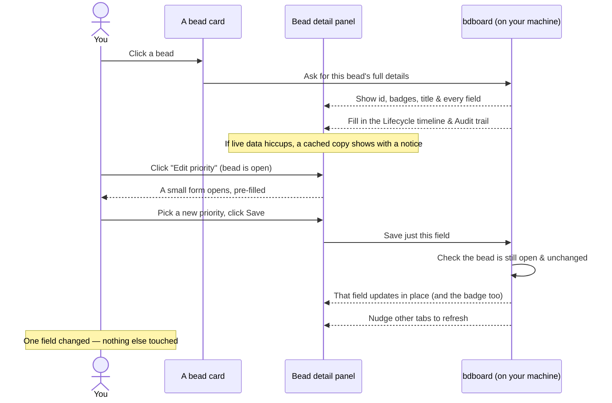

# Feature: Bead detail & editing

## What it does

Click any bead anywhere in bdboard — a card on the **Board**, a finished bead in
the closed lane, or a row in the **History** list — and a detail panel slides
open over the page. That panel is the single place where you see *everything*
about one bead: its id, its priority and status badges, its title, and a **Bead
details** list that shows every field the bead carries (description, acceptance
criteria, dependencies, assignee, dates, labels, and more). Below the details it
builds two history views from the bead's own record — a **Lifecycle** timeline
of how it moved between states, and an **Audit trail** of every change ever made
to it. And while a bead is still **open**, the same panel lets you change its
details in place: edit one field at a time with a small **Edit** control, or add
to its running notes — all point-and-click, no terminal required.

## Why it exists

A bead card on the board can only show a headline — the id, the priority, a
title, maybe an assignee. But the real story of a piece of work lives in its
details: *why* it exists (the description and acceptance criteria), *what it
depends on*, *who's on it*, and *how it got to where it is now*. The detail
panel exists to give you that full picture on demand without cluttering the board
itself: glance at the cards to scan the work, click one to dive in.

Editing lives here for the same reason. Before this panel, fixing a typo in a
title, bumping a priority, or jotting a note meant dropping to the command line —
fine mid-task for a power user, clumsy when you just want to correct one thing
you're looking right at. Putting editing *inside* the detail view means you
change a field in the exact place you read it, see the result immediately, and
never touch a terminal. It's also deliberately **careful**: only open beads can
be edited, each field saves on its own (so you can't accidentally clobber a field
you didn't touch), notes can only be *added to* (never overwritten), and a save
is refused if someone changed the bead out from under you. The detail panel is
where you understand a bead; editing is where you safely tweak it.

## How it works

### User perspective

Click a bead's card and its detail panel opens over whatever page you were on.
At the top you'll see, in order: the bead's **id**, a coloured **priority**
badge, a **status** badge (open, in progress, closed, and so on), and the bead's
**title**. A close button sits in the corner, and a small line beneath
notes whether you're looking at **Live details** or a **Cached snapshot**, with a
link to view the bead's complete **raw JSON** in a new tab if you ever need the
unfiltered data.

The body of the panel has three parts, top to bottom:

- **Lifecycle** — a short timeline of the bead's status changes, each stop
  showing the state, when it happened, how long the bead sat in that state
  ("dwell time"), and who moved it. This appears once the history finishes
  loading.
- **Bead details** — a labelled list of every field on the bead. Long prose
  fields (description, acceptance criteria, notes, design) are rendered with
  their Markdown formatting; short bits of metadata (status, priority, assignee,
  dates, counts) sit in a compact two-column layout for fast scanning.
  **Dependencies** are shown as clickable links — click one to jump straight to
  that related bead's detail panel.
- **Audit trail** — the full change log: every field-by-field change to the
  bead over time, with when, who, and what changed.

To **edit a field** (only possible while the bead is **open**), find it in the
**Bead details** list and click the small **Edit** control under it (for
example, **Edit title** or **Edit priority**). It expands into a little form
pre-filled with the current value, plus **Cancel** and **Save** buttons:

- Plain fields like **title**, **assignee**, or an external reference give you a
  single-line box.
- Longer fields like **description**, **acceptance criteria**, and **design**
  give you a multi-line box that understands Markdown.
- **Priority** and **type** give you a dropdown of allowed choices, so you can't
  pick something invalid.
- **Estimate** gives you a number box.

Click **Save** and just that one field updates in place — everything else on the
panel stays exactly as it was. (Change the priority and the coloured badge at the
top updates at the same moment.)

**Notes are special:** instead of an *Edit* control, the notes field offers
**+ Add a note**. Whatever you write is *appended* below the existing notes —
your note is added, never replacing the history above it.

If the bead isn't open — it's being worked on (in progress) or already closed —
the **Edit** controls simply don't appear, because those beads are locked. And
because the panel stays current on its own, a change you (or an agent) make to a
bead shows up in your other open tabs automatically (see
[Live updates](live-updates.md)).

### System perspective

In plain language: when you open a bead, bdboard reads that bead's full details
fresh from your own machine and lays them out as the detail panel. If the live
read briefly hiccups, it falls back to the most recent cached copy and shows a
small banner saying so, so you still see useful content instead of an error. The
history views — Lifecycle and Audit trail — are built from the bead's own
recorded change log, fetched once and used to render both: the lifecycle timeline
is just the status-change stops pulled out of that same log, and the audit trail
is the full list. Repeated no-op rewrites are filtered out of the audit so it
stays readable, and the very first entry is always shown as "created".

When you save an edit, bdboard changes only that one field and then re-reads the
bead so the panel shows the real, saved result rather than a guess. Two safety
checks run before any write goes through. First, a **status gate**: bdboard
re-checks, live, that the bead is still open — if it became in-progress or closed
since you opened the panel, the save is refused. Second, for ordinary
(replace-style) edits, an **"is this still current?" check**: the panel remembers
when the bead was last changed, and if someone else changed it in the meantime,
your save is rejected so you can't silently overwrite their work. Adding a note
skips that second check, because an append can never clobber anything. After any
successful change, a quiet "something changed" nudge goes out so every other open
bdboard tab refreshes too. All of this happens against data that lives on your
machine — nothing is sent to the internet (see
[Your data is local & safe](../Concepts/your-data-is-local-and-safe.md)).

## Sequence

## Where you'll find it

- **The detail panel** opens from **any bead card** — on the **Board** page
  (active swim lanes and the closed lane) and on the **History** page. There's
  no separate "open bead" button; the whole card is clickable.
- **The header** of the panel holds the bead's id, its priority and status
  badges, the title, the close button, and the small "Live details /
  Cached snapshot · raw JSON" line.
- **The Lifecycle timeline** and **Bead details** list fill the upper body of
  the panel; the **Audit trail** sits below them.
- **The Edit controls** appear *inside the Bead details list*, one under each
  changeable field — but only when the bead is **open**. The notes field shows
  a **+ Add a note** control in the same spot instead of an Edit control.

## Edge Cases

> [!WARNING]
> - **Only open beads can be edited.** Once a bead is being worked on
>   (in progress) or is closed, its fields become read-only and no Edit controls
>   appear. This is deliberate — it stops an edit from quietly clobbering
>   in-flight work or rewriting finished history. See
>   [Bead lifecycle & the lanes](../Concepts/bead-lifecycle-and-lanes.md).
> - **Notes can only be added to, never overwritten.** The notes field offers
>   *+ Add a note*, not *Edit*, on purpose: a bead's notes often hold
>   verification evidence and decision trails that must never be lost. To correct
>   something, add a follow-up note.
> - **Concurrent changes are protected.** If someone else (or an agent) changes
>   the same bead after you opened its panel, your save may be rejected with a
>   "this bead changed since you opened it" message, so their change isn't lost.
>   Refresh, reopen the bead, and re-apply your edit against the latest version.
> - **Some fields are never editable here.** Things like status, parent, the id
>   itself, story points, timestamps, and the various counts are intentionally
>   not editable from this panel — they're set by the bead's lifecycle or are
>   fixed. Only the safe, user-owned fields (title, description, acceptance
>   criteria, design, priority, assignee, type, external reference, estimate, and
>   notes) can be changed.
> - **You might be looking at a cached copy.** If live data is momentarily
>   unavailable, the panel shows the most recent cached snapshot with a small
>   notice. The next refresh reconciles it to live data.

## Error Scenarios

- **The bead can't be found** (you clicked a card for something that's since been
  removed): instead of a blank panel, you get a friendly *"We couldn't find that
  bead. Please refresh the board and try again."* message.
- **The history can't load** (the Lifecycle/Audit fetch hiccuped): the panel
  still shows the bead's details, and the history area shows *"Audit history is
  temporarily unavailable"* with an invitation to try again in a moment — the
  rest of the panel keeps working.
- **A save fails** (the underlying store hiccuped): the edit form reports that
  the change *couldn't be saved* rather than silently doing nothing, and your
  typed value stays in the box. Wait a beat and retry.
- **The bead is locked** when you try to save (it became in-progress or closed
  after you opened it): the save is refused with a note that the bead can no
  longer be edited because only open beads are editable. Close the panel, reopen
  the bead, and confirm it's still open.
- **The bead changed since you opened it:** the save is refused with a "please
  refresh and re-apply your edit" message so you don't overwrite someone else's
  change. Reload, reopen, and make your change against the current version.
- **The page has been open a very long time:** an action can be rejected with a
  prompt to refresh, because the page's safety token can go stale. Reload the
  page and repeat your action.

## Good to know

- **The raw JSON link is your escape hatch.** If the tidy layout ever hides a
  detail you need, the **raw JSON** link in the panel header opens the complete,
  unfiltered set of fields bd knows about for that bead in a new tab.
- **The Lifecycle timeline shows dwell time.** Each stop tells you how long the
  bead spent in that state — handy for spotting a bead that's been sitting in one
  lane far too long. See
  [Bead lifecycle & the lanes](../Concepts/bead-lifecycle-and-lanes.md).
- **The Audit trail hides noise.** Repeated no-op rewrites are filtered out so
  the change log stays meaningful, and the oldest entry always reads as
  "created".
- **Dependencies are navigable.** Click a dependency or dependent listed in the
  details to hop straight to that bead's panel — no need to find it on the board
  first.
- **One field at a time, saved on its own.** There's no big "Save everything"
  button, so you can never accidentally overwrite a field you didn't intend to
  touch.

## Related

- [Edit a bead](../Guides/edit-a-bead.md) — the step-by-step how-to for opening a
  bead, changing a field, and adding a note, with a troubleshooting table.
- [What is a bead?](../Concepts/what-is-a-bead.md) — what each field in the
  detail panel means.
- [Bead lifecycle & the lanes](../Concepts/bead-lifecycle-and-lanes.md) — the
  states a bead moves through and why only open beads can be edited.
- [History & trends](history-and-trends.md) — the bigger picture of how your work
  has changed over time, beyond a single bead's audit trail.
- [Live updates](live-updates.md) — why a change to a bead appears in your other
  tabs without a refresh.
- [Your data is local & safe](../Concepts/your-data-is-local-and-safe.md) — where
  bead details live and why viewing and editing them never touches the internet.
- [Take your first look](../Guides/take-your-first-look.md) — getting bdboard
  open and oriented so you can reach the board and open a bead.
- [Features](index.md) — the rest of what bdboard does.
- [Overview](../Overview.md) — the big picture of the app.
