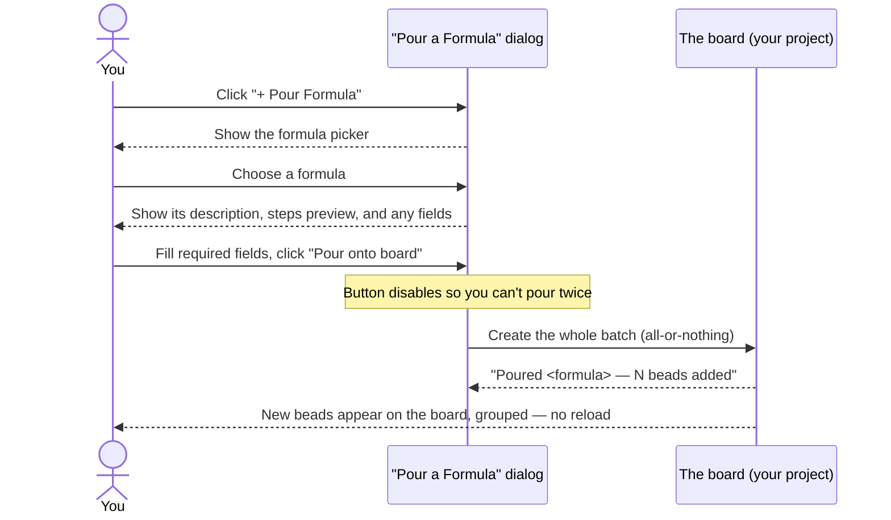

# Feature: Create from formulas

## What it does

Create from formulas lets you stamp out a whole cluster of related beads in a
single action instead of creating each one by hand. A **formula** is a reusable
template that already knows the shape of a recurring piece of work — its steps,
the order they go in, how they relate, and any blanks you need to fill in. You
open the **Pour a Formula** dialog from the board, pick a formula, fill in
anything it asks for, click **Pour onto board**, and the matching beads appear
on the board as one neatly grouped batch — usually within a second or two, with
no page reload.

## Why it exists

Some work comes in the same shape over and over: the same checklist of tasks,
the same little dependency chain, the same handful of follow-ups. Re-creating
that cluster bead-by-bead every single time is slow, error-prone, and easy to
get subtly wrong — you forget a step, you wire two beads up backwards, or you
type the title slightly differently than last time.

Formulas exist so that the *shape* of recurring work is captured once and poured
on demand. The point isn't just speed (though it is much faster) — it's
**consistency**: every pour of the same formula produces the same well-formed set
of beads, correctly linked, every time. That means you can trust that "the usual
batch" really is the usual batch, and you can preview exactly what's about to
land before you commit. It also keeps your board honest: a pour is
all-or-nothing, so you never end up with a half-built cluster of orphaned beads
if something goes wrong partway through.

## How it works

### User perspective

You start from the board. In the masthead at the top of the page, next to the
light/dark theme toggle, there's a **+ Pour Formula** button. Clicking it opens
a dialog titled **Pour a Formula** with a short hint: *"Pick a formula, fill any
variables, and pour its beads onto the board."* The dialog reloads its list of
available formulas fresh every time you open it, so a formula someone added a
moment ago shows up without a page reload (you'll briefly see *"Loading
formulas…"*).

From there it's a short, two-step flow:

1. **Pick a formula** from the **Formula** dropdown (it starts on *"Choose a
   formula…"*). Each entry shows its name and, where one exists, a short
   description. Choosing one loads that formula's form below the dropdown,
   headed by its name and full description.
2. **Preview and fill in** what it needs. If the formula has steps, a **Show all
   steps** disclosure (with a count beside it) lets you expand an ordered
   preview of every bead it will create — this preview is look-ahead only,
   nothing is created until you actually pour. If the formula asks for inputs, you'll see
   one field per **variable**, each with a label and often a line of help text;
   some come pre-filled with a sensible default, and any field marked with a red
   asterisk is required. If the formula needs nothing, it simply says *"This
   formula takes no variables."*

When you're ready, click **Pour onto board**. The button briefly disables itself
so you can't accidentally pour twice while it works. A moment later a
confirmation line appears — *"Poured **<formula name>** — N beads added to the
board."* — and the picker resets to *"Choose a formula…"* so you could pour
again, while the confirmation stays put. Behind the dialog, the new beads have
already appeared on the board, grouped together under a heading named after the
formula. You don't refresh; the board updates itself (see
[Live updates](live-updates.md)).

### System perspective

In plain language, and without any code or file paths: when you open the dialog,
bdboard asks your project for the list of formulas it currently has and shows
them in the dropdown. When you pick one, it reads that formula's full details —
its complete description, its ordered steps, and its variables (including which
ones are required because they have no default) — and builds the form you see.

When you pour, bdboard first double-checks on its side that every required
variable actually has a value, then hands the formula and your filled-in values
off to your project to "cook." Cooking a formula expands its template into a real
set of beads and lands them on your board as one batch. The whole batch is
created together as a single, atomic operation: either every bead lands, or — if
something goes wrong — none of them do and your board is left untouched. There's
no half-finished cluster to clean up.

A couple of touches keep the result tidy. The pour creates one behind-the-scenes
grouping node that ties the batch together; bdboard deliberately **hides** that
wrapper from the board (you'd never want to see it as a stray card) and counts it
out of the total, so the "N beads added" number matches what you can actually
see. bdboard also gives the batch's group heading a short unique tag, so if you
pour the same formula twice you can tell the two batches apart at a glance.
Finally, once the pour succeeds, bdboard refreshes its picture of your beads and
nudges every open page to catch up — which is why the new beads appear on the
board (and in any other tabs you have open) on their own.

## Sequence

## Where you'll find it

- **The entry point** is the **+ Pour Formula** button in the masthead at the
  very top of the **Board** page, sitting in the right-hand actions group beside
  the light/dark theme toggle.
- **The dialog** (**Pour a Formula**) opens over the board. Top to bottom it
  holds: a one-line hint, the **Formula** dropdown, the selected formula's form
  (its description, an optional **Show all steps** preview, and any variable
  fields), the **Pour onto board** button, a **Close** button (Esc also closes
  it), and a confirmation area that shows what landed.
- **The result of a pour** shows up on the **Board** itself, behind the dialog:
  the new beads appear as a group headed by the formula's name plus a short tag.

There's no separate settings screen for this — picking, previewing, and pouring
all happen inside the one dialog.

## Edge Cases

> [!WARNING]
> - **A pour is all-or-nothing.** If anything goes wrong while the batch is being
>   created, nothing is added — your board is never left half-built with orphaned
>   beads.
> - **The hidden wrapper isn't counted.** Every pour creates one behind-the-scenes
>   grouping node that the board hides on purpose, so the "N beads added" number
>   reflects only the beads you'll actually see, not that invisible extra.
> - **Repeat pours are distinguishable.** Each pour of the same formula gets its
>   own short tag in its group heading, so two batches of the same formula don't
>   blur together on the board.
> - **Poured beads show up in every open tab.** If you have bdboard open in more
>   than one tab or window, a freshly poured batch appears in all of them
>   automatically — so if beads seem to materialize "out of nowhere," check
>   whether you (or an agent) just poured a formula elsewhere.
> - **Previewing the steps changes nothing.** Expanding **Show all steps** is a
>   look-ahead only; no beads exist until you click **Pour onto board**.
> - **Required fields gate the pour.** A field marked with a red asterisk must
>   have a value; the dialog won't complete the pour until every required field
>   is filled, even if you try to submit early.

## Error Scenarios

- **No formulas to pour.** If your project has no formulas yet, the picker says
  *"No formulas found."* — there's nothing to pour until a formula is added.
- **The list won't load.** If the formulas can't be fetched, the dialog shows a
  friendly *"Couldn't load formulas right now. Please try again in a moment."*
  rather than breaking; close and reopen the dialog (which retries) or reload the
  page.
- **A formula's details can't be read.** If a picked formula's template is broken
  or unreadable, you'll see *"Couldn't read this formula's details"* (or a
  similar note about its variables). Other formulas still work; the broken one
  needs fixing before it can be poured.
- **A required field was left empty.** If you somehow submit without filling a
  required variable, the pour is refused and a message names exactly which
  variable(s) still need a value — nothing is created.
- **The pour is rejected.** If your project refuses the pour, you'll see *"Pour
  failed: …"* with the real reason. Because a pour is atomic, nothing was added,
  so you can adjust your inputs (or have the formula checked) and try again
  without cleaning anything up.
- **A partial pour.** In the rare case the batch comes back incomplete, the
  dialog warns of a *"Partial pour"* — naming how many beads actually landed and
  flagging that some steps didn't. The honest signal is intentional: it won't
  dress up an incomplete batch as a clean success. Remove the incomplete group
  and have the formula's setup checked before retrying.
- **The pour takes too long.** A very large formula can exceed the wait window,
  in which case you'll see *"Pour timed out. The formula may still be
  materializing — refresh in a moment."* Give it a few seconds and refresh to
  see whether the beads arrived before pouring again, so you don't create
  duplicates.
- **The dialog was open a very long time.** A safety check can go stale on a page
  left open for ages; if a pour is rejected and asks you to refresh, reload the
  page, reopen the dialog, and pour again.

## Good to know

The grouping is deliberately invisible-where-it-should-be and visible-where-it
helps: the wrapper node that ties a batch together is hidden from the board (and
left out of the count) so it never clutters your view, while the formula-named
group heading and its short per-pour tag are kept so you can always see which
beads came from which pour. And because pouring only ever reads and writes your
own project data on your machine, creating beads this way never reaches out to
the internet — see [Your data is local & safe](../Concepts/your-data-is-local-and-safe.md).

## Related

- [Create beads from a formula](../Guides/create-beads-from-a-formula.md) — the
  step-by-step how-to for actually pouring, including troubleshooting.
- [What is a bead?](../Concepts/what-is-a-bead.md) — the building block a formula
  stamps out copies of.
- [Bead lifecycle & the lanes](../Concepts/bead-lifecycle-and-lanes.md) — where
  your newly poured beads land on the board and how they move.
- [Live updates](live-updates.md) — why poured beads appear on their own, across
  every open tab, without a refresh.
- [Edit a bead](../Guides/edit-a-bead.md) — adjusting a bead after a formula
  creates it.
- [Take your first look](../Guides/take-your-first-look.md) — getting bdboard
  open and oriented.
- [Features](index.md) — the rest of what bdboard does.
- [Overview](../Overview.md) — the big picture of the app.
