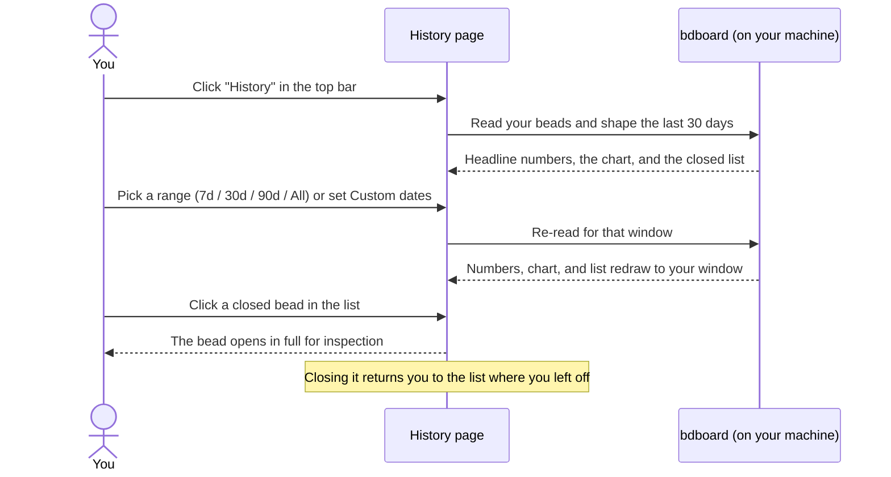

# Feature: History & trends

## What it does

History & trends is bdboard's look-back lens. Where the **Board** answers
"what's happening right now?", the **History** page answers "how has this
project been going over time?". It gathers every bead you've *finished* and
shows it three ways at once: a strip of headline numbers across the top (totals,
how fast work tends to move, how much you're closing per day), a **Created vs
closed** chart with one small bar-pair per day, and a paginated, newest-first
list of the closed beads themselves. You choose the stretch of time you want to
study — the last 7, 30, or 90 days, everything ever closed, or an exact span of
dates you pick — and the whole page reshapes to that window. Click any closed
bead in the list to open it in full for the complete story.

## Why it exists

The Board is deliberately a *recent-activity* surface: its time filter stops at
three days, so older finished work simply isn't there. That keeps the day-to-day
view fast and uncluttered, but it leaves a real question unanswered — *how is the
project trending?* You can't tell from a snapshot of today whether you're
burning down a backlog or quietly drowning in one, how long beads typically wait
before someone picks them up, or whether last month was busier than this one.

History & trends exists to answer exactly those retrospective questions without
cluttering the Board. By collecting finished work across weeks or months and
laying it out as numbers, a daily chart, and a browsable list, it turns a pile of
closed beads into something you can actually *read*: the rhythm of the project,
whether work is flowing or piling up, and how long things take from filed to
done. It's the wide bay window to the Board's small kitchen window — same
project, a deliberately different framing for a different kind of question. See
[Time ranges & recent work](../Concepts/time-ranges-and-recent-work.md) for the
mental model behind the two surfaces.

## How it works

### User perspective

You reach History from the top navigation bar — it sits between **Board** and
**Memory**. The page opens showing the **last 30 days** by default, and after a
brief shimmer it fills in with three things stacked top to bottom:

- **A headline numbers strip** across the top. From left to right it reads:
  **Total** and **Closed** (workspace-wide tallies — every bead, and every bead
  ever closed), then **Avg lead**, **Closed (range)**, **Median lead**, and
  **Throughput**. The two workspace tallies never change when you adjust the time
  window — they always count everything. The other four *do* react to the window
  you've picked. Each label has a small **i** icon; hover, focus, or click it for
  a one-line explanation of what that number measures and whether it follows the
  range.
- **The Created vs closed chart.** Each day in your window is a small column
  holding two bars side by side — one for beads **created** that day and one for
  beads **closed** that day — with a legend naming each series and its total for
  the window. When the "closed" bars run taller than the "created" bars over a
  stretch, you were burning down the backlog; when the reverse is true, work was
  piling up faster than it finished.
- **The Closed beads list.** Below the chart, the beads closed in your window
  appear as cards, **newest-closed first**, with the total count beside the
  heading. Click any card to open that bead in full. If more closed beads exist
  than fit on a page, **‹ Newer** and **Older ›** buttons step through pages, a
  **Page** indicator shows where you are, and a **Per page** selector lets you
  show 25, 50, or 100 at a time (it starts at 50 and remembers your choice).

To change the window, use the range buttons near the top — **7d**, **30d**,
**90d**, **All** — or click **Custom** to open a little panel with **From** and
**To** date pickers plus **Apply** and **Clear**. The active window is
highlighted, and everything on the page — numbers, chart, and list — refreshes to
match. The whole page is read-only: picking a range only re-filters what's shown,
and opening a closed bead just lets you inspect it. For a click-by-click walk
through all of this, see
[Explore history & trends](../Guides/explore-history-and-trends.md).

### System perspective

In plain language: when you open History, bdboard takes the same single, fresh
reading of your project's beads that the rest of the app uses — all on your own
machine, nothing fetched from the internet (see
[Your data is local & safe](../Concepts/your-data-is-local-and-safe.md)) — and
then *derives* everything on the page from that one reading. There's no separate
"history database" being kept; the page is computed on demand from your current
beads.

The window you choose sets two boundaries — an earliest moment and (for a custom
range) a latest one. bdboard keeps only the beads whose finish time falls inside
those boundaries, then shapes them into the three views:

- For the **numbers**, it measures, for the beads closed in your window, how long
  each took. It reports two different "how long did it take" figures side by
  side: **Median lead** counts from when a bead was first *filed* to when it
  closed — the whole wait, including time spent sitting in the backlog — while
  **Avg lead** counts from when work was actually *claimed* until it closed — the
  hands-on time. Seeing both tells you how much of a bead's life was waiting
  versus being worked. **Throughput** is simply the average number of beads
  closed per day across the window. The two **Total**/**Closed** tallies come
  from a whole-workspace count, which is why they ignore the range.
- For the **chart**, it tallies how many beads were *created* on each day and how
  many were *closed* on each day, then lays those day-by-day counts on one
  continuous timeline — filling in any quiet days with zero so the chart reads as
  a steady run of days rather than a jagged one.
- For the **list**, it sorts the in-window closed beads newest-first and hands
  back just the page you asked for, remembering the total so the pager knows
  whether there's more.

A bead that has no recorded finish time can't be placed on a timeline, so it
simply doesn't appear in the chart or the closed list. Picking a **From** date
that's later than your **To** date isn't an error — bdboard quietly swaps them so
the window still makes sense rather than coming back empty, and the **To** day is
counted in full (a bead closed any time that day still counts). The page also
stays current on its own: if a bead closes while you're looking, History
re-reads and re-draws — see [Live updates](../Features/live-updates.md).

## Sequence

## Where you'll find it

- **The History page** — reached from the **History** link in the top navigation
  bar, between **Board** and **Memory**.
- **The range buttons** — a row near the top of the page: **7d**, **30d**,
  **90d**, **All**, and a **Custom** button that opens a small **From**/**To**
  date panel with **Apply** and **Clear**.
- **The headline numbers** — a strip across the very top of the page (in the
  page header): **Total**, **Closed**, **Avg lead**, **Closed (range)**,
  **Median lead**, and **Throughput**, each with a small **i** info icon.
- **The Created vs closed chart** — the middle section, with a legend above it
  naming the **Created** and **Closed** series and their totals.
- **The Closed beads list** — the lower section, a vertical list of cards
  (newest-closed first) with a **‹ Newer** / **Older ›** pager, a **Page**
  indicator, and a **Per page** selector (25 / 50 / 100).

There's no settings screen to configure here — you steer everything from the
range buttons, the custom-date panel, and the per-page selector right on the
page.

## Edge Cases

> [!WARNING]
> - **The two workspace tallies don't move with the range — on purpose.**
>   **Total** and **Closed** count your whole workspace as it stands right now.
>   If a number doesn't budge when you change the window, it's one of these,
>   sitting deliberately next to the figures that *do* respond.
> - **A dash (—) means "nothing to measure", not an error.** Lead times need
>   closed beads with the right timestamps; if the window has none, the figure
>   shows a muted dash rather than a misleading zero. Widen the window or wait
>   for more work to close.
> - **`From` later than `To` is forgiven.** bdboard swaps the two dates so your
>   window stays meaningful instead of coming back empty.
> - **The `To` date is inclusive.** A bead closed at any time on your chosen end
>   date still counts — you don't lose the last day.
> - **A live refresh snaps the window back to the default last-30-days view.** If
>   a bead closes in the background while you're on a custom range or a different
>   preset, History re-reads the *default* window. If the page seems to "reset"
>   on its own, that's why — just re-pick your range to get back to where you
>   were. See [Live updates](../Features/live-updates.md).
> - **The chart is readable without colour.** The "created" bar carries a
>   diagonal hatch pattern, not just a different colour, and the chart and each
>   day carry descriptive labels — so the two series stay distinguishable in
>   greyscale, with colour-blind vision, or via a screen reader.

## Error Scenarios

- **Your window has no closed work.** The chart shows a gentle "No beads created
  or closed to chart …" note and the list shows "Nothing closed … — try a wider
  range." Nothing is broken; either nothing finished in that span or the project
  has no closed work yet. Click **All** or a wider preset to broaden the view.
- **You page past the end of the list.** Switching to a narrower range can leave
  you on a page that no longer has results; you'll see "Nothing on page N" with a
  one-click **back to page 1** link rather than a dead end.
- **A custom range looks empty even though you know work closed then.**
  Double-check the **From**/**To** dates — anything closed outside the span is
  filtered out. Use **Clear** to drop back to a preset, confirm the data's there,
  then narrow again.
- **The numbers or list look stale.** History refreshes itself when work changes,
  but because all the data lives on your own machine you can always reload the
  page to force a fresh read — it loads quickly.

## Good to know

The behaviours you'd most want to rely on are the ones the project's automated
checks pin down: that the window's lower and upper bounds are honoured exactly
(with the **To** day counted in full and no off-by-one), that an inverted custom
range is swapped rather than left empty, that the daily chart fills quiet days
with zero so it reads as a continuous timeline, that paging returns exactly the
slice you asked for and reports whether there's more, and that the lead, median,
and throughput figures are computed only from beads with the timestamps they
need. In everyday use that adds up to a simple promise: the window you pick is
the window you get, and the numbers, chart, and list always agree with each
other.

## Related

- [Time ranges & recent work](../Concepts/time-ranges-and-recent-work.md) — the
  mental model behind windows, presets, and "recent" versus "all time", and why
  the Board and History use different controls.
- [Explore history & trends](../Guides/explore-history-and-trends.md) — the
  step-by-step how-to for everything on this page.
- [Bead lifecycle & the lanes](../Concepts/bead-lifecycle-and-lanes.md) — how a
  bead travels from filed to closed, which is what the lead and throughput
  numbers measure.
- [What is a bead?](../Concepts/what-is-a-bead.md) — the unit being counted,
  charted, and listed here.
- [Live updates](../Features/live-updates.md) — why the page refreshes itself
  when work changes (and why a live refresh returns to the default window).
- [Your data is local & safe](../Concepts/your-data-is-local-and-safe.md) — why
  building these trends never involves the internet.
- [Edit a bead](../Guides/edit-a-bead.md) — working with a bead once you've
  opened it from the closed list.
- [Take your first look](../Guides/take-your-first-look.md) — getting bdboard
  open and oriented, including the Board that History complements.
- [Features](index.md) — the rest of what bdboard does.
- [Overview](../Overview.md) — the big picture of the app.
