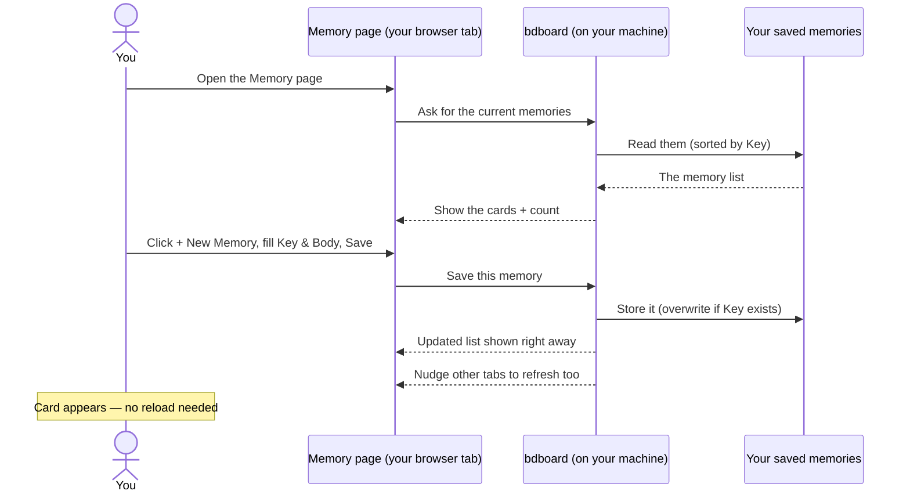

# Feature: Memory manager

## What it does

The memory manager is the **Memory** page in bdboard — the place where you
curate the long-lived notes your AI agents carry into every session. Each memory
is a short, memorable **Key** (a label like `dev-workflow`) paired with a
**Body** (the note itself, which can use Markdown). From this one page you can
add a new memory, search the ones you already have, edit a memory's text, and
forget a memory you no longer need. Everything is point-and-click: add with the
**+ New Memory** button, find by typing in the search box, and use the small
pencil and trash buttons on each card to edit or remove. No terminal required.

## Why it exists

Agents are forgetful by design — each session starts fresh. Without somewhere to
keep your standing conventions, gotchas, and preferences, you'd have to repeat
them every single time ("use relative links in docs", "we deploy on Fridays",
"prefer this naming style"). Memories solve that: they're handed to every agent
at the start of a session, so the things you've already explained stay explained.

But a pile of memories is only useful if it's easy to keep tidy. Before this
page existed, the only way to manage memories was on the command line — fine for
a power user mid-task, awkward when you just want to glance at what your agents
know and prune the stale bits. The memory manager exists to make that curation
**visible and safe**: you can see every memory rendered nicely, search to find
the one you mean, fix a note in place, and remove one only after an explicit
confirmation — because forgetting a memory quietly weakens every future agent
session that relied on it.

## How it works

### User perspective

Open the **Memory** page from the top navigation bar (it sits alongside
**Board** and **History**). You'll see a search box, a **+ New Memory** button,
and a list of memory cards — each card showing its Key as a heading and its Body
rendered below. A small count line tells you how many memories you have. If you
have none yet, a friendly empty message invites you to add your first.

- **Add:** Click **+ New Memory**. A dialog opens with two fields, **Key** and
  **Body**. Fill both in and click **Save Memory** — the dialog closes and your
  new card appears in the list. Both fields are required.
- **Find:** Start typing in the **Search memories** box. After a brief pause the
  list narrows to memories whose Key or Body contains your term, and the count
  line updates to read something like *2 matching "deploy"*. Clear the box to
  see everything again.
- **Edit:** Click the **pencil** button on a card. The same dialog reopens,
  pre-filled with that memory's Key and Body — but the Key is locked, because a
  memory is identified by its Key. Change the Body and click **Save Memory** to
  replace the note in place.
- **Forget:** Click the **trash** button on a card. A confirmation dialog
  appears, naming the exact Key and warning that forgetting it is permanent and
  silently degrades future agent sessions. Click **Yes, Forget It** to remove
  it, or **Cancel** to back out.

Your changes show up immediately, and because the page stays current on its own,
a memory you add or remove in one browser tab appears in your other tabs too —
no refresh needed (see [Live updates](live-updates.md)).

### System perspective

In plain language: the Memory page reads your project's memories straight from
your own machine and shows them as cards. When you search, the filtering is done
for you — bdboard asks for just the memories whose Key or Body contains your
term (matching is case-insensitive), so the list you see is already narrowed by
the time it arrives. Memories always come back sorted alphabetically by Key, so
the list order is stable and predictable.

When you **save** a memory, bdboard stores it under its Key. If that Key already
exists, the old note is **overwritten** rather than duplicated — that's why
saving the same Key again is how you keep a single note current, and why the Key
is locked when you're editing. When you **forget** a memory, it's removed
outright.

After any add, edit, or forget, two things happen: the page you're on updates
right away so you see your change without waiting, and a quiet "something
changed" nudge goes out so every other open bdboard tab refreshes its memory
list too. All of this happens against data that lives on your machine — nothing
is sent to the internet to manage your memories (see
[Your data is local & safe](../Concepts/your-data-is-local-and-safe.md)).

## Sequence

## Where you'll find it

- **The Memory page** lives behind the **Memory** link in the top navigation
  bar, next to **Board** and **History**.
- **The toolbar** across the top of the page holds the **Search memories** box
  on the left and the **+ New Memory** button on the right.
- **The list** fills the rest of the page: one card per memory, each with the
  Key as a heading, the rendered Body below, and a **pencil** (edit) and
  **trash** (forget) button in the card's corner.
- **The dialogs** appear over the page: a *New Memory / Edit Memory* form when
  you add or edit, and a separate *Forget Memory?* confirmation when you remove.

## Edge Cases

> [!WARNING]
> - **Saving an existing Key overwrites it.** There's no "are you sure?" for a
>   save — re-using a Key replaces that memory's Body. If you wanted a separate
>   note, give it a different Key. (This is deliberate: it's how you keep one
>   note up to date.)
> - **You can't rename a Key.** The Key is locked while editing. To "rename",
>   create a new memory with the Key you want and the same Body, then forget the
>   old one.
> - **Empty fields are rejected.** Both Key and Body are required, and
>   whitespace alone doesn't count — if either is blank, the save is refused.
> - **Changes ripple across tabs.** If you have bdboard open more than once,
>   adding or forgetting a memory in one tab updates the others automatically. A
>   memory that seems to change "on its own" was probably edited elsewhere (by
>   you in another tab, or by an agent).

## Error Scenarios

- **Memories won't load** (the underlying note store hiccuped): instead of a
  blank page or a crash, the list area shows a friendly *"Couldn't load memories
  right now. Please try again in a moment."* message. Wait a beat and the next
  refresh usually recovers; reload the page if it persists.
- **A save or forget fails:** the dialog reports that the memory couldn't be
  saved or deleted rather than silently doing nothing. Close the dialog, wait a
  moment, and retry.
- **The page has been open a very long time:** an action can be rejected with a
  prompt to refresh, because the page's safety token can go stale. Reload the
  page and repeat your action.
- **A search matches nothing:** the list shows *No memories matching "…"* — your
  term doesn't appear in any Key or Body. Clear the search box to see everything
  and refine your term.

## Good to know

- **Forgetting can't be undone.** There's no trash-can recovery — the
  confirmation dialog is the safety net, which is exactly why it spells out the
  Key and warns you before it acts. When in doubt, **edit** a memory to trim or
  correct it rather than forgetting it outright. If you're unsure, copy the Body
  before you confirm a forget.
- **Memories are for your agents, not just notes-to-self.** Phrase them as
  durable facts ("prefer relative links in docs") rather than one-off reminders,
  because every memory here is fed to future agent sessions.
- **Bodies support Markdown,** so you can use emphasis, lists, and code spans to
  keep longer notes readable on their cards.

## Related

- [Manage agent memories](../Guides/manage-agent-memories.md) — the step-by-step
  how-to for adding, finding, editing, and removing memories, with a
  troubleshooting table.
- [Your data is local & safe](../Concepts/your-data-is-local-and-safe.md) —
  where your memories live and why managing them never touches the internet.
- [Live updates](live-updates.md) — why a memory change in one tab appears in
  your other tabs without a refresh.
- [What is a bead?](../Concepts/what-is-a-bead.md) — the rest of what bdboard
  tracks, alongside the memories your agents rely on.
- [Take your first look](../Guides/take-your-first-look.md) — getting bdboard
  open and oriented, including how to reach the Memory page.
- [Features](index.md) — the rest of what bdboard does.
- [Overview](../Overview.md) — the big picture of the app.
