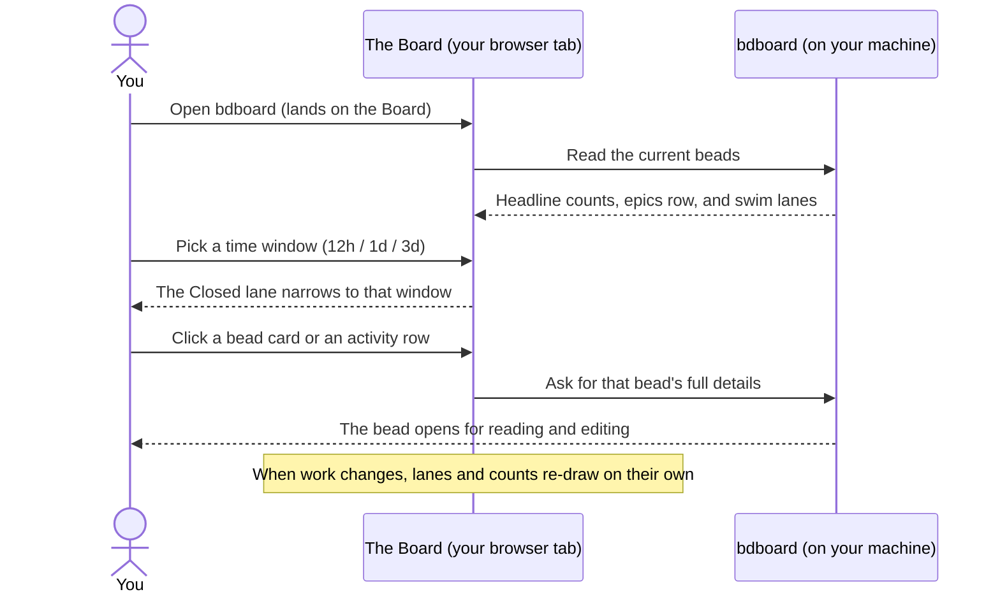

# Feature: The board (swim lanes & activity)

## What it does

The board is bdboard's home page — the first thing you see when you open the
app. It lays your project's work out as a set of **swim lanes**, one column per
stage of progress, so you can see at a glance what's waiting, what's stuck,
what's being worked on right now, and what's recently finished. Across the top
sits a strip of **headline counts**, above the lanes runs a row of **epics**
(the big bodies of work), and a dedicated **Activity** column shows the most
recent things that happened, newest first. Every bead on the board is a card you
can click to open its full details. The board reads your work and arranges it —
you don't drag cards around or set their stage by hand here; the stage a bead
sits in is decided by the bead's own status and its dependencies.

## Why it exists

A list of every open item, sorted by date, tells you *what* exists but not
*where things stand*. When you manage work as beads — especially when agents and
teammates are filing, claiming, and closing them in the background — the
question you actually have is rarely "show me everything." It's "what can I pick
up next?", "what's blocked and why?", "is anything actually moving?", and "what
just got done?" Those are questions about **stage**, not about a flat list.

The board exists to answer all of those at a glance, by mapping the messy
underlying state of each bead onto a small, fixed set of lanes that always mean
the same thing. Because the lanes are derived automatically from each bead's
real status and its blocking relationships, the picture is honest: a bead can't
sit in "Ready" if something is still blocking it, and a finished bead can't
linger as if it were open. The board is deliberately a **recent-activity
surface** — it focuses on what's live and what just changed, and hands off the
long retrospective ("everything we've ever closed") to the
[History page](history-and-trends.md).

## How it works

### User perspective

Open bdboard and you land on the **Board** (the first link in the top
navigation). Reading top to bottom, here's what you see:

- **The headline counts** across the top: how many beads are **Open**,
  **Blocked**, **Deferred**, and **Closed**. These are your project's vital
  signs in one line. (There's deliberately no "In Progress" count up here —
  bdboard is a one-thing-at-a-time tool, so the single active bead is shown in
  its lane instead of as a noisy 0-or-1 number.)
- **A time-window filter** on the right, just above the lanes, with three
  choices: **12h**, **1d** (the default), and **3d**. This narrows how far back
  the **Closed** lane reaches, so you can focus on "what got done in the last
  few hours" versus "the last few days." Your choice sticks as you move around.
- **The Epics row**: a horizontal strip of the larger bodies of work. The epic
  that's actively underway (or, if none is, the one that's next in line) leads
  the strip, and epics that depend on one another are laid out in the order
  they need to happen. Each epic chip shows its id, priority, title, current
  status, and who it's assigned to.
- **The swim lanes** themselves, left to right: **Deferred**, **Blocked**,
  **Ready**, **In Progress**, **Closed**, and an **Activity** column. Each lane
  has a title and a live count of how many cards it holds. Within a lane, the
  most urgent and most recently-touched work floats to the top.
- **Bead cards**: every item is a small card showing its id, a priority badge,
  its title, who it's assigned to, its type, and a marker if it has
  dependencies. **Click any card** to open its full detail view, where you can
  read and edit it (see [Bead detail & editing](bead-detail-and-editing.md)).
- **The Activity column**: the latest things that happened, newest at the top —
  each row shows when it happened, what happened (created, updated, in progress,
  blocked, or closed), who, and the bead's title. Clicking an activity row opens
  that bead too.

You don't arrange any of this. A bead lands in the right lane on its own based
on its status and whether anything is blocking it. As work changes — by you or by
an agent — the lanes and counts update themselves in place; you never reload (see
[Live updates](live-updates.md)).

### System perspective

In plain language: bdboard takes a fresh reading of your project's beads and
sorts each one into exactly one lane using a small, consistent set of rules:

- **In Progress** — the bead is actively being worked.
- **Blocked** — the bead is explicitly marked blocked, *or* it's open but
  something it depends on isn't finished yet. (So "open but waiting on another
  bead" correctly shows up as blocked, not as ready-to-go.)
- **Ready** — the bead is open and nothing is blocking it, so it's genuinely
  available to pick up next.
- **Deferred** — open-ish work that's been set aside for now.
- **Closed** — finished work (closed, resolved, or done).

The **Epics row** is handled separately: epics live in their own strip rather
than in the lanes, and finished epics drop out of it. Epics that depend on each
other are ordered so predecessors come before the work that waits on them, and
the one that's active (or next-ready) is pulled to the front so your eye lands on
"what's happening now" first. Behind the scenes, a redundant grouping wrapper
that gets created when you pour a formula is hidden from the lanes so it doesn't
show up as a stray empty card — the human-readable formula name rides on the
epic that *does* appear (see [Create from formulas](create-from-formulas.md)).

The **Closed** lane and the **Closed** headline count are deliberately kept in
agreement: both reflect the same recent set of finished work, bounded to roughly
the last few days when the board reads your beads, then narrowed further by
whichever time window (12h / 1d / 3d) you've picked. Anything older than that
window isn't lost — it simply lives on the History page, which is built for the
long view. The **Activity** column is a synthesized feed: since there isn't a
single running log across every bead, each bead contributes one entry based on
its most recent timestamp, with the action inferred from its current state, and
the newest few dozen are shown.

For why the page never goes stale while you watch it, see
[Live updates](live-updates.md); for why none of this involves the internet, see
[Your data is local & safe](../Concepts/your-data-is-local-and-safe.md).

## Sequence

## Where you'll find it

The board **is** the home page — it's the **Board** link, first in the top
navigation (alongside **History** and **Memory**). On that page:

- **Headline counts** sit across the **top of the page** (the masthead): Open,
  Blocked, Deferred, Closed.
- **The Pour Formula button** and the **dark-mode toggle** live at the **top
  right** of the masthead.
- **The time-window filter** (12h / 1d / 3d) is a small row of buttons
  **above the lanes, on the right**. The highlighted one is the active window,
  and **1d** is the default. Your selection is remembered as you navigate.
- **The Epics row** runs **horizontally just under the toolbar**, above the
  lanes.
- **The swim lanes** fill the **main body**, left to right: Deferred, Blocked,
  Ready, In Progress, Closed, and Activity. Each shows a count next to its name.
- **Bead cards** are everywhere inside the lanes; **click one** to open its
  detail view.

There's no settings screen for the board's layout — the lanes, ordering, and the
rules that place each bead are automatic. The one control you set yourself is the
time window, and it only affects how far back the Closed lane reaches.

## Edge Cases

> [!WARNING]
> - **The time filter only narrows the Closed lane.** The other lanes (Ready,
>   Blocked, In Progress, Deferred) show their current contents regardless of the
>   12h / 1d / 3d choice, because those represent *live* state, not dated events.
>   Switching to 12h won't hide an in-progress bead just because it's older.
> - **"Open but waiting" shows up as Blocked, not Ready.** If a bead is open but
>   something it depends on isn't finished, the board puts it in **Blocked** on
>   purpose — so "Ready" only ever means "genuinely free to start now."
> - **The board's Closed lane is intentionally short-range.** It reaches back
>   only a few days at most. To see everything you've ever finished — or to look
>   at older closures — use [History & trends](history-and-trends.md), which is
>   built for the long view.
> - **Finished epics leave the Epics row.** Once an epic is done it drops out of
>   the strip rather than cluttering it; you'll find completed epics through
>   History, not on the board.
> - **One thing in progress at a time.** Because bdboard is a single-flight tool,
>   the In Progress lane normally holds a single active bead, which is why there's
>   no In Progress number in the headline counts.

## Error Scenarios

- **The board is still loading.** The counts strip and the lanes paint a
  lightweight placeholder first and then fill in a moment later, so the page
  appears instantly instead of waiting on a full reading. You briefly see
  outlines where cards will be, then the real content swaps in.
- **A lane has nothing in it.** Empty lanes don't disappear — they stay put and
  simply read *(empty)*, so the board's shape is stable and you can tell at a
  glance that, say, nothing is currently blocked.
- **No epics are active.** The Epics row shows a quiet *(no active epics)* note
  rather than vanishing, so the row's place on the page is predictable.
- **No recent activity.** The Activity column reads *no activity yet* instead of
  showing a blank space.
- **Live updates can't connect.** The board still works as a normal, accurate
  view of your beads the moment it loads; you can reload by hand at any time to
  pull the current picture (see [Live updates](live-updates.md)).

## Good to know

The board's promise is that a bead always lands in the lane that matches its real
state, and that the Closed lane and the Closed headline count never disagree
about what counts as "recently finished." That consistency — the lane rules, the
honest "blocked vs. ready" split, and the agreement between the count and the
lane — is exactly what the project's automated checks pin down, so the picture
you read off the board can be trusted at a glance. In everyday use it comes down
to a simple habit: scan the counts for the vitals, glance at the Epics row for
the big picture, read the lanes for "what's next / what's stuck / what's moving,"
and watch Activity for what just happened.

## Related

- [Bead lifecycle & the lanes](../Concepts/bead-lifecycle-and-lanes.md) — the
  mental model behind the stages a bead moves through and what each lane means.
- [What is a bead?](../Concepts/what-is-a-bead.md) — what the cards on the board
  actually represent.
- [Time ranges & recent work](../Concepts/time-ranges-and-recent-work.md) — why
  the board is short-range and the History page is the long view.
- [Bead detail & editing](bead-detail-and-editing.md) — what opens when you
  click a card.
- [Live updates](live-updates.md) — why the lanes and counts refresh themselves.
- [History & trends](history-and-trends.md) — the long retrospective for older,
  closed work.
- [Create from formulas](create-from-formulas.md) — pouring new beads onto the
  board with the Pour Formula button.
- [Your data is local & safe](../Concepts/your-data-is-local-and-safe.md) — why
  none of this touches the internet.
- [Take your first look](../Guides/take-your-first-look.md) — a guided first
  tour of the board.
- [Features](index.md) — the rest of what bdboard does.
- [Overview](../Overview.md) — the big picture of the app.
