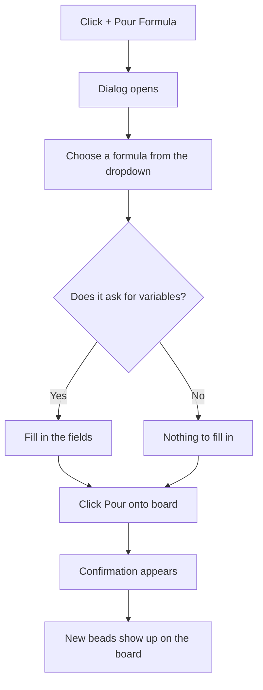

# How to: Create beads from a formula

## Goal

Spin up a whole set of related beads in one go by pouring a **formula** — a
reusable template that knows the shape of a recurring piece of work (its
steps, their order, and how they relate) and stamps the matching beads onto
your board for you. By the end of this guide you'll be able to open the pour
dialog, choose a formula, fill in any details it asks for, and watch its beads
appear on the board — without creating each one by hand.

## Prerequisites

- bdboard is open in your browser. (If it isn't, start it the way you normally
  do and follow the address it shows you — see
  [Take your first look](take-your-first-look.md).)
- At least one formula is available to pour. Formulas are part of your project;
  if you have none yet, the picker will tell you so (see
  [Troubleshooting](#troubleshooting)).
- A rough idea of which formula you want and what it's for. If a formula asks
  for variables (like a name or a label to slot into each bead), have those
  values ready.
- Nothing else — there's no sign-in, and the beads you create live with the
  rest of your project data on your own machine. See
  [Your data is local & safe](../Concepts/your-data-is-local-and-safe.md).

> [!IMPORTANT]
> A formula creates **several beads at once**, all linked together as a group.
> That's the whole point — it saves you from re-creating the same cluster of
> tasks every time. Before you pour, it's worth glancing at the formula's
> steps (the dialog lets you expand them) so you know what's about to land. To
> understand what a single bead is, see
> [What is a bead?](../Concepts/what-is-a-bead.md).

## Steps

Here's the path you'll follow — open the dialog, pick a formula, fill in
anything it needs, then pour:

### Open the pour dialog

1. In the top bar of the board, click the **+ Pour Formula** button (it sits
   alongside the light/dark theme toggle) — *expected result: a dialog titled
   **Pour a Formula** opens over the board, with a short hint reading "Pick a
   formula, fill any variables, and pour its beads onto the board." It briefly
   shows "Loading formulas…" while it fetches what's available.*

### Choose a formula

2. In the **Formula** dropdown (it starts on "Choose a formula…"), open the
   list and pick the formula you want. Each entry shows its name and, where
   one exists, a short description — *expected result: a form for that formula
   appears below the dropdown, headed by the formula's name and its full
   description.*
3. (Optional but recommended) If the form shows a **Show all steps** disclosure
   with a count next to it, click it to expand the list — *expected result: an
   ordered list of every step the formula will create appears, each with its
   title and, where given, its type and a short description. Click the summary
   again to collapse it.*

> [!IMPORTANT]
> Expanding the steps is a preview, not a commitment — nothing is created until
> you actually pour. Use it to sanity-check that this is the formula you meant
> to run.

### Fill in any variables

4. Look at the fields below the steps. If the formula takes inputs, you'll see
   one field per **variable**, each with a label and (often) a line of help
   text explaining what it's for — *expected result: fields you can type into,
   some of which may already be filled with a sensible default value.*
5. Fill in any field marked with a red asterisk (**\***) — these are required.
   Fields that came pre-filled can be left as-is or changed to suit — *expected
   result: your values appear in the fields. The **Pour onto board** button
   won't let you proceed while a required field is still empty.*

> [!NOTE]
> If the formula needs no inputs, you'll simply see the message "This formula
> takes no variables." — there's nothing to fill in, so go straight to pouring.

### Pour the beads onto the board

6. Click **Pour onto board** — *expected result: the button briefly disables
   itself so you can't pour twice by accident while it works.*
7. Wait for the confirmation — *expected result: a success line appears,
   marked with a check, reading something like "Poured **<formula name>** — N
   beads added to the board.", where N is how many beads landed. The picker
   resets to "Choose a formula…" so you could pour another, while the
   confirmation stays visible.*
8. Look at the board behind the dialog (or close the dialog with the **Close**
   button or the Esc key) — *expected result: the new beads have appeared,
   grouped together under a heading named after the formula. You didn't need to
   refresh — the board updates on its own. See
   [Live updates](../Features/live-updates.md) for why.*

> [!IMPORTANT]
> Each pour of the same formula gets its own short tag in its group heading, so
> if you pour the same formula twice you can tell the two batches apart on the
> board at a glance.

> [!WARNING]
> If you have bdboard open in more than one tab or window, the freshly poured
> beads appear in all of them automatically. So if beads seem to "appear out of
> nowhere", check whether you (or an agent) just poured a formula elsewhere.

## Troubleshooting

| Symptom | Fix |
| --- | --- |
| The dialog says "No formulas found." | Your project doesn't have any formulas to pour yet. Formulas are part of the project's setup; add one (or ask whoever maintains the project to), then reopen the dialog — it reloads the list fresh every time you open it. |
| You see "Couldn't load formulas right now. Please try again in a moment." | The list couldn't be fetched. Close the dialog, wait a moment, reopen it (which retries automatically); if it persists, reload the page. |
| You picked a formula but its form says "Couldn't read this formula's details" / "Couldn't read this formula's variables." | That formula's template couldn't be read. Pick a different formula to confirm the dialog itself works, then have the broken formula checked; reopen and try again once it's fixed. |
| The **Pour onto board** button won't do anything. | A required field (marked with a red asterisk) is still empty. Fill every required field, then pour. If you submitted anyway, you'll see a message naming exactly which variable(s) still need a value. |
| You see "Pour failed: …" with a reason. | The pour was rejected and nothing was added (a pour is all-or-nothing, so your board isn't left half-built). Read the reason shown, adjust your inputs or the formula as needed, and pour again. |
| The result warns of a "Partial pour — only N beads materialized; some steps did not land." | The formula didn't create everything it should have. Remove the incomplete group from the board, have the formula's setup checked, then pour again. |
| You see "Pour timed out. The formula may still be materializing — refresh in a moment." | A large formula took longer than expected. Give it a few seconds, then refresh the board to see whether the beads arrived before pouring again (to avoid creating duplicates). |
| After a long time with the dialog open, a pour is rejected and asks you to refresh. | The page's safety check can go stale on a page left open a very long time. Reload the page, reopen the dialog, and pour again. |
| You poured the right formula but can't tell which group is which. | Each pour's group heading carries a short unique tag. Match the tag in the confirmation line to the heading on the board, or pour into a quieter time window so it stands out. |

## Related

- [Create from formulas](../Features/create-from-formulas.md) — what the pour
  feature offers, at a glance.
- [What is a bead?](../Concepts/what-is-a-bead.md) — the building block a
  formula stamps out copies of.
- [Bead lifecycle & the lanes](../Concepts/bead-lifecycle-and-lanes.md) — where
  your newly poured beads land on the board and how they move.
- [Live updates](../Features/live-updates.md) — why poured beads appear without
  a refresh, across every open tab.
- [Take your first look](take-your-first-look.md) — getting bdboard open and
  oriented.
- [Edit a bead](edit-a-bead.md) — adjusting a bead after a formula creates it.
