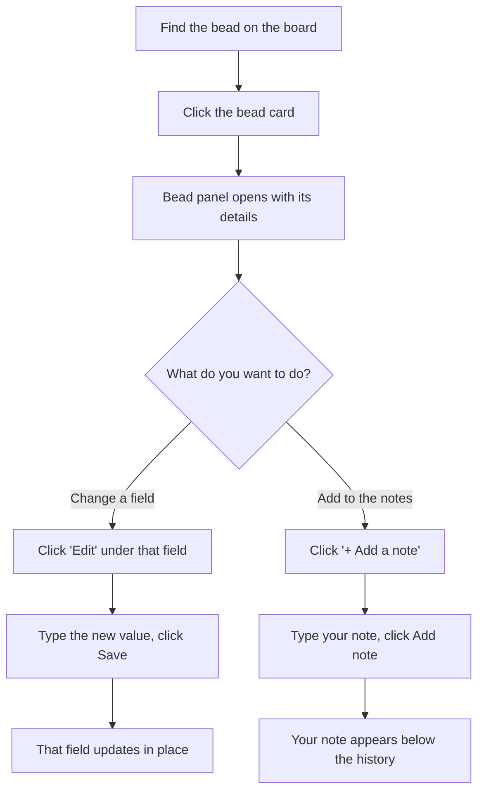

# How to: Edit a bead

## Goal

Change the details of an existing bead — its title, description, priority,
assignee, type, and more — directly from the board, without touching a terminal.
By the end of this guide you'll be able to open any bead, edit one field at a
time, add a note to its running history, and understand why some beads can't be
edited at all. Editing happens **one field at a time and saves on its own**, so
there's no big "Save everything" button to hunt for and no way to accidentally
overwrite a field you didn't touch.

## Prerequisites

- bdboard is open in your browser. (If it isn't, start it the way you normally
  do and follow the address it shows you — see
  [Take your first look](take-your-first-look.md).)
- The bead you want to change is **open**. Only beads still in the open state
  can be edited — once a bead has been claimed (it's being worked on) or closed
  (it's finished history), its fields become read-only. See
  [Bead lifecycle & the lanes](../Concepts/bead-lifecycle-and-lanes.md) for what
  each state means.
- Nothing else — there's no sign-in, and every change you make is saved with the
  rest of your project data on your own machine. See
  [Your data is local & safe](../Concepts/your-data-is-local-and-safe.md).

> [!IMPORTANT]
> Editing is restricted to **open** beads on purpose. A bead that someone (or an
> agent) is actively working on, or one that's already closed, is locked so your
> edit can't quietly clobber in-flight work or rewrite completed history. If you
> don't see any edit controls, that's almost always why — check the bead's
> status at the top of its panel.

## Steps

Here's the path you'll follow: open the bead, expand the field you want to
change, edit it, and save. Adding a note follows the same shape but uses a
separate "Add a note" control.

### Open the bead

1. On the **Board** page, find the card for the bead you want to change and
   click it — *expected result: a panel slides open over the page showing that
   bead's id, its priority badge, its status, its title, and a **Bead details**
   section listing every field. Below that is an **Audit trail** that
   loads the bead's history.*

2. Glance at the **status** shown near the top of the panel — *expected result:
   if it reads as open, you'll see small **Edit** controls under the changeable
   fields. If it's being worked on or is closed, those controls won't appear,
   because the bead is locked.*

### Change a field

3. Find the field you want to change in the **Bead details** list and click the
   **Edit** control beneath it (for example, **Edit title** or **Edit
   priority**) — *expected result: the control expands into a small form with a
   labelled box already holding the field's current value, plus **Cancel** and
   **Save** buttons. Your cursor lands in the box automatically.*

4. Update the value. The kind of box you get depends on the field — *expected
   result:*
   - *For text fields like the **title**, **assignee**, or an external
     reference, you'll type into a single-line box.*
   - *For longer fields like **description**, **acceptance criteria**, or
     **design**, you'll get a larger multi-line box that understands Markdown.*
   - *For **priority** and **type**, you'll pick from a dropdown of allowed
     choices (priorities **P0** through **P4**; types such as bug, feature,
     task, epic, chore, or decision) — you can't type a value that isn't on
     the list.*
   - *For an **estimate**, you'll get a number box.*

5. Click **Save** (or click **Cancel** to back out without changing anything) —
   *expected result: the form collapses and just that one field updates in place
   with your new value. Everything else on the panel stays exactly as it was. If
   you changed the priority, the coloured priority badge at the top of the panel
   updates at the same time.*

### Add a note

6. Scroll to the **notes** field and click **+ Add a note** — *expected result:
   a small form opens with a **New note** box and a reminder that your note is
   *added below* the existing notes, never replacing what's already there.*

7. Type your note (Markdown is supported), then click **Add note** — *expected
   result: the form collapses and your note appears appended beneath the
   bead's existing note history. The earlier notes are untouched.*

> [!IMPORTANT]
> Notes are **append-only** — there's deliberately no way to edit or overwrite
> the existing note history from here. That history often holds verification
> evidence and discovery trails that must never be lost, so the only thing you
> can do is *add* to it. If you need to correct something, add a follow-up note
> rather than trying to replace the old one.

> [!WARNING]
> If you have bdboard open in more than one tab or window — or an agent is
> working alongside you — your saved changes appear in the other views
> automatically, with no need to refresh. So if a bead seems to change "on its
> own", check whether the same bead was updated elsewhere. See
> [Live updates](../Features/live-updates.md).

> [!CAUTION]
> If someone else (or an agent) changes the same bead after you opened its
> panel, your save may be rejected to protect their change from being
> overwritten — you'll be asked to refresh and re-apply your edit. This is a
> safety net, not an error on your part; just reload, reopen the bead, and make
> your change again against the latest version.

## Troubleshooting

| Symptom | Fix |
| --- | --- |
| There are no **Edit** controls anywhere on the panel. | The bead isn't open. Beads that are being worked on or are already closed are locked for editing. Check the status shown near the top of the panel. |
| You try to save and you're told the bead **can no longer be edited**. | The bead's status changed to in-progress or closed after you opened it. Close the panel, reopen the bead, and confirm it's still open before editing. |
| Saving is rejected with a message that the bead **changed since you opened it**. | Someone or something edited the same bead in the meantime. Refresh the page, reopen the bead, and re-apply your change against the current version so you don't overwrite their edit. |
| The **Add note** button does nothing / says there's **nothing to add**. | A note can't be empty. Type some text into the New note box (spaces alone don't count) and try again. |
| You see a message that the change **couldn't be saved**. | The underlying store hiccuped. Close the form, wait a moment, and retry; if it persists, reload the page and try once more. |
| After leaving the page open for a very long time, a save is refused and asks you to refresh. | The page's safety token can go stale on a tab that's been open a long time. Reload the page, reopen the bead, and repeat your edit. |
| You expected to edit a field (like status, parent, or the id) but there's no Edit control for it. | Some fields are intentionally not editable here — they're set by the bead's lifecycle or are immutable. Only the safe, user-owned fields (title, description, acceptance criteria, design, priority, assignee, type, external reference, estimate, and notes) can be changed from this panel. |
| Your priority change saved but the badge at the top still looks old. | This normally updates instantly. If it didn't, close and reopen the bead — the panel will reload with the current priority. |

## Related

- [Bead detail & editing](../Features/bead-detail-and-editing.md) — what the
  bead panel shows and what you can do on it, at a glance.
- [What is a bead?](../Concepts/what-is-a-bead.md) — the fields you're editing
  and what they mean.
- [Bead lifecycle & the lanes](../Concepts/bead-lifecycle-and-lanes.md) — why
  only open beads can be edited.
- [Take your first look](take-your-first-look.md) — getting bdboard open and
  oriented.
- [Live updates](../Features/live-updates.md) — why your changes appear across
  tabs without refreshing.
- [Your data is local & safe](../Concepts/your-data-is-local-and-safe.md) —
  where your edits are saved and why that matters.
