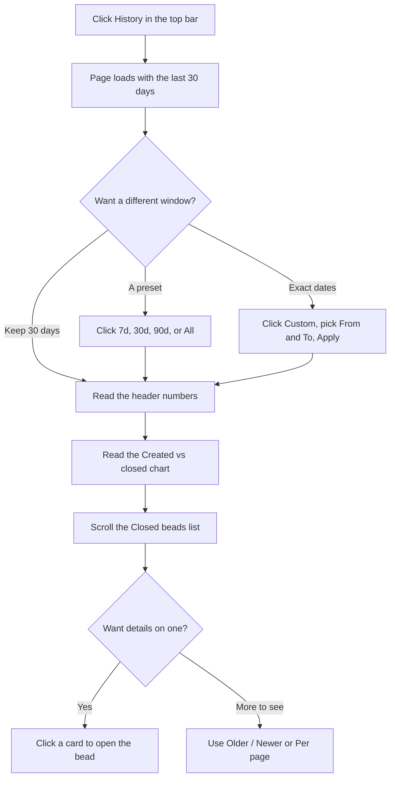

# How to: Explore history & trends

## Goal

Look back over finished work and spot the shape of your project over time.
By the end of this guide you'll be able to open the **History** page, pick the
stretch of time you care about, read the at-a-glance numbers in the header,
make sense of the **Created vs closed** chart, page through the list of closed
beads, and open any one of them for the full story — all without typing a single
command. History is the long-window companion to the **Board**: where the board
shows the here-and-now, History is where older, finished work goes to be
reviewed.

## Prerequisites

- bdboard is open in your browser. (If it isn't, start it the way you normally
  do and follow the address it shows you — see
  [Take your first look](take-your-first-look.md).)
- Some closed work to look at. History only charts and lists beads that have
  actually been closed, so a brand-new project with nothing finished yet will
  show friendly "nothing here" messages until work starts wrapping up.
- Nothing else — there's no sign-in, and everything you see is read from your
  own project data on your own machine. See
  [Your data is local & safe](../Concepts/your-data-is-local-and-safe.md).

> [!IMPORTANT]
> History is a *read-only* lens on finished work. Nothing on this page changes
> your beads — clicking a closed bead opens it for inspection, picking a time
> range only re-filters what's shown, and switching pages just moves through the
> same list. You can explore freely without fear of altering anything.

## Steps

Here's the path you'll follow — open the page, choose a time range, read the
numbers and the chart, then drill into individual closed beads:

### Open the History page

1. In the top navigation bar, click **History** (it sits between **Board** and
   **Memory**) — *expected result: the page title changes to "History", and
   after a brief shimmer the page fills in with a row of summary numbers across
   the top, a **Created vs closed** chart, and a **Closed beads** list. It opens
   showing the **last 30 days** by default.*

### Choose a time range

2. Look at the row of range buttons near the top: **7d**, **30d**, **90d**, and
   **All**. Click the window you want — *expected result: the button you chose
   becomes highlighted (and the others un-highlight), and the numbers, chart,
   and list all refresh to cover just that span. **All** drops the time limit and
   shows everything ever closed.*

3. To look at an exact stretch of dates instead, click the **Custom** button at
   the end of the range buttons — *expected result: a small panel opens beneath
   it with two date pickers, **From** and **To**, plus **Apply** and **Clear**.*

4. Pick a **From** date and a **To** date, then click **Apply** — *expected
   result: the panel closes, the **Custom** button shows as the active choice,
   and everything on the page narrows to beads closed within those dates. The
   **To** date is included in full — a bead closed any time on that day still
   counts.*

> [!IMPORTANT]
> If you accidentally pick a **From** date that's later than your **To** date,
> bdboard quietly swaps them so the range still makes sense rather than coming
> back empty. To return to a preset window, reopen **Custom** and click
> **Clear**, or just click one of the **7d** / **30d** / **90d** / **All**
> buttons.

### Read the headline numbers

5. Scan the strip of figures across the top of the page. From left to right
   they tell you: **Total** and **Closed** (workspace-wide tallies of every bead
   and every bead ever closed), then **Avg lead**, **Closed (range)**, **Median
   lead**, and **Throughput** — *expected result: each figure shows a value (or
   a muted dash when there's nothing to measure). The four range-based figures
   change whenever you change the time range; the two workspace tallies stay the
   same because they always count everything.*

6. If a label isn't self-explanatory, click the small **i** icon next to it —
   *expected result: a short tooltip appears explaining exactly what that number
   measures and whether it follows the time range. For example, **Throughput**
   is the average number of beads closed per day across the window you've
   chosen.*

> [!IMPORTANT]
> Two of the headline numbers measure different kinds of "how long did it take".
> **Median lead** counts from when a bead was *first filed* to when it closed
> (the whole wait), while **Avg lead** counts from when work was *actually
> claimed* until it closed (the hands-on time). Seeing both side by side tells
> you how much of a bead's life was spent waiting versus being worked.

### Read the Created vs closed chart

7. Look at the **Created vs closed** chart. Each day in your range is a small
   column holding two bars side by side — one for beads **created** that day and
   one for beads **closed** that day — and the legend above names which,
   with the totals for the window — *expected result: taller "closed" bars than
   "created" bars over a stretch mean you were burning down the backlog; the
   reverse means work was piling up faster than it was finishing.*

> [!WARNING]
> The two bars are deliberately drawn differently, not just in different colours
> — the "created" bar carries a diagonal hatch pattern — so you can still tell
> them apart in greyscale or with colour-blind vision. Hovering or reading with
> a screen reader gives the exact created and closed counts for each day.

### Browse the closed beads

8. Scroll down to the **Closed beads** list. It shows the beads closed in your
   window as cards, **newest-closed first**, with the total count beside the
   heading — *expected result: a vertical list of cards, each showing a closed
   bead's key details. If nothing closed in the window, you'll instead see a
   gentle "Nothing closed …" message suggesting you try a wider range.*

9. Click any card to inspect that bead in full — *expected result: a detail view
   opens over the page showing the bead's information. Closing that view returns
   you to the History list exactly where you left off. (For working with a bead's
   contents, see [Edit a bead](edit-a-bead.md).)*

### Move through the list

10. If there are more closed beads than fit on one page, use the **Older ›** and
    **‹ Newer** buttons at the bottom to step through pages; the **Page**
    indicator between them shows where you are — *expected result: the list
    swaps to the next or previous page of closed beads while keeping your chosen
    time range.*

11. To see more (or fewer) beads at once, change the **Per page** selector next
    to the pager — you can pick **25**, **50**, or **100** (it starts at 50) —
    *expected result: the list reloads from page 1 with that many cards per page.
    Your choice is remembered, so it sticks the next time you visit History.*

> [!WARNING]
> History updates itself live: if a bead closes while you're looking at the
> page, it appears without you needing to refresh. There's a trade-off, though —
> a live update **snaps the view back to the default last-30-days window**. So if
> you'd set a **Custom** range or a different preset and the page seems to "reset"
> on its own, a bead just closed in the background; simply re-pick your range to
> get back to where you were. See [Live updates](../Features/live-updates.md).

## Troubleshooting

| Symptom | Fix |
| --- | --- |
| The page is empty or shows "Nothing closed …". | Either nothing has closed in the window you picked, or your project genuinely has no closed work yet. Click **All** (or a wider preset) to broaden the window; if it's still empty, there's simply nothing finished to show yet. |
| A headline number shows a dash (—) instead of a value. | That measurement has no data for the current range. For example, lead and cycle times need closed beads with the right timestamps; widen the range or wait until more work closes. |
| The chart says "No beads created or closed to chart …". | Nothing happened in that window to plot. Pick a wider range or different dates. |
| I picked a custom range but the page jumped back to the last 30 days. | A bead closed in the background and triggered a live refresh, which returns to the default window. Just reopen **Custom** (or click your preset) to re-apply your range. |
| My custom range came back empty even though I know work closed then. | Double-check the **From**/**To** dates. Remember the **To** day is included, but anything closed outside those dates is filtered out. Click **Clear** and try a preset to confirm the data is there, then narrow down again. |
| The **Older ›** button is missing. | You're already on the last page for this window — there are no older closed beads to show. |
| A page shows "Nothing on page N". | You paged past the end (this can happen after switching ranges). Use the **back to page 1** link in that message, or pick a range again. |
| The list or numbers look stale. | History refreshes on its own when work changes, but you can always reload the page to force a fresh read; your project data lives locally, so it loads quickly. |

## Related

- [History & trends](../Features/history-and-trends.md) — what the History page
  offers, at a glance.
- [Time ranges & recent work](../Concepts/time-ranges-and-recent-work.md) — the
  mental model behind windows, presets, and "recent" versus "all time".
- [Bead lifecycle & the lanes](../Concepts/bead-lifecycle-and-lanes.md) — how a
  bead travels from filed to closed, which is what the lead and cycle numbers
  measure.
- [Edit a bead](edit-a-bead.md) — working with a bead once you've opened it from
  the list.
- [Live updates](../Features/live-updates.md) — why the page refreshes itself
  when work changes.
- [Take your first look](take-your-first-look.md) — getting bdboard open and
  oriented.
