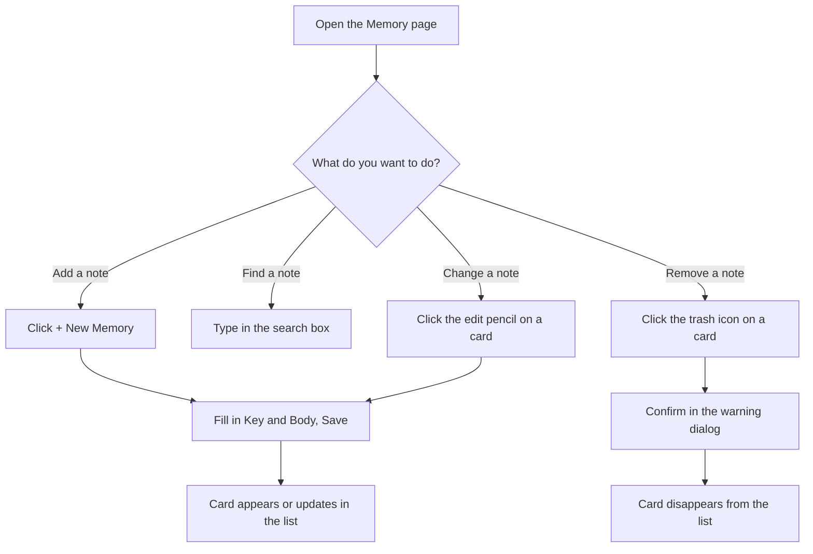

# How to: Manage agent memories

## Goal

Add, find, update, and remove the long-lived notes your AI agents rely on —
the *memories* that get handed to every agent at the start of a session so they
remember your conventions, gotchas, and preferences without being told again.
By the end of this guide you'll be able to curate that knowledge entirely from
the **Memory** page, with no terminal commands required.

## Prerequisites

- bdboard is open in your browser. (If it isn't, start it the way you normally
  do and follow the address it shows you — see
  [Take your first look](take-your-first-look.md).)
- A rough idea of what you want to capture: each memory is a short **Key**
  (a memorable label) plus a **Body** (the actual note, which may use Markdown).
- Nothing else — there's no sign-in, and your memories live with the rest of
  your project data on your own machine. See
  [Your data is local & safe](../Concepts/your-data-is-local-and-safe.md).

> [!IMPORTANT]
> Memories are *shared with your agents*, not just notes-to-self. Every memory
> you keep here is fed to future agent sessions, so phrase them as durable facts
> ("we deploy on Fridays", "prefer relative links in docs") rather than
> one-off reminders.

## Steps

Here's the path you'll follow for the common tasks — opening the page, then
adding, finding, editing, or removing a memory:

### Open the Memory page

1. In the top navigation bar, click **Memory** (it sits alongside **Board** and
   **History**) — *expected result: the page title changes to "Memory" and a
   list of existing memory cards loads. If you have none yet, you'll see a
   friendly empty message inviting you to add your first one.*

### Add a new memory

2. Click the **+ New Memory** button near the top of the page — *expected
   result: a dialog box opens titled "New Memory" with two empty fields, **Key**
   and **Body**.*
3. In **Key**, type a short, memorable label (for example, a few words joined
   by dashes). The dialog reminds you that this is just a short identifier —
   *expected result: your text appears in the Key field.*
4. In **Body**, write the note itself. You can use Markdown for emphasis, lists,
   and the like — *expected result: your text appears in the larger Body box.*
5. Click **Save Memory** — *expected result: the dialog closes and your new
   memory appears as a card in the list, showing its Key as a heading and the
   Body rendered below it. The count at the top of the list goes up by one.*

### Find a memory

6. Click in the **Search memories** box at the top of the list and start typing
   — *expected result: as you type (after a brief pause), the list narrows to
   only the memories that match, and the count line updates to read something
   like "2 matching …".*
7. To return to the full list, clear the search box (use its built-in
   clear control or delete your text) — *expected result: every memory reappears and the count
   line shows the total again.*

### Update an existing memory

8. On the card you want to change, click the **edit** (pencil) button —
   *expected result: the dialog opens titled "Edit Memory", pre-filled with that
   memory's current Key and Body. The Key is locked for editing, because a
   memory is identified by its Key.*
9. Adjust the **Body** text as needed, then click **Save Memory** — *expected
   result: the dialog closes and the card updates in place with your new
   content. The total count stays the same — you've replaced the note, not
   added one.*

> [!IMPORTANT]
> Saving with a Key that already exists *overwrites* that memory's body rather
> than creating a duplicate. That's intentional: it means re-saving the same Key
> is how you keep a single note current. If you wanted a separate note, give it
> a different Key.

### Remove a memory

10. On the card you no longer need, click the **forget** (trash) button —
    *expected result: a confirmation dialog appears, naming the exact Key and
    warning that forgetting it permanently removes it and quietly weakens every
    future agent session that relied on it.*
11. If you're sure, click **Yes, Forget It** (otherwise click **Cancel**) —
    *expected result: the dialog closes, the card disappears from the list, and
    the count drops by one.*

> [!CAUTION]
> Forgetting a memory cannot be undone, and the cost is invisible: agents simply
> stop knowing whatever that note taught them. When in doubt, **edit** the
> memory to trim or correct it rather than forgetting it outright.

> [!WARNING]
> If you have bdboard open in more than one tab or window, changes you make in
> one appear automatically in the others — there's no need to refresh. So if a
> memory seems to change "on its own", check whether you (or an agent) updated
> it elsewhere.

## Troubleshooting

| Symptom | Fix |
| --- | --- |
| The **Save Memory** button doesn't seem to do anything. | Both **Key** and **Body** are required. Make sure neither is blank (whitespace alone doesn't count) and try again. |
| You see a message that the memory "couldn't be saved" or "couldn't be deleted". | This usually means the underlying note store hiccuped. Close the dialog, wait a moment, and retry; if it persists, reload the page and try once more. |
| After a long time on the page, an action is rejected and asks you to refresh. | The page's safety token can go stale on a page that's been open a very long time. Reload the page, then repeat your action. |
| The list shows "No memories matching …". | Your search term doesn't match any Key or Body. Clear the search box to see everything, then refine your term. |
| You meant to keep a memory but clicked forget. | There's no undo. Re-create it with **+ New Memory** using the same Key and the original text. (Tip: copy the Body before confirming a forget if you're unsure.) |
| You want to rename a memory's Key. | You can't rename a Key directly. Create a new memory with the desired Key and the same Body, then forget the old one. |
| The list looks empty right after opening the page. | It loads a placeholder for a split second; give it a moment. If it stays empty and you expected memories, reload the page. |

## Related

- [Memory manager](../Features/memory-manager.md) — what the Memory page offers,
  at a glance.
- [Your data is local & safe](../Concepts/your-data-is-local-and-safe.md) —
  where your memories live and why that matters.
- [Take your first look](take-your-first-look.md) — getting bdboard open and
  oriented.
- [Live updates](../Features/live-updates.md) — why changes appear across tabs
  without refreshing.
