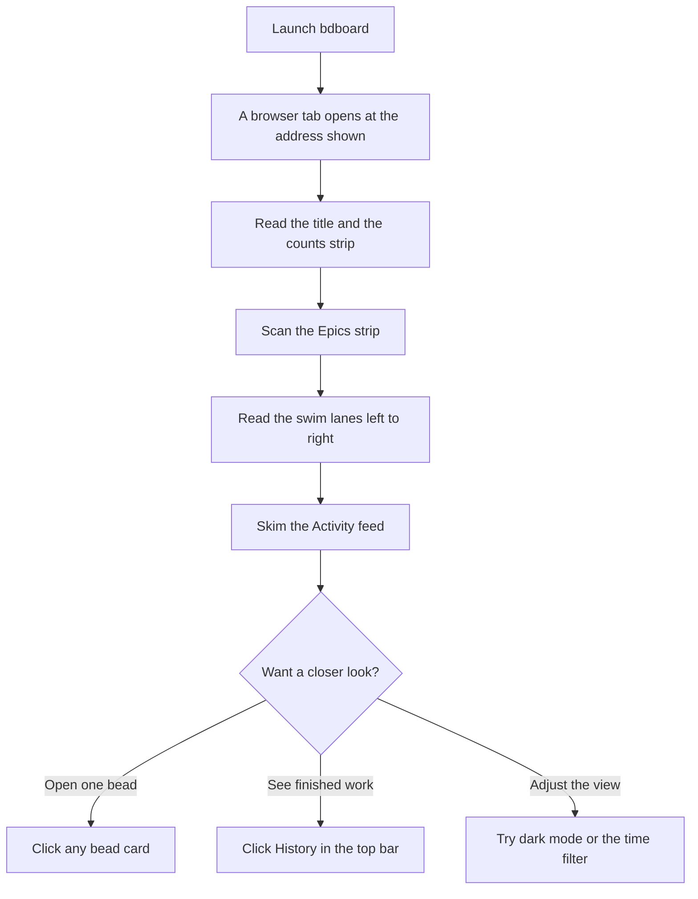

# How to: Take your first look

## Goal

Open bdboard for the very first time and get your bearings. By the end of this
guide you'll have the dashboard up in your browser, you'll know what every part
of the **Board** is telling you — the title, the running counts, the swim lanes,
the epics strip, and the live activity feed — and you'll know how to peek inside
a single bead, switch between the three main pages, dim the lights with dark
mode, and narrow the board to just the last few hours or days. Think of this as
the orientation tour before any of the task-focused guides.

## Prerequisites

- A project that bdboard can read — that is, a workspace that already has beads
  in it. bdboard is a *window onto* your existing bead data; it doesn't create
  the project for you.
- A way to launch bdboard. You start it the way you normally start it for your
  setup; when it launches it prints an address and usually pops open a browser
  tab for you. If a tab doesn't open on its own, open the address it shows you.
- A web browser. There's nothing to install in the browser, no account, and no
  sign-in — everything you see is read straight from your own project on your
  own machine. See the
  [Concepts](../Concepts/index.md) section — *Your data is local & safe* — for
  where what you see actually comes from.

> [!IMPORTANT]
> The Board is a *live, read-only* view of your work. Just looking around —
> clicking a bead open, switching pages, flipping to dark mode, or changing the
> time window — never changes your beads. You can explore the whole tour freely
> without worrying about altering anything.

## Steps

Here's the shape of the tour: get the board open, read each part of the screen
from the top down, then try the handful of things you can click.

### Open the board

1. Launch bdboard the way you normally do for your setup — *expected result:
   after a moment a browser tab opens at the address bdboard prints when it
   starts. If no tab opens automatically, open that address yourself. The page
   that loads is the **Board**.*

2. Give the page a second to fill in — *expected result: the layout appears
   right away as a set of empty-looking columns (placeholders), then the real
   numbers and bead cards fade in a heartbeat later. This two-stage paint is
   normal: bdboard shows you the page shape instantly and then drops in the live
   data so nothing jumps around.*

### Read the top of the screen

3. Look at the top-left of the page — *expected result: your workspace's name is
   shown as the page title, so you can tell at a glance which project you're
   looking at.*

4. Look at the strip of figures along the top-right, next to the title —
   *expected result: a small row of running totals for your workspace, labelled
   **Open**, **Blocked**, **Deferred**, and **Closed**, each with its count. A
   label that reads zero is shown muted rather than hidden, so the strip keeps a
   steady shape and never jumps around as numbers change.*

> [!IMPORTANT]
> You won't see an "In Progress" tally in that top strip, and that's on purpose.
> bdboard treats work as one-thing-at-a-time, so a count that only ever reads 0
> or 1 would just be clutter. The single active item already has its own column
> further down the page (see the next steps), which is the clearer place to look
> for "what's being worked on right now".

### Read the second row

5. Just below the title, find the row of page links: **Board**, **History**, and
   **Memory** — *expected result: three text links sitting together. **Board**
   is shown as the current page (it's emphasised and marked as where you are).
   These are how you move between the three main areas of bdboard.*

6. Over on the right of that same row, find the **Dark** / **Light** toggle and
   the **+ Pour Formula** button — *expected result: the toggle's label tells
   you which mode you'd switch *to*, and the button is your entry point for
   creating new beads from a saved formula (covered in its own guide).*

### Read the swim lanes

7. Look at the **Epics** strip near the top of the main area — *expected result:
   a horizontal row of larger cards, one per active epic, each showing its id,
   priority, title, and current status. Epics are the big umbrella items that
   group smaller beads together; if there are none active you'll see a quiet
   "(no active epics)" note instead.*

8. Below the epics, read the columns (the "swim lanes") from left to right —
   **Deferred**, **Blocked**, **Ready**, and **In Progress** — each with a
   count beside its name — *expected result: every lane holds the beads in that
   state as small cards. **Deferred** is parked-for-later, **Blocked** is
   waiting on something else, **Ready** is fair game to pick up, and **In
   Progress** holds the item being worked on right now. An empty lane shows a
   gentle "(empty)" marker so you can tell it loaded but has nothing in it.* For
   the full story of how a bead moves between these lanes, see the
   [Concepts](../Concepts/index.md) section — *Bead lifecycle & the lanes*.

9. Find the **Closed** lane — *expected result: it briefly shows shimmering
   placeholder cards, then fills with recently closed beads. It loads a moment
   after the other lanes by design, so the rest of the board is usable straight
   away. The Board only keeps *recently* closed work here; the full back catalogue
   lives on the **History** page.*

10. Find the **Activity** feed — *expected result: a running list of the latest
    things that have happened — beads created, claimed, updated, and closed —
    newest first, each line showing roughly when it happened, what happened, who
    did it, and which bead. If nothing's happened yet you'll see "no activity
    yet".*

### Read a bead card

11. Look at any single card in a lane — *expected result: each card shows the
    bead's id and, where set, a priority badge, its title, and a line of extra
    detail such as who it's assigned to, its type, and a marker if it has
    dependencies. That's the at-a-glance summary; the full detail is one click
    away.* For what a bead actually *is*, see the
    [Concepts](../Concepts/index.md) section — *What is a bead?*.

### Try the few things you can click

12. Click any bead card (or an epic, or a line in the Activity feed) — *expected
    result: a detail view opens over the board showing everything bdboard knows
    about that bead. Close it to return to the board exactly where you were.* To
    go further and change a bead's contents, see
    [Edit a bead](edit-a-bead.md).

13. Above the lanes on the right, find the small time-window buttons — **12h**,
    **1d**, and **3d** — and click a different one — *expected result: the one
    you pick becomes highlighted and the board narrows to show work from just
    that window. It starts on **1d** (the last day). For looking further back
    than a few days, that's what the History page is for.*

14. Click the **Dark** / **Light** toggle on the top row — *expected result: the
    whole page switches between light and dark appearance, and the toggle's label
    flips to offer the other mode. Your choice sticks, so bdboard remembers it
    next time.*

15. Click **History** in the top row, then **Memory**, then **Board** again —
    *expected result: each link takes you to that page, and the link for wherever
    you are is always shown as the current one. You've now seen all three areas;
    Board is home base.* From here, dig into finished work with
    [Explore history & trends](explore-history-and-trends.md) or browse saved
    notes with [Manage agent memories](manage-agent-memories.md).

> [!WARNING]
> The board updates itself live — when work changes, the lanes, counts, and
> activity feed refresh on their own within a moment, with no need to reload.
> That's why a card may appear, move, or vanish while you're looking: someone (or
> something) just changed a bead. See the [Features](../Features/index.md)
> section — *Live updates*.

## Troubleshooting

| Symptom | Fix |
| --- | --- |
| No browser tab opened when I launched bdboard. | bdboard prints an address when it starts — open that address in your browser yourself. (Some setups deliberately don't auto-open a tab.) |
| The page title says "workspace not ready" and it won't show a board. | bdboard was started somewhere that isn't a bead project. Start it from inside your project's directory, or point it at your project, then reload. |
| The board loads but every lane is empty. | Your project genuinely has no beads yet, or its history hasn't been brought onto this machine. Once there are beads to show, they'll appear; until then the empty lanes are expected. |
| The columns appear but the numbers and cards never fill in. | bdboard paints the page shape first and then loads the live data. If the data never arrives, reload the page; if it still won't load, the underlying bead tool may be stuck — wait a moment and try again. |
| The Closed lane just shows shimmering placeholders forever. | The Closed lane loads a beat after the others. Give it a second; if it never settles, reload the page. |
| I changed the time window and beads disappeared. | That's the filter working — the board is now showing only the chosen window (12h, 1d, or 3d). Pick a wider button, or visit **History** to look further back. |
| The board "reset" or a card jumped while I was reading. | bdboard refreshes itself live when work changes, so the view can shift on its own as beads are created, claimed, or closed. Nothing's broken — it's just staying current. |
| Dark mode (or my time-window choice) didn't stick. | These preferences are remembered in your browser. If they reset, your browser may be clearing site data between visits — check its privacy settings. |

## Related

- [Features](../Features/index.md) — includes *The board (swim lanes & activity)*,
  a fuller tour of everything the Board page shows, and *Live updates*, why the
  board refreshes itself when work changes.
- [Concepts](../Concepts/index.md) — includes *What is a bead?* (the basic unit
  you see on every card), *Bead lifecycle & the lanes* (how a bead travels from
  filed to closed, which is what the lanes represent), and *Your data is local &
  safe* (where what you see actually comes from).
- [Edit a bead](edit-a-bead.md) — opening a bead and changing its contents.
- [Explore history & trends](explore-history-and-trends.md) — reviewing finished
  work over time.
- [Create beads from a formula](create-beads-from-a-formula.md) — using the
  **+ Pour Formula** button.
- [Manage agent memories](manage-agent-memories.md) — the **Memory** page.
