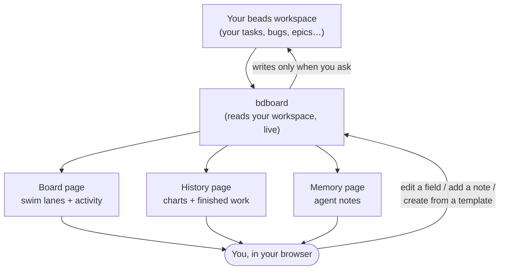

# bdboard — Overview

> A friendly tour of **bdboard** for people who *use* it. No code, no file
> paths — just what bdboard is, what you can do with it, and how the pieces fit
> together. For step-by-step tasks see the [Guides](Guides/index.md); for the
> background ideas see the [Concepts](Concepts/index.md).

## In one sentence

**bdboard is a live, always-fresh web dashboard for your *beads* workspace** —
it opens in your browser and shows your work as colour-coded swim lanes, with
full detail on every item, a history page with trends, and a place to manage the
notes your AI agents rely on.

## What it's for

If you track your work as **beads** (small issue cards — tasks, bugs, epics, and
so on), bdboard gives you an at-a-glance picture without leaving your
terminal-driven workflow. You start it from inside a project, a browser tab
opens, and from then on the board **keeps itself up to date on its own** — you
never have to hit refresh. It's a *viewer first*: it reads your workspace and
shows it beautifully, and the few changes it can make (editing a field, adding a
note, removing a memory, creating items from a template) only ever happen when
*you* ask for them.

## What you can do

| You want to… | Use this | Learn more |
| --- | --- | --- |
| See everything in flight at a glance | The board's swim lanes | [Feature: The board](Features/the-board.md) |
| Read or tweak one item in depth | Click a bead to open its detail panel | [Feature: Bead detail & editing](Features/bead-detail-and-editing.md) |
| See how much you've finished over time | The History page | [Feature: History & trends](Features/history-and-trends.md) |
| Manage the notes your AI agents read | The Memory page | [Feature: Memory manager](Features/memory-manager.md) |
| Spin up a whole set of items from a template | The Formulas panel | [Feature: Create from formulas](Features/create-from-formulas.md) |
| Trust that what you see is current | The live indicator (it updates itself) | [Feature: Live updates](Features/live-updates.md) |

## How the pieces fit together

bdboard has **three pages** — the **Board**, the **History** page, and the
**Memory** page — that all look at the *same* live workspace. When anything in
your workspace changes, every open tab quietly refreshes the parts that need it.

## A few things worth knowing up front

- **You never refresh.** A small "live" indicator shows the board is watching
  your workspace; changes appear within a second or so. See
  [Concept: ...how it stays current](Features/live-updates.md).
- **The board shows *recent* finished work; the History page shows *all* of
  it.** The Closed lane on the board is a short rolling window so it stays tidy;
  to look further back, open History and pick a date range. See
  [Concept: Time ranges & recent work](Concepts/time-ranges-and-recent-work.md).
- **Your data stays on your machine.** bdboard reads your local workspace and
  shows it to you in your own browser. See
  [Concept: Your data is local & safe](Concepts/your-data-is-local-and-safe.md).
- **Some beads are read-only on purpose.** An item that's actively being worked
  on (or already finished) can't be edited from the board, so you can't
  accidentally step on work in progress. See
  [Feature: Bead detail & editing](Features/bead-detail-and-editing.md).

## What bdboard relies on

| It needs… | Why |
| --- | --- |
| A **beads workspace** | bdboard is a viewer *for* your beads — it shows the work you track there. New, empty workspaces show an empty board until they have items. |
| A **web browser** | The whole dashboard runs in your browser; a tab opens automatically when bdboard starts. |
| **Your beads tool** | bdboard reads your workspace through your beads command-line tool, so that tool needs to be available where you run bdboard. |

## New here? Start with these

1. [Take your first look](Guides/take-your-first-look.md) — a guided tour of
   what's on screen the first time you open bdboard.
2. [Concept: What is a bead?](Concepts/what-is-a-bead.md) — the vocabulary
   everything else builds on.
3. [Concept: Bead lifecycle & the lanes](Concepts/bead-lifecycle-and-lanes.md) —
   what Ready, Blocked, In-Progress and the rest actually mean.

See the [documentation home](index.md) for the full map.
